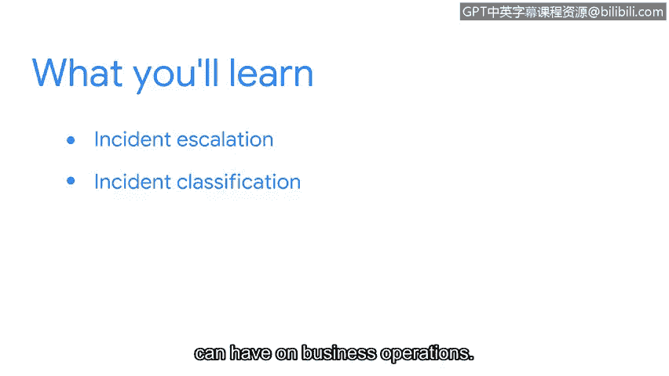

# 049：欢迎来到第二周 🎬

在本节课中，我们将学习如何将安全事件上报给正确的人员，这是初级安全分析师的一项关键技能。我们将探讨事件上报的重要性、分类方式及其对业务的影响。

很高兴你今天能加入学习。在上一节内容中，我们学习了各类资产的重要性，也了解了安全事件与普通事件之间的关系。本节中，我们将重点关注如何将这些事件上报给正确的人员。

保护组织的数据和资产是安全团队的首要目标。你每天所做的决策对于帮助安全团队实现这一目标至关重要。**识别何时以及如何上报安全事件**是核心环节，它能确保小问题不会演变成组织的大麻烦。

“上报”是一个你需要熟悉的概念。在你未来的安全职业生涯中，这个词会频繁出现。

在接下来的视频里，我们将从初级分析师的角度讨论事件上报。然后，我们会探讨各种事件分类类型，以及安全事件可能对业务运营产生的影响。最后，我们将分享一些关于事件上报的通用准则。

接下来，我们将首先关注事件上报，以及如何利用它来防止一个小问题演变成大问题。

我们开始吧。

---

本节课中，我们一起学习了事件上报的基本概念及其在网络安全工作中的重要性。我们了解到，及时、准确地上报是控制安全风险、保护组织资产的关键步骤。