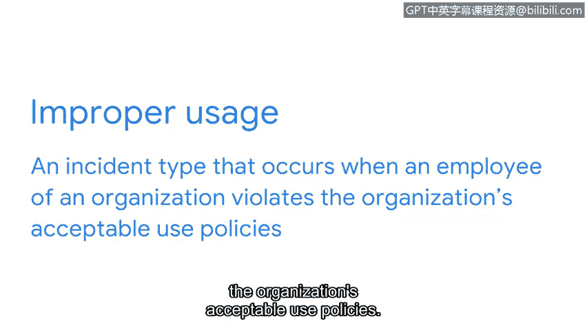

**网络安全入门：第八课：准备升级安全事件**

**概述**

在本节课中，我们将学习三种常见的安全事件分类类型：恶意软件感染、未经授权的访问和不当使用。了解这些事件类型及其特征，是有效识别和上报安全事件、保护组织免受威胁的关键第一步。

---

**回顾与引入**

上一节我们定义了“升级事件”的含义，并讨论了在需要时正确升级事件所需的技能。本节中，我们来看看几种需要了解的事件分类类型：恶意软件感染、未经授权的访问和不当使用。

---

**恶意软件感染 😈**

恶意软件感染是指恶意软件（旨在破坏系统）侵入组织的计算机或网络时发生的事件类型。

正如之前课程所讨论的，恶意软件感染有多种形式。有些较为简单，有些则更为复杂。

以下是两种常见示例：

*   **网络钓鱼攻击**：这属于相对简单的恶意软件感染。
*   **勒索软件攻击**：这被认为是复杂得多的恶意软件感染。

恶意软件感染可能导致系统网络运行速度异常缓慢。攻击者甚至可能阻止组织查看关键数据，除非组织向攻击者支付赎金来解锁数据。

由于组织网络和计算机上存储着大量敏感数据，此类事件对组织的影响尤为严重。因此，上报恶意软件感染是保护你所服务组织的重要环节。

---

**未经授权的访问 🔓**

未经授权的访问是指个人在未经许可的情况下，获得对系统或应用程序的数字或物理访问权限的事件类型。

你可能还记得，在本课程计划的早期，我们讨论过**暴力破解攻击**。这种攻击通过反复试验来破解密码、登录凭证和加密密钥。攻击者常利用此类攻击来获取对组织系统或应用程序的未经授权访问。

所有未经授权的访问事件都需要上报。😡 然而，上报的紧急程度取决于该系统对组织业务运营的关键性。我们将在本课程后面更详细地探讨这个概念。

---

**不当使用 ⚠️**

不当使用是指组织员工违反组织可接受使用政策时发生的事件类型。

这种情况可能有点复杂。有些不当使用实例是无意的。例如，员工可能试图访问软件许可证供个人使用，甚至使用公司系统访问朋友或同事的数据。也许员工没有意识到他们违反了政策，或者政策本身没有正确定义并传达给员工。

但也有一些时候，不当使用是故意行为。

那么，如何判断不当使用事件是意外还是故意的呢？这可能是一个难以做出的决定。正因如此，不当使用事件应始终上报给主管。作为组织安全团队的成员，你在工作中很可能会遇到各种各样的事件类型。因此，了解它们是什么以及如何上报至关重要。

---

**总结**

本节课中，我们一起学习了三种核心的安全事件分类：**恶意软件感染**、**未经授权的访问**和**不当使用**。我们了解了每种类型的定义、潜在影响以及上报的重要性。掌握这些基础知识，将帮助你在未来的网络安全工作中，更准确、更及时地识别和响应安全威胁，为保护组织的信息资产贡献力量。