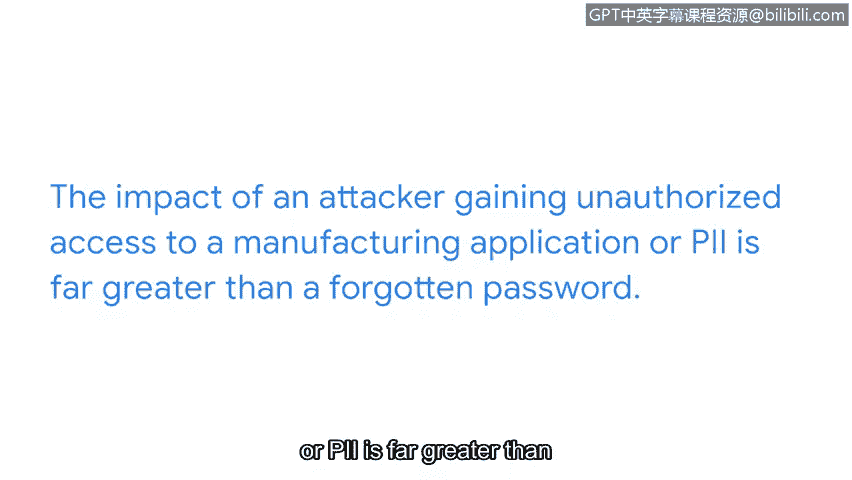

# 052：从微小事件到重大数据泄露

## 概述
在本节课中，我们将探讨一个看似微小的安全事件，如果未能得到及时上报和处理，如何可能演变成一场重大的数据泄露事件。我们将通过一个具体的场景来理解事件上报的重要性、事件严重性的评估，以及资产与安全事件之间的关键联系。

---

## 从平静到警报：一个被遗忘的笔记

上一节我们讨论了不同类型的安全事件以及将其上报给正确人员的重要性。本节中，我们来看看如果一个事件长时间未被上报，会发生什么。

让我们跟随组织安全团队度过一天。

这一天对安全团队来说风平浪静。突然，你注意到一个最近被组织禁止使用的应用程序出现了异常的日志活动。

你记下笔记，打算在下次与主管的会议中提及此事。

但你忘记了，并且从未提及。

---

## 一周之后：事态升级

沿着同样的场景，让我们快进到一周之后。

你和你的主管再次会面。但此时，主管指出发生了一起数据泄露事件。

这起泄露事件影响了组织的一个制造工厂。

现在，该制造工厂的所有运营都已暂停。

这导致公司损失了金钱和宝贵的时间。

几天后，安全团队发现，数据泄露始于那个最近被禁止使用的应用程序中的可疑活动。

---

## 核心教训：小事件与大问题

我们从这一场景中学到的是，一个简单的事件如果未能被妥善上报，就可能导致更严重的问题。

此处还需注意事件的**严重性**。最初，如果分析师没有足够信息来确定对组织造成的损害程度，事件可能以**中等**严重性级别上报。

一旦经验丰富的事件处理人员审查了该事件，其严重性级别可能会被**调高**或**调低**至**高**或**低**级别。

你遇到的每一个安全事件对组织都很重要，但有些事件无疑比其他事件更紧急。

---

## 如何确定安全事件的紧急性？

那么，确定安全事件紧急性的最佳方式是什么？

这实际上取决于事件所影响的**资产**。

以下是几个例子：

*   **低影响事件**：例如，一名员工忘记了工作电脑的登录密码。如果他们多次尝试登录失败，可能会触发一个低级别的安全事件。这个事件需要处理，但其影响可能微乎其微。
*   **高影响事件**：在另一些情况下，资产对组织的业务运营至关重要，例如制造工厂或存储**PII**的数据库。这类资产需要以更高的紧急性加以保护。

攻击者未经授权访问制造应用程序或PII所造成的影响，远比忘记密码严重得多。

因为攻击者可能干扰制造流程或泄露客户的私人数据。

---

## 总结
本节课中，我们一起学习了安全事件上报的连锁反应。我们通过一个具体案例看到，未能及时上报一个微小的异常活动，最终可能导致重大的运营中断和数据泄露。关键在于理解不同**资产**的价值，并据此评估安全事件的**严重性**和**紧急性**。在后续课程中，我们将分享更多关于上报时机的新概念，以及你在此过程中的角色为何如此重要。