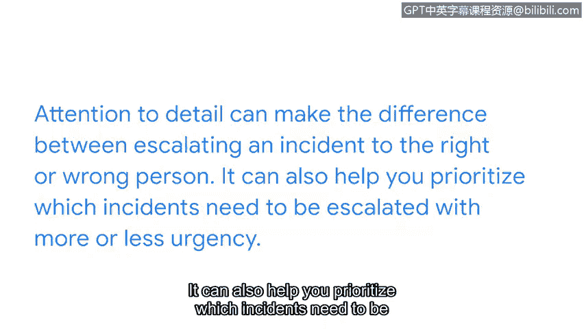

# 053：10_02 何时以及如何上报安全事件

在本节课程中，我们将学习如何正确上报安全事件。我们将探讨上报政策的重要性、通用指导原则，以及如何在工作中应用这些原则，确保事件得到妥善处理。

我们已经分享了很多关于你在上报事件时角色重要性的内容。

我们也讨论了几种你可能遇到的事件类型。

但是，为了正确上报一个事件，你需要采取哪些实际步骤？

这个问题的答案实际上取决于你所在的组织。

所有组织并没有统一的事件上报标准或流程。

每个安全团队在处理事件时都有自己的流程和程序。

在本视频中，我们将讨论事件上报的通用指导原则，以及如何在工作中应用它们。

让我们开始吧。

## 理解上报政策

每个组织都有自己处理安全事件的流程。

这个流程被称为**上报政策**，它是一套规定了当发生事件警报时应通知谁以及如何处理该事件的操作指南。

理想情况下，上报过程每次都应顺利进行。但在工作场所，这个过程可能会遇到意想不到的挑战。

例如，如果你的直属主管不在办公室怎么办？如果当天发生了事件，仍然需要上报给某人。

这就是为什么理解你所在组织的上报政策很重要的一个例子。

你不需要死记硬背组织的上报政策，但明智的做法是在你的工作设备上保存一个书签。这样，当你需要时，你总能访问到它。

遵循组织的上报政策至关重要，因为你采取的行动有助于保护组织及其服务对象免受恶意行为者的侵害。

组织的上报政策可能是一份很长的文件。

因此，你需要关注组织上报政策中的细节。对细节的关注决定了你是将事件上报给了正确的人还是错误的人。

它还能帮助你确定哪些事件需要更紧急或较不紧急地上报。

## 应用通用指导原则

虽然每个组织的具体流程不同，但存在一些通用的指导原则。

以下是分析师在上报事件时可以遵循的一些关键步骤：

1.  **识别与确认**：首先，确认事件是否真实发生，并初步评估其性质和影响范围。
2.  **查阅政策**：立即查阅组织的上报政策，确定应遵循的流程和应通知的人员。
3.  **初步遏制**：在能力范围内，采取初步措施防止事件影响扩大，例如隔离受影响的系统。
4.  **收集证据**：记录事件发生的时间、相关日志、受影响的资产等信息，为后续分析提供依据。
5.  **及时上报**：根据政策的紧急程度分类，通过指定渠道（如工单系统、即时通讯工具、电话）联系指定人员。
6.  **持续沟通**：在上报后，保持与事件响应团队的沟通，提供必要的协助和信息更新。

## 总结与回顾

本节课中，我们一起学习了安全事件上报的核心要点。我们了解到，上报政策是每个组织独有的行动指南，遵循它是保护组织安全的关键。虽然每个组织处理事件上报的方式不同，但分析师需要确保事件得到正确处理。

通过关注政策细节和应用通用步骤，你可以更有效、更专业地履行你的职责。出色的工作，这扩展了你的安全思维。😊