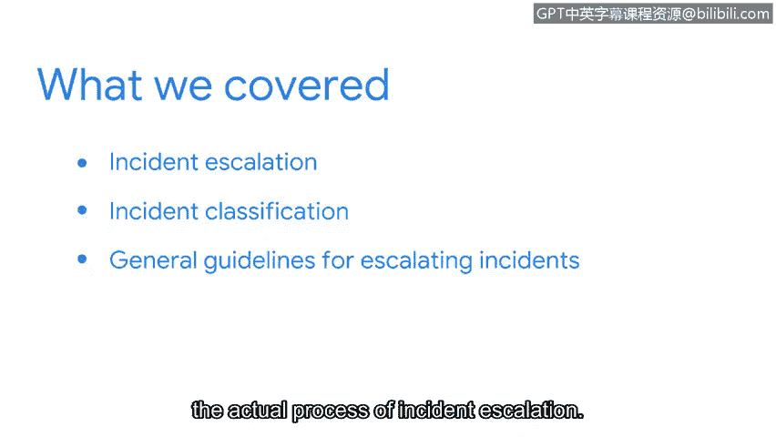

**谷歌网络安全专业证书第八课：8：投入实践：为网络安全工作做好准备**

**P54：11_01_wrap-up.en_subtitled**

在本节课程中，我们学习了事件上报在网络安全中的核心作用。现在，让我们一起来回顾本节所涵盖的关键内容。

上一节我们介绍了事件上报的基本概念，本节中我们将对整个学习内容进行总结。

我们首先定义了**事件上报**，并讨论了有效上报事件所需具备的重要特质。

接着，我们探讨了几种常见的事件分类类型，以及它们可能对组织造成的潜在影响。

在此基础上，我们分析了如果处理不当，小的安全事件如何可能演变成更大的问题。

最后，我们介绍了一些关于事件上报实际操作流程的通用指导原则。

😊

需要注意的是，具体的上报流程会因您所在组织的不同而有所差异。

但有一点应该始终不变，那就是您对细节的关注。

理解每个事件如何影响组织的数据和资产至关重要。

因为您所做的决定可能会影响整个安全团队乃至整个组织。

您准备好继续您的安全之旅了吗？接下来，我们将讨论利益相关者以及如何与他们进行有效沟通。

**总结**

本节课中，我们一起学习了事件上报的定义、所需特质、事件分类与影响、小事件升级的风险以及上报流程的一般准则。掌握这些知识是成为一名有效的网络安全分析师的重要一步。