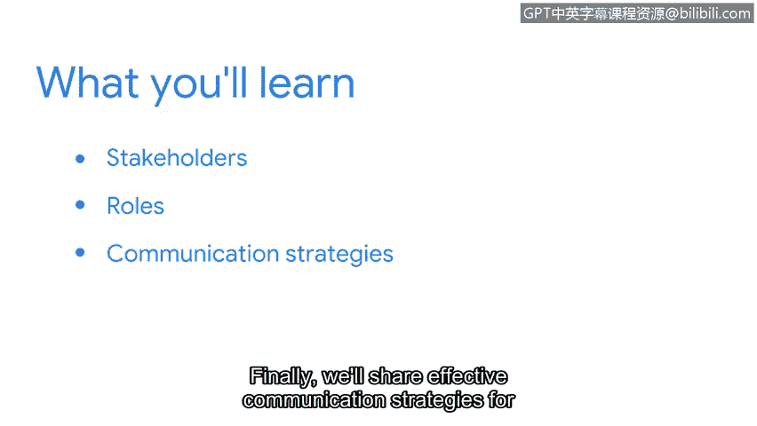

# 055：12_01_welcome-to-week-3

## 概述 📋

在本节课中，我们将要学习如何与网络安全工作中的关键人物——利益相关者——进行有效沟通。我们已经在前面的课程中涵盖了大量内容，从安全基础到对网络以及SQL和Python等编程语言的基本理解。这些概念是准备从事安全职业时的核心知识。但如何将这些信息应用到日常工作中？又该向谁传达这些信息？本课程将首先讨论利益相关者是谁，然后明确他们在安全事务中的角色，最后分享向利益相关者传达关键信息的有效沟通策略。

## 认识利益相关者 👥

上一节我们概述了本课程的目标。本节中我们来看看沟通的第一步：识别利益相关者。但在与利益相关者沟通之前，我们必须先理解他们是谁以及他们为何重要。

所以，让我们开始吧。