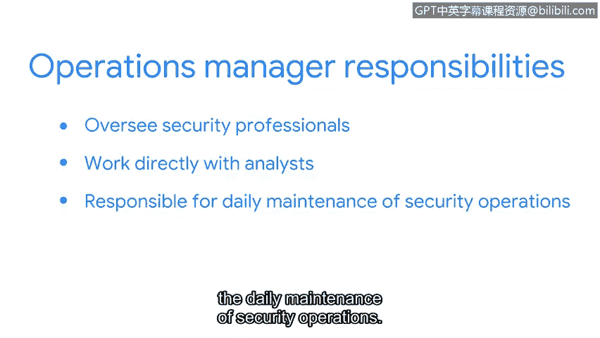

**网络安全专业证书：第八课：为网络安全工作做好准备**

**概述**

在本节中，我们将探讨组织内部的层级结构，并了解网络安全领域中的关键利益相关者。理解这些角色及其职责，对于初级分析师有效开展工作至关重要。

---

**组织层级与利益相关者**

组织层级通常从分析师开始，向上延伸至管理层，直至最高执行官。这种层级结构是理解利益相关者的有效方式。

**利益相关者**被定义为对组织的决策或活动具有利益的个人或团体。对于初级分析师而言，这一点非常重要，因为利益相关者日常所做的决策将直接影响你的工作方式。

我们将重点关注那些对分析师日常决策感兴趣的利益相关者。毕竟，你可能会被要求向他们汇报你的发现。

因此，让我们进一步了解他们是谁，以及他们在安全方面扮演的角色。

---

**利益相关者的重要性**

安全威胁、风险和漏洞可能影响整个公司的运营，从财务影响到客户数据与信任的丧失，安全事件的影响是无限的。

每位利益相关者都有责任为安全团队的各种决策和活动提供意见，并就如何最好地保护组织提出建议。

许多利益相关者密切关注着组织关键资产和数据的安全。我们将重点介绍其中五位：风险经理、首席执行官、首席财务官、首席信息安全官和运营经理。

以下是这五位关键利益相关者的详细介绍：

*   **风险经理**：他们对组织至关重要，因为他们帮助识别风险并管理对安全事件的响应。他们还会就需处理的法规问题通知法律部门。此外，如果需要对事件发布公开声明，风险经理会通知组织的公共关系团队。
*   **首席执行官**：这是组织中的最高领导者。首席执行官负责财务和管理决策，并有义务向股东汇报并管理公司运营。因此，安全自然是首席执行官的首要任务。
*   **首席财务官**：他们是负责管理公司财务运营的高级执行官。他们从财务角度关注安全，因为安全事件可能给企业带来潜在成本。他们也关心用于应对安全事件所需的工具和策略的相关成本。
*   **首席信息安全官**：他们是负责制定组织安全架构、进行风险分析和系统审计的高级执行官。他们的任务还包括创建安全和业务连续性计划。
*   **运营经理**：他们管理安全专业人员，以帮助识别安全威胁并保护组织免受其害。在保护公司免受威胁、风险和漏洞侵害时，这些人通常作为第一道防线直接与分析师合作。他们通常也负责安全运营的日常维护。

---

**与利益相关者的沟通**

在大型组织中，作为一名初级分析师，你不太可能直接与风险经理、首席执行官、首席财务官或首席信息安全官沟通。然而，运营经理很可能会要求你准备沟通材料，以便与这些人员分享。

接下来，我们将更深入地关注利益相关者以及如何与他们进行有效沟通。

---

**总结**

本节课中，我们一起学习了组织层级的概念，并认识了网络安全领域中的五位核心利益相关者：风险经理、首席执行官、首席财务官、首席信息安全官和运营经理。我们了解了他们的基本职责，以及他们为何关注安全事务。理解这些角色是未来进行有效沟通和协作的基础。