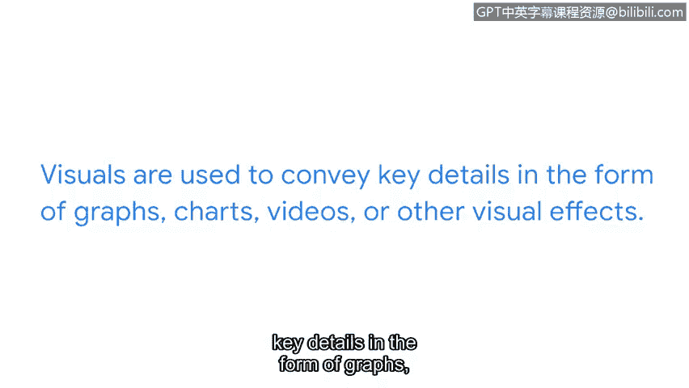

# 058：网络安全沟通的构建模块 🧱

在本节中，我们将学习如何构建清晰、精确的网络安全沟通，以便向利益相关者有效传达安全事件、影响及解决方案。

上一节我们讨论了向利益相关者传达重要信息。确保沟通具体且清晰至关重要，这样利益相关者才能理解正在发生的事情以及可能需要采取的行动。本节中，我们将更详细地探讨如何创建精确且清晰的沟通。

## 讲述一个“安全故事” 📖

创建与利益相关者分享的安全沟通，类似于讲述一个精彩的故事。故事通常有开头、中间和结尾。在故事中，通常存在某种冲突以及最终的解决方案。向利益相关者讲述安全故事时，这个概念同样适用。

安全故事详细说明了安全挑战是什么、它如何影响组织以及该问题的可能解决方案。安全故事还包括与挑战、其影响和提议解决方案相关的数据。这些数据可以是总结关键发现的报告形式，也可能是需要立即关注的问题列表。

## 构建安全故事的步骤 🛠️

以下是一个构建安全故事的具体步骤示例。

假设你一直在监控系统日志，并注意到日志中可能存在恶意代码执行，这可能导致敏感用户信息泄露。现在你需要向利益相关者（本例中是你的直属主管）沟通正在发生的事情。

**第一步：详细说明问题。**
*   在监控日志时发现潜在的恶意代码执行。

**第二步：参考组织的应急响应预案。**
*   提及预案中关于在系统日志中发现恶意代码的建议指导。这向你的主管表明，你一直在关注团队已建立的程序。

**第三步：提供问题的可能解决方案。**
*   在这个场景中，你可能不是采取何种行动的最终决策者，但你已经向利益相关者解释了发生的事情以及一个可能的解决方案。

## 沟通故事的方式 📤

你可以通过多种方式传达我们刚刚讨论的故事。

以下是几种常见的沟通方式：
*   **发送电子邮件。**
*   **共享文档。**
*   **使用可视化呈现进行沟通。**
*   **使用事件管理或工单系统。** 许多组织拥有遵循其安全预案步骤的事件管理或工单系统。

## 利用可视化元素 📊

某些场景通过使用视觉元素能更好地表达。视觉元素用于以图表、图形、视频或其他视觉效果的形式传达关键细节。这允许利益相关者查看所解释内容的图像化表示。

可视化仪表板可以帮助你向利益相关者讲述一个完整的安全故事。在本课程后面，你将有机会学习如何使用 Google Sheets 创建一个可视化的安全故事。

## 总结与展望 🔮

一个知道如何讲述引人注目且简洁的安全故事的安全专业人员，可以帮助利益相关者就应对事件的最佳方式做出决策。理想情况下，你希望成为一个让利益相关者工作更轻松的人。而有效的沟通无疑将帮助你做到这一点。

本节课中，我们一起学习了网络安全沟通的核心构建模块：如何像讲故事一样，通过定义问题、引用预案、提出方案三个步骤，清晰地向利益相关者传达安全事件。我们还探讨了邮件、文档、可视化图表等多种沟通方式。接下来，我们将继续讨论与利益相关者的沟通。