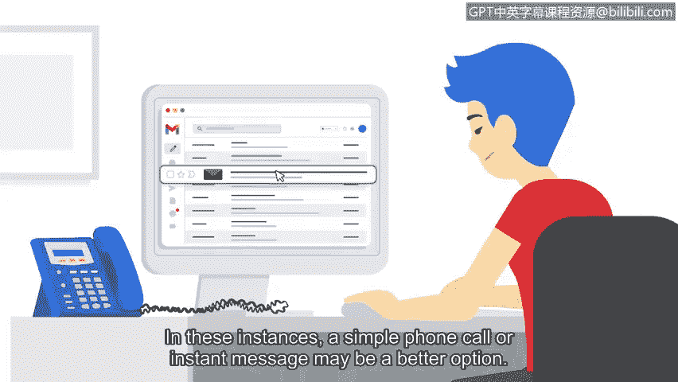

# 059：网络安全中的视觉化叙事

## 概述
在本节课中，我们将学习网络安全专业人员如何有效地向利益相关者传达威胁、风险、漏洞或事件以及可能的解决方案。我们将重点探讨各种沟通策略，特别是视觉化叙事、电子邮件和电话沟通的技巧与注意事项。

## 视觉化叙事
上一节我们介绍了沟通的重要性，本节中我们来看看如何利用视觉元素来讲述安全故事。使用视觉元素可以帮助你传达有影响力的数据和指标。

图表和图形在这方面特别有用。

以下是图表和图形的两个主要用途：
*   它们可用于比较数据点。
*   它们可用于展示更大问题中的一小部分。

使用相关且详细的图形可以帮助你构建想要向利益相关者讲述的故事，从而使他们能够做出有助于保护组织的决策。

## 书面与直接沟通
虽然视觉是吸引利益相关者注意力的有效方式，但有些问题最好通过电子邮件甚至电话来解释。

请注意这些沟通类型中包含的敏感信息。

出于安全目的，谨慎沟通敏感信息非常重要。

务必遵循组织预案中概述的程序，并始终确保将电子邮件发送给正确的收件人。😡，因为如果错误的人收到机密安全信息，可能会造成风险。

电子邮件的一个挑战是可能需要等待很长时间才能得到回复。

利益相关者有很多职责。这意味着他们有时可能会错过一封电子邮件或未能及时回复。

在这些情况下，一个简单的电话或即时消息可能是更好的选择。

## 主动跟进与职业发展
我的安全经验告诉我，有时一个简单的即时消息或电话可以帮助推动事态发展。

对于需要立即关注的问题，直接沟通通常比等待数天或数周的电子邮件回复更好。在适当的时候，如果利益相关者没有及时回复电子邮件，请主动跟进。😡，这听起来很简单，但一个友好的电话通常可以防止重大问题的发生。

在安全专业领域脱颖而出很重要。

特别是如果你没有该行业的先前经验，视觉化呈现、电子邮件和电话是展示你书面和口头沟通技巧的好方法。

视觉化方面展示了你有能力以有影响力的方式整合指标和数据。

如果你没有收到利益相关者的及时回复，跟进则显示了主动性。

## 总结
本节课中我们一起学习了网络安全中的关键沟通策略。我们探讨了如何利用**图表和图形**进行视觉化叙事，以清晰展示数据和问题。我们也分析了电子邮件和电话沟通的适用场景、安全注意事项以及主动跟进的重要性。掌握这些沟通技巧，不仅能有效推动工作，也是展示你专业能力的重要途径。