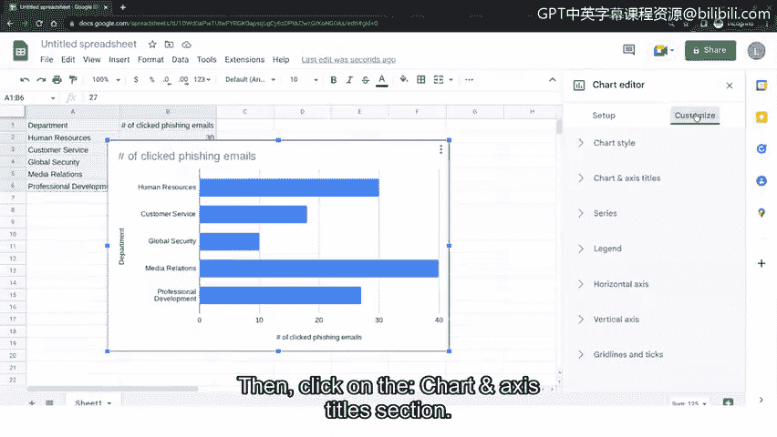

# 060：如何创建可视化仪表板

## 概述
在本节课程中，我们将学习如何将网络安全数据转化为一个直观的可视化故事。我们将使用Google Sheets工具，根据一个虚构的钓鱼邮件点击数据，创建一个条形图仪表板，以便清晰地向利益相关者展示问题所在。

---

## 创建数据可视化故事
上一节我们讨论了与利益相关者沟通的重要性，本节中我们来看看如何通过可视化工具将数据转化为易于理解的故事。

假设运营经理接到首席信息安全官（CISO）的询问，希望了解哪些部门的员工最常点击钓鱼邮件。我们的目标是找出点击频率最高的五个部门。

调查显示，最常点击钓鱼邮件的五个部门是：人力资源部、客户服务部、全球安全部、媒体关系部和专业发展部。

基于此信息，安全团队可以创建一个数据的可视化呈现，以便与运营经理和CISO分享。随后，各方可以共同协作，确定如何解决此问题。

有多种平台可用于创建和分享数据的可视化故事。Apache Open Office是一个免费的开源办公套件，允许用户创建电子表格和其他可视化图表。另一个无需代码的选项是Google Sheets。

今天，我们将把数据输入Google Sheets，然后创建一个条形图来展现这个数据故事。

如果你没有Google账户，需要先创建一个。

以下是创建账户的步骤：
1.  访问 Google.com，点击“登录”。
2.  点击“创建账户”，并选择“个人用途”。
3.  按照每一步提示完成个人账户的创建。

## 在Google Sheets中创建条形图
现在你已经拥有了Google账户，我们可以开始创建Google Sheets条形图可视化。

以下是具体操作步骤：
1.  点击页面右上角的“九宫格”菜单图标。
2.  点击“Sheets”图标。
3.  点击“空白”以新建一个电子表格。
4.  选中单元格A1，输入“部门”。
5.  选中单元格B1，输入“点击钓鱼邮件次数”。
6.  选中单元格A2，输入“人力资源部”。
7.  选中单元格B2，输入 `30`。
8.  选中单元格A3，输入“客户服务部”。
9.  选中单元格B3，输入 `18`。
10. 选中单元格A4，输入“全球安全部”。
11. 选中单元格B4，输入 `10`。
12. 选中单元格A5，输入“媒体关系部”。
13. 选中单元格B5，输入 `40`。
14. 选中单元格A6，输入“专业发展部”。
15. 选中单元格B6，输入 `27`。
16. 选中包含标题、部门名称和数据的所有行和列。
17.  点击表格顶部的“插入”菜单。
18. 选择“图表”。
19. 在图表编辑器菜单中，点击“图表类型”下拉菜单。
20. 向下滚动到条形图选项，然后选择第一个条形图样式。
21. 在图表编辑器菜单中，点击“自定义”。
22. 点击“图表和轴标题”部分。

现在，将标题更新为“按部门统计的钓鱼邮件点击情况”或其他与数据相关的标题。然后点击图表编辑器顶部的“X”图标以关闭编辑器菜单。

恭喜你成功创建了第一个可视化安全故事！

## 总结
本节课中，我们一起学习了如何利用Google Sheets将网络安全数据转化为条形图。创建数据的可视化故事，能帮助安全团队成员向利益相关者清晰传达关键信息，使复杂问题能以有意义且易于理解的方式呈现。这些数据故事还有助于促进对组织内部问题的更好理解，并让决策者能够确定如何解决那些使组织面临风险的安全问题。