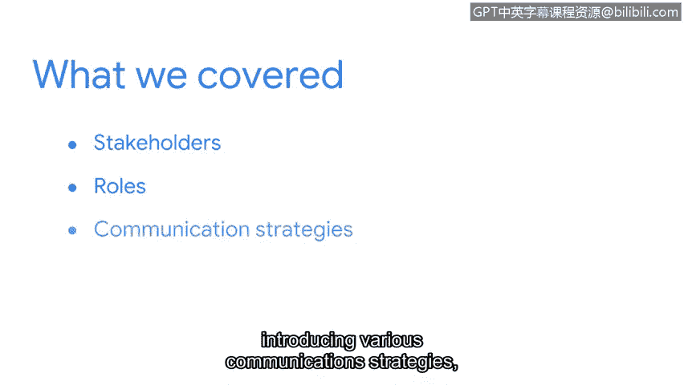

# 061：课程回顾与总结

在本节课中，我们将回顾与利益相关者沟通的核心内容，并总结关键要点。

## 🎯 课程内容回顾

上一节我们介绍了利益相关者的定义及其在组织安全中的角色。本节中，我们来总结本模块所涵盖的全部要点。

我们首先定义了利益相关者及其在保护组织安全中所扮演的角色。

随后，我们探讨了与利益相关者沟通的敏感性，以及谨慎、保密地共享信息的重要性。

接着，我们讨论了需要传达给利益相关者的信息类型。毕竟，利益相关者通常非常繁忙，因此我们只应分享他们需要了解的相关信息。

最后，我们介绍了多种沟通策略，包括电子邮件、电话通话和可视化仪表板。

## 💡 核心要点总结

理解组织内的利益相关者是谁以及如何与他们沟通，将对你整个网络安全职业生涯有所帮助。

以下是在沟通中需要遵循的几个关键原则：

*   **策略性沟通**：对你使用的沟通策略要有意识、有目的。
*   **信息精简**：从沟通内容中移除不必要的细节。
*   **精准传达**：向利益相关者传递信息时要具体且精确。

利益相关者依赖你，作为一名“故事讲述者”，以他们能理解的方式讲述安全状况、潜在问题及解决方案。我们讨论的沟通策略将帮助你脱颖而出，展现出兼具技术能力和可迁移技能的综合素质。

## 🚀 后续内容预告

接下来，本课程最后部分的讲师 Emily 将探讨几种参与安全社区互动的方式，以及如何在安全领域寻找并申请工作。

本节课中，我们一起学习了利益相关者的重要性、沟通的敏感性、信息筛选的原则以及多种实用的沟通策略。掌握这些技能对于成为一名有效的网络安全专业人员至关重要。