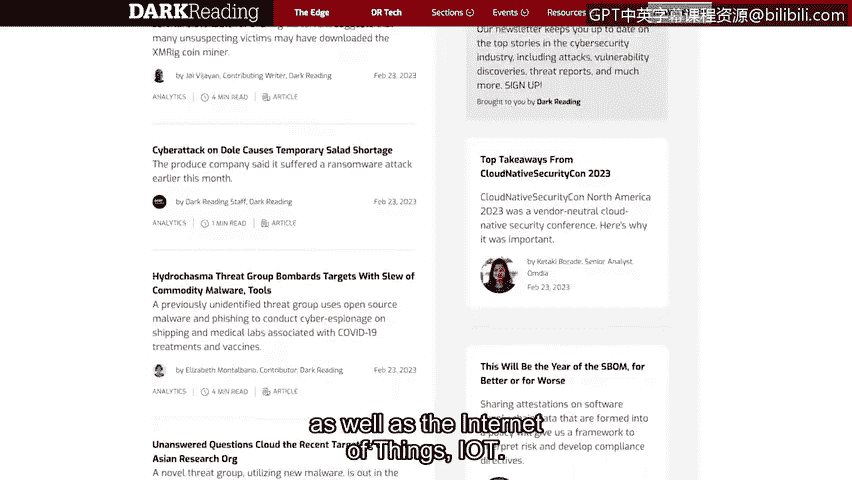

**谷歌网络安全专业证书：第八课：投入实践：为网络安全工作做好准备**

**概述**

在本节中，我们将探讨如何持续学习并与网络安全社区保持联系。随着课程接近尾声，了解如何获取行业最新动态和资源，对于你的职业发展至关重要。

---

**📚 持续学习与行业资源**

随着我们课程接近尾声，开始思考如何与安全社区互动变得很重要。

由于行业不断发展，及时了解最新的安全趋势和新闻至关重要。

以下是几个值得你定期查阅的优秀资源。

**安全专业最令我兴奋的一点，正是行业的持续演进。**

以 **OWASP Top 10** 为例。在课程早期，我们讨论过，这是一份全球公认的标准意识文档，列出了Web应用程序面临的十大最关键安全风险。

这份列表每三到四年更新一次，因此它是该领域不断发展的绝佳例证。

在本证书课程之外继续你的安全教育，将有助于你在招聘经理面前脱颖而出，并可能让你比其他候选人更具优势，因为这表明你愿意随时了解行业动态。

为了帮助你入门，以下是一些知名的安全网站和博客：

*   **CSO Online**：该网站提供关于各种安全和风险管理主题的新闻、分析和研究。许多首席安全官会浏览此网站以获取建议和思路。定期查阅这份出版物对你很有好处。
*   **Krebs on Security**：这是一个由前《华盛顿邮报》记者布莱恩·克雷布斯创建的深度安全博客。该博客涵盖安全新闻以及对各种网络攻击的调查。访问克雷布斯博客是了解全球最新安全新闻和动态的好方法。
*   **Dark Reading**：这是一个受安全专业人士欢迎的网站。该网站提供有关各种安全主题的信息，例如分析与应用安全、移动与云安全，以及物联网。

---

**🚀 总结与展望**

安全是一个不断发展的行业。作为安全领域的专业人士，我们必须通过寻求新信息来与之共同发展。

请务必探索我们在本节中讨论的一些网站和博客，以随时了解行业动态。

接下来，我们将讨论如何参与安全社区，以及通过哪些方式来建立并推进你的安全职业生涯。