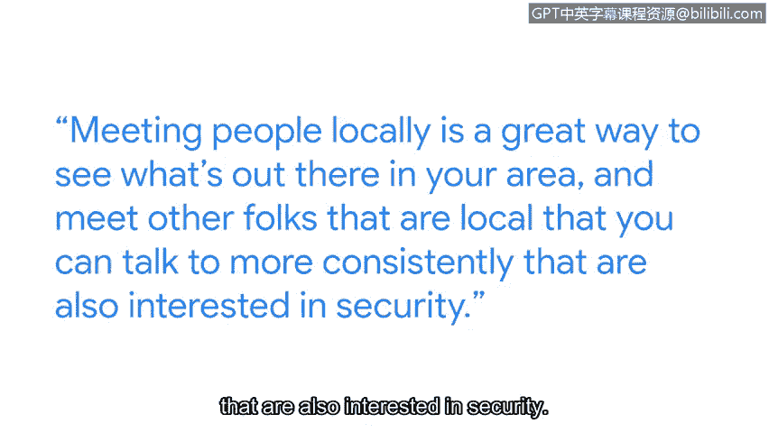

# 064：21_04_victoria-continue-your-learning-journey

## 🎯 概述
在本节课中，我们将跟随谷歌安全工程师Victoria的分享，了解她如何从非传统计算机科学背景进入网络安全领域，以及如何持续学习并为网络安全工作做好准备。我们将探讨团队多样性、持续学习的重要性以及行业参与方式。

---

## 🌱 从非传统背景进入网络安全领域
我是Victoria，是谷歌的一名安全工程师。当我第一次申请网络安全工作时，我感到不知所措。我并非传统计算机科学教育背景的申请者。实际上，我的专业是生物学。每当招聘人员看到我的简历时，我总会有点担心，害怕他们看到生物学专业后会说：“你为什么要申请？”然后直接忽略我的简历。

上一节我们了解了进入网络安全领域的挑战，本节中我们来看看团队多样性的价值。

## 🤝 团队多样性的价值
我认为我所在的团队非常多元化。我们有很多来自不同背景的人。我认为拥有多元化团队的一个好处是，你们可以从不同角度看待问题。如果所有人的背景都相同，你们可能无法想出新的解决方案。团队中有新人，甚至是行业新人，他们的视角确实有助于让事情对每个人来说都更容易理解。

了解了团队协作的优势后，接下来我们探讨持续学习的重要性。

## 📚 持续学习的重要性
在网络安全领域持续学习非常重要，因为事物总是在不断变化。几年前的重大威胁可能与今天的情况不同。努力跟上不断变化的形势，是我工作职责的核心部分。为了支持我在安全领域的持续教育，我会参加课程，并尽可能考取证书。但其中很大一部分只是跟上当前的行业新闻。无论是关于已发生漏洞的新博客文章，还是对新发布恶意软件的详细分析。我努力至少对行业内的不同趋势保持最表面的了解。

除了理论学习，实践与社区交流同样关键。

## 🌐 参与行业社区与活动
我经常参加**besidesides**会议。这些是本地组织的小型会议，因此你有更多机会与本地安全社区互动。这是在像**Decon**或**Black Hat**这样的大型会议上无法获得的体验。与本地人交流是了解你所在地区情况、结识其他本地同行的好方法，你可以与他们进行更持续的交流，他们也同样对安全感兴趣。

在分享了学习与交流的途径后，最后我们来看看给新人的建议。

## 💡 给新人的建议
在我担任这个角色之前，我希望我知道一件事：**不知道所有事情是可以的，你不需要知道所有事情**。你有队友和其他人可以帮助你弥补你的薄弱环节。所以，如果你不了解所有安全知识，不要感到压力，因为没有人能做到。从事安全工作非常有趣，很多事情都可能发生。每天的工作都不同。所以，如果你喜欢动态且不断变化的事物，那么安全领域非常适合你。

---

## 📝 总结
本节课中我们一起学习了Victoria从生物学背景转型为安全工程师的经历。我们探讨了团队多样性带来的创新视角、在快速变化的网络安全领域保持持续学习的必要性，以及通过行业会议和本地社区建立人脉的重要性。最后，我们明白了**没有人需要知道一切**，团队协作和保持好奇心是这一领域成功的关键。