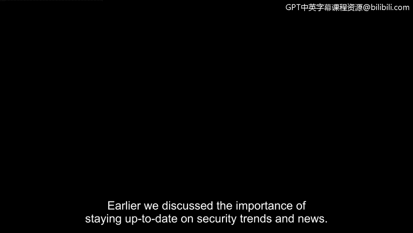
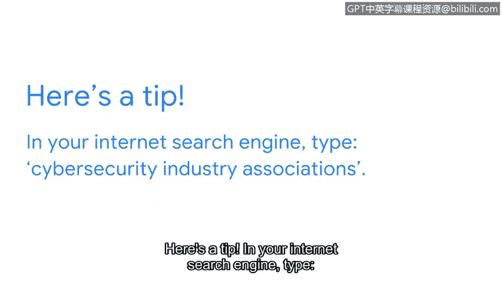

# 065：以有意义的方式参与网络安全社区

在本节课中，我们将学习如何通过有效参与网络安全社区，来建立和推进你的职业生涯。我们将重点探讨利用社交媒体和行业组织进行专业连接的方法。

上一节我们讨论了关注安全趋势和新闻的重要性。本节中，我们来看看如何通过与业内人士建立联系来推进你的职业生涯。

## 有效利用社交媒体

社交媒体是与业内其他安全专业人士建立联系的绝佳方式。然而，必须注意你在社交媒体页面上分享的信息，以及在回复陌生人消息时的谨慎性。

以下是有效利用社交媒体建立或推进安全职业生涯的几种方式。

### 关注行业领袖

一种方式是关注或阅读安全行业领袖的帖子。例如，首席信息安全官是很好的关注对象。他们经常发布在安全领域的访谈，并分享他们阅读或撰写的文章。

你可能会问：如何在社交媒体上找到CISO来关注？最佳方式是进行互联网搜索，查找知名组织或你感兴趣组织的CISO姓名。找到姓名后，你可以直接去社交媒体网站查找他们。理想情况下，关注安全专业人士时应使用LinkedIn，因为该平台专注于连接同领域或相似领域的专业人士。

### 连接在职分析师

另一种利用社交媒体推进职业生涯的方式，是与目前在该领域就业的其他安全分析师建立联系。在LinkedIn等社交网络上，你可以通过搜索“网络安全分析师”或类似术语来找到安全专业人士，然后筛选“人员”以及谈论“#网络安全”标签的人。找到你想连接的其他专业人士后，你可以发送连接请求并附上简短评论，例如：“你好，我想与你连接，以了解更多关于你为何对安全感兴趣以及作为分析师的经历。”

此外，你可以设置筛选条件，找到专注于你感兴趣的安全相关主题的活动和群组。

## 探索其他连接途径

虽然LinkedIn等社交媒体平台非常适合连接专业人士，但有些人对在社交媒体上保持活跃感到更自在。对于那些不太活跃于社交媒体的人，还有其他方式可以连接安全专业人士或在行业内寻找导师。

### 加入安全协会

加入不同的安全协会是与他人建立联系的好方法。市面上有很多协会，因此你需要做一些研究来找到最适合你的。

这里有一个小技巧：在你的互联网搜索引擎中，键入“网络安全行业协会”。这个搜索词会列出各种不同的协会，请务必选择那些与你职业目标相符的。

## 总结

本节课中，我们一起学习了如何通过社交媒体和行业组织有意义地参与网络安全社区。我们探讨了关注行业领袖、连接在职分析师以及加入专业协会等方法。现在你已经了解了这些途径，可以考虑在LinkedIn上关注一位CISO、连接其他分析师，或搜索并加入网络安全组织。