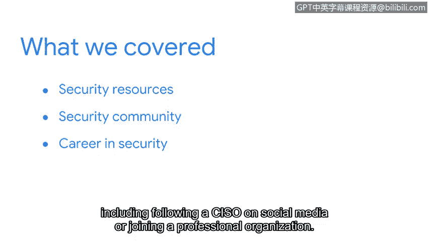

# 067：课程回顾与展望

在本节课中，我们将回顾本阶段所学的核心内容，并展望接下来的学习重点。我们将总结如何利用可靠资源、融入安全社区以及规划职业发展路径。

## 课程回顾

上一节我们探讨了多种网络安全实践方法，本节中我们来系统回顾一下已覆盖的关键知识点。

首先，我们识别了可靠的安全信息资源。这些资源是构建知识体系和保持信息更新的基础。

然后，我们讨论了融入安全社区的不同方式。积极参与社区是持续学习和职业发展的重要途径。

我们也探索了社交媒体在连接其他安全专业人士、了解当前热门话题方面的实用性。

最后，我们分享了在安全领域建立并推进职业生涯的几种方法。

以下是建立和推进安全职业生涯的具体方式列表：
*   在社交媒体上关注首席信息安全官（CISO）。
*   加入专业组织。

## 学习进展与展望

我们的学习之旅已经取得了长足的进步。你应该为自己的进展和所走过的路程感到自豪。

在本课程的最后一个部分，我们将花时间为你接下来的求职和面试流程做好准备。这无疑是一个令人兴奋的新阶段。

---

**本节课总结**：本节课中，我们一起回顾了如何寻找可靠资源、融入安全社区以及规划职业发展。我们为即将进入的求职准备阶段奠定了基础。