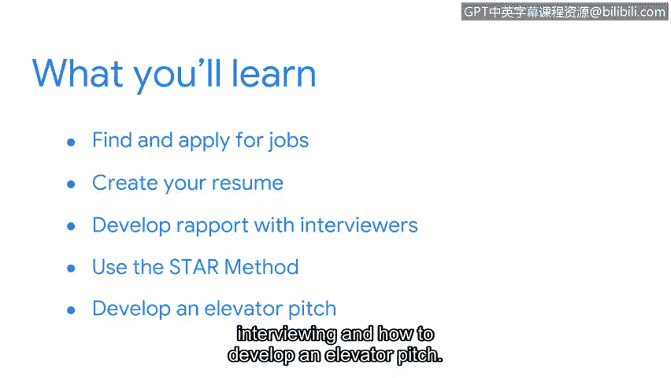

# 068：第五周导览

在本节课中，我们将学习如何为寻找初级网络安全分析师职位做好具体准备。我们将探讨求职策略、简历撰写、面试技巧以及如何建立行业人脉。

---

欢迎回来。在本课程中，我们已经详细探讨了许多与安全相关的主题。我们讨论了保护组织资产和数据的方法，以及用于保护它们的工具和流程。我们还探索了如何与利益相关者沟通、如何利用可靠资源来跟进安全新闻与趋势，以及如何参与安全社区以帮助您在该领域建立并推进您的职业生涯。

现在，我们需要帮助您为寻找初级安全分析师职位做好准备。

网络安全是一个广阔的领域，拥有无数的就业机会。根据美国劳工统计局的数据，预计到2030年，安全相关职位的数量将增长超过30%。但是，您如何才能找到适合自己的机会呢？

在接下来的几个视频中，我们将讨论帮助您在行业内寻找和申请工作的具体策略，包括如何创建简历以及如何与面试官建立融洽关系。我们还将介绍面试中的STAR方法以及如何准备一段精彩的电梯演讲。

---

我记得最初对我的职位产生兴趣，是因为教育是我的热情所在。在为面试做准备而研究安全领域和行业的过程中，我更加坚定了对网络安全的着迷。

坦率地说，我曾经认为安全的许多作用是理所当然的。现在，我感到非常幸运能成为这个行业的一员，并享受它所带来的激动人心的机遇。

现在，是时候帮助您为寻找网络安全工作做好准备了。让我们开始吧。

---

**本节课总结**

在本节课中，我们一起学习了第五周的课程目标，即专注于求职准备。我们回顾了之前学到的核心安全知识，并引出了即将深入探讨的求职策略、简历优化和面试技巧，为后续的实践内容奠定了基础。