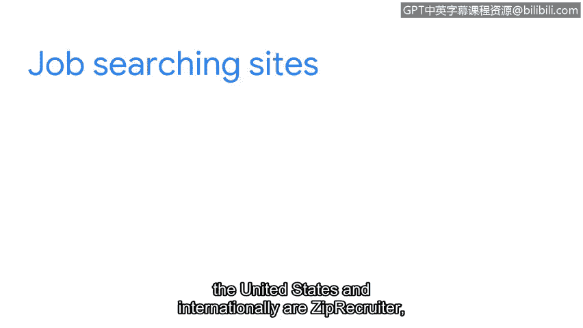

**谷歌网络安全专业证书第八课：投入实践：为网络安全工作做好准备：P69：探索网络安全职位**

在本节中，我们将探索网络安全领域的几个入门级职位，并了解如何开始寻找这些工作机会。

你已经取得了长足的进步。你可能记得在本课程早期，我们讨论过行业中的一些安全职位。现在，我们将深入探讨其中的三个角色。

---

### **安全分析师**

我们首先介绍安全分析师。安全分析师通常是一个入门级职位，对于准备进入安全领域的你来说可能很有吸引力。

该角色的主要职责通常包括：
*   监控网络以发现安全漏洞。
*   制定策略以帮助保护组织安全。
*   研究IT安全趋势。

在之前的课程中，我们讨论了日志监控和安全信息与事件管理工具。扎实掌握这些工具的使用基础，对于胜任此角色无疑非常有用。

---

### **信息安全分析师**

接下来，我们看看信息安全分析师。这个角色通常侧重于制定计划并实施安全措施，以保护组织的网络和系统。

在本课程前期，你学习了可用于制定安全计划和流程的控制措施与框架，以及如何使用SIEM和包嗅探器来识别风险。这些知识在制定计划和确定最佳工具以加强组织安全态势时将大有裨益。

---

### **安全运营中心分析师**

最后，我们来探索安全运营中心分析师这个角色。安全运营中心分析师，也称为SOC分析师，是另一个你可能觉得激动人心的职位。

该角色通常侧重于确保按照既定策略和流程，快速有效地处理安全事件。在本课程中，我们讨论过安全预案，以及它们如何因组织而异。我们还强调了遵循预案中概述的流程来响应安全事件的重要性。这些知识无疑将帮助你在应聘此职位时脱颖而出。

---

### **寻找更多职位机会**

除了上述角色，还有许多其他你可能感兴趣的职位。寻找更多职位的一个好方法是在各种招聘网站上创建账户并搜索网络安全职位。

以下是一些在美国和国际上知名的招聘网站：
*   ZipRecruiter
*   Indeed
*   Monster

这些网站都有数百个开放的职位列表，每个职位标题下都列出了职责和技能要求。我们现在已经开始讨论工作和申请渠道了。

---

### **申请前的准备工作**

在申请任何职位之前，做好研究非常重要。你需要收集关于公司、职位角色、以及必需和优先技能的大量信息。这将帮助你为潜在的面试做好准备，让你确切了解雇主的需求，以及你的技能如何与雇主的期望相匹配。这也有助于你将个人价值观和热情与组织的使命和愿景相结合。

但在申请安全职位之前，制作一份能吸引雇主注意的简历至关重要。接下来，我们将详细讨论简历的撰写过程。