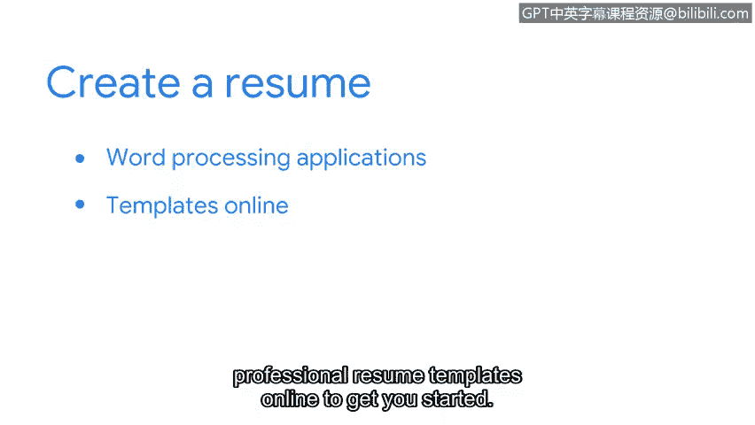

# 070：如何制作一份网络安全简历 📄

在本节课程中，我们将学习如何制作一份针对特定职位的简历。一份精心准备的简历是获得面试机会的关键。我们将介绍简历的核心组成部分、如何展示你的技能，并提供一些实用的建议。

---

一份简历有时也被称为履历或CV。即使你没有网络安全领域的直接工作经验也无需担心。本证书课程已经涵盖了入门级安全分析师职位所需的关键技能和概念。

你可以将你在本课程中学到的所有内容都写在简历上。这包括编程语言，例如 **Python** 和 **SQL**，以及 **Linux** 命令行操作。你还可以分享你对“安全思维”的理解、对标准框架和模型（如**NIST CSF**和**CIA三元组模型**）的知识，以及你对如何使用**SIEM工具**和**数据包嗅探器**的熟悉程度。

此外，你之前的工作经验可能也让你掌握了一些可迁移到安全岗位的知识和技能。这些技能可能包括注重细节、团队协作以及拥有出色的书面和口头沟通能力。

以下是简历的一个示例。

## 简历结构与内容

一份专业的简历通常包含以下几个部分。我们将逐一进行说明。

### 个人信息与标题

你需要在简历顶部写上你的姓名，后面跟上你的职业头衔。你的头衔可以是“安全分析师”，或者与你申请的职位相匹配的头衔。你还需要提供至少一种雇主或招聘人员可以联系到你的方式，例如电子邮件地址或电话号码。

### 个人简介

在姓名和头衔之后，你需要提供一个简介陈述。这个部分应该简洁，只需一两句话，概括你的优势和相关技能。确保陈述中包含职位描述中“职责”部分的特定关键词。

你可以在陈述中这样写：
> 我是一名积极进取的安全分析师，正在寻求一个入门级网络安全职位，以应用我在网络安全、安全策略和组织风险管理方面的技能。

### 技能部分

在姓名和简介陈述之后是技能部分。这是一个项目符号列表，列出你在此课程中学到的、与职位相关的技能。

### 工作经验部分

雇主通常希望了解你之前的工作经验。在“工作经验”部分，你将列出你的工作经历。在每个工作条目下，提供一份你所执行的技能和职责列表。

一个好的做法是每个项目符号都以动词开头。如果可能，提供可以量化成就的细节。例如：
> 与一个六人团队合作，为超过25名公司员工开发了培训课程。

尽量突出你基于以往工作经验和本证书课程所获得的安全或技术相关技能和知识。

### 教育与认证部分

简历的下一个部分列出你的教育和认证情况。从你最近完成的教育开始，包括认证、职业学校、在线课程或大学经历。同时，请注明颁发你认证的网站和组织名称，以及你就读的学校。列出任何与你申请的职位相关的学习科目。

如果你目前正在就读学校或认证课程但尚未毕业，请注明“进行中”。

## 实用建议与总结

在制作简历时，请记住以下几点。在将简历发送给潜在雇主之前，请确保其中没有拼写或语法错误。另外请注意，简历通常长约两页，并且只列出你最近10年或更短时间的工作经验。

简历可以使用文字处理应用程序（如Google Docs或Open Office）创建。然而，你可能会在网上找到一些简单但专业的简历模板来帮助你入门。要找到它们，可以在你的互联网浏览器中输入“免费简历模板”或类似的搜索词。

如果你使用模板，请务必将所有预设文本替换为你的信息和资历。

制作简历需要考虑的方面很多，但我们今天所讲的内容将帮助你迈出第一步。接下来，我们将探讨面试流程。

---

本节课中，我们一起学习了如何构建一份网络安全简历，从个人信息、个人简介、技能展示到工作经验和教育背景的撰写。记住，简历是你职业能力的书面呈现，清晰、准确且有针对性的简历能大大增加你获得面试的机会。