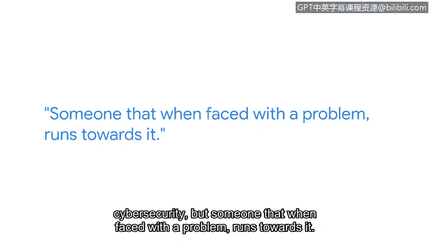

# 073：技术面试技巧

## 概述
在本节课程中，我们将跟随谷歌全球招聘经理Garvey，学习如何为网络安全领域的技术面试做好准备。课程将涵盖面试官的期望、需要准备的核心技术、回答开放式问题的方法以及理想的候选人特质。

---

## 面试的本质与期望
上一段我们了解了讲师背景，现在我们来探讨技术面试的核心目的。面试官Garvey指出，技术面试并非一场限时答题的简单测验。

面试官真正想了解的是，候选人是否理解**网络安全的基础知识**，并且能否清晰地解释这些概念。面试的重点在于考察理解深度与沟通能力，而非单纯的知识记忆。

## 需要准备的核心技术与工具
理解了面试的考察方向后，我们来看看应该重点准备哪些具体内容。对于申请入门级职位的候选人，Garvey推荐熟悉以下程序和应用程序：

以下是建议重点准备的工具及其学习要点：
*   **Splunk**：理解其**功能**与**目的**。
*   **Wireshark**：理解其**功能**与**目的**。

学习目标不应止步于表面操作。如果能进一步理解它们的**内部原理**、存在的**原因**，甚至思考“如果没有这个工具，该如何解决问题”，将会在面试中脱颖而出。

## 掌握网络安全基础知识
除了具体工具，扎实的理论基础同样至关重要。你需要理解并掌握本领域内的基础知识主题。

以下是几个关键的基础知识领域：
*   **网络安全**
*   **Web应用程序安全**
*   **操作系统内部原理知识**
*   **安全协议**

Garvey认为，从这些基础领域开始准备是一个重要的起点。

## 如何应对开放式问题
在掌握了技术和理论后，我们需要学习应对面试中最具挑战性的部分：开放式问题。这类问题往往设计得**模棱两可**且**复杂**。

练习回答开放式问题至关重要。面对此类问题时，你首先应该做的是**提出澄清性问题**。

从面试官那里获取更多信息，这不仅能帮助你**缩小问题本身的焦点**，也能**降低问题的范围**，将其转化为一个你熟悉且能从容回答的具体问题。

## 组织答案的方法：STAR法则
当面对一个庞大的开放式问题时，你需要一个清晰的结构来组织你的回答。Garvey推荐使用**STAR法则**。

**STAR法则**是一个极佳的组织回答框架：
*   **S** - 情境：描述问题发生的背景。
*   **T** - 任务：说明你需要完成的具体任务。
*   **A** - 行动：详细阐述你采取了哪些行动。
*   **R** - 结果：陈述行动带来的最终结果。

这个方法能帮助面试官理解你的思路。同时，“**大声思考**”也能让面试官跟上你的思维过程，即使你未能得出完整答案，他们也能知道你走在正确的轨道上，并在必要时提供帮助。

## 理想候选人的特质
了解了技巧之后，我们来看看面试官心目中理想的候选人是什么样的。Garvey描述了他寻找的候选人特质。

他的理想候选人是：
*   热爱学习的人。
*   谦逊、诚实的人。
*   能够应对生活中**模糊性**和**复杂性**的人（不一定直接与网络安全相关）。
*   面对问题时主动迎难而上的人。
*   始终保持“学生”心态，不断学习，并能指导他人的人。

这些特质会贯穿在他们的整个职业生涯中。

## 关于面试紧张情绪
最后，我们来谈谈一个普遍问题：面试紧张。在技术面试中感到紧张是很正常的。

紧张意味着你在乎这次机会，也说明有人认可你并相信你的潜力。Garvey鼓励道：“这个领域需要你。相信自己，相信你的直觉。不要害怕失败。”

---

## 总结
本节课中，我们一起学习了为网络安全技术面试做准备的要点。我们明确了面试重在考察对基础知识的理解和阐述能力，需要重点准备像Splunk和Wireshark这样的核心工具以及网络安全、操作系统原理等基础知识。我们学习了应对复杂开放式问题的策略：先提问澄清，再用STAR法则结构化地回答，并辅以“大声思考”。此外，我们了解了面试官看重的候选人特质，如好学、谦逊和解决问题的能力。最后，请记住，面试时感到紧张是正常的，保持自信，真诚地展示你的知识和潜力。