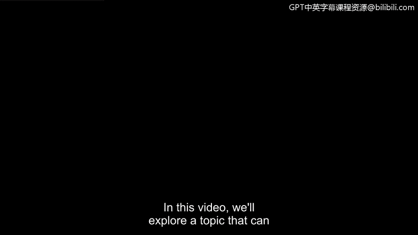
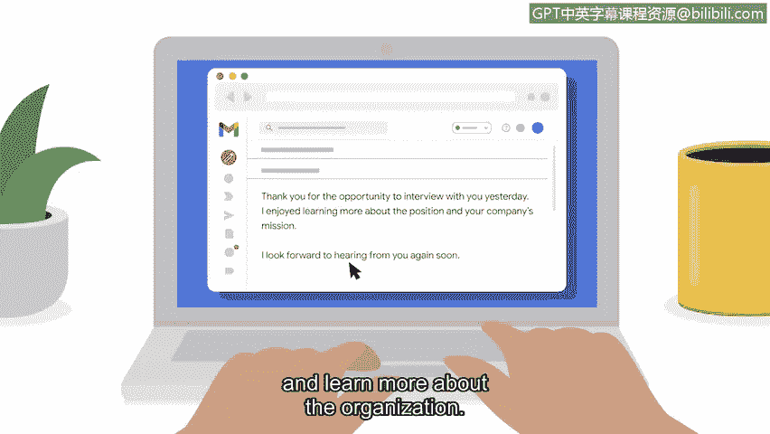

# 075：如何与面试官建立融洽关系

## 概述
在本节课程中，我们将学习一个在面试过程中至关重要的软技能：如何与潜在雇主建立融洽关系。掌握这项技能能显著提升你的面试成功率，让你在众多候选人中脱颖而出。

---

## 什么是融洽关系？🤝
上一节我们探讨了面试准备，本节中我们来看看如何与面试官建立良好互动。首先，我们需要理解核心概念。

**融洽关系**指的是一种友好的关系，在这种关系中，双方能理解彼此的想法并进行良好的沟通。建立这种关系是成功面试的关键。

## 建立融洽关系的起点
融洽关系的建立始于你与公司人员的第一次互动，无论是通过电话、电子邮件还是视频会议。

在撰写电子邮件时，使用专业的语气表达你对职位的兴趣至关重要。同时，保持礼貌和友好也同样重要。

表达对获得面试机会的感谢，是建立初步良好印象的一种有效方式。

## 电话筛选阶段的技巧
当你进行初步电话筛选时，可以使用友好、对话式的语气。尝试在说话时保持微笑。

虽然通话时对方看不到你的表情，但微笑确实能让你的声音听起来更友善，从而传递积极的情绪。

在电话筛选和现场面试中，你可以通过自然地积极参与来缓解紧张情绪。这可以简单到说一句“你好，很高兴认识你”。

你甚至可以通过询问面试官“今天过得怎么样？”来开启一段简短友好的对话。如果刚过完周末，你也可以问“周末过得如何？”。

在现场面试中提问时，请保持眼神交流；在视频面试中，请确保直视摄像头。这表明你专注于当前的对话。

## 准备提问：展示你的投入
通常，在面试的后半段，面试官会询问你是否有问题要问。正如我们之前讨论的，提前准备一些问题在此刻非常重要。

以下是一些建议的问题供你参考：

*   **关于角色挑战**：请问，如果加入这个职位，我可能面临的最大挑战是什么？公司期望我如何应对这个挑战？
*   **关于公司文化**：您认为在这家公司工作最棒的一点是什么？或者，分析师典型的一天是怎样的？
*   **关于职业发展**：这个职位未来的成长潜力如何？

提问表明你深入参与了对话，并且对公司及职位抱有浓厚的兴趣。同时也向雇主展示出你的自信，表明你在做出承诺前，也希望确保他们的公司是适合你的选择。

## 面试后的跟进：巩固印象
在现场面试结束一两天后，发送一封跟进邮件是一个好主意。

这只是一封简短的邮件，用于感谢面试官给予的会面机会，并表达你对该组织的进一步了解。

在这封邮件中，提及面试中某个具体的讨论点也是一个好主意。这表明你当时在积极倾听并参与了对话。

请记住，雇主可能同时在面试其他候选人。发送一封跟进邮件有助于让你与众不同，并提醒面试官你们之间的讨论内容。

## 总结
在本节课中，我们一起学习了为你的第一份网络安全职位面试时，与面试官及其他员工建立融洽关系的重要技巧。

在面试前后撰写友好而专业的电子邮件，并在面试过程中进行友好的交谈，这些都能帮助你脱颖而出，成为该职位的优秀候选人。