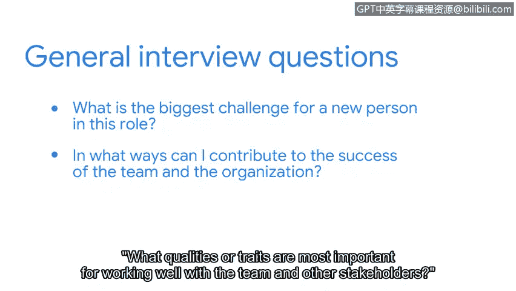

**谷歌网络安全专业证书第八课：投入实践：为网络安全工作做好准备：P77：向面试官提问的策略** 🎤

在本节中，我们将探讨在求职面试中可以使用的额外策略，特别是如何向面试官提出有价值的问题。

---

在过去的面试中，你的潜在雇主可能问过：“你对我有什么问题吗？” 这类问题为你提供了一个机会，可以向面试官展示你已做好准备，并愿意与他们进行有意义的对话。

面试准备的一个重要部分是在面试前对公司进行研究。因为这能让你提出一些问题，证明你花时间了解了该组织及其需求。这类问题表明你对职业充满热情，并希望帮助公司加强其安全态势。

此外，你也可以向面试官提出一些通用问题，以判断这份工作及组织本身是否适合你。

以下是几个示例问题：

*   **新人在这个职位上面临的最大挑战是什么？**
*   **我可以通过哪些方式为团队和组织的成功做出贡献？**
*   **与团队及其他利益相关者良好合作，最重要的品质或特质是什么？**

这类问题可以帮助你与面试官建立融洽关系，并表明你有兴趣了解更多关于职位角色和组织文化的信息。

当你准备充分时，求职面试会是一个非常令人兴奋的过程，而提问是面试过程中必不可少的一环。不要害怕向潜在雇主提出有挑战性的问题。这将帮助他们了解你是一个深思熟虑、充满好奇心、能为团队增值的人。

接下来，我们将讨论另一个策略：电梯演讲。

---

**本节总结**

在本节中，我们一起学习了在面试中主动向面试官提问的重要性。通过提前研究公司并提出有针对性的问题，你不仅能展示自己的准备程度和热情，还能评估职位与自身的匹配度，从而在面试中占据更有利的位置。