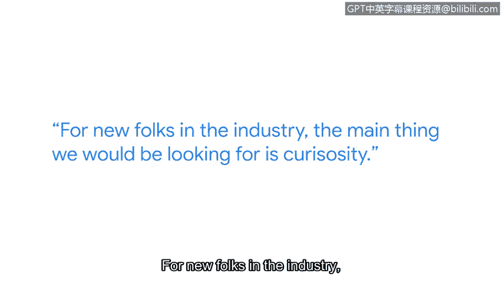
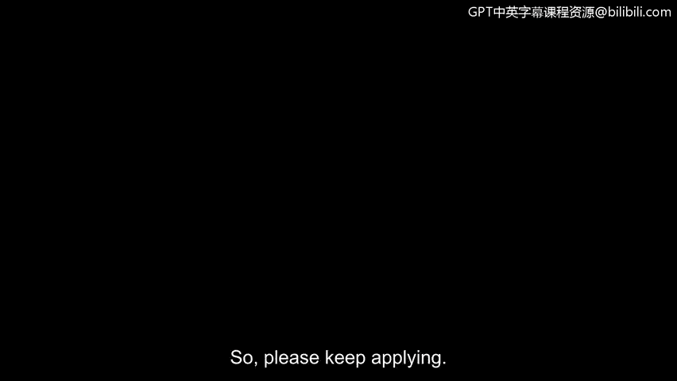

# 078：35_06_来自招聘经理的面试技巧 🎯

## 概述
在本节课中，我们将学习来自谷歌安全工程经理Karan的宝贵面试建议。Karan分享了他在招聘过程中观察到的趋势，并为准备技术面试和非技术面试提供了具体指导。无论你的背景如何，这些技巧都将帮助你更好地为网络安全领域的职位面试做好准备。

---

## 面试准备的两个维度 🔍
上一节我们介绍了课程背景，本节中我们来看看如何系统地准备面试。Karan建议将面试准备分为技术准备和非技术准备两个部分。

### 技术准备
对于技术部分的准备，重点是夯实基础并清晰沟通。

以下是技术准备的核心要点：
*   **巩固基础知识**：深入理解网络基础和信息安全基础概念。确保你明白事物的工作原理及其相互关联。
*   **明确问题核心**：在回答问题前，务必通过提问来澄清问题，以理解面试官真正想问什么以及问题的根源。许多人没有真正弄清问题就急于回答。
*   **诚实面对未知**：如果你不知道某个问题的答案，不要害怕说“我不知道”。但可以补充说明：“以下是我会如何尝试解决这个问题的方法。”

### 非技术准备
非技术准备同样重要，它关乎你如何展示自己以及与团队协作的能力。

以下是非技术准备的关键实践：
*   **模拟练习**：与朋友一起练习，找一个面试伙伴，观察自己的反应，发现自己的不足之处。在这个过程中要善待自己。
*   **展示完整的自我**：专注于在面试中展现真实的自己。这意味着展示你将如何与团队合作。
*   **举例说明**：提及你与他人合作完成的项目案例，你是如何领导那些项目的，或者你是否参与过开源协作。
*   **重视软技能**：许多这类软技能，在解决安全问题时也至关重要。

---

## 行业新人最被看重的特质 🌱
在面试行业新人时，招聘者最看重的是候选人的特质和潜力。

我们主要寻找的特质包括：
*   **好奇心与驱动力**：我个人寻找那些有动力、非常渴望深入了解该领域的人。他们可能并非无所不知，我们理解这一点。
*   **提出正确问题**：我们想确保他们能提出正确的问题，并通过与他人合作来解决问题。
*   **积极的态度**：如果你给出“我不知道，但我会想办法搞清楚”这样的回答，那真是太棒了。

---

## 求职心态与行动建议 💪
除了具体准备，保持正确的求职心态和采取积极的行动也至关重要。

请记住以下建议：
*   **不要害怕被拒绝**：找到第一份工作需要时间。我当初投了上百份申请才找到第一份工作。
*   **大胆申请**：即使你不满足所有“必备”或“优先”条件，也不要害怕申请。只需关注最低资格要求。如果你符合，就不必犹豫，请继续申请。

---

## 总结
本节课中，我们一起学习了来自招聘经理的面试洞见。我们了解到面试准备应兼顾**技术基础**的巩固与**非技术软技能**的展现。行业新人最宝贵的资产是**好奇心**、**学习驱动力**以及**合作解决问题**的态度。最后，保持坚韧，**不惧拒绝**并**积极投递**简历，是开启职业生涯的关键步骤。记住，展现真实的自己，诚实面对未知，并持续学习，你就能在面试中脱颖而出。