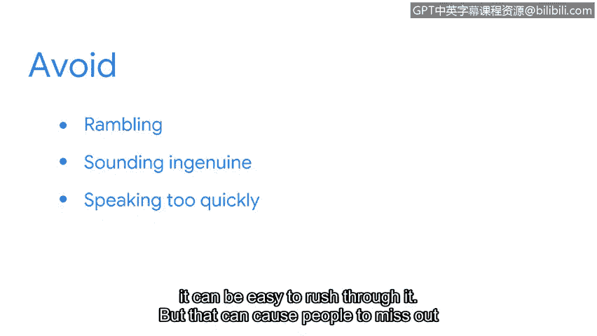

**网络安全求职准备：第八课：电梯演讲的构建与呈现**

在本节课中，我们将学习一个关键概念——电梯演讲。它能帮助你梳理自身优势，并在求职或社交场合中高效地向他人展示这些优势。

---

### **什么是电梯演讲？**

电梯演讲是一段关于你的经验、技能和背景的简短总结。

它之所以被称为“电梯演讲”，是因为其时长应控制在60秒或更短，这大约相当于一次电梯行程的对话时间。电梯演讲让你能在极短的时间内，向潜在雇主展示你是谁。

这种演讲形式适用于招聘会、职业博览会、专业会议以及领英等社交媒体求职平台等多种社交场合。

### **如何构建电梯演讲**

上一节我们了解了电梯演讲的定义与用途，本节中我们来看看如何具体构建一个有效的电梯演讲。

你的电梯演讲需要简短且有说服力。无需罗列所有过往经历和成就。相反，应重点说明你是谁、为何对成为安全专业人员充满热情，以及你所具备的、与安全分析师职位直接相关的资质和技能。

以下是构建演讲内容时可包含的核心要素：

*   **你是谁**：简要介绍自己的身份。
*   **你的热情**：解释为何对网络安全领域感兴趣。
*   **核心技能**：突出与职位相关的关键能力。例如，批判性思维、问题解决能力以及与他人建立协作关系的能力，是大多数组织都在寻找的可迁移技能，应在演讲中重点强调。
*   **技术能力**：可以提及在本证书课程中学到的技术技能，例如使用各种SIEM工具，以及运用SQL和Python等编程语言来识别和应对风险。

### **电梯演讲的注意事项**

构建好演讲内容后，我们来看看在正式呈现时需要注意避免哪些问题。

在电梯演讲中，避免漫无边际或分享无关细节非常重要。潜在雇主只想了解你是谁，以及为何应该考虑让你担任安全职位。

以下是几个关键的注意事项：

*   **避免过度排练**：在准备阶段，你需要多次练习。但切忌练习过度，导致在实际向决策者陈述时听起来不真诚或像机器人。相反，在演讲时应像正常对话一样自然表达，这有助于吸引听众并保持他们对内容的兴趣。
*   **避免语速过快**：因为电梯演讲相当简短，很容易说得太快。但这可能导致听众错过你的一些关键技能，仅仅因为你语速太快而一带而过。

### **最后的建议与总结**

一个额外的建议是：你可以在网上搜索“电梯演讲”示例，以获取灵感，帮助你构思自己的演讲。

本质上，你的电梯演讲是一种向他人说明你为何是安全职位绝佳人选的方式——你拥有出色的技能，并对职业生涯有清晰的方向。

😊 虽然与潜在雇主交谈时感到紧张是人之常情，但请记住：深呼吸，保持镇定，以自信、坚定的态度和正常的语速进行演讲。你会做得很好的。😊

---

**本节课总结**

本节课中，我们一起学习了电梯演讲这一重要工具。我们明确了它的定义与适用场景，探讨了如何构建一个简短、有说服力的演讲内容，重点介绍了需要包含的核心要素和需要避免的常见问题。最后，我们强调了自信、自然呈现的重要性。掌握电梯演讲，能帮助你在求职过程中更有效地展示自己，抓住宝贵的机会。