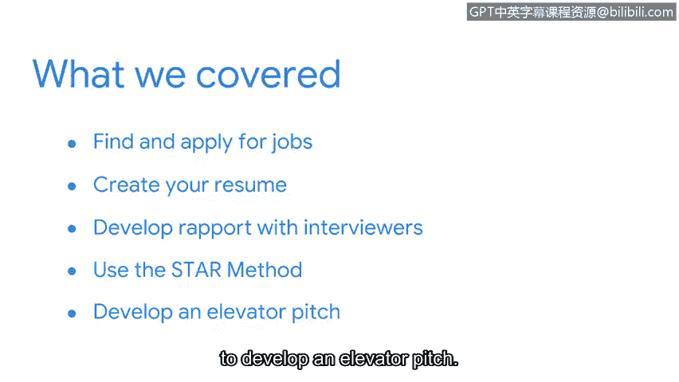

**网络安全求职实战：第八课：课程总结**

在本节课中，我们将回顾并总结关于如何为网络安全求职做好准备的各项关键技能与策略。

---

你已经出色地完成了本课程这一部分的学习。让我们花点时间来回顾一下所涵盖的内容。

我们首先讨论了如何在安全领域寻找和申请工作。

接下来，我们探讨了如何创建一份出色的简历。

随后，我们分享了一些与面试官建立良好关系的策略。

我们还介绍了如何使用**STAR方法**来有深度地回答开放式的面试问题。其核心公式为：
**S（情境） + T（任务） + A（行动） + R（结果）**

最后，我们讨论了如何构思一个简洁有力的电梯演讲。

---

希望这些内容能帮助你在开始寻找和申请安全领域的工作时充满信心。祝你好运。

---

**总结**
本节课中，我们一起学习了网络安全求职的全流程：从寻找职位、制作简历，到面试沟通技巧（包括建立关系、运用STAR方法回答问题）以及准备电梯演讲。掌握这些技能将为你成功踏入网络安全职业生涯奠定坚实基础。