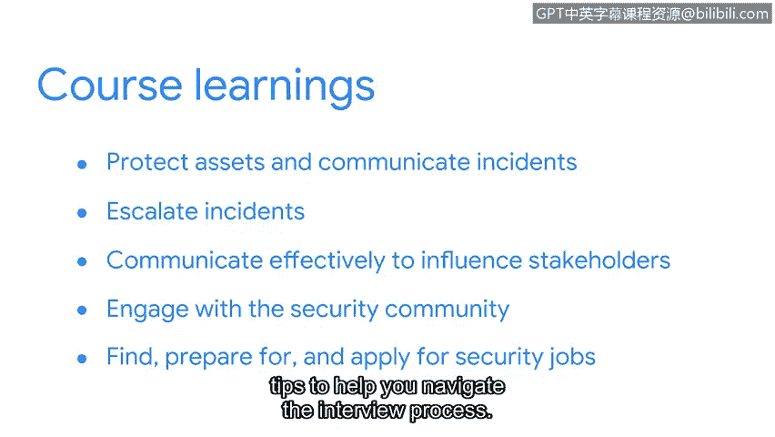

# 082：课程总结

在本节课中，我们将回顾整个课程的核心内容，总结从培养安全思维到求职准备的全过程。

---

## 🎉 祝贺与回顾

恭喜你完成证书项目的最后一门课程。我们覆盖了大量信息，现在花点时间来回顾一下。

我们首先讨论了如何通过培养安全思维来保护资产并沟通安全事件。

---

## 🛡️ 培养安全思维与事件沟通

上一节我们介绍了安全思维的重要性，本节中我们来看看具体如何应用。

我们探讨了如何以及何时将事件上报给合适的团队成员，以确保小问题不会演变成对组织及其服务对象造成严重影响的大问题。

---

## 📢 有效沟通与影响决策

接下来，我们探索了有效沟通的方法，以影响利益相关者做出与安全相关的决策。

这包括以下具体方式：
*   讨论如何使用可视化图表来传达重要信息。
*   发送电子邮件。
*   拨打电话或发送即时消息。

---

## 🤝 融入安全社区

之后，我们分享了一些融入安全社区的方法。

以下是几种有效的途径：
*   参加行业会议。
*   通过社交网络平台与其他分析师建立联系。

---

## 💼 求职准备与申请

然后，我们进入了课程的最后部分，该部分涵盖了如何寻找、准备并申请工作。

这包括以下关键讨论点：
*   如何创建一份有吸引力的简历。
*   帮助你顺利通过面试流程的技巧。

---

## ✨ 总结

在本节课中，我们一起学习了从建立安全基础、有效沟通、社区参与到最终求职的完整路径。能够陪伴你完成这段学习旅程，是我的荣幸。