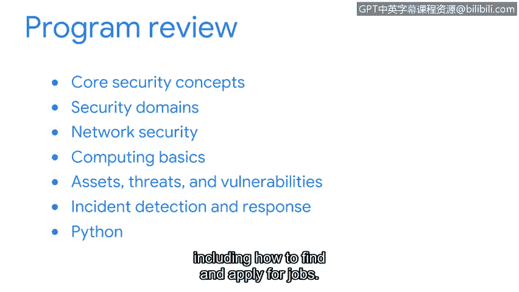
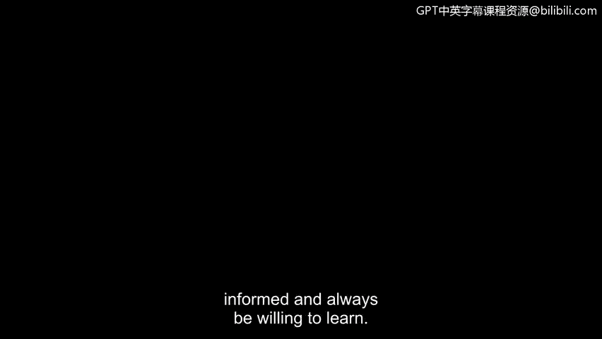

**谷歌网络安全专业证书：第八课：投入实践：为网络安全工作做好准备**

在本节课中，我们将回顾整个谷歌网络安全专业证书课程的核心内容，总结所学知识，并为你的网络安全职业生涯做好准备。

---

这个证书课程涵盖了一些严谨的网络安全内容。你本可以在任何时刻选择放弃。但你坚持了下来。为此，你值得为自己感到骄傲。

正如我们在课程伊始所讨论的，安全领域正在不断发展，并且急需像你这样的安全专业人员，来帮助保护世界各地的组织及其所服务的人群。你在整个证书课程中获得的知识与技能，将使你能够开始申请入门级的安全分析师职位。

现在，让我们花点时间来总结一下我们在整个课程中讨论的内容。

以下是本证书课程涵盖的核心模块概览：

*   **模块一：核心安全概念**：我们首先探讨了核心安全概念，包括安全的定义和核心技能。
*   **模块二：安全领域与组织运营**：接着，我们介绍了八个安全领域的重点，并讨论了安全如何支持关键的组织运营。
*   **模块三：网络安全**：随后，我们讨论了网络安全，包括网络架构以及用于保护组织网络的各种机制。
*   **模块四：安全分析师的计算基础**：在下一门课程中，我们将重点转向安全分析师的计算基础。在这一部分，我们介绍了 **`Linux`** 和 **`SQL`**。
*   **模块五：资产、威胁与漏洞**：之后，我们深入探讨了资产、威胁和漏洞。这包括讨论资产如何分类，以及组织用于保护重要信息和最小化风险的安全控制措施。
*   **模块六：事件检测与响应**：在接下来的课程中，我们专注于事件检测与响应。在这里，我们定义了什么是安全事件，并解释了事件响应的生命周期。
*   **模块七：Python编程与安全任务**：在随后的课程中，我们介绍了 **`Python`** 编程语言，并探索了如何开发与常见安全任务相关的代码。
*   **模块八：职业发展路径**：最后，在课程的最后一个模块，我们探讨了与进入安全行业相关的主题，包括如何寻找和申请工作。

---

你投入了大量宝贵的时间和精力来完成这个证书课程。请记住，学习并不会在此止步。随着你在职业生涯中不断前进，请始终关注安全领域涌现的新趋势。

随着技术的持续进步，对组织和个人的威胁也将不断演变。保持信息灵通并始终乐于学习，是你的责任。

---

**总结**

本节课中，我们一起回顾了整个谷歌网络安全专业证书课程的学习旅程。我们从核心概念出发，逐步深入到网络、系统、编程和事件响应等具体领域，最终为你进入网络安全职业做好了准备。请带着这份扎实的基础、持续学习的热情以及保护数字世界的责任感，开启你的职业生涯。