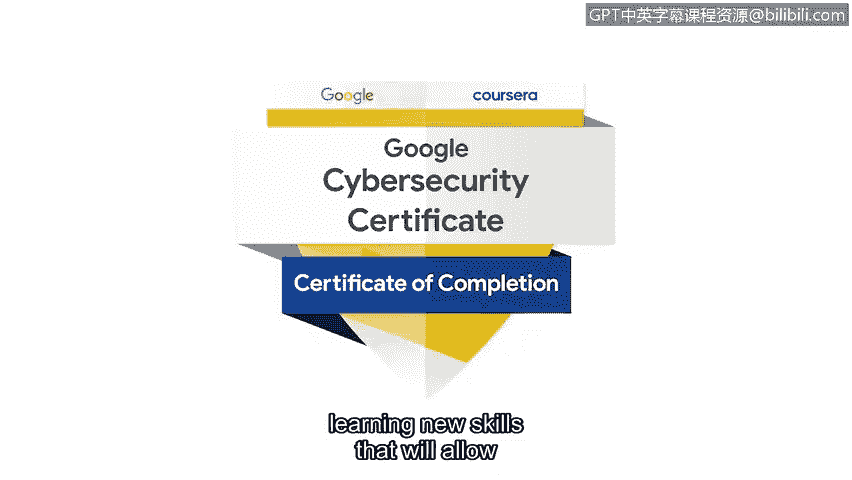

# 084：为网络安全工作做好准备

## 概述
在本节课中，我们将回顾并总结完成谷歌网络安全专业证书课程的成就与意义。课程讲师们将向完成学业的学员表示祝贺，并展望未来的职业发展道路。

---

## 课程完成祝贺 🎉

你刚刚完成了谷歌网络安全专业证书课程。

这是一项非凡的成就，它充分表明了你致力于学习新技能、追求职业目标的决心。

---

## 讲师寄语

以下是来自课程讲师团队的祝贺与鼓励。

恭喜你。你做到了。

我迫不及待地想看到你们中有多少人决定投身这份职业，并在网络安全领域探索那些非常酷的领域。

恭喜，你是超级明星。干得漂亮。

你做到了。我为你加油，祝你持续成功。你所取得的成就，可能是你做过的最棒的决定之一。我期待着你将体验到的所有机会。

恭喜你抵达终点。你已经准备好去保护每个人的安全了。

请持续学习，持续成长。你会发现这是一个非常有价值的职业。

恭喜你做到了。欢迎来到网络安全世界。冒险在此之后仍将继续，网络安全世界还有更多内容等待探索，但你已经准备就绪。

能够引导你完成本项目的最后部分，是我的荣幸。我知道你已经为开启或继续一段卓越的网络安全职业生涯做好了充分准备。

祝贺你，并祝你在未来的旅程中一切顺利。

---

## 总结
本节课中，我们一起聆听了课程讲师对学员完成谷歌网络安全专业证书的衷心祝贺。他们肯定了学员的努力与成就，并鼓励大家将所学知识应用于实践，在持续学习和成长中，开启有价值的网络安全职业生涯。