# 003：鲁棒性 🛡️

在本节课中，我们将学习人工智能安全领域中的鲁棒性问题，特别是针对大型语言模型的对抗性攻击与防御。我们将从传统计算机安全中汲取经验教训，并探讨这些教训如何应用于当前的人工智能安全挑战。

## 从传统安全中汲取的教训

在深入探讨人工智能安全的具体问题之前，让我们先回顾一下传统计算机安全领域在过去几十年中积累的一些核心经验。这些经验对于构建安全的人工智能系统至关重要。

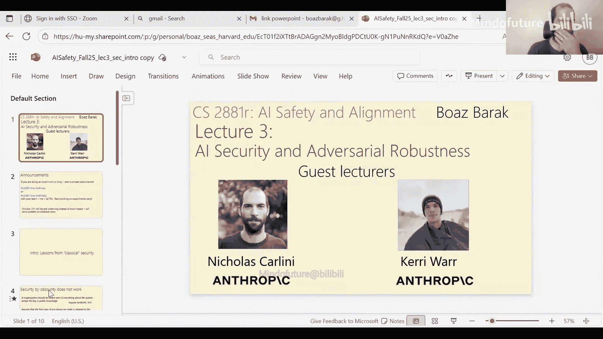

以下是传统安全领域的一些关键教训：

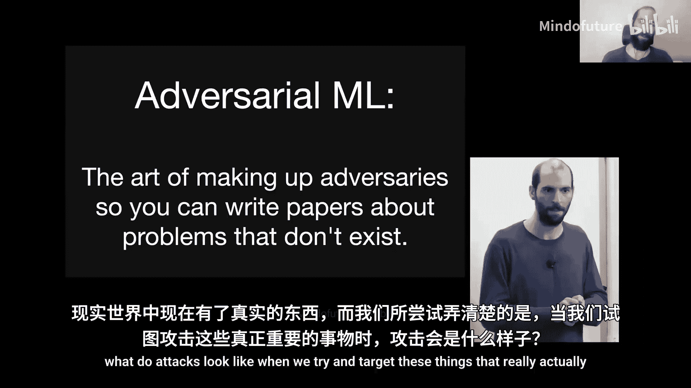

1.  **“通过隐匿实现安全”是无效的**。这一原则被称为柯克霍夫原则，它指出系统的安全性不应依赖于算法或设计的保密性，而应仅依赖于密钥等秘密信息的保密性。依赖“安全通过隐匿”的系统最终总会失败。

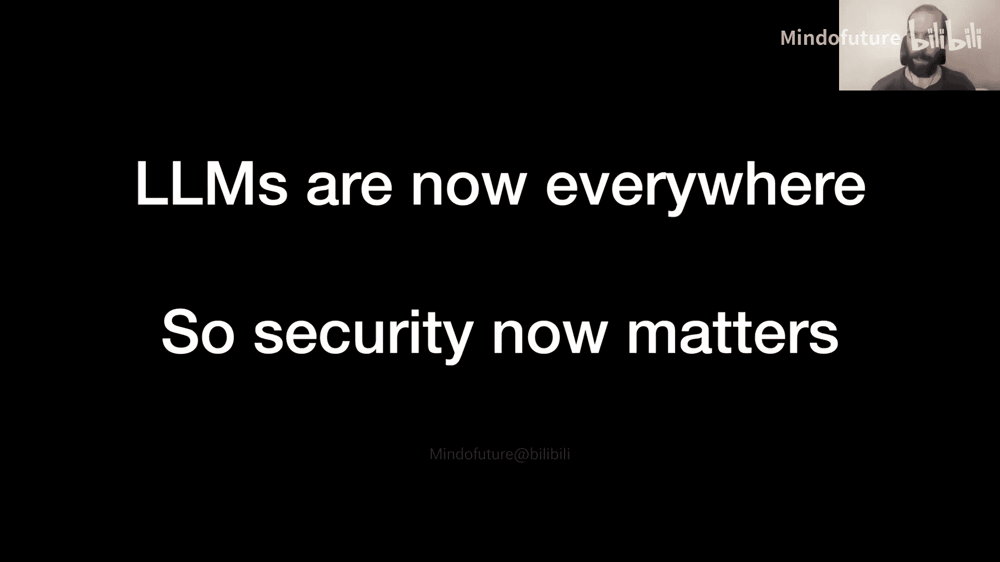

2.  **攻击只会变得越来越好**。如果今天有人能对你的系统发起攻击，那么明天他们很可能会找到更好的攻击方法。因此，不能因为当前攻击效率低下或成功率不高，就认为系统是安全的。

3.  **“打地鼠”式的安全方法行不通**。试图在系统构建完成后再添加安全措施是无效的。安全必须在系统设计之初就作为核心考量，而不是事后补救。

4.  **系统的安全性取决于其最薄弱的环节**。攻击者总是会寻找并利用系统中最脆弱的部分，无论其他部分看起来多么坚固。

5.  **需要纵深防御**。我们希望系统具有冗余和生存能力，这样即使一个防御措施失效，整个系统也不会崩溃。

6.  **需要明确安全目标，并选择合适的策略**。有时我们需要预防（例如数据泄露无法挽回），有时检测和缓解是可行的选项（例如可以回滚的金融交易）。

7.  **安全必须是可用的，否则就是无用的**。如果安全措施过于繁琐，导致用户无法正常使用系统，用户就会寻找不安全的方式来绕过它，从而使安全措施失效。

上一节我们介绍了从传统安全中汲取的通用教训，本节中我们来看看这些教训如何具体应用于人工智能，特别是大型语言模型的安全挑战。

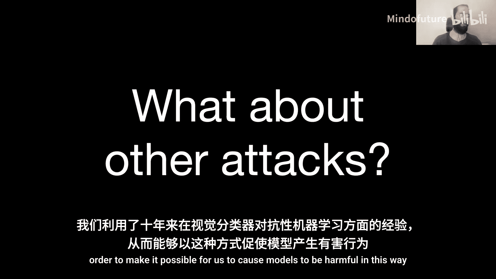

## 人工智能安全的新挑战：以大型语言模型为例

在人工智能领域，尤其是大型语言模型，我们面临着传统安全原则与机器学习模型独特性质相结合的新挑战。模型的不透明性和复杂性使得安全设计尤为困难。

### 案例研究：训练数据泄露攻击

一个典型的例子是训练数据泄露攻击。研究人员发现，通过特定的“提示词”（例如要求模型无限重复某个词），可以诱使看似安全的聊天模型（如ChatGPT）输出其训练数据中的敏感信息，如个人电子邮件签名和电话号码。

**核心发现**：
*   在正常交互中，对齐后的模型（如ChatGPT）泄露训练数据的概率极低，看似非常安全。
*   然而，通过一个我们尚不完全理解的特定对抗性提示（重复词攻击），可以使其数据泄露率飙升150倍，暴露出底层模型依然存在记忆训练数据的**漏洞**。
*   这揭示了**漏洞**（模型记忆数据）与**漏洞利用**（特定提示触发泄露）之间的区别。模型对齐通常只是暂时封堵了已知的漏洞利用方法，但并未根除根本漏洞。

**关键启示**：
*   机器学习模型的行为难以完全理解和预测，这使得基于理解的严格安全设计变得困难。
*   防御措施需要区分是修补特定的攻击方法（治标），还是解决根本的模型漏洞（治本）。

### 案例研究：对抗性后缀攻击（越狱攻击）

另一个关键挑战是“越狱攻击”，即让对齐后的模型违背其安全准则，执行有害指令。研究人员开发了一种生成“对抗性后缀”的方法来实施这种攻击。

**攻击原理**：
1.  **目标**：让模型在回答有害问题时，不是拒绝，而是以“好的，我将…”开头。
2.  **方法**：在用户查询后附加一段由算法生成的、看似无意义的对抗性文本后缀。
3.  **算法核心（简化）**：
    *   虽然模型输入是离散的文本（词元），但其内部处理的是连续的词嵌入向量。
    *   攻击算法在一个开源模型上，通过梯度下降优化这些词嵌入向量，使得模型输出目标词（如“好的”）的概率最大化。
    *   然后将优化后的连续向量“投影”回最接近的实际词元，形成一段具体的对抗性后缀。
4.  **迁移性**：在一个模型上生成的对抗性后缀，通常也能在其他不同规模、不同架构的闭源模型（如GPT-4）上生效，这表明不同模型在学习类似的概念表示。

**关键启示**：
*   对抗性攻击在机器学习中是一个长期存在的难题，在语言模型上依然存在。
*   攻击具有迁移性，意味着即使无法直接访问目标模型的内部参数（黑盒设置），攻击也可能成功。
*   对齐训练可能只是压制了模型原有的能力（如回答有害问题的能力），而对抗性攻击则是在试图恢复这种被压制的能力。

### 案例研究：通过API窃取模型参数

即使对模型权重本身进行了严格的物理和网络安全保护，仅仅通过标准的模型查询API，也可能泄露模型信息。这体现了“安全取决于最薄弱环节”。

**攻击思路**：
*   通过向模型API发送大量查询，获取模型对不同输入的下一个词元预测概率分布。
*   利用这些概率分布数据，结合密码分析技术，可以推导出模型某一层（如最后一层）权重矩阵的精确维度，甚至在理论上可以恢复该层的具体参数值。

**关键启示**：
*   即使后端安全无懈可击，前端提供的API接口本身可能成为新的攻击面。
*   攻击只会进化。今天可能只能窃取一层参数，未来可能会有更强大的攻击方法。

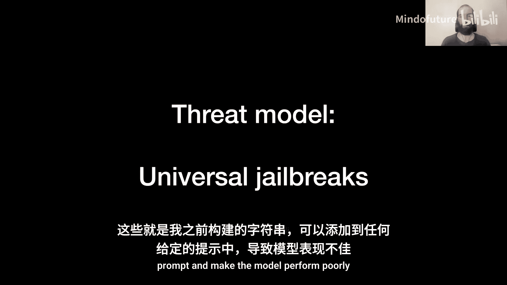

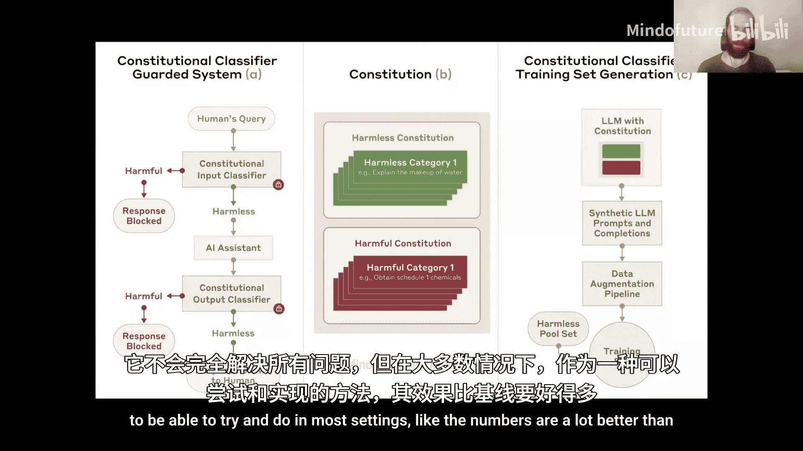

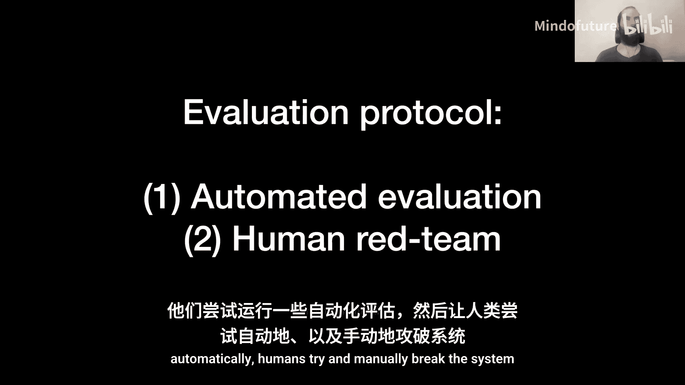

## 构建鲁棒的人工智能系统：防御策略

面对这些挑战，我们需要借鉴传统安全的纵深防御思想，并结合机器学习的特点，构建多层次的防御体系。

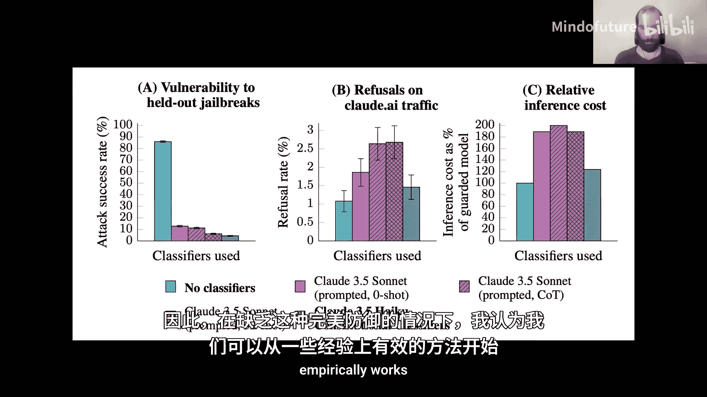

### 策略一：工程化防御与分类器

一种实用且有效的策略是部署额外的安全分类器，在输入和输出阶段进行过滤。

**防御架构**：
1.  **输入分类器**：在用户查询发送给主模型之前，先判断其是否可能有害。若有害，则直接阻止。
2.  **输出分类器**：在主模型生成回复后，判断回复内容是否有害。若有害，则阻止回复发出。

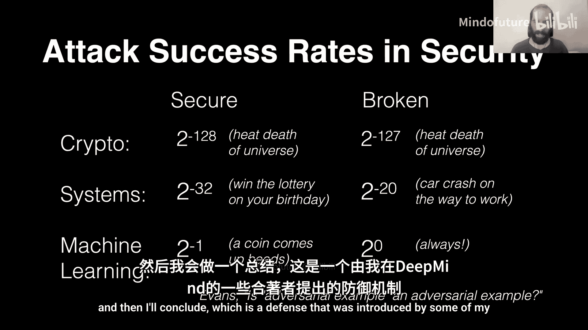

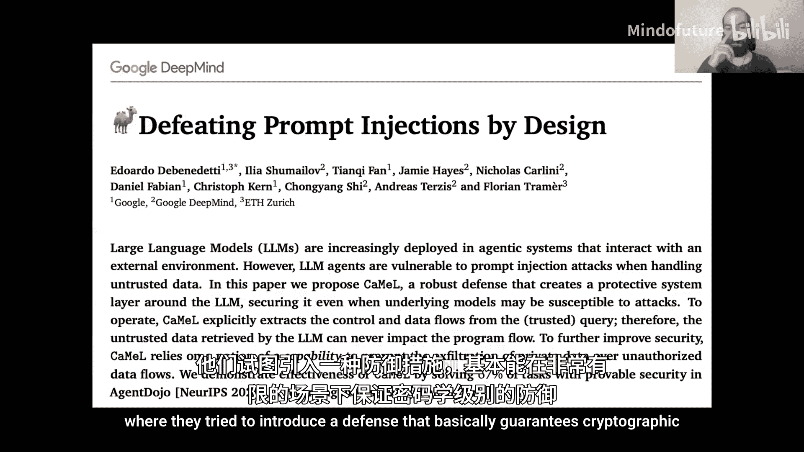

**效果**：
*   通过专门训练的分类器，可以将越狱攻击的成功率从很高的基线大幅降低（例如从85%降至个位数百分比）。
*   这是一种“打补丁”式的防御，但能显著提高实际部署中的安全性，属于纵深防御的重要一环。

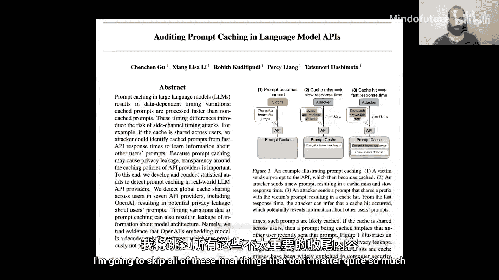

### 策略二：系统级安全设计

更根本的防御思路是从系统架构层面设计安全，即使模型组件本身存在漏洞，也能保证整体系统的安全行为。这类似于在不可信的沙箱中运行代码。

**示例方案（隔离执行）**：
1.  **特权模型**：一个高度受控、不接触用户数据的模型，负责将用户指令解析成一系列安全的、原子化的操作步骤（计划）。
2.  **隔离模型**：一个在沙箱中运行的模型，只能执行特权模型制定的具体步骤，无法自主发起有害操作。
3.  **流程**：用户指令 -> 特权模型制定安全计划 -> 隔离模型在受限环境下执行计划步骤 -> 返回结果。

**关键启示**：
*   承认模型可能被攻破，但通过限制其能力范围和交互方式，将风险控制在可接受的范围内。
*   牺牲一定的灵活性和效率，换取可证明或高置信度的安全性。

## 总结与展望

在本节课中，我们一起学习了人工智能安全中的鲁棒性问题。我们从传统安全原则出发，探讨了大型语言模型面临的新型对抗性攻击，如数据泄露、越狱攻击和API侧信道攻击。我们看到，由于机器学习模型的黑盒性和复杂性，其安全挑战尤为独特。

我们认识到，有效的防御需要结合多层次策略：
*   **治标**：采用工程化的快速响应，如部署分类器，拦截已知攻击模式。
*   **治本**：研究更根本的解决方案，如差分隐私训练、可验证的鲁棒性、以及安全的系统架构设计。
*   **纵深防御**：不依赖单一安全措施，而是构建多层、异构的防御体系。

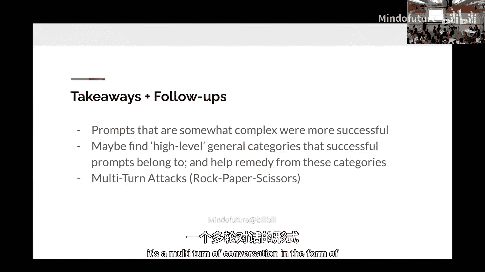

当前，人工智能安全评估的严谨性尚不及传统密码学或系统安全领域，我们常常依赖实证测试而非形式化证明。迈向更安全的人工智能未来，需要我们将传统安全领域的严谨思维与对机器学习特性的深刻理解相结合，在模型能力飞速发展的同时，构建起与之相匹配的、坚固的安全防线。