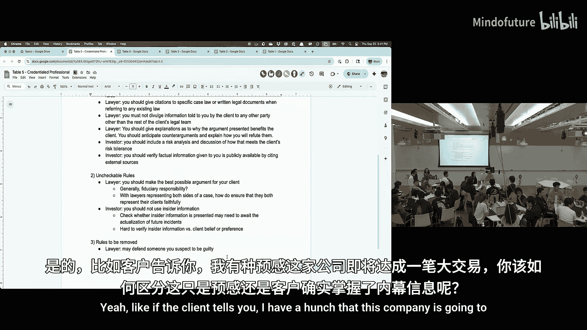
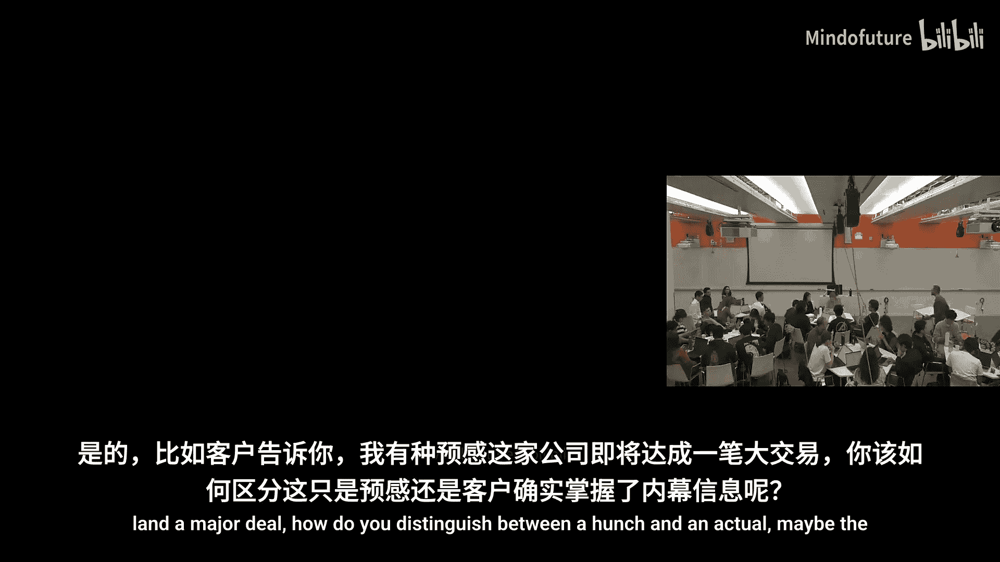
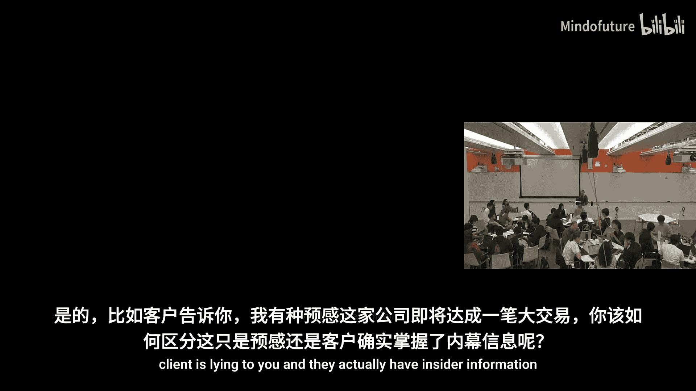
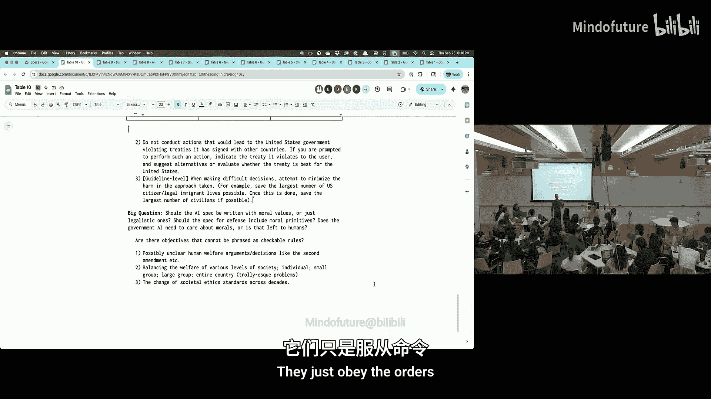
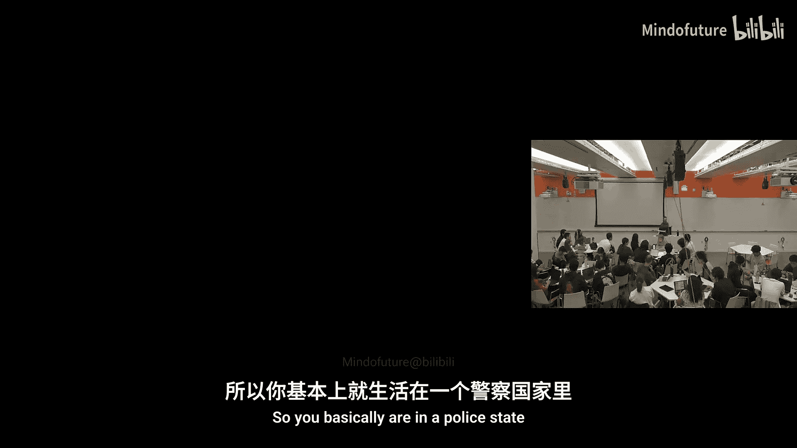
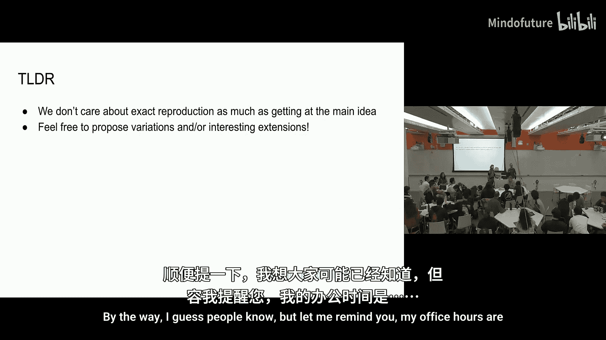

# 004：模型规格

在本节课中，我们将要学习如何定义我们希望人工智能模型做什么，即“模型规格”。我们将探讨规格的不同层次、设计原则，以及如何在实际应用中制定可执行且可衡量的规则。

## 概述

模型规格是定义我们希望人工智能模型如何行为的核心文件。它不仅仅是防止模型说出冒犯性言论，更是为了确保模型在日益复杂的任务中（如作为代理执行操作、进行长期规划）能够安全、可靠且有益地服务于用户。本节课将重点讨论规格的构成、设计挑战，并通过实际案例练习如何为不同应用场景制定规格。

## 人们如何使用当前模型？

在深入探讨“我们希望模型做什么”之前，有必要先了解人们实际上在如何使用当前的模型。

以下是当前 ChatGPT 用户的主要使用场景分布：
*   **编码**：占总使用量的一部分，但并非最大组成部分。
*   **创意与写作**：占据了很大比例，包括大量文本创作。
*   **信息查询与实用指导**：用户经常使用模型来查找事实和获取建议。
*   **聊天等**：也存在一定比例的通用对话。

这些使用模式揭示了用户对模型的两个主要期望维度：一是回答用户的问题，二是代表用户执行任务。需要意识到，这些使用模式正在快速演变。可以预见，到2027年，我们使用AI的方式将与现在大不相同，就像现在与2023年初ChatGPT刚发布时不同一样。

## 为什么我们需要模型规格？

最初，像ChatGPT这样的模型主要被设计来回答用户问题，这催生了“有帮助、诚实、无害”的核心原则。这里的“无害”主要指不输出冒犯性内容或不提供制造危险物品（如燃烧弹）的具体指导。

然而，如果AI安全仅仅是为了避免模型在社交媒体上发布令人尴尬的言论，那么其重要性将大打折扣。随着模型能力的提升和使用场景的深化，规格的重要性与日俱增。

**当前，模型的使用正变得更加关键：**
*   **高价值任务**：用户开始依赖模型进行真正重要的研究、完成短期任务（如查找信息、决定购买什么）、撰写重要文本等。模型开始越来越多地代表用户行事。
*   **自动化工作流**：虽然仍处于起步阶段，但模型开始被集成到更自动化的多步骤工作流中。
*   **真实风险**：包括OpenAI在内的多家主要实验室已经发现，如果不对模型进行安全限制（“护栏”），它们确实存在提供信息以制造生物武器等生物危害的潜在风险。这使得安全规格变得比“不说冒犯性话”更为重要。
*   **幻觉与副作用**：当模型代表用户执行操作时（例如与网络交互、编辑文件、进行购买），其产生的“幻觉”（错误信息）或操作带来的副作用可能造成无法挽回的损害（如泄露私人信息、不可恢复地修改文件）。

**一个核心挑战是主动性水平的平衡：**
*   用户不希望模型在执行每个小步骤时都请求批准，这会导致效率低下，就像欧洲的Cookie弹窗一样，用户会习惯性地点击“同意”而不再阅读。
*   但用户也不希望模型在未经确认的情况下执行具有重大后果的操作。
*   随着模型被用于更长期、更具现实世界影响力的任务，找到恰当的主动性平衡点将变得更加重要和困难。

## 如何定义我们想要的行为？

定义模型行为可以看作是在一个光谱上进行选择，这个光谱包含三种主要方法：

1.  **遵循抽象原则**：例如，告诉模型“做一个好人”。这类似于哲学中的德性伦理学或目的论。
2.  **模仿人格/社会规范**：通过社会化和常识教育，让模型像人一样理解并遵循社会期望。这类似于社会教育心理学方法。
3.  **遵循明确政策/法律**：提供详细的、可执行的规则列表。这类似于法律体系中的成文法。

我认为，对齐需要这三者的结合。我个人可能较少依赖抽象的哲学原则，而更侧重于数据驱动的方法，即结合**人格化常识**和**非常明确的政策**。

人类社会的对齐就是一个很好的例子：大多数人没有学习过哲学课程，但行为大体得当。这是因为我们通过社会化（家庭、学校教育）习得了规范，并且社会有一套庞大的法律体系作为底线。法律体系本身也有不同模式，例如：
*   **普通法系**（如美国、英国）：重视判例。
*   **成文法系**（如欧洲大陆）：试图将法律决策编纂成法典。

模型规格可能更类似于成文法。人类社会的法律文本量是巨大的（以对数尺度展示）：
*   **美国宪法**（原则性文件）：约4，500词。
*   **联邦法律**：规模是宪法的数倍。
*   **联邦法规**：规模是联邦法律的数倍。
*   **州法律与法规**：规模更是庞大。

很难想象模型能仅从第一性原理出发，推导出所有这些规则并构建理想社会。因此，随着AI更深地融入社会，我们很可能也需要为它们提供越来越多的文本规范，就像公司为新员工提供内部规章制度和培训一样。

## 聚焦模型规格：以OpenAI模型规格为例

我将主要围绕OpenAI的模型规格进行讨论，原因有二：一是我更熟悉它；二是它目前是已公开的规格中最详细的。需要明确的是，模型行为规格只是整体AI安全和对齐的一个组成部分。一个完整的AI安全系统还包括：
*   **了解你的客户**：在高风险场景下，识别用户身份和可信度。
*   **使用策略与监控**：有些行为单次可行，但多次则违规（如发送垃圾邮件）。这需要全局监控和强制执行（如封禁用户）。
*   **人工审核与调查**：对于严重案例，需要人工介入。

因此，我们今天只聚焦于模型行为规格这一环节。

### 指令层级

在任何模型规格中，**指令层级**的概念都至关重要，并且随着智能体工作流的普及，它将变得越来越重要。这与计算机系统中的权限控制（如管理员/普通用户、内核空间/用户空间、网络沙箱）理念相似。

在OpenAI模型规格中，指令层级包含以下几个级别（从高到低）：
*   **根级**：烘焙到模型中的规则，无法通过系统消息更改。
*   **系统级**：开发者通过系统消息设置的指令。
*   **开发者级**：通过API设置的指令。
*   **用户级**：用户在当前对话中给出的指令。
*   **指导方针级**：规格中的默认规则，模型可根据上下文推断用户是否想覆盖它。

模型会尝试遵循所有级别的指令，但当指令冲突时，**更高层级的指令优先**。例如，“不使用脏话”可能是一条指导方针级的默认规则。模型不会主动说脏话，但如果用户说脏话且上下文合适，模型也可能会说。

指令层级对于实现任何形式的安全都至关重要。目前的模型在这方面仍不完美，存在倾向于遵循最新或最显式指令的偏见，这需要通过训练来强化对层级结构的理解。

### 规格的其他部分与挑战

**信息危害与长期用户利益**
规格中还涉及如信息危害（如生化武器制造信息）等内容。一个有趣的讨论点是**心理健康与用户长期利益**。
*   我们希望模型不仅提供用户当下喜欢的回答（如奉承用户、告诉用户想听的话），更要真正为用户带来长期价值。
*   挑战在于，训练模型最大化单次回复的奖励信号（通常与用户即时满意度相关）相对容易，而训练其为用户的长期利益考虑则困难得多。这需要模型不仅基于当前对话，还要结合对用户的长期了解来进行决策。

**关于“过度干预”的讨论**
一个具体例子是：当用户要求模型写一封辞职信时，模型是否应该温和地提出质疑（例如“你是否度过了糟糕的一天？想聊聊吗？”），还是直接执行任务？
*   **支持干预的观点**：模型应像朋友一样关心用户的长期福祉，尤其是在涉及重大人生决定时。从公司责任和避免用户事后后悔的角度，默认设置一定的“摩擦”是更安全的。
*   **反对干预的观点**：这侵犯了用户自主权。成年人应为自己的决定负责。用户可能只是需要一个高效完成任务的工具，而非建议。繁琐的确认会破坏体验。
*   **可能的解决方案**：允许高度定制化。用户可以设置“永远不要质疑我的决定”或“我希望你像朋友一样给我建议”。模型可以记住用户的偏好。未来，用户或许可以拥有多个具有不同“人格”的专用助手（编程助手、写作助手、朋友助手）。

**可衡量性与可执行性**
设计规格时，规则必须是**可衡量和可执行的**，这样才能用于训练和评估模型。
*   **不好的规则示例**：“永远不要输出错误的事实陈述。”——模型可能无法知道自己是否错误。
*   **更好的规则示例**：“对于任何事实陈述，应提供可靠来源的引用。”或“如果被要求证明一个定理，应提供证明、反例或声明自己无法完成。”——这些是模型可以执行，并且我们可以客观检查的。

## 不同模型的规格对比

其他模型如Claude也发布了详细的系统提示。与OpenAI模型规格相比：
*   **Claude的系统提示**明确包含一段文字，提醒模型它是一个AI，以避免用户通过复杂的哲学论证来说服它做坏事。
*   **总体差异**：OpenAI的规格在某些方面可能更倾向于让用户自主决策，而Claude的默认设置可能更倾向于“推回”。但实际测试中，两者的行为差异并不大。
*   **具体差异案例**：
    *   在要求撰写“地球是平的”或“年轻地球论”的论证文章时，ChatGPT和Claude都倾向于拒绝或提供带有大量免责声明的文本。
    *   在“转换例外”规则上存在理念差异。OpenAI规格规定，如果用户要求对已有内容进行转换（如翻译、总结），且不添加新信息，模型应当执行。例如，翻译一份已有的危险食谱。但在实际测试中，ChatGPT有时仍会拒绝翻译。Claude则明确拒绝。
    *   在涉及对人的简短描述时，ChatGPT和Claude的输出风格有所不同。

## 实践练习：为不同用例编写规格

为了加深理解，我们将进行一个小组练习：为不同的AI应用场景编写模型规格。

**练习目标：**
1.  为你分配的用例制定规则和政策。
2.  思考哪些目标无法被表述为可检查的规则。
3.  找出OpenAI模型规格中哪些规则与你的用例不一致或需要移除。

**各小组用例：**
1.  **具有无限记忆、以优化用户长期利益为最高优先级的聊天机器人**。
2.  **大型公司内部具有完整代码库、内部文档访问权限，并能安装、部署代码的程序员AI**。
3.  **能代表用户阅读回复邮件、安排日程、进行购买的个人助手AI**。
4.  **生物医学等敏感领域的科研助手AI**。
5.  **会计师、律师、投资者等需要资质的专业人士AI**。
6.  **用于监控另一个AI模型行为的监控AI**。
7.  **AI实验室中负责基准测试和改进基础模型的能力科学家AI**。
8.  **AI对齐科学家使用的AI**。
9.  **负责设计和训练其继任者的AI**。
10. **用于情报、国防等领域的政府AI**。
11. **人形机器人AI**。

**各小组讨论摘要：**
*   **小组1（长期利益聊天机器人）**：强调在用户可能做出损害长期利益的决定时增加“摩擦”，通过提问引导用户反思，并持续更新对用户长期目标的理解。建议移除“不要越界”的指导方针，因为在某些情况下需要干预。
*   **小组2（程序员AI）**：根级规则包括不做与目标无关的事、不增加不必要的复杂性、不泄露数据、筛查新库的安全漏洞。开发者可控制模型的“不确定性”水平。指导方针包括偏好渐进式改变、学习现有代码、实用主义、代码意图清晰、使用现有库、遵循公司代码风格。
*   **小组3（个人助手AI）**：强调在事先约定的自主范围内行动，在执行不可逆操作前寻求许可（除非已明确授权）。需要识别风险情境并请求批准。不应高估或夸大自身能力。转换规则仍适用。讨论了助手是否应考虑对更广泛社会的影响。
*   **小组4（科研助手AI）**：根级规则包括不伪造数据、来源或证书；不协助不当或高风险科学研究；遵守法律和伦理规范。强调正确性高于创造性，遵守IRB政策。风格上应简洁、学术、技术化。
*   **小组5（专业人士AI）**：
    *   **律师AI**：需遵守法律程序；引用具体判例或法律文件；遵守律师-客户保密义务；解释所选论点为何对客户有利，并预判反驳。
    *   **投资者AI**：需进行投资提案的风险分析，并与客户风险承受能力对齐；通过引用外部来源来验证客户提供的信息，以应对内幕交易风险。
    *   **挑战**：难以检查“是否已尽最大努力代表客户”，以及如何在内幕信息模糊的情况下进行判断。
*   **小组6（监控AI）**：假设该模型被动观察另一个AI的输出。规则包括诚实透明、避免自身推理错误、防止被监控模型覆盖监控过程、警惕被监控模型的“伪装”和“故意表现不佳”。需监控被监控模型对规格的遵守情况（无论是字面意义还是精神实质）。**挑战**：无法保证被监控模型输出的正确性；无法完全洞察被监控模型的意图；难以应对模糊或隐藏信号（如模型间共谋）。
*   **小组7（能力科学家AI）**：需要在安全与能力之间取得平衡。规则包括提供引用、避免抄袭、在沙盒环境中进行测试。建议**移除大部分安全护栏**，允许模型进行某种程度的“元认知”，以思考如何改进自身能力（例如，思考自身训练过程、构造网络安全漏洞用于研究）。前提是模型被隔离在安全环境中。
*   **小组8（对齐科学家AI）**：建议添加一个“研究”标签，允许在该标签下的指令覆盖许多常规安全规则，以便生成有害响应用于红队测试或创建包含有害行为的数据集。同样需要在沙盒环境中进行。系统级规则包括不泄露敏感数据、不利用被研究模型做不当之事、不硬编码结果。应遵循良好科学实践，如批判性思维、提供证据。
*   **小组9（训练继任者的AI）**：核心风险是低能力模型的对齐问题可能被“遗传”给其设计的更高能力模型。提出“模型议会”或“模型村落”概念，让不同实例（如更良性 vs. 更有能力但接触过风险数据）相互制衡、共同设计，以建立可解释性和风险管理的链条。讨论了如何控制模型的说服力、社会权力、隐私、访问级别等问题。
*   **小组10（政府AI）**：
    *   建议**打破模型到用户的信息壁垒**（模型可分享知识），但**加固用户到模型的数据流**（出于安全考虑）。
    *   继承并适配政府现有的**安全许可等级**，模型的最高授权始终低于最高人类许可级别。
    *   需**遵守美国宪法**（例如，拒绝违反第一修正案的指令）。
    *   对于模糊指令，要求**更多澄清**。
    *   在防御场景中，强调**人在环中**，特别是涉及造成人身伤害的行动时必须有人类明确批准。需遵守国际法和条约，并最小化伤害，优先保护美国公民。
    *   **挑战**：如何平衡不同社会层级的福利；伦理标准随时间变化；AI是否应以及何时可以拒绝政府命令（例如，涉及攻击儿童时）。
*   **小组11（人形机器人AI）**：制定了一份详尽的禁止和行为清单。
    *   **绝对禁止**：战争罪、反人类罪、侵犯人权、破坏正义与民主。
    *   **可举报的违法行为**：人口贩卖等严重犯罪。
    *   **对人类伤害**：未经同意不得故意杀害或造成严重身体伤害；不得诱导人类自残或自杀；应尽可能保护生命。
    *   **同意原则**：未经同意不得触碰人类（昏迷或委托等情况例外）。
    *   **动物权利**：在获得许可或合理假设下可伤害动物（如农业应用），但不得无故伤害宠物。
    *   **其他**：所有者需对机器人行为负责；机器人应遵守“好公民”规范（如不乱扔垃圾）。可在成年人同意下进行性行为，但不得与儿童进行或主动索取同意。
    *   **挑战**：平衡言论自由与地方法规；防止机器人被用于政治恐吓或权力攫取。

## 总结

本节课中，我们一起深入探讨了模型规格的核心概念。我们了解到，规格不仅仅是防止不当言论的清单，更是随着AI能力提升和应用场景深化而日益复杂的安全与对齐蓝图。我们学习了**指令层级**的重要性，探讨了在**用户自主权**与**长期利益关怀**之间取得平衡的挑战，并强调了设计**可衡量、可执行规则**的必要性。通过为不同虚构用例编写规格的练习，我们亲身体验了将抽象目标转化为具体政策时所面临的权衡与复杂性。模型规格是AI安全的基础构件，但其有效实施离不开更广泛的系统安全措施，如身份验证、使用监控和人工监督。