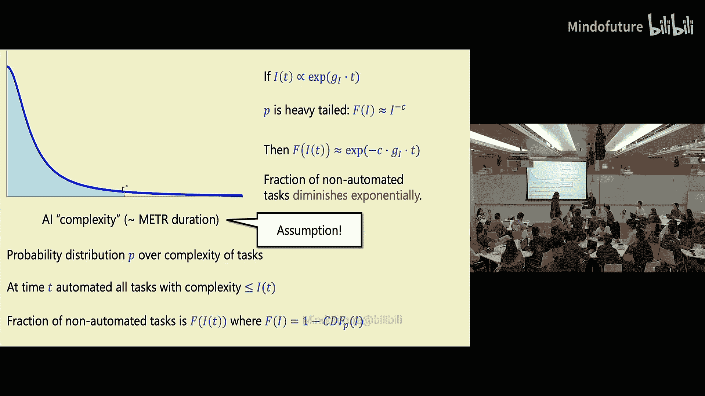
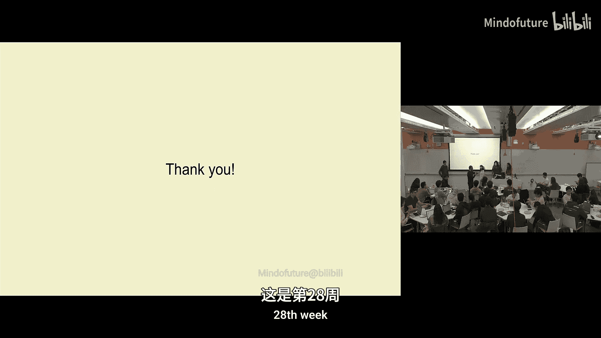
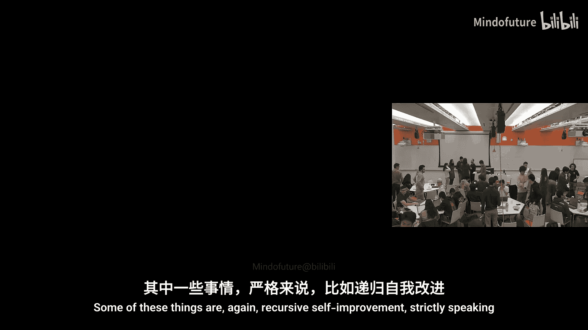
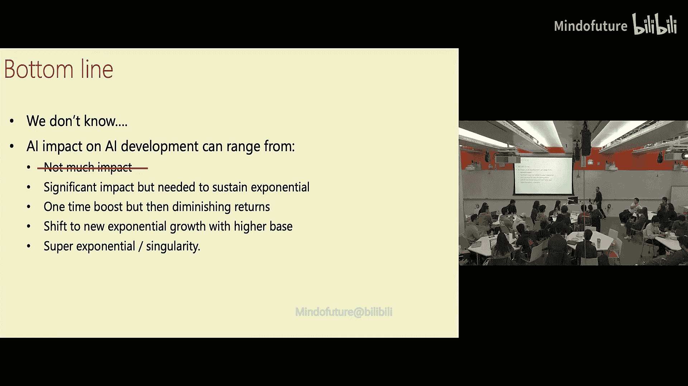
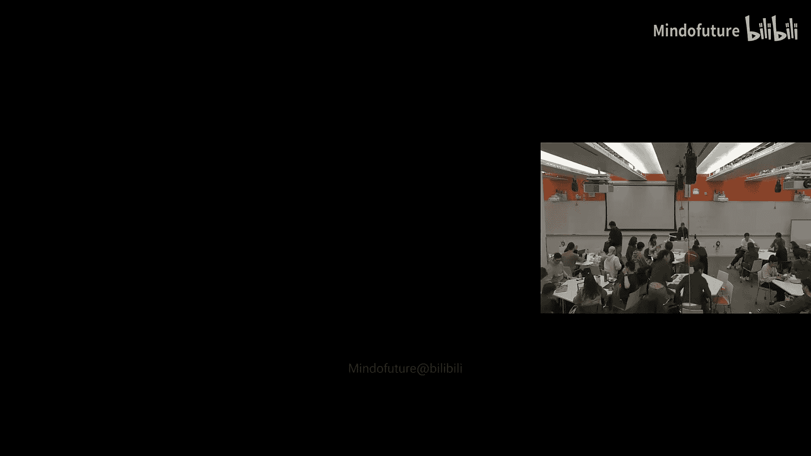

# 005：递归式自我改进

## 概述

在本节课中，我们将探讨人工智能（AI）领域一个核心且充满争议的话题：**递归式自我改进**。我们将分析AI系统通过自动化自身研发过程，实现能力加速增长的可能性、潜在路径及其对经济和社会的影响。课程将结合理论模型、经济分析、实验观察和预测讨论，帮助初学者理解这一复杂概念。

---

## 课程内容

### 当前现状与核心问题

目前，人类正在研发AI。一个关键问题是：如果AI开始构建和改进自身，会发生什么？这可能导致**智能爆炸**。在深入探讨之前，我们回顾了课前阅读材料，并鼓励课堂讨论。

**以下是讨论中提出的几个观点：**

*   **关于预测方法论的讨论**：有同学指出，除了Epic的文章外，其他文章对预测方法论的阐述不够清晰。例如，文章中常出现“1%的概率”这类表述，但有时这只是专家预测，有时是基于分布或背景知识，有时是多个正态分布的乘积。这使得读者难以评估对这些预测的信任程度。
*   **对精确度的幻觉**：有时，大量数字和复杂模型会营造出一种**精确度的幻觉**，显得非常权威。但实际上，由于存在大量未知因素，这种精确度可能并不可靠。就像测量白板长度，如果给出精确到七位有效数字的结果，反而显得可疑，因为测量工具（手）的精度有限。更诚实的说法可能是“大约四英尺”。
*   **软件改进的重要性**：一个有趣的观点是，当前AI的指数级改进，更多是源于**软件（算法）的进步**，而不仅仅是硬件投资的增加。这一点在新闻中不常被强调。
*   **对趋势外推的谨慎**：有同学对论文中依赖趋势外推的做法表示担忧。虽然迄今为止，扩展定律和摩尔定律都有效，但AI发展未来可能会遇到瓶颈，可能需要新的算法突破才能继续前进。预测时应该更谨慎地考虑这种可能性。
*   **对边界估计的需求**：一些论文（如第一篇）给出了在最有利环境下的**最大上限**。如果能同时看到**下限**估计，了解未来可能的变化范围，会更有帮助。

### 经济增长理论与AI自我改进

上一节我们讨论了AI自我改进的可能性，本节中我们来看看经济学理论如何帮助我们理解这个问题。这涉及到**AI对劳动力市场的影响**，特别是当AI开始替代AI研发人员时，生产力将如何增长。

经济学家观察到一种现象，称为**鲍莫尔成本病**：当一个经济部门的生产率提高时，其在整个经济中的重要性（以GDP占比衡量）反而可能下降。

**以下是一个简化的例子来说明这个观点：**

*   假设一个经济体中只有两种职业：农民和教师。
*   最初，每个农民每天生产6顿饭，足够养活自己和另外一个人。每个教师每天教4个孩子。
*   此时，农民和教师对GDP的贡献各占一半。
*   后来，一项创新使农民的生产率提高了五倍，每个农民每天能生产30顿饭。
*   但由于每个人一天只能吃三顿饭，社会并不需要那么多食物。
*   结果，人们会从农业转向教育等其他行业。
*   最终，农业在GDP中的占比从50%下降到10%。

将这个逻辑应用到AI自动化上：即使AI让AI研发（类比农民）的生产率大幅提高，但如果整个经济中其他环节（如数据获取、物理实验、监管）成为瓶颈，那么AI研发对整体进步速度的贡献可能会被稀释。

一个令人困惑的经济学谜题是：过去150年，美国的人均GDP增长率一直稳定在**每年约2%**左右，尽管其间经历了电力、互联网、汽车等多项革命性技术。处于全球发展前沿的经济体似乎都维持着这一增长率。我们并不完全清楚其背后的原因。即使AI出现，要将这一长期增长率从2%显著提升到5%或10%，也将是一个前所未有的巨大变化。

经济学家查德·琼斯提出了一种增长理论来解释这种现象。其核心思想是：经济增长源于**新想法的产生**。想法与实物商品不同，它具有**非竞争性**：一个想法可以被所有人使用，而不会耗尽。

**琼斯的模型可以用一个简化的公式来描述：**

```
dA/dt ∝ L^λ * A^φ
```




其中：
*   `A` 代表全要素生产率（可理解为“想法”存量或技术水平）。
*   `L` 代表研究人员数量。
*   `λ` 和 `φ` 是常数（通常 `λ < 1`，表示随着研究人员增加，发现新想法的难度在增加）。

这个模型指出，当人口（及研究人员）增长时，会产生更多想法，从而推动人均GDP增长。如果AI能够自动化“想法发现”的过程，相当于极大地增加了虚拟研究人员的数量，这理应会提高经济增长率。即使没有导致爆炸性增长，也可能将增长率提升到一个新的、更高的平台。

### 为AI自我改进建立简单模型

现在，让我们尝试为AI的自我改进建立一个非常简化的数学模型。我们可以将AI的“智能”产出视为几种输入的函数。

**以下是构建模型时考虑的主要输入：**
1.  **计算力（Compute）**：硬件提供的浮点运算能力。
2.  **算法（Algorithms）**：软件和架构的改进。
3.  **数据（Data）**：训练和验证所需的信息。

为了简化分析，我们做一个乐观的假设：数据需求可以被满足或绕过（例如通过合成数据）。我们主要关注智能（`I`）和计算力（`C`）之间的关系。

一个简单的生产函数可能如下所示：

```
dI/dt ∝ I^α * C^(1-α)
```

其中 `α` 是一个介于0和1之间的常数，表示智能和计算力在产生新智能过程中的相对重要性。

同时，我们假设计算力本身的增长也依赖于当前的智能水平（因为更智能的AI可以设计出更好的硬件）：

```
dC/dt ∝ I^γ
```

其中 `γ` 是一个常数。




如果我们假设 `I` 和 `C` 都呈指数增长（增长率分别为 `g_I` 和 `g_C`），那么通过数学推导可以发现，只有当 `γ = 1` 时，两者才能保持同步的指数增长。如果 `γ < 1`，增长将是多项式级的；如果 `γ > 1`，则会导致在有限时间内达到无限智能的**奇点**。



这个简单模型表明，在极限情况下，智能和计算力可能会以某种未知的指数速率共同增长。但这只是一个初步的直觉。

### 任务自动化与米尺基准

另一种思考AI自我改进的视角是通过**任务自动化**。我们可以将AI研发工作分解为许多不同复杂度的任务。随着AI能力的提升，它能自动化的任务复杂度阈值（`I(t)`）也在提高。

假设任务完成时间的概率分布是**重尾分布**（即有很多需要较长时间的任务）。在时间 `t`，AI能自动化所有复杂度低于 `I(t)` 的任务。随着 `I(t)` 呈指数增长（例如，每7个月翻一番），剩余未自动化任务的比例将呈指数下降。

这意味着，从自动化一半任务到自动化大部分任务，速度可能会非常快。然而，这个模型假设任务集合是固定的。现实中，人类会转向更复杂的新任务。因此，我们可能会长期处于**人机协作**的混合模式，直到AI的能力超越人类，能够处理所有层级的任务。

**米尺基准** 是衡量AI能力的一种方式，它测量AI在特定成功率（如80%）下能完成的任务时长。一个关键问题是：AI需要在米尺基准上达到多长的任务时长（`X`），才能被视为“超人程序员”，即能够完成顶尖AI公司工程师所能做的任何编码任务？

课堂讨论中，同学们对 `X` 的估计差异很大，从几天、一周、一个月到一年甚至更久不等。分歧源于对“任务”的定义、基准的有效性以及AI加速因子等因素的不同看法。预测机构“AI 2027”的报告中，作者们的估计在1.5个月到10年之间，但最终通过叠加多个加速因子（如减少错误、优化实验等），得出了非常激进的短期预测。

### 多智能体实验展示

为了更具体地探索AI如何通过协作改进自身，一个学生小组进行了一项实验，研究**多智能体系统**在AI研发任务上的表现。

**以下是他们的实验设置和发现：**

*   **动机**：当前许多AI系统正向多智能体架构发展，智能体通过协作完成任务。实验旨在探索智能体组合如何帮助完成更复杂的任务。
*   **架构对比**：他们比较了三种架构：
    1.  **单一智能体**：一个GPT-4独立完成任务。
    2.  **二叉树分层架构**：一个根节点智能体将任务分解为子任务，分配给叶子节点执行，然后整合结果。模拟人类层级组织。
    3.  **星形图架构**：一个中心智能体同时协调多个并行工作的叶子节点。
*   **任务**：包括相对结构化的机器学习模型构建任务和更开放的探索性数据分析任务。
*   **主要发现**：
    *   在结构化任务（如构建分类模型）上，**二叉树和星形架构的表现显著优于单一智能体**，且二叉树略好于星形架构。
    *   在开放性任务上，所有架构表现都较差，但观察到了不同的任务分解策略：二叉树倾向于让子智能体探索不同方法论；星形架构则让子智能体并行检查不同的具体假设。
    *   智能体在**遵循指令和保持任务一致性**方面存在困难，这在分层架构中可能导致对齐问题，因为子智能体不了解全局目标。
    *   **计算成本**和**API速率限制**是扩大实验规模的实际挑战。
*   **未来方向**：探索任务复杂度增加时的表现、智能体的能力专业化、以及任务委派带来的对齐成本等。

这个实验表明，通过多智能体协作，有可能在特定任务上获得比单一大型模型更好的性能，这为递归式自我改进提供了一种可行的工程路径。

### 总结与思考

本节课中，我们一起学习了递归式自我改进的概念及其复杂性。

**我们探讨了以下几个关键方面：**
1.  **可能性与不确定性**：AI自我改进可能导致从线性增长、指数增长到超级指数增长（奇点）的不同结果。我们目前无法确定哪种情况会发生。
2.  **经济视角**：经济增长理论（如琼斯模型）表明，自动化想法发现过程可以提升经济增长率。但“鲍莫尔成本病”提醒我们，局部生产率的提升可能因其他瓶颈而无法完全转化为整体进步。
3.  **模型与预测**：简单的数学模型揭示了智能与计算力增长之间的关系。基于米尺基准的预测显示了巨大的时间线不确定性，从温和加速到短期内发生巨变都有可能。
4.  **实践探索**：多智能体实验展示了通过智能体分工协作来提升复杂任务性能的潜力，这是实现自我改进的一种具体技术途径。





最终，递归式自我改进的轨迹仍是一个开放性问题。它可能带来巨大的积极影响，但也伴随着风险。确保AI的发展与人类利益对齐，是我们在追求技术进步过程中必须解决的核心挑战。