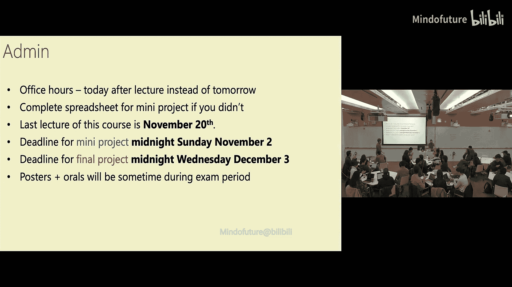
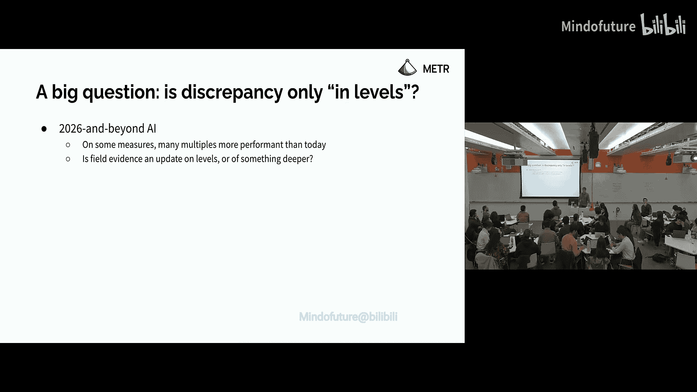
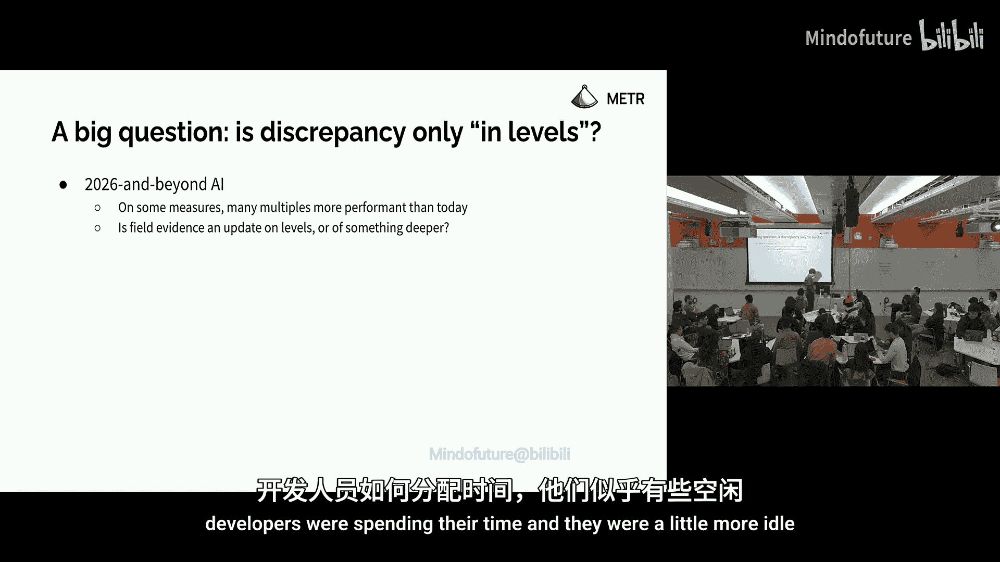
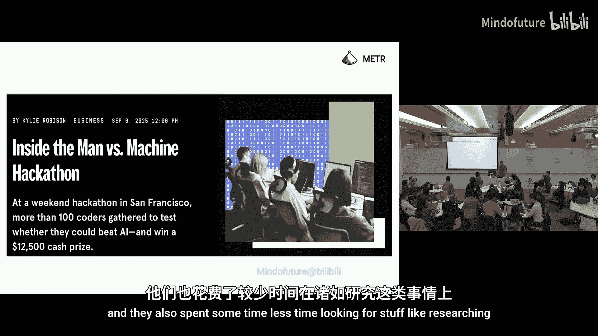
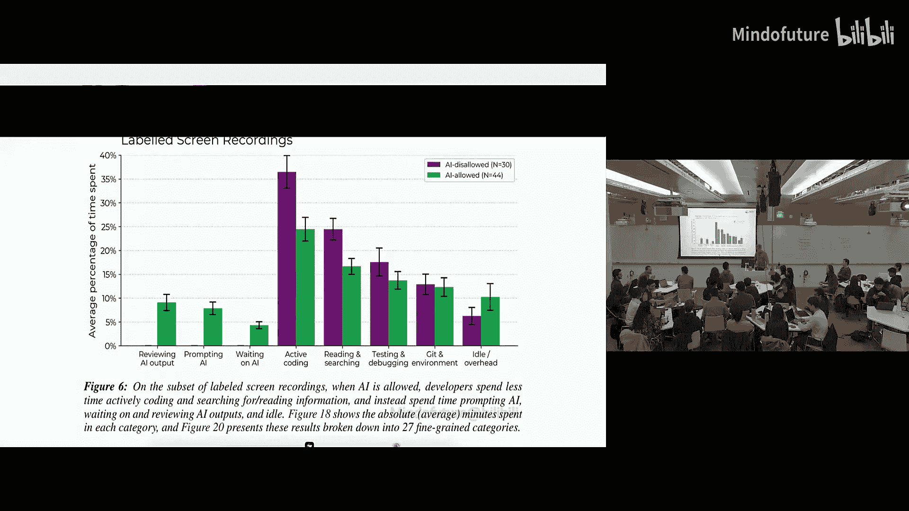

# 007：实验室与现场证据对比

## 概述

在本节课中，我们将探讨评估人工智能能力的两种主要证据来源：实验室基准测试和现场实验。我们将通过分析Meter的“时间范围”基准测试、GDP-Valuel论文以及一项关于AI辅助软件开发的现场随机对照试验，来对比这两种方法得出的不同结论，并尝试调和它们之间的差异。

---

## 课程安排与项目信息

在开始之前，先说明一些课程安排事项。

我通常的办公时间是在周五上午9点，地点在Swiss Bakers。本次讲座后，由于没有实验环节，我们可能会提前结束。如果提前结束，我将在这里进行办公时间，与任何想交流的同学交谈。

关于小型项目，如果你还没有填写合作者和主题信息，请尽快完成。

本课程的最后一讲，我刚刚意识到，实际上是在11月20日。我之前一直以为是12月4日，但学期实际上在12月3日结束。11月27日是感恩节。

我们已将小型项目的截止日期延长至11月2日。但如果你可以开始最终项目，不妨现在就开始，因为最终项目的截止日期是学期最后一天，即12月3日。

提交最终项目后，我们将进行评审。考虑到进行马拉松式的最终项目口头报告会很困难，助教和我将挑选一些项目进行口头报告，并为所有项目安排一个海报展示环节。我们会在考试期间找一个合适的时间进行。

---

## 嘉宾讲座：Joel Becker

今天我们非常荣幸邀请到Joel Becker来做客座讲座。

非常感谢邀请我。非常高兴能在这里与大家交流。我是Joel，在Meter担任研究员。今天我将与大家探讨一个难题。

我们有两种关于AI能力的证据来源。可能还有更多，但至少有两个类别。

一类是基准测试风格的证据，例如你在Meter图表上看到的那种，以及各公司发布的模型卡中报告的内容。

另一类是“野外”能力证据，例如我们今天在经济中看到的影响，或者人们进行的更混乱、更贴近实际、更全面、更接近我们最终关心目标的实验。

这两种证据似乎给出了不同的答案。我将尝试与大家调和这些不同的答案。

我在Meter工作。我想你们已经看过那个图表了。

---

## 实验室证据：基准测试与时间范围

在实验室证据方面，我们将回顾大家熟悉的基准测试，以及我和同事完成的、包含大家熟悉的图表的论文《GDP-Valuel》，我想阅读材料中提到了它。

在野外证据方面，我们将回顾我作为共同作者的一篇论文，以及一些劳动力市场数据，尽管我知道课程后面会更多地讨论这个话题。

我们将尝试调和它们，并讨论其对劳动力市场、可能的科技与就业以及自动化AI研发的影响。

你们可能听说过Meter，它代表模型评估与威胁研究。模型评估是指，我们询问模型的能力如何，基于这些模型的智能体可能有哪些倾向。威胁研究则是试图将我们对这些智能体能力和倾向的理解，与我们心中的威胁模型联系起来，例如通过破坏渠道或AI研发自动化等。

也许问这个问题有点傻，但我想稍微解释一下动机。为什么我们关心AI能力？至少从Meter的角度，我为什么关心AI能力？

这是一个我认为被严重低估的资源。你们中许多人看过图表，但除非是上周的阅读材料，否则你们大多数人可能没有看过Meter的GPT-5报告。它不像你们之前可能见过的Meter在模型卡上的条目，那些是公司作为模型发布一部分列出的安全测试类型以及Meter的贡献。相反，这是Meter试图就GPT-5是否对社会构成灾难性风险做出结构化论证。

论证的大致结构如下：顶部有几个威胁模型，例如AI研发自动化、自主复制以及破坏AI公司的可能性。我们有一些证据来源：首先是AI实验室（本例中是OpenAI）的承诺或保证，其次是对GPT-5能力的测量，然后是对其推理轨迹的检查。

我们之所以引入推理轨迹和实验室保证，是因为我们希望确信模型没有“隐藏实力”，即低估自身能力。这样我们才能真正依赖我们的能力评估。我们得出GPT-5不太可能构成灾难性风险这一结论，很大程度上是因为我们认为它不具备构成灾难性风险所需的一些能力。如果我们因为某些原因（例如模型隐藏实力）严重低估了这些能力，那似乎会削弱我们的论证。

我们将重点讨论能力评估部分，这激发了我对AI能力的关注。

---

### 如何测量能力？

至少在今天，测量能力最流行的方法是什么？特别是在今年之前。

这里有一些较旧的基准测试。它们通常有一个人类基线，分数在0%到100%之间，有一个可能达到的最高分。解读图表上的一些数据点或线条有些困难。例如，达到人类基线的100%是否意味着在我们关心的相关意义上具有超人类能力？在SWE-bench上80%或60%的原始分数又意味着什么？这有点难以解释。

另一个引起我注意的是，我们从在这些基准测试上获得零信号到完全饱和这些基准测试所需的时间似乎正在缩短。如今，创建尚未饱和的基准测试极其困难。

这里有一些更近期的基准测试，数据来自Epoch AI。AI确实在根据基准测试变得更好。

---

### Meter的方法：时间范围

我们将采用一种略有不同的方法，尽管它有很多相似属性。如果有人有尖锐的问题，请随时打断我，不必等到最后。

从概念上讲，我们的想法是：我们将计算人类在尽可能相同的条件下完成一组任务所需的时间，这些条件与AI智能体被要求完成任务的条件相同，即相同的环境、相同的命令访问权限、相同的资源等。然后，我们测量AI在这些相同任务上的表现。

接着，我们将人类完成时间转换为对自主AI能力的估计。

为了更详细地说明，这里有一些示例任务。

左上角的H-cast基准测试是一组看似非常开放、需要高度自主性才能完成的任务，或者至少是自主能力的指示性任务。它们都是基于计算机和软件的。

SWAA基准测试是一系列原子软件任务。例如，任务可能是：这里有一个包含四个文件名的列表，其中一个文件是`passwords.txt`，哪个文件最可能包含密码？

而Arena基准测试则是一组更具挑战性的机器学习研究工程任务。例如：这里有一个大型微调脚本，你能在保持功能完全相同的同时，大幅减少脚本运行时间吗？或者，你能优化这个内核吗？诸如此类的挑战。

对于每个智能体，我们会得到像这样的图表。紫色条显示了按人类完成时间分组的成功率。例如，对于Claude 3.7 Sonnet，在1到2小时的分组中，成功率约为6%。

我们将对这些按任务难度分组的成功率进行逻辑回归拟合。

然后，我们称这个模型的时间范围为X轴上的一个点，在该点上我们认为模型成功完成任务的概率是50%。50%并没有什么特别之处，也许是因为在这个点上我们有最多的正负样本，它是一个直观的抛硬币概率点，并且与之前的文献一致。但使用50%并没有根本性的原因。如果你觉得这有问题，请记住这一点。

那么问题来了，这个图表有多典型？有趣的是，人类完成时间在某种意义上如此预测模型成功。例如，在这里，直到4分钟，模型基本上100%成功。这是这些特定基准测试的特性，还是普遍现象？

这是一个很好的问题。这绝对是一个经验观察。我不确定我们是否有很好的先验理论理由来预期这种情况。但我认为这是一个在许多地方得到证实的经验观察。我不记得具体在哪里了，可能是在GPT-5的模型卡里。我在某个地方看到过一些数据表明，在某个基准测试上，AI在较长任务上的表现比在较短任务上更差。

我猜测，长任务和短任务之间存在一些复杂的分布差异。是的，我认为这是一个经验规律，仅此而已，但我认为这是一个被观察到的经验规律。

你本可以观察到某种瓶颈短任务，即人类只需一分钟就能完成，但模型无论如何都无法完成的任务，但你似乎没有观察到这种情况。

我们将看到，这种测量在某些方面对任务分布敏感，而在其他方面不敏感。你可能会认为这些原子任务在相关意义上不属于同一分布，这可能是导致这种看似并非不合理模式的部分原因。但总的来说，我认为有理由称这些任务在分布上大致相似，有些短，有些长。事实证明，对于短任务，最现代的模型确实非常出色。

---

### 关于GPT-5评估的疑问

我们也阅读了Meter对GPT-5的评估。我注意到的一件事是，显然有量化这类能力的方法，但之前可能没有这样做。在GPT-5评估中，很多时候似乎是某些事情被识别出来，然后只用一行解释说明，内部讨论后认为不值得关注，然后就转到下一个话题。我想知道为什么你们没有尝试找到量化的方法？这是由于时间限制吗？还是内部有量化方法但没有报告？

很好的问题。我参与了论文工作，但没有参与GPT-5评估。需要强调的是，我的强烈猜测是时间非常有限。Meter是一个小团队，技术人员规模大约15人或稍多一点。此外，我认为我们在评估科学方面取得了巨大进展，但还有很多有待探索。对于那些出现的问题，要么是科学尚未成熟，要么是科学已经成熟但我们没有时间。

一个突出的例子是，我们为可能危险的能力设定了一个门槛，即具有40小时时间范围且50%可靠性。这个数字从何而来？它来自Meter一位非常聪明的人的一个猜测，一个凭空而来的猜测。如果你对能力门槛应该设在哪里有更好的想法，我非常欢迎。但有时我们不得不诉诸于这类方法。

---

### 关于逻辑回归与任务长度的疑问

抱歉，这可能是两个相关的问题。为什么是逻辑回归？为什么假设它是合理的？关于对数规划，是否有四小时或两天的任务？就像可以构造任意长度的任务，只需将顺序依赖的较短任务串联起来。我假设这不是我们真正关心的。那么，在什么意义上，较长的任务更难？是因为它们只是来自不同的分布吗？还是说，对于模型来说，找到中间步骤有多难？有可能较长的任务无法分解，但困难的部分在于找到分解的方法。我不知道是哪个。

我们先回答第一个问题。为什么使用逻辑回归？我不知道，看看直方图。这不是唯一的原因。我们可以使用Probit，或者使用分段局部线性模型。我认为，至少对于50%这个点，它们会给出非常相似的答案。如果我们试图测量99%的可靠性，那么分布假设可能会发生很大变化。我们坚持使用逻辑回归，是因为我们引用的心理测量学文献中使用了它。这些理由是否合理，留给你们思考。

关于如何回答第二个问题，你已经看到了图表。这里有两个不同的时间轴：日历时间和人类完成时间的概念。你心中可能还有第三个时间概念，即模型完成任务所花费的时间，请注意不要将它与前两个概念混淆。

我认为，在初步近似中，你可以在脑海中将其设置为0。它们并非即时回答，其中一些需要顺序操作。但这不是你在这里应该考虑的主要事情。与此相关的是，这个时间范围测量将每个步骤的难度概念和所需步骤序列都压缩成了一个度量，即人类完成时间。

你可以通过串联较小任务来创建更长的任务，至少在我们没有这样做的情况下。有些任务容易分解成这些小任务，有些则不然。事实上，一些H-cast任务彼此是严格子集关系，例如“你能在这个软件中找到这10个错误吗？”与“你能在这个软件中找到这10个错误中的3个吗？”。我们在论文中以某种方式处理了这个问题。

你能再告诉我一次，你觉得哪里不满意吗？关于任务。

我认为你应该意识到，在这个汇总统计量中，有许多不同的维度是有趣的。我在某种意义上掩盖了这两个维度，在这些维度内部也存在有趣的问题。实际上，你的两个答案可能相互关联。例如，从经验上看，如果你回到这个逻辑拟合，当X轴是时间的对数时，你得到了很好的逻辑函数拟合。也许我是一个人，但我认为，如果任务只是较小任务的串联，那么就不应该是时间的对数，因为那样的话，一个四小时的任务基本上就是四个一小时的任务，那么概率应该是类似2的负4次方。

所以特征应该不同，或者你会看到这种指数下降。是的，没错。因为如果确实如此，一个四小时的任务，或者一个十六小时的任务基本上是连续完成十六个一小时的任务，那么概率应该是2的负16次方。所以，也许会是不同的分布。我认为这里有些道理，但我对数学细节不熟悉。Toby Ord的网站上有一篇文章，他提出一个模型可以非常好地拟合Meter数据，即考虑每个模型在每一步都有某种失败的风险率。我的印象是，你可以从类似那样的模型中恢复出这些拟合。再次说明，我对那里的细节不熟悉。

---

### 关于成功概率解释的疑问

关于成功概率的解释，比如说50%的成功率，是更接近于50%的任务100%完成，还是任何任务都有50%的几率完成？你明白我的意思吗？

我在Meter最亲密的合作者之一是Sky（又名Night Rush）。我想讲座结束后他可能会回看讲座，所以我想提一下他。他的印象是我这周应该研究这个问题。我目前不确定确切的答案。

需要明确的是，这个概率是既对任务抽样又对多次试验抽样得到的。对于每个任务，特别是当它是0%时，就是0%，对吧？所以如果是100%，就是100%的任务和每次任务100%成功。只有当它是50%时，才可能是在100%的任务上，你50%的时间成功，或者在50%的任务上100%成功，50%的任务上0%成功。

是的，这又涉及到任务规范。抱歉，如果之前已经详细说明过，但对于任务规范，你是否考虑了人类创建上下文所需的时间？因为对于许多不同的任务，关键在于获得足够的上下文。

这是一个非常好的问题，我稍后会讨论，所以先跳过。

当你报告人类时间时，这是否意味着人类达到100%成功率所需的时间？还是其他？

是的，我们定义的成功不一定是某些底层指标的100%。对于某些任务，成功定义为1，失败为0。对于有些任务，有0到1之间的底层指标。我们通过设置某个阈值（如0.8）将这些任务的成功二值化。同样的阈值也适用于人类。成功的人类基线者完成任务并达到阈值以上所需的几何平均时间。

再次强调，就像使用40小时、50%可靠性作为危险能力门槛一样，这里有很多任意性。我们可以采用不同的阈值，不同的阈值可能对应人类达到该阈值所需的不同时间长度。

这些都是隐藏在暗处的一些问题。

---

### 时间范围趋势与攻击结论

好的，我们已经看到了这个图表，将我们为Claude 3.7 Sonnet看到的情况推广到许多其他模型。逻辑拟合似乎在许多模型中都大致合理。时间范围是我们预测成功概率为50%的X轴上的点。

然后，如果你将其绘制在日历时间上，你会看到类似指数增长的东西。你已经看过图表了。在这个对数线性图上，它看起来确实非常指数化。

接着，我们试图在论文的其余部分攻击这个结论。让我讲一点内部故事。

在2023年初的一份Meter内部演示中，有一张图表。Y轴上写着某种大致类似于危险能力的度量，X轴是时间或计算资源或其他。图表大致看起来像这样。也就是说，我们从早期阶段就试图寻找某种可预测、可预报的趋势，使我们能够对尚未见过的下一个模型或某个时间点将看到的能力水平做出知情预测。

当然，我们当时在做这种混乱的事情。创建这些任务的过程是，人们带着他们的任务来找我们，我们尝试使这些任务更稳健，确保模型不能轻易作弊，确保它们有公平的评分标准，对模型和人类都公平，只使用终端和相关命令等。一些内部任务是由Meter员工创建的，他们只是头脑风暴，思考什么对模型来说很难，比如我们以前在网上没见过的具有挑战性的研发问题。这感觉非常混乱。

所以很明显，当我们制作这张图表时，它与X轴的相关性会非常低，完全不像这张图表。当我们看到这张图表时，我不确定是欣喜还是怀疑，或者觉得哪里出了问题。拟合如此紧密，这很奇怪。因此，我们在论文的其余部分试图攻击这个结论。

另外，如果你天真且非常不负责任地外推到一个月时间范围（50%成功率），那么根据主要趋势，你可能会得到2029到2030年左右。或者，如果你注意到最近的数据点看起来上升得有点快，你可能会认为是2027年。一个月时间范围到达的著名日期是2027年。我的即兴看法是，我的一些同事同意，一些不同意。当你只有这么少的数据点时，增加额外参数或类似做法有点不负责任。你应该选择最简约的拟合。这里最简约的拟合就是一条直线。我对有两条直线感到紧张，因为这有点过度解读迹象了。所以我个人会坚持2029到2030年这个说法。

---

### 对结论的攻击

以下是对结论的一些攻击。

首先，如果这些逻辑拟合对于不同模型有非常不同的斜率，那么在不同可靠性水平上的趋势可能看起来远不如这个50%趋势那么清晰。但情况似乎并非如此，至少对于80%可靠性水平是如此，因此我认为20%可靠性水平也是如此。

我们进行了一些外部有效性检查。也就是说，我们相当确信我们已经确保了内部有效性，没有在统计上犯错误，基本上相信我们正在做的任务、程序以及生成的汇总统计量。

但这在多大程度上适用于现实世界？我们做了一些检查。

第一个是回溯预测练习。当我们最初开始实施那个图表时，我们没有这个原子操作套件。我们只有这些更具挑战性的任务。因为GPT-2无法进行新颖的机器学习研究工程，我们无法在任务套件上测量GPT-2。你可能会问，根据我们最初拥有的数据，这能在多大程度上预测其余的趋势？答案似乎是出奇地好。

本周我在思考的一件事是，对于所有这些数据点，除了GPT-2，我们都使用公告日期作为日历日期。对于GPT-2，由于OpenAI延迟发布很久，我们使用的是部署日期，而对于所有其他数据点，我们使用的是公告日期。如果将GPT-2移到2019年底，那么这个回溯预测练习的拟合度会更强。

一个问题是，任务套件是否有奇怪或不寻常之处，特别是Meter任务（像许多基准测试风格的任务一样）并不混乱。也就是说，它们不涉及与现实世界的很多交互，没有高度模糊的评分标准，它们被打包得很好，上下文已经为你整理好了。在大多数情况下，我会说基本上所有的Meter任务，就像基本上所有的基准测试风格任务一样，都处于非常低的混乱度范围。但即使它们都处于较低范围，也有一点变化。所以你可能要问，我们是否看到即使在混乱度较高的任务范围内，性能也在提高的趋势？你应该将其视为中等混乱度任务，而不是真正的高混乱度任务。在这个度量上非指数趋势并不意味着另一个度量上也是非指数趋势，因为这里的Y轴是成功率而不是时间范围。但大致上，在混乱度较高的任务上也看到了进展一致的证据。

这是下一个懒惰的检查，因为我们认为现实世界中的任务可能比Meter任务更混乱。这是最不混乱的任务，那些是最混乱的任务。非常感谢。

我再次注意到，关于分布不够混乱的担忧并非Meter任务独有，这对许多基准测试都是如此。例如，SWE-bench也有其他问题，比如污染、一些问题不可能解决等。它也有这个特点：要在SWE-bench任务上成功，你需要通过算法评分的单元测试用例。因此，代码质量或输出质量并不重要，唯一重要的是你是否通过测试用例。而且问题被选择为我们可以进行这种算法评分的问题类型。

另一个外部有效性检查，加上之前的警告，我们在SWE-bench上看到了类似的趋势。这只是不同的数据集，表明Meter任务并没有什么完全奇怪的地方。

这里的倍增时间是70天，我想这有很大的差异。是的，这可能是SWE-bench中人类基线时间的问题导致了这种倍增时间。

---

### 近期工作与不同任务分布

在更近期的工作中，首先，我们继续为新发布的模型计算时间范围测量值。虚线趋势是从Sonnet 3.5到3.7。也就是说，我们只拟合了之前图表中、论文发表时已发布的模型的预测。隐含的预测似乎相当不错。它们与这个更快的斜率一致，尽管我非常主观地认为，我们仍然应该对这个曲线的形状保持谨慎，采用更简约的预期。

我同事Thomas Quar的一些近期工作使用了一种略有不同的方法来获取时间范围。这种方法使用了我认为隐含质量较低的人类基线。关于这一点有很多细节，你可以在Meter网站上看到更多，与之前的工作并不直接类似。但我的解读是，这个图表表明，我们在相当不同的任务分布上看到的时间范围倍增时间（这些仍然是基于软件的任务，这很重要）对我来说出奇地相似，但截距非常不同。也就是说，我们从一个更低的点开始，尤其是那些需要大量视觉能力的任务。

这有点落后了，但我一直在思考关于最混乱图的绘制。为什么你选择准确率而不是专家时间？因为当时技术人员甚至少于15人，我们需要把论文发表出来。我想这就是真正的原因。我相当确定这就是真正的原因。

---

### 关于Anthropic声称的疑问

我有个快速问题。你们展示了包括GPT-5在内的最新模型。你们是否对Anthropic声称Claude 4.5可以独立工作30小时的任务进行了基准测试或测试？

我不太确定Anthropic具体想声称什么。我注意到，我们估计Claude 4.5大约有两小时的时间范围，这与存在它能连贯工作30小时的案例是完全一致的。这更像是一种平均类型的东西，而那种说法更像是一种最大类型的主张。

我展示的是完全不同的东西：人类完成任务所需的时间和模型完成任务所需的时间。如果模型工作了30小时，那么人类能在两小时内完成似乎有点令人惊讶，但这并非完全不可能。也可能是最坏情况与平均情况的区别。这对我来说似乎是对的。

---

## 基准测试方面：GDP-Valuel

接下来是能力领域的基准测试方面：GDP-Valuel。这不是我的论文，我可能会说错。这篇论文引起了很大兴奋，我稍后会给出一些看法，分享我兴奋的地方以及我认为它可能不如你从之前的基准测试工作中预期的那么好的地方。

他们大致要做的是：选择对美国GDP贡献最大的九个行业，在这些行业中，选择对工资或薪酬贡献最大的五个职业，并且主要是数字化的。再次注意，这里有一些重要的选择在进行。

这些职业看起来像这样。然后，对于每个职业，他们将让该职业的专家或专业人士帮助他们创建任务，即一对精心设计的提示和任务上下文。

如前所述，以及一些有经验的人类可交付成果，我们可以将AI的可交付成果与之比较。

请注意，这些可交付成果不仅仅是基于文本的。我认为这是一个重要的改进。

以下是他们的评分方式。他们将获得一个响应（本例中是GPT-5，尽管论文中报告了许多其他模型）。他们将拥有我们刚才提到的、带有任务上下文的人类黄金标准可交付成果，以及附加到该上下文的参考文件。

然后，他们将要求另一组人类专家，或者一种自动评分器（一种他们支持但支持程度较低的LM判断），根据一些主观和客观标准来评价哪个可交付成果更优。

以下是他们的发现。我之前听说B提到过，他们注意到一个非OpenAI模型在这个基准测试上表现优于OpenAI模型，这令人印象深刻。我认为这是值得称赞的研究实践。

---

### 对GDP-Valuel的看法

我想退一步问问这意味着什么。目前我会说，这看起来相当令人印象深刻。

以下是我对这个基准测试的一些主观优点看法。

首先，我们稍后会深入探讨的是，我认为在思考模型在基准测试上的成功率时，一个并非高度量化但量化上有些重要的考虑因素是算法评分部分。也就是说，我们使用这种零边际成本、自动的、只检查你真正关心的一部分的评分程序来给AI评分。但我们可以做其他事情，比如让人类根据代码的整体质量（不仅仅是是否通过测试用例）来判断代码是否应该合并到主分支，或者在这里，根据一些主观和客观标准列表来判断某个样本响应是否更优。我认为这很重要且令人印象深刻。我认为未来我们会看到更多这样的做法。

第二是长视野难度。我最近几周一直在思考如何获得更具挑战性的任务，以便我们能够可靠地测量50%时间范围。在野外很难找到我们认为人类需要超过一天且生成成本不高的任务。所以，从我的角度来看，这些任务中有些确实需要人类很长时间，这是一个重要的优点。

第三是任务真实性。根据论文，我的印象是这些任务确实对应于对美国GDP有重要贡献的职业中的真实工作产出。

---

### GDP-Valuel的潜在缺点

另一方面，这里有一些主观的缺点。

首先，我认为这与精心设计的上下文有关。通过以这种方式将事物任务化或带入基准测试，我觉得你移除了一些现实世界的摩擦，这在某种意义上有利于AI。你只评判最终输出，而不是那种你自己作为工作者试图定义任务是什么，然后向老板或同事提供中间输出，再将反馈整合到最终输出的过程。你也没有考虑，鉴于你的高层目标，你是否应该做这件事而不是其他事，高层目标是否正确等等。

其次，为模型整理上下文和信息检索是工作的重要组成部分。这在某种程度上有所体现，但我认为在GDP-Valuel和其他基准测试评估中，这一点被低估了。

最后是忽略了任务之间的依赖性或交互。我不太确定该怎么说。也许我的意思是，假设有两个任务A和B，自己完成任务A对于完成任务B很重要，比如已经处理过问题或看过解决方案。假设模型能完成任务A但不能完成任务B。我想我有点把自己搞糊涂了。总之，我认为任务之间可能存在重要的交互，使得在任务级别上进行测试在某种意义上有利于模型。

以下是GDP-Valuel中关于这一点的说法。实际上我跳过了这个。哦，我跳过了另一个主观缺点。我认为存在对可由低上下文评判者评分的任务类型的选择。我认为这源于任务化。专家们策划那些他们认为原则上可以由不熟悉先前工作的评判者（即使他们是相关专业人士）在基准测试中评分的任务。

---

### 基准测试告诉我们什么？

快速退一步思考，基准测试告诉我们什么？

我即将对当今的AI能力说一些更悲观的话。我认为，退一步看看构成Arena基准测试的各类机器学习挑战很重要。你可以单独阅读那篇论文。我完全无法以今天AI的标准完成任何这些挑战。这对我来说似乎是一个非凡的事实，即AI在如此技术困难的工作上如此有能力。

我认为进展迅速。这对你们来说不是新闻。

但我们即将引入一些警告。以下是一些限制。首先，基线者，或者在GDP-Valuel中，人类专家评判者是低上下文的。这不是他们日常做的工作。如果你在Meter工作，你对Meter任务有额外的上下文，这使你能够比不熟悉Meter技术栈的专家软件工程师或研究工程师更快地完成事情。

其次，天花板相当低。许多基准测试正在饱和。第三，我认为任务在某种重要意义上被高度选择，正如我们刚才讨论的。第四，混乱度。基准测试风格的任务并不混乱，但提升混乱度高的任务非常昂贵。所以实际上，如果你在寻找接近你关心且可扩展的东西，你通常会牺牲混乱度作为权衡。

---

### 关于不同经济任务子集的疑问

我在想，你对可能使用不同的经济有价值任务子集有什么看法？我在阅读论文时考虑的是，也许考虑自由职业者/承包商工作，这些工作本质上提供的上下文较低，被要求的是具体的任务，但仍然具有经济价值，并且可以通过让模型完成合法的自由职业者/承包商工作，然后事后告诉人们实际上你不需要付钱给我们的助手等方式进行有机测量。

有一个叫做Freelancer的基准测试就是这么做的，你应该搜索一下。我认为这是个好问题。

也许现场实验是基准测试局限性答案的一部分。它们会有一系列缺点，但也有一些互补的优点。

---

## 现场实验：AI辅助软件开发

在我们将要讨论的特定现场实验中，我共同领导的一项实验，我们将使用极高上下文的开发者。这些任务不是合成的，它们是这些开发者实际工作中本来会出现的任务。

在某种意义上，我们可以获得超出人类范围的信号。一旦所有基准测试都饱和了，也许这些工程师仍然可以获得2倍、3倍或4倍的加速。

以下是我们实验的设置。

我们将招募16名经验丰富的开发者（稍后会看到他们的经验水平），在大型、成熟的开源仓库上工作（稍后会看到具体仓库）。平均而言，他们每人完成大约16个来自他们真实工作的任务。

这些任务的选择有两种方式：一种是基于问题的任务，需要与同事大量沟通，但最终不涉及合并到主分支的任务被隐含地排除。另一种是，如果他们预计工作超过四小时，出于统计功效的原因，他们会将问题分解成更小的部分。

但我们认为它们代表了预计少于四小时的、基于问题的工作。

我们将这些任务（而不是这些开发者）随机分配到“禁止使用AI”或“允许使用AI”的条件中。“禁止使用AI”意味着你想象的那样：像2090年那样的软件开发，没有标签自动补全，没有Cursor，没有GitHub Copilot，没有ChatGPT等。“允许使用AI”也意味着你想象的那样。我们不指定他们使用特定的AI，只是允许他们使用任何对他们正常流程有效的东西。我们为他们购买了Cursor Pro，所以他们主要使用Cursor。他们主要使用当时人们使用Cursor时会用的前沿模型，考虑到研究进行的时期，通常是Claude 3.5 Sonnet和3.7 Sonnet。

然后，我们记录每个任务的完成时间，包括审查前和回应审查后。我假设这里的人熟悉合并、拉取请求和问题的术语。如果不确定，请举手示意。

你们是否给了他们一些时间在实验开始前试用Cursor？给了一点。他们接受了大约30分钟的培训，确保他们可以使用Cursor的代理模式在自己的仓库中进行更改，并原则上能够将其合并到他们的仓库中。正如你在这里看到的，他们将在研究期间完成大约16个问题，每个问题大约两小时。所以对于后面的问题，他们确实比开始时拥有更多的Cursor经验。他们中约有四分之一在研究开始前就有Cursor经验，几乎所有人都有某种常规使用AI的工作流程，要么是基于网页的如Bard或ChatGPT，要么使用VS Code Copilot，这与Cursor类似。

我们稍后会谈到这一点。

---

### 实验仓库与开发者

以下是我们选取的一些仓库。如果你们中有人熟悉开源开发，会对其中许多仓库很熟悉。我们有Haskell编译器、That's GH、scikit-learn、Hugging Face Transformers。平均而言，这些仓库有超过一百万行代码，已存在10年以上。这些都是大型、成熟、有经济价值的仓库。

以下是我们为每个仓库收集的开发者统计数据。这些通常是这些仓库按提交次数排名第三的贡献者。所以，这些是这些有价值仓库的真正顶级开发者，总提交次数在几百到甚至几千次之间。他们平均在这些仓库上工作了大约五年。

---

### 关于开发者AI知识的疑问

我想之前有人问过关于阅读材料的问题，即这些人对LLM实际工作原理的了解程度，因为我觉得一旦你更多地了解LLM理论，你使用它们的方式就会改变。你们是否筛选过这一点？是否询问过他们了解多少机器学习理论？

是的，也许让我再讲点故事。

我们完成了这个时间范围的工作。Nate、我以及Meter的其他一些人有外部有效性的担忧。我们想，让我们运行一个试点研究，花几个月时间，在我们能做到的最明显或最简单的环境中进行。开源开发不需要我们与公司合作。让我们找一些最有经验的开发者，这样我们觉得能从研究中获得高质量、深入的见解。然后，就让他们自由发挥。最后我们再看看结果如何。

我们绝对没有筛选他们对AI工具经验水平的高低。

---

### 预测与实际结果

我想你们已经看过图表了。我以前做这个演讲时，会现场收集听众的预测，当翻到下一张幻灯片、每个人猜测-40%或其他数字时，总是能听到明显的惊叹声。但你们是预测者之一吗？好的，通常我演讲时，听众中也有预测者。我会说，你们就是这个数据。

我肯定会站在绿色（预测有加速）那一边。

经济学专家，这些是教授、实验室的经济学家、顶尖研究生，他们预测这些问题的完成时间会减少约40%。机器学习专家，通常是实验室的人或顶尖机器学习博士项目的人，他们预测完成时间会减少约40%。开发者自己预测完成时间会减少24%。开发者自己在研究完成后，预测他们在过去的研究问题上速度快了20%。而实际上，我们观察到他们速度变慢了。这对我们来说没问题，因为我们按开发者认为他们得到的速度付费。

是的，图表顶部有很多警告。我们将逐一讨论。这是另一种看待基本相同事情的方式。开发者预测，如果允许使用AI，问题将花费更少时间。而实际上，我们看到问题花费了更多时间。

---

### 对结果的反思与假设

是的，这是另一个令人震惊的结果。当我们第一次看到这个结果时，我们做了更多故事讲述，我们当时的想法可能和你们第一次看到这个图表时的想法一样：我们搞砸了。然后几周过去了，点估计仍然是负的（按这个完成时间度量是正的）。于是，我们观看了大量这些开发者工作的视频，思考所有可能的原因，采访开发者，并提出了我们认为可能驱动结果的因素。

首先，我们有一些我们认为导致在这种环境下减速的做法。

一是对AI有用性的明显过度乐观。他们认为会有帮助，他们使用AI。原则上，他们随时可以通过不使用AI来获得零点。

二是开发者对仓库的高度熟悉。这在某些方面与精心设计的上下文观点相关。与我自己工作不同，开发者通常在开始解决问题之前就知道如何解决问题。他们对这些仓库了如指掌，比Cursor或底层AI工具了解得多得多。这给了他们一些优势。我注意到，这在某些方面类似于我们之前讨论的混乱度问题。

这些是庞大而复杂的环境。有一些初步工作表明，AI在代码行数或文件数更多的环境中表现更差。这些仓库非常庞大。

AI的可靠性不高。它们经常提出方向正确的建议，但鉴于它们可能是错的，你既需要验证它们是否正确，如果错了，还需要重做工作，这显然会带来时间成本。

我将跳到下一个。

---

### 影响因素与开发者经验

以下是一些影响不明确的因素。我将跳过大部分，只谈谈低于平均水平的AI工具使用。这篇论文的公开讨论中经常提到这一点，你们中有些人可能已经在问题中提到了。也许这些开发者只是使用AI的能力较差。我对此解释持怀疑态度。现在也许是讨论原因的好时机。

我认为我持怀疑态度的最重要原因（不仅仅是反思这些图表）是我用过Cursor。我有一些非常有才华的同事，我观察过他们使用Cursor，然后我观察了这些开发者使用Cursor的许多许多小时。我在想，他们做得不好吗？我认为他们没有。我没有看到他们在工作流程中有巨大的速度提升被遗漏。一种可能更高级的工作流程是定义一组测试，然后代理可以迭代对抗这些测试。这被认为是一种更高级的工作流程，初学者可能不会使用。我认为我没有看到这些开发者有很多机会使用那种工作流程。

这主要是指导我在此问题上的感觉的原因。但是，如果我们只考虑那些在研究前有相关AI经验的开发者，我们并没有真正看到任何速度提升的差异。如果我们排除一些早期的AI问题，这与Boas之前提到的类似。你可能会认为他们在研究开始时对Cursor不太熟悉，但一旦他们进行了10个小时，他们就有了一些熟悉度，并且会在某种程度上加速。这项研究规模相当小，这是一个统计功效不足的证据，就像我们的许多子集证据一样。不要从中得出太强的结论，但我们没有明显看到任何突出的东西。

然后，这里有一个图表，编码了这些开发者在开始特定问题时拥有的总AI小时数，即他们在研究期间花在AI允许问题上的时间总和，以及他们进入研究时对Cursor的经验。这是一个相当保守的度量。在30到50小时的分组中有一位开发者，他在2024年将Cursor作为主要IDE，使用了140小时。为了保守起见，他填写了大约50小时，所以他最终落在这个分组中。在倒数第二个分组中，有人在2024年将Cursor作为IDE。我会说，这个图表已经与没有太大变化一致。有些人看过这个图表，认为最后的数据点有些变化。如果你改变这个特定开发者的编码方式，那个点会向下移动。我认为，这个图表的存在就是我们把这个因素归为混合的原因。

总的来说，有些东西似乎指向随着经验增加变化不大，有些则指向另一个方向。

---

### 关于配对初级开发者的疑问

你之前提到的一些观点，比如开发者对工作非常熟悉，这可能使速度下降而不是提升。是否有对照研究，你实际上将初级开发者（比如刚入职的）与AI配对？他们首先能达到与高级开发者相同的性能吗？并且是否有速度上的减少或益处？

很好的问题。我们正在进行另一项提升研究，将涉及更多初级开发者。之前的文献对AI加速有更积极的估计。我对此文献中的许多论文持轻微怀疑态度，原因不同，我们可以讨论。但它们确实使用了更多初级开发者，并看到了这些生产力提升。通过你指出的渠道，初级开发者会得到提升，这对我来说似乎完全合理。

另一个问题是，他们是否得到任何关于使用什么模型的建议？是Cursor还是其他？或者这是Cursor自动路由的一部分？

他们被允许使用不同的模型。我们从视频记录中获取了一些关于他们使用什么模型的数据，他们主要使用Claude 3.5 Sonnet和3.7 Sonnet，这是当时的前沿模型。他们没有收到关于使用什么的建议。实际上，条件被称为“允许使用AI”，而不是“必须使用AI”。他们如果愿意，可以不使用任何AI。

我想还有一个问题。

---

### 关于AI引入错误的疑问

开发者需要修复AI代理编辑破坏的任何东西。我觉得有时会发生这种情况。我想知道这在像这样的大型仓库中发生在哪里？

完全正确。我们观察到，开发者报告的一小部分情况是Cursor作为一个不太成熟的IDE有时会以VS Code不会的方式崩溃。但更常见的是，AI做出了开发者不满意的更改。我们这里有，开发者接受少于44%的AI生成内容。我们认为这是他们在Cursor中点击“接受”的行数比例。然后我们观察到他们有时会更改那些额外的行，尽管我们没有在代码中跟踪这一点。我们认为少于44%，更像是20%或15%由Cursor调整或最终出现在拉取请求中的代码行。

我提到这个的原因，具体是关于模型是否曾更改与任务无关的代码。哦，我不太确定具体，但可能有很多关于Claude 3.7 Sonnet特别会做那种事情的报告。

---

### 研究社区的反应

我很好奇，研究社区对……的反应是什么？有箭头指向老板。嗯，优秀的问题。你指的是后者如此接近零吗？不，不。哦，是沿着线向下，但是是的，但是因为开发者按经验小时分组，因为他们都重叠了。

是的，研究中有大约250个问题。子集证据统计功效不足。你知道，我们本想这是一个为期两个月的试点，结果却变成了一个六个月的项目，因为我们花了所有时间深入研究这个奇怪的结果：“这不可能是真的。”我们正在做这个更大的研究。是的，有至少一个开发者在条件中根本没有使用Cursor。我不确定是否删除了AI。我不确定那个开发者可能使用了什么其他工具。我不确定GPT-5是否完成。

只是基线，你知道，只是不使用代理，他们会节省一些时间。

我有两个直觉，没有证据，不应该相信我，但可以提出来。我觉得也许标签自动补全被严重低估了。我之前说过AI没有太多实际作用，这并没有真正说明这一点。我的一个假设是，开发者在允许使用AI时只是不那么努力地思考问题，他们只是把所有相关信息转储到上下文中，然后等待输出，也许我不在状态或什么的。标签自动补全更像是一种在状态的工作流程。你思考事情的设计，然后评论说这种函数放在这里。我假设至少在这个时期，更有效的工作流程是后者。

另一件事，你没有完全这么说。但很多人