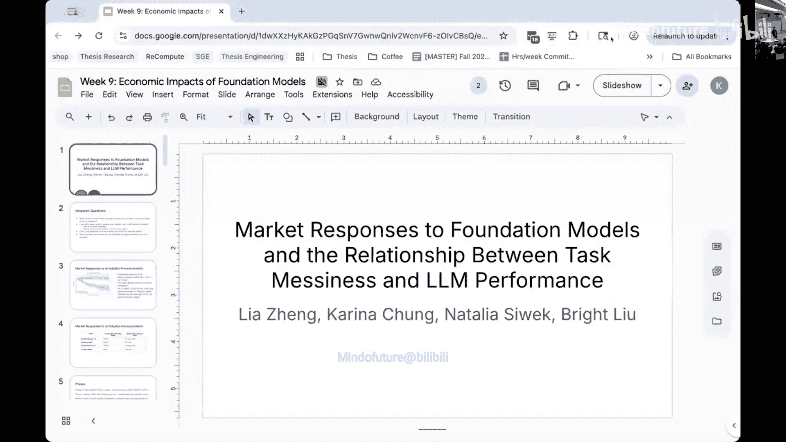
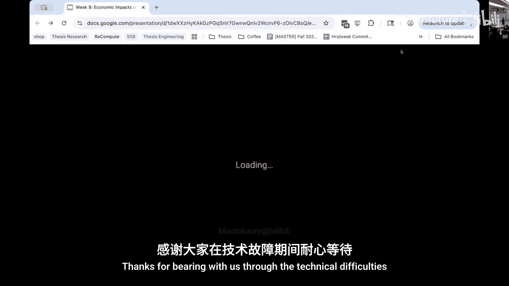
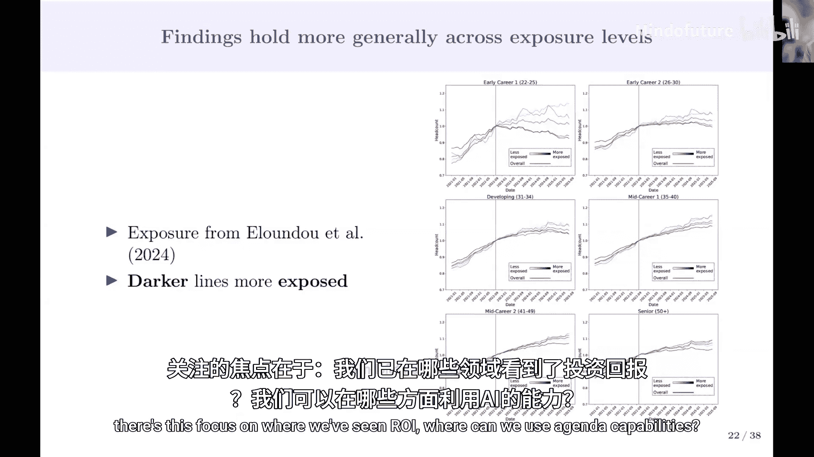

# 010：人工智能的经济影响

在本节课中，我们将学习人工智能对经济的影响，包括其对就业、生产力、企业战略和全球格局的潜在作用。课程内容基于哈佛大学CS 2881R课程的第9讲，由OpenAI首席经济学家Ronnie Chatterji和斯坦福大学教授Bryan Brynjolfsson分享。

## 概述

人工智能的快速发展引发了对其经济影响的广泛讨论。经济学家、政策制定者和企业领袖都在试图理解AI将如何重塑劳动力市场、生产力增长和全球竞争格局。本节课程将探讨AI经济的现状、历史背景下的技术变革，以及未来可能面临的挑战与机遇。

---

## 主讲人背景与视角

上一节我们介绍了课程的整体框架，本节中我们来看看两位主讲人的背景及其如何塑造他们对AI经济的看法。

**Ronnie Chatterji** 是OpenAI的首席经济学家，同时也是杜克大学的教授。他的工作聚焦于数据驱动的实证研究、公共政策以及组织在技术采纳中的关键作用。他强调了在AI时代，跨学科合作对于解决安全问题的重要性。

**Bryan Brynjolfsson** 是斯坦福大学教授，他的研究关注技术对劳动力市场和生产率的影响。他介绍了其团队的最新研究《煤矿中的金丝雀》，该研究利用ADP的薪资数据分析了AI对初级职位招聘的实际影响。

---

## 人工智能如何改变经济

在了解了主讲人的视角后，我们来看看经济学家们如何评估AI对宏观经济的潜在影响。

对GDP增长影响的预测存在很大差异，从温和增长到巨大飞跃不等。这种差异源于几个因素：
*   **历史类比与独特性**：借鉴蒸汽机、电力等历史技术革命的经验，但AI的采纳速度和能力演进可能前所未有。
*   **快速演进的能力**：AI模型能力提升极快，使得研究目标不断移动，给经济预测带来挑战。
*   **不同的理论框架**：对“智能”的定义范围（是仅限于聊天机器人，还是涵盖解决复杂问题的广义智能）会影响对经济潜力的估计。

---

## 人工智能与就业市场

上一节我们讨论了AI对整体经济的潜在影响，本节中我们重点关注一个核心议题：就业。

关于AI对就业的影响，存在两种主要观点：一种认为AI将创造新的工作机会并提升生产率；另一种则担心会导致大规模失业。Brynjolfsson教授的研究提供了基于数据的洞察。

以下是其研究《煤矿中的金丝雀》中的关键发现：
*   **初级职位受影响**：自2022年底ChatGPT发布以来，22-25岁年轻人在AI暴露度高的工作（如软件开发、客服）中的就业率显著下降，而经验丰富的员工就业则保持增长趋势。
*   **自动化与增强的区别**：研究将AI使用分为“自动化”（完全交由AI处理任务）和“增强”（AI辅助人类）。自动化程度高的职业就业增长更慢，而增强型职业则未见相同模式。
*   **效应集中于需求侧**：就业变化主要通过招聘减少实现，而非薪资下降。即使在公司内部，也观察到从高AI暴露职位向低暴露职位的招聘转移。
*   **多种稳健性检验**：排除科技行业、考虑远程工作可行性、区分大学学历与非大学学历员工后，核心结论依然成立。

**核心公式/概念**：
*   **AI暴露度**：使用 `O*NET` 数据库和大型语言模型评估不同职业任务被AI替代的潜力。
*   **累积异常变化**：用于衡量特定事件（如模型发布）前后经济指标（如国债收益率）相对于历史趋势的变化。

---

## 历史背景与AI的独特性

在分析了当前就业数据后，我们需要将AI置于更广阔的技术革命历史中审视。

回顾历史，技术对劳动力的担忧自古有之（例如16世纪的织袜机），但技术进步最终伴随着生活水平的总体提升和新工作的创造。然而，调整过程可能漫长且痛苦，例如工业革命初期城市生活质量曾下降。

AI与此前技术革命可能的不同之处包括：
*   **前所未有的采纳速度**：ChatGPT两个月内用户破亿，是史上最快的消费者技术采纳之一。
*   **能力快速提升与成本下降**：AI模型在多项基准测试上迅速达到饱和，且服务成本（如每百万tokens的成本）急剧下降。
*   **影响分布不均**：AI的影响在地理、组织领导和价值观上存在差异，导致其经济效益的分布并不均匀。

---

## 政策、安全与跨学科挑战

认识到AI影响的复杂性和不均性后，我们必须思考如何应对这些挑战。

AI安全是一个跨学科问题，需要经济学家、社会学家、心理学家、政治学家和技术专家的共同参与。政策讨论需考虑多种工具：
*   **现有自动稳定器**：如失业救济、食品券等社会保障网络，可在经济冲击时自动启动。
*   **促进劳动力流动**：考虑改革职业许可制度，降低转行门槛，并利用AI加速再培训过程。
*   **激励与监管**：思考如何设计政策，鼓励增强型而非纯替代型AI技术的发展，并建立适应AI代理的新法律和制度框架（如“代理人法律”）。

---

## 学生实验：现实任务评估与市场反应

理论探讨之后，我们通过学生实验来获得一些具体的实证发现。

学生们进行了一项实验，旨在探究两个问题：市场对主要AI模型发布的反应，以及前沿LLM在“混乱”现实任务上的表现。

**实验一：市场对模型发布的反应**
*   **方法**：分析了19个主要AI模型发布日前后，美国长期国债收益率的累积异常变化。
*   **发现**：早期发布（如ChatGPT）伴随显著的收益率下降，可能反映了对生产率和通缩的预期。但随着更多发布纳入分析，效应变得不显著，表明市场可能已将这些进步定价，或被更大的宏观经济事件主导。

**实验二：LLM在混乱任务上的表现**
*   **方法**：从GDPVal数据集中选取70个现实世界任务，使用GPT-4o mini评估其“混乱度”（基于16个因素，如需要文件操作、动态环境等），并用不同GPT模型执行这些任务，评估其输出质量。
*   **发现**：
    1.  **模型表现不佳**：即使最新模型，在复杂任务上的平均得分也较低（约58/100），表明离可靠处理现实工作流程尚有距离。
    2.  **混乱度评估集中**：大多数任务混乱度得分集中在10或12（满分16），表明评估标准可能不够细化。
    3.  **时间估计不准**：LLM严重高估了完成任务所需时间，可能是以人类为参照，而非其自身处理速度。
    4.  **模型持续进步**：GPT-4o mini 和 GPT-4o 的表现优于 GPT-4，尤其在专业服务领域。

---

## 总结与未来展望

本节课中我们一起学习了人工智能经济影响的多维度图景。

我们从宏观预测、就业市场实证研究、历史比较、政策挑战以及具体的实验分析等多个角度探讨了AI的经济影响。关键要点包括：AI对就业的影响目前集中在初级职位；其发展速度和历史技术革命既有相似也有独特之处；应对其挑战需要跨学科合作和创新性政策思考；而当前模型在处理复杂现实任务上仍有局限。

未来，研究需要更关注AI在全球不同国家的差异化影响、对教育体系的塑造、以及新兴的制度创新需求。对于个人而言，在AI时代培养技术能力、商业洞察力以及软技能，将成为应对变化的关键。

---
*本教程根据哈佛大学CS 2881R课程第9讲内容整理，旨在为初学者提供清晰、直白的知识概述。*