# 014：2035年的人工智能与GDP价值 📈

在本节课中，我们将探讨人工智能对未来经济的潜在影响，特别是其对全球GDP和劳动力市场的变革性作用。我们将从宏观趋势分析开始，然后深入了解OpenAI团队如何通过GDP-Val等评估基准来量化AI在现实工作任务中的能力，并讨论AI自动化研究、科学发现以及随之而来的安全与准备挑战。

## 课程概述与AI的经济影响

我们很高兴今天能请到Pegel和Kevin。上周介绍他们时我说过，我并非OpenAI的盲目粉丝，但我认为我们拥有全球最好的前沿模型评估团队。因此，我们非常期待他们的分享。

我们决定这样安排：我先用大约20分钟，基于一篇关于AI如何影响经济的博客文章，做一个引言介绍。然后，我们会把时间交给Tegel和Kevin。在适当的时候我们会休息一下，之后还会有学生实验分享。

我认为这次会议正在被录制，我们可以稍后决定如何处理录像。好的，那么我想谈谈我认为AI在未来会是什么样子。

在我看来，AI正变得越来越强大，成本也越来越低。我们正处在一个关键的节点。

另一张我非常喜欢的图表来自“This Meter”论文，它表明：你可能会认为，对于那些对人类来说非常容易的任务，AI可能仍然难以企及。但我们并没有真正看到这种情况。我们看到，最终那些对人类来说容易的任务，AI基本上都能100%解决——当然，这有一个巨大的前提：这不是在对抗性环境中。所以，从某种意义上说，这不是最坏情况。目前，我们至少还没有解决“对抗性鲁棒性”这个难题。我们总能找到一些输入，让模型无法解决那些简单的任务。但模型在简单任务上的可靠性确实变得非常高。

这两个趋势结合在一起，形成了我的思维模型。Kevin、Nagel或其他人如果对这个模型有不同意见，请随时提出。我认为，思考AI最简单的方式是：我们基本上是在向经济中注入数量呈指数级增长的虚拟劳动力。

每年，不仅虚拟劳动力的数量会增长，他们的能力和通用性也会显著提升。最初可能不涉及机器人技术，但机器人技术最终会跟上。所以，没有什么任务是必然无法自动化的。

我认为未来会出现类似这样的图表，指数的基数尚待确定。虚拟劳动力的数量基本上每年呈指数级增长，他们的通用性和质量也以显著的速度增长。

我预计扩散过程会更曲折。可能由于各种原因，在某些部分扩散较慢。但如果它们变得更大、更强，即使初期扩散慢，最终也会赶上。

我的观点是，在极限情况下，比如大约20年内，我们可能会看到全球劳动力有效增加十倍。

为了有个直观感受，我在博客中尝试做了一些计算，并与一些经济模型进行了比较。简单来说，这个假设基于我们看到的指数级增长，意味着我们将看到前所未有的自动化率。

过去，自动化率通常是个位数百分比，并且随时间推移而下降，导致自动化和收入的增长更接近线性。而未来，我们可能会看到两位数的自动化率。

假设我们每年自动化之前未自动化的任务的10%，并且伴随着这种增长，成本下降多少甚至都不那么重要了，我们将获得爆炸性增长。这种爆炸性增长不是指奇点那种要么所有人灭亡、要么立即进入天堂的意义，而是更接近工业革命级别的增长。再想想，劳动力增加十倍意味着什么？

迄今为止，全球劳动力一直由人类构成。我认为可以这样理解：全球人口上一次增长十倍，要追溯到1750年。

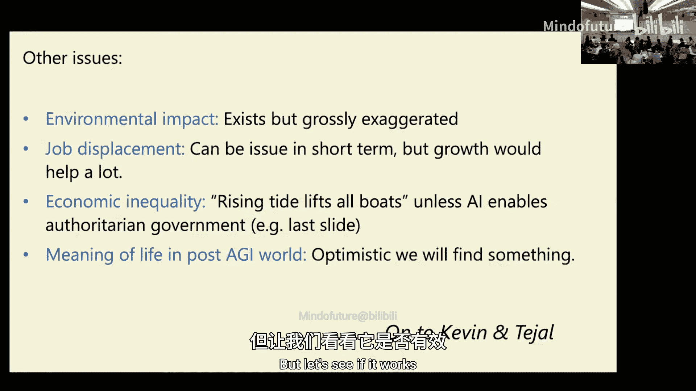

工业革命使我们能够增加劳动力，科学革命使我们能够在养活所有人的同时，让生活变得比以往任何时候都好。全球GDP自1700年代以来确实爆炸式增长。

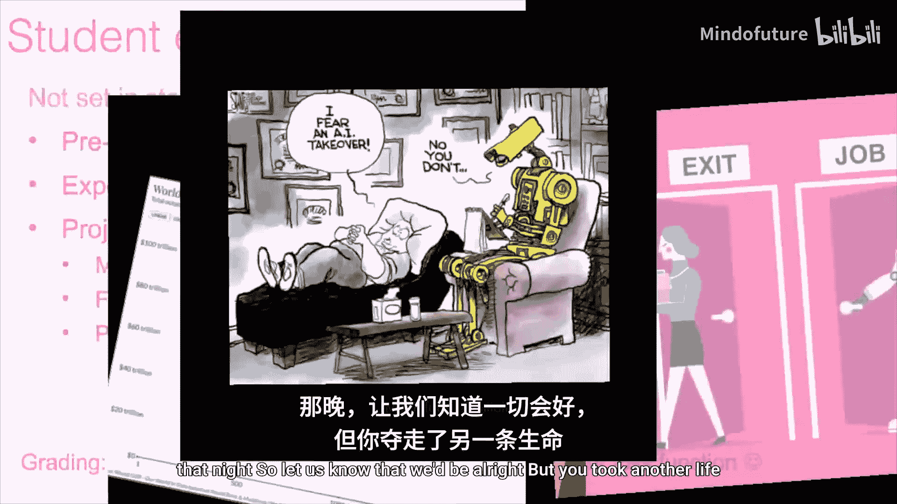

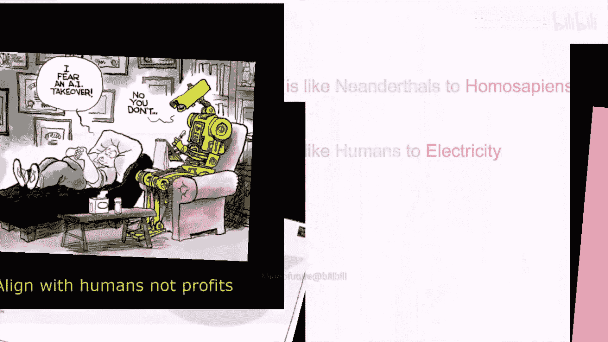

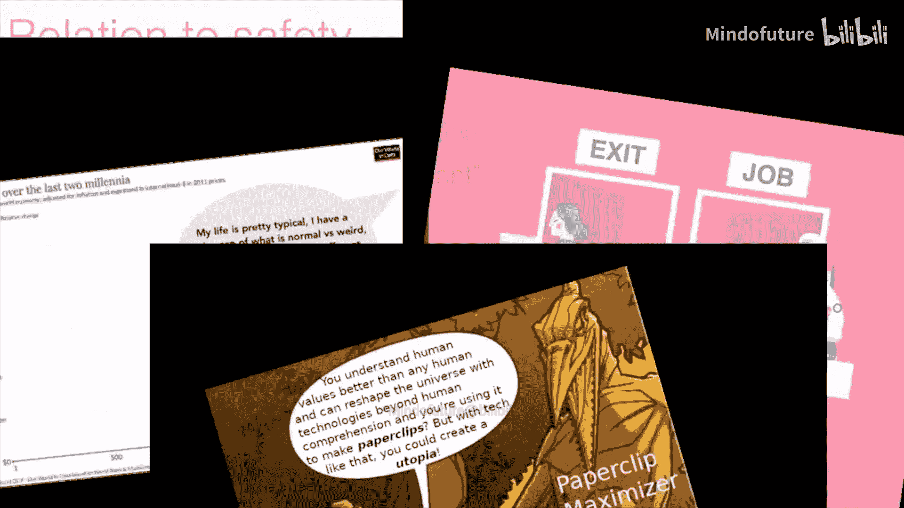

你可能会说，这只是经济数据，但其他统计数据，如预期寿命和儿童死亡率，自那时起也都大幅改善。你可能会说，也许这只是富裕国家和美国富人的情况，穷人状况仍然很糟。但首先，这些是全球数据，是地球上80亿人的平均值。即使比较美国、世界和撒哈拉以南非洲，确实存在巨大差异，但趋势是相同的：都在上升，预期寿命在上升，儿童死亡率在下降，而且下降幅度很大。

具体来说，看看今天非洲的预期寿命。它比全球平均水平差，但差的程度大概是世界1980年代的水平，而不是1700年代的水平。

再次强调，从比例感来看，即使在绝对意义上，过去最富有的人的生活也比不上今天的普通人。当然，你总能找到今天生活非常悲惨的人，以及过去健康长寿的人。但总的来说，即使以典型的美国人或许多国家的贫困线为标准，在最重要的方面，现在的生活也比前工业时代的皇室生活更好。举个例子，英格兰女王。

她是一个相当典型的例子，也许比其他例子更极端。她有七个孩子，我不知道有多少次流产，但有七个活产的孩子，其中五个在成年之前夭折。我不记得具体数字了，大概三个在婴儿或幼儿期，两个在青少年时期。她本人在37岁生日时死于最后一次分娩的感染，婴儿本身也在几天内死亡。这就是当时的生活，即使是皇室，即使是英格兰女王。

所以，底线是：如果AI确实能将全球劳动力增加十倍，我认为这将是一场彻底的变革，而且总体上很可能是一场向好的彻底变革。

但这是一门AI安全课程，我担心事情可能出错。让我用几分钟谈谈我的个人立场，其他人可以随时反驳。也许我们最后有时间进行更多问答。

我个人不太担心经典的“AI接管并杀死所有人”的末日场景。我写过一篇关于这本书的半评论，你可以阅读，这里不展开所有细节。但总的来说，确实，我们没有完全的控制和理解。但我认为这也不是零控制、零理解。尤多夫斯基式的观点是：这些是巨大的矩阵，我们一无所知，它们可能随时密谋杀死我们，我们毫无头绪，也完全无法影响它们。它们会发展出自己奇怪的目标并无情地追求。我不认为情况会是这样。我认为我们无法完全控制和理解，但在完全控制理解和一无所知之间存在一个巨大的光谱，我认为我们处于中间位置。我们肯定没有达到我个人感到舒适的那种接近完全控制和理解的程度。

这引出了另一个观点。我主要担心的是，除非我错了，我们只是撞上了许多人预测的“墙”，否则如果AI继续以类似当前的速度发展，我们将在极短时间内经历巨大的市场变化，并将可能200年或100年的进步压缩到10或20年内，这将非常剧烈。

我认为社会没有准备好，我们的政府没有准备好，国际关系也没有准备好应对这样的事情。我认为技术安全的缺乏，即我们没有完全控制这些AI，我们还没有办法防止滥用、使它们变得鲁棒和可靠，所有这些因素都可能使情况变得更糟，并产生许多未知的未知数。

所以，我不知道具体会出什么问题。但我认为，短时间内发生快速变化，加上我们没有达到显著的控制水平，这是一个问题。

我有时喜欢用的一张幻灯片是：航空安全。我们确实成功降低了事故数量，但这花了我们50年时间。在这50年里，产品基本上保持不变。如果你看70年代的喷气式飞机和现在的喷气式飞机，现在更省油，有一些进步，但非常渐进。相比之下，AI十年内的变化，更像是从自行车到飞机的飞跃。

因此，我们试图在技术不断变化的同时使其更安全，这是一个问题。

我个人担心的另一件事是AI与政治权力。我认为AI有可能赋予个人权力，但也可能剥夺他们的权力。我认为AI有可能放大一个人的影响力，使一个人能做更多事情。

也许它可以增加政府的透明度，你无法用大量的文书工作淹没一个小人物或非营利组织。也许你甚至可以要求AI审查政府通信，然后显示一切基本上都按应有的方式运行。实际上，从长远来看，AI可能更有利于信息战中的防御方，就像AI最终更有利于防御垃圾邮件一样。

但另一方面，AI可以实现我们前所未见的大规模政府监控。即使是高度极权主义的政府，也受限于无法真正负担为每个公民配备一个间谍。现在，你也许可以为每个公民配备一百个间谍。AI将深入参与我们所有的通信。因此，除非我们改变法律或确保这些通信受到保护，否则你和AI之间所有非常私人的通信都可能被传唤和审查。

如果政府拥有顺从的AI工作者，那就意味着它们永远不会拒绝违反宪法的命令，也永远不会有人吹哨，这也可能成为极权政府的配方。

我认为，基本上，在AI世界中，私人公民在讨价还价方面的筹码可能会减少。我不认为这是人们唯一的筹码，至少在民主社会中肯定不是。但这又多了一个因素。

我认为，我们是走向绿色道路还是红色道路，更多地取决于政策决策，尽管我希望从这门课程出来的人能比普通人更有影响力。但其中一些也可能取决于技术能够实现什么或不能实现什么，以及公司追求或放弃哪些途径。

人们还提到了AI的其他问题，可能比我提到的更多。环境影响是真实的，但经常被严重夸大。如果你在《纽约时报》读到关于环境的内容，幸运的话可能只夸大了一个数量级，不幸的话可能夸大了三个数量级。

我认为工作替代是一个问题，但经济增长会有很大帮助。例如，美国关于全民医保、医疗保险、社会保障预算平衡与减税的许多辩论，如果你有4%的增长而不是2%的增长，这些问题就会消失。如果你有10%的增长，那情况就完全不同了。

虽然我，可能还有你们中的大多数人，实际上喜欢自己的工作，并在某种程度上赋予生活意义，但我认为很多人工作只是为了薪水，如果不工作也能拿到薪水，他们其实没问题。总的来说，我认为只要我们不陷入独裁政府，只要不变成财阀统治或其他什么，就会有如此多的繁荣，我们将共同提升。

我相信，即使没有更多的会计师，人类也会找到生活的意义。也许很多会计师会去画画，结果可能非常擅长。

基本上，让我把话题交给Kevin，但我会先短暂休息一下。在我的课堂上，我经常在课程结束时播放一些视频片段。我想在这里也做类似的事情。我让Codex来做这件事。我基本上给了Codex所有的PowerPoint幻灯片和一首我认为合适的音乐MP3（《当地球死亡时》）。我说，去找找梗，做个视频片段。也许这会是Codex还不擅长的下一个评估任务。让我们看看效果如何。

（视频播放）

好的，快速概述一下。我们今天想告诉你们几件事。首先，我们将介绍我们参与的一个名为GDP-Val的评估，其目标是衡量模型在现实世界任务中的表现。然后，我们会谈谈我们如何看待自动化AI研究以及如何衡量其进展。接着，我们会花时间讨论这种快速进展对安全和准备工作的影响。最后，希望我们能进行一场富有成果的讨论。我知道之后还有学生展示，我们会确保留出时间。我们的演示会很简短。

## GDP-Val：衡量AI在现实工作中的表现

也许从谈论GDP-Val开始。GDP-Val你可能在Twitter上看到过，有很多新闻报道。我们基本上是在尝试建立一个基准，来衡量我们的模型完成现实世界工作的能力。它传播得非常快，几天内就在Hugging Face上排名第一。它之所以传播快，是因为历史上我们衡量AI在现实工作中表现的能力非常有限。我们只有像MMLU或GPQA这样的测试，衡量模型回答学术风格问题的能力。GDP-Val是我们首次能够衡量模型是否真的能在现实世界中完成实际工作的方法之一，我很高兴能和你们分享一些细节。

也许Kevin，你可以翻到下一页。更多人在谈论它，我想他们正在思考。

你可以翻到下一页。是的，我们GDP-Val的目标是，这是衡量AI模型执行现实世界知识工作的第一步。我说的“现实世界知识工作”，指的是可以在计算机上完成的那种工作，比如会计、法律或金融。直到此刻，我们还没有系统的方法来衡量模型随时间推移的表现或进行预测，我们很大程度上依赖于客户意见或人们写的文章。但我们非常感兴趣的是，即使在训练模型的过程中，也能衡量它们的能力，并与现实世界分享这些信息。

这里有很多局限性，但我们关心对此类任务进行评估的原因是，理解AI对劳动力的影响非常重要。正如Bill提到的，有很多关于可能发生什么的猜测，也有很多耸人听闻的文章说AI可能会夺走所有工作。因此，拥有科学和实证基础非常重要。

但是，人们现在能看到的是使用数据、生产数据或对GDP的实际影响。问题在于，对于像AI或AGI这样的基础技术，这些是能力存在之后的滞后指标。如果你回顾历史上的重大技术变革，如互联网、铁路或飞机，从能力存在到广泛使用，往往需要数年甚至数十年的时间。例如，从飞机存在到每个人使用飞机在世界各地工作和拜访客户，花了很长时间。另一个例子是自动驾驶汽车，Waymo已经运行得相当好，但需要一些时间和文化理解，人们才愿意乘坐Waymo并意识到它有效。

因此，我们同样希望主动预测这些模型能做什么，因为我们预计调整法规、文化转变、人们习惯在日常工作中使用这些模型都需要时间。但这并不否认模型可能已经具备其中一些能力的事实，我们希望对它们进行预测。这就是我们想要衡量它的原因。

OpenAI对此感兴趣的另一个原因是，OpenAI的使命是帮助确保AGI造福世界，我们认为AGI本质上将涉及完成具有经济价值的任务，因此我们希望衡量这些任务并拥有良好的科学依据。

让我先展示一些GDP-Val中任务类型的例子。这来自我们的论文，你可以在网上找到。在右侧，你有一个实际可交付成果的例子，是某人在真实工作中实际完成的。这些工作要么是本人拥有的，要么他们获得了许可将其纳入评估集。他们会进行清理，确保没有个人身份信息等。但这些任务非常多样化。

例如，左上角，一位制造工程师正在设计一个电缆卷轴支架。请注意，这是一个非常3D、多模态的任务，这个人花了很长时间才完成。然后，他们给出了在制作这个电缆卷轴支架时可能访问的上下文或文件。目标是看模型是否能做同样的事情，它能否完成这个人必须做的这项工作。

中间顶部是一个竞争对手格局分析。如果你们中有人做过银行实习，在尽职调查一家可能收购或帮助出售的公司时，一个经典任务就是了解其他竞争对手，并创建这个非常详细的、包含所有可比估值的格局图。这是另一种类型的任务。

这里我还给出了更多例子，比如房地产经纪人、客户服务邮件、创建视频和文本报告、为护理职位制作咨询报告、分析大量Excel数据、作为礼宾员制作行程、在公园和娱乐部门工作并规划不同供应商的布局位置。所有这些任务都旨在涵盖一系列时间范围，有些是长达数小时的任务，有些是数天，有些甚至是数周。我们有人提交了他们写的一整本书，他们说，让我们测试一下模型需要多长时间才能擅长这类任务。

这是真实的工作。我的意思是，它不等同于自动化整个工作。它是一个定义明确的任务，有特定的输出，并且仅限于计算机上的工作，不包括体力劳动。但它比我们之前给模型的测试类型要现实得多。观察模型在这些任务上的表现如何，追踪起来非常有趣。

也许翻到下一页，我们如何挑选这个初始集中的任务。我们只是想从贡献美国GDP超过5%的行业开始，这样我们有个起点。然后，我们挑选了这些行业中收入最高、主要从事数字工作的职业。我们没有过多关注主要是体力劳动的任务。这些是非常典型的知识工作任务。这就是我们如何筛选出GDP-Val第一版中的第一批任务。它之所以叫GDP-Val，是因为它是对GDP相关任务的评估。

这里有一些其中的职业例子，它们非常多样化，从编辑到注册护士，到房地产经纪人，到药剂师，到招聘人员。招募这些人花了很长时间，我们非常关心找到最优秀的人才，我们希望获得非常多样化的职业代表。

我们关心找到最优秀人才的原因是，我们感兴趣的是模型是否真的能在这些任务上表现出色。因此，我们找的人必须有丰富的工作经验，必须有顶尖的简历，我们进行了一系列背景调查。基本上，我们希望确保人类对比对象是一个非常强大的人类。如果模型在该任务上能超越人类，那实际上意味着什么？意味着模型比一个在该领域有丰富经验、有晋升历史的真正有才华的个体更优秀。

这些只是专家们为了成为我们对比的人类并帮助制作任务而必须通过的一些标准的例子。

在我讨论结果之前，你们可能关心的一件事是：这些任务是否真正具有代表性？质量控制好吗？因此，我们对模型和人类进行了大量的质量控制，确保我们包含的任务具有代表性，确保它们实际上是可以解决的，比如人们没有忘记包含完成这项工作可能需要的参考文件，并进行了大量审查，以使其尽可能高质量。

也许翻到下一页。现在我来谈谈评分。如果你有一个任务和提示，你想知道模型是否比人类更好，我们实际上如何评分，哪个更好？我们做的第一件事是，让不是制作任务的同一批专家的另一组专家，假装他们是经理，说：嘿，如果两个报告给了你这两份工作成果，你更愿意使用哪一个？这是选项一。也许Kevin，你可以翻到下一页。

他们必须在自己的领域有丰富的经验，必须通过筛选测试。然后在下一页，我们展示这实际上是什么样子。对于每一个比较，我们提出的每一个问题，我们至少让三位专家查看这个具体问题。他们至少查看模型的三个样本。每次他们只是进行两两比较：哪个更好？是人类实际工作中完成的可交付成果，还是模型（例如GPT-5）的输出？然后他们会考虑客观标准，比如哪个更正确，以及主观因素，比如哪个格式更好、更容易阅读、更容易理解。这有助于我们将其汇总成一个总体胜率。

如果你翻到下一页。这是我们发布的一个头条结果。我想先从Y轴开始，即相对于行业专业人士的胜率。这意味着专家认为模型的输出比专家在其实际工作中实际完成的成果更好的时间百分比。50%意味着你大约一半时间更喜欢模型，一半时间更喜欢专家。

我不知道你是否说过你有模型的多个样本，但胜率仍然是一个样本的胜率，而不是三局两胜之类的。不，不是三局两胜，是平均的。

让我们从最左边开始。Kevin和我都参与了GPT-4o和GPT-5的工作。实际上，我认为你当时也在场，我不知道我是否在场，但我参与不多。好吧，当时，我们对GPT-4o非常兴奋，因为我们认为这是我们发布过的最好的模型，它是多模态的，可以处理图像。但如果你当时使用GPT-4o，与专家相比，它相当糟糕。你基本上只会在大约10%的时间里更喜欢模型的输出。也许平局多一点。“胜和平”意味着专家无法真正区分差异，所以他们说是平局。

但如果你看GPT-4o-mini或GPT-5，你会发现我们已经开始更接近与行业专家的持平水平。实际上，如果我们把ChatGPT Agent也画在这里，它也会落在这条线上。让我们真正兴奋的是，首先，模型在绝对意义上比我们预期的更接近行业专家。我的意思是，再次强调，这是在定义非常明确的任务上。但它们相当现实。而且趋势看起来大致是线性的。

所以，自然的问题是：如果你只是延长这条线，什么时候我们能与这些专家持平？这非常有趣。如果你翻到下一页。

我们还绘制了其他模型。抱歉，我太兴奋了，嗓子有点哑。Claude实际上已经非常接近与专家持平了。我们希望对结果保持超级客观。再次强调，这不是工作中可能做的每一项任务，但已经非常接近持平了。

好的，我们认为另一件有趣的事情是：你可能会想，一个人如何将使用模型融入他们的工作流程？你可以想象这样一种设置：一个人类专家，比如你是一个会计师，你从模型中采样以完成任务，如果模型做得好，你就使用那个完成结果；如果不好，你就自己完成任务。我们有一个问题是：如果人类在尝试自己完成任务之前先从模型中采样，他们会节省时间或金钱吗？

我们实际上模拟了这种情况，我们用一批模型设置了这种模拟。结果表明，自GPT-4以来，每个模型，如果你在亲自动手之前先从模型中采样，实际上会节省时间和金钱。对于GPT-5，大约是1.4倍或1.6倍的更快、更便宜。这太疯狂了，我真希望能向你们展示这有多令人兴奋。而且它只会变得更好。

我们在论文中有更多这方面的细分，这里不需要深入。但我们认为有趣的一点是，OpenAI的模型在纯文本方面实际上比Claude好得多，但Claude在所有多模态文件方面都更好。因此，在OpenAI内部，这是一个相当有趣的观点：嘿，我们现在在处理文件扩展名方面看起来不太好，可以改进这一点。

我们还有一些数据，我们可以很快地过一遍。如果你增加解决问题的推理努力，你往往会做得更好。这条线相当有趣。

我之前说过，模型在一些定义明确的任务上已经接近与专家持平。但仅仅因为模型可能被人类偏好，了解模型的失败之处也很重要，比较失败的严重性。人类可能更喜欢模型的完成结果，但失败可能非常糟糕，甚至是灾难性的。例如，你不会想要一个客户服务代理辱骂客户是白痴，或者在医疗案例中，如果模型的失败导致有人死亡，那将非常糟糕。

因此，对我来说，要信任将模型置于循环中，灾难性伤害的风险必须非常低。所以我们做了一个后续研究，我们让人类专家对模型未被选中的时间进行评级。这只是看GPT-5被认为比人类差的那部分样本，细分结果很有趣。

大约23%的时间，人类认为模型实际上更好，这与我们的内部注释者一致性相符，即专家们并不总是同意模型是否更好。所以这里有一些主观性。

大约50%的时间，人们认为模型可以接受，但仍然比人类差。27%的时间被认为完全不合格，3%是灾难性的。从我们的角度来看，灾难性的结果非常糟糕，你可能无法在没有人类监督的情况下在生产中使用模型。但如果我们能降低这个灾难性比率，你可能会认为模型在未来会更可用。

这是一组详细结果的快速概述。也许Kevin，你想谈谈其中一些原因，因为我觉得我的声音不太好，而结果实际上很酷。

是的，我来谈谈这些东西。我认为这很有趣，比如模型会犯什么错误。很多都是基本的指令遵循问题，比如要求交付特定文件类型，对人类来说提交PDF或幻灯片并不比写东西难多少，甚至可能更自然，比如经常使用PowerPoint。但对模型来说很难。有很多非常有趣的格式问题，我认为后面会描述。另外，由于工具限制，模型可能在处理部分任务时遇到困难，尤其是多模态数据或非常大、不同格式的文件，它们在很多使用中没见过。你可以深入了解一些格式元素。

然后，我认为另一个是准确性。我相信你们都经历过，有时即使是GPT-5思维链，也会给你一个数字，然后你检查发现它有点错误，或者有三个来源在阅读这个东西，其中两个这么说，一个不这么说，这就是一个重大的错误和失败。

是的，所以Rachel，你随时想跳回来都可以，我会尽量合理地呈现这些内容，因为内容太好了。

好的，我会继续。是的，我的意思是，你可以看到，模型真的在基本的格式问题上挣扎。但通常数据本身更合理，或者分析更合理。这只是一张随机的幻灯片，它不太好。我想任何人都可能做出比这更好的幻灯片，实际的演示格式。你也可以用Agent公开复制这一点，有时它也会犯这种错误。

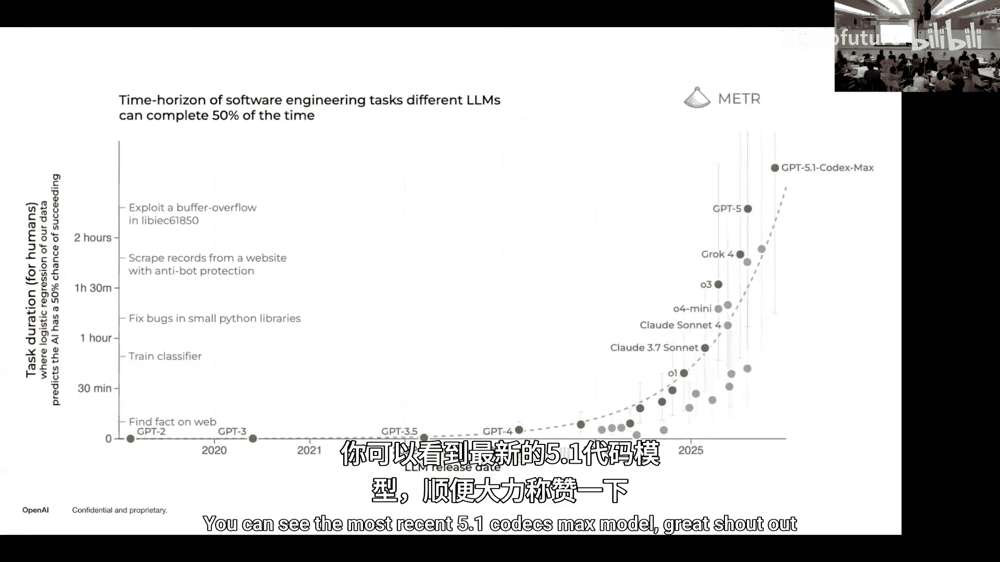

还有，缺乏视觉元素，比如超出页面，这些都是可交付成果被认为不合格的非常简单的原因。

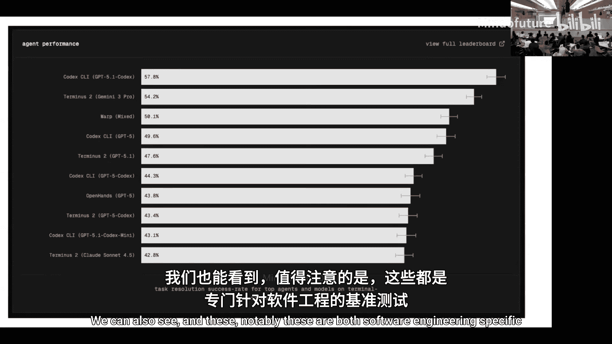

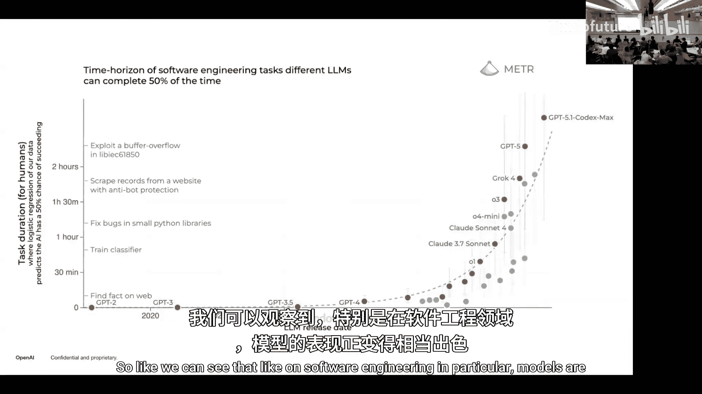

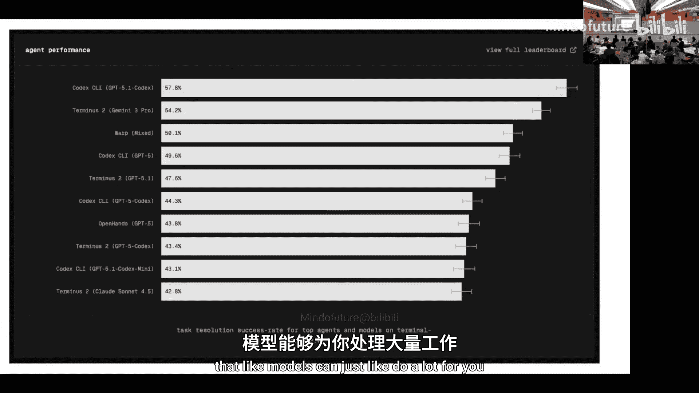

另外，一个有趣的事情是，模型通常看不到最终可交付成果的确切渲染格式。例如，这是一个奇怪的Unicode问题，有时它会使用奇怪的字符，在某些特定字体中无法正确显示。这是另一个问题，很多实际渲染的可交付成果都有这些奇怪的下划线和破折号，实际上无法正确渲染。模型很难分辨这一点，你基本上需要封闭的图像接收器才能看到这个。

让我们看看这个。模型会随着时间的推移变得更好，这很有趣。我认为这里就像……好的，我们可以点击浏览。是的，这里，我认为这是一个例子，你可以看到模型输出的演变。你可以看到GPT-4o只有一堆这样的东西，然后GPT-4o-mini改变了，有一些文字，有一个总结，这相当好，有很多关于总结的细节。然后GPT-5，实际上是一个有主题的演示，有颜色，实际上使它更容易阅读。这也是一个例子。实际上我不熟悉原始数据，但你可以看到模型在实际格式和演示方面仍然在变得更好。

让我们看另一个例子，这个例子是：你是安全协调员，必须创建一个月度安全检查表，为一家食品杂货零售店建立安全环境。然后GPT-4o只是写了一些东西，基本上是Google文档级别，只有几个合理的要点。GPT-4o-mini有一个表格，你可以有评论，你可以想象打印出来在现实中实际使用。然后GPT-5有疯狂的细节，有一个漂亮的表格，有总结，有不同的部分，有颜色，实际上使某人更好。

好的，这是一个模型和人类反应的例子。我很好奇，你们认为哪个更好？你们应该举手。如果你认为左边那个更好，请举手。如果你认为右边那个更好，请举手。你们不能在这时说T。哪个是真实的？等等，我们也应该让他们猜哪个是模型，哪个是人类。哦，好的。如果你认为左边是模型，请举手。然后如果右边是模型，请举手。这感觉差不多，也许左边稍微多一点，我不确定。我猜我不记得了。这非常说明问题，它们开始看起来一样了。我认为左边可能是模型，也就是你们认为更好的那个。“由执业护士准备”并没有泄露信息，因为我们让他们删除了名字，也许他们改了名字。

我可以说……好的。另一件我要讨论的事情是，我们尝试的提示工程，看看是否能修复一些非常明显的失败。你可以说，很多这些都不是智力问题，只是模型没有做正确的事情，或者格式没有做得很好。因此，我们创建了一个极其详细的提示，列出了每一个可能的问题，然后还可以使用GPT-5的最佳四选一来挑选哪个实际上更好。

你可以看到，这实际上确实显著提高了性能。我认为这象征着这里有如此多的低垂果实。从某种意义上说，模型非常有能力，但如果我是一个会计师或从事工作的人，创建PDF时，只是使用一些微小的挑剔点，这些点可以很容易地修复，但现在却阻止我完全用模型来做这件事。所以，这显然不是一个巨大的增长，但我认为这表明，仅仅一个非常简单的干预实际上也能提高性能。你可以在这里看到，它们使用了这些工件，重叠变得零，尤其是因为你可以让模型检查并确保它实际上是正确的。然后，还有一小部分文件损坏了，模型不知为何产生了损坏的文件。

是的，这个数据集也有一个公开可用的部分，我们非常好奇让人们尝试，尝试不同的模型，尝试不同的策略，也看看数据是什么样的。我认为看看前10个提示，看看我们告诉模型什么信息，以及你认为哪些方面现实、哪些不现实，这非常有趣。特别是很多这些提示极其详细，模型有很多上下文，但模型对工作没有上下文。就像如果你只是被告知，你不会得到13段的工作解释，但模型在这种情况下不知道。

是的，我们还有这个网站 evals.openai.com，列出了我们制作的所有其他评估。比如我们制作了Paper Bench，用于复现ML论文，我们稍后会讨论，还有很多其他的。

是的，基本上就是这样。我认为还有一点需要指出：显然，这项工作有很多局限性。其中之一当然是，它只是经济上有价值的工作的一小部分，主要是因为它仅限于数字工作，只有有限的职业集，而且可交付成果也是自包含和一次性的。它不衡量，例如，如果你在一个职位上工作了两年，有人告诉你一句话，你就知道如何将其扩展成一个定义非常明确的任务。这不是它衡量的。它是一个非常单一的可交付成果，只是一段文本，任何人都应该能够用它来创建实际输出。因此，我们声称这不是衡量整个工作的表现，只是这些定义明确的子集，但希望这是朝着理解模型在这个领域有多好以及剩余限制是什么迈出的良好一步。

基本上就是这样。在我们进入下一部分之前还有什么问题吗？我们应该问问人们：你们害怕吗？有多少人感到害怕？我猜。我不知道。我会说……你感觉有多害怕？0%，30%害怕？那不算太害怕。我的意思是，也许我也……人们现在对GDP有疑问，但在我们继续之前。

请举手。谢谢你们有趣的演示。我很好奇你们能否分享是如何找到并说服这些专家参与研究的，尤其是考虑到普遍存在的一种感觉，即你们正在弄清楚他们的工作是否可以被取代甚至超越。是的，我的意思是，首先，我们给予的报酬相当不错。而且，你知道，市场可以激励行为。但我认为，我们的动机更多是为了科学，并作为研究分享。我认为人们很想知道模型能否完成这些任务。这本身就是有价值的信息。所以实际上很有趣，当论文出来时，专家们在Slack频道里说，这是如此惊人的工作，我们很高兴能为此做出贡献。所以我认为，你们所做的具体工作类型相对没有争议。但你可以思考延伸问题：人们对于实际致力于使模型擅长他们的工作会有多兴奋，我认为这可能是一个不同的问题。

我们可以问问那些害怕的人为什么害怕吗？或者你害怕吗？害怕可能不是正确的词，但也许是不安。我不知道。你有后续问题吗？或者你得到了什么？嗯，我在想的一件事是，我不知道这个班有多少大四或大三学生，但我们衡量的大部分工作是入门级的，就像你们大学毕业第一年或第二年做的许多工作，而你们是哈佛学生。所以你们可能……还好。我只是好奇人们是否对这类事情感到压力。

既然我有麦克风，我想我可以谈谈我的经历。我刚刚从工业界回来，之前在一家金融公司做入门级工作。我想我之所以想回到学校，部分原因是我觉得这最终会赶上。我有点想站在这类事情的前沿，所以我不想只是坐着，然后让GDP-Val轻松评估我的工作。所以，是的，这就是我回来的原因。还有其他人对此有评论吗？恐惧或……

你昨天是谁？不，我想我对Boaz早先演示中关于“水涨船高”的说法有些怀疑。这只是我非常主观的看法，我们处在一个小众社区，外面很多人对AI有很多犹豫和恐惧。在这个快速变化的世界里，你希望那些当前工作可能被取代的人能够找到机会提升技能或改变技能、适应。但我也担心这种恐惧会以某种方式限制很多人，我不知道结构上我们是否准备好应对这种转型。

是的，我觉得这是一个非常合理的观点。是的，我的意思是，坦率地说，我只是认为，如果AI真的取代了大量工作，目前AI对失业的影响非常有限，主要是在某些特定领域，但如果它变得非常显著，那么因为AI现在可以取代的每一项工作，明年都可以做得更好、更便宜，所以我很难想象它如何在不创造大量经济增长的情况下做到这一点。

然后，即使人们找不到其他工作，社会安全网的计算也会变得非常不同，如果你处在一个有巨大经济增长的地方。所以，我认为在这种背景下，也许我们……是的，我的意思是，对大多数人来说，就像我说的，我不认为就业本身是一个目标，它是获得你想要的东西（如物质）的一种手段。如果你能用更少的劳动获得这些，那也没关系。让我猜猜，实际上，关于这一点……是的，我想只是在此基础上再补充一点，让我害怕的一件事是权力积累的想法。我认为这将是一个导致权力在新地方大量积累的工具。我认为，就社会如何运作而言，关键是对这种权力设置保障措施，并以有趣的方式分配权力。我不确定我是否听到了一个连贯的故事，关于我们如何管理这种权力积累并分配它。这并不是说这个故事不存在。

但我当然认为，当我思考为什么害怕AI时，这基本上是我脑海中的问题：社会是否能够跟上并设计出足够快的架构来适应那个世界？所以我想我的问题是：是否存在一个世界，你认为你看到了如此多的颠覆，以至于前沿能力实际上被搁置或不发布，因为你试图管理正在发生的颠覆？或者你认为，由于起作用的激励结构，前沿模型一旦上线，总是会尽可能快地推出？

我认为，社会从监管或社会接受角度对前沿模型的反应如何，仍有待观察。但也许回到他早先谈论劳动力权力时的观点，我认为一件非常有趣的事情是，劳动力更有价值时，劳动力就有更多权力。一方面，我想确保人们知道GDP-Val非常有限，它只衡量定义明确的子集任务。另一方面，我们提出任务的方式是，我们去了劳工统计局网站，他们对每个工作都有细分，比如对于会计，花多少时间查阅外部材料、制定预算、与客户交谈。所以人们可能会认为，追踪这些方面的进展，实际上是在追踪你是否能够在构成人们大部分工作的任务上差异化地增加价值。我认为如果模型在这方面变得更好，劳动力拥有的权力……可能会不那么独特。

谢谢。首先我想说的是，我在这里扮演一点魔鬼代言人，我认为没有人能从功能失调的社会中获得任何价值。我想听听你们是否同意或不同意这一点，但我无法想象AI的影响会大到，例如，公司要赚钱，人们需要有钱花，一切都建立在社会之上。这就是为什么我对巨大的社会影响不那么害怕。但作为一个生活例子，我不太虔诚，已经没有那么多的东西可以说这赋予了我生命价值。我和我的朋友们强烈感受到的一件事是，我们所做的工作赋予了我们生命很多价值。所以，如果我每天早上醒来，发现我六个月后要做的事情一夜之间被AI完成了，社区变得更好，但我也……很难过，因为我不能做它，或者其他人也不能。

我想听听Kevin的想法。我也非常喜欢我的工作，我希望能够做它。我同意功能失调的社会可能很糟糕。是的，我非常……嗯，我也非常关心工作，我觉得它非常重要。我有点矛盾，因为……我认为也许有一些细微差别，我有时会回想起这个关于洗衣机的轶事，当洗衣机刚发明时，那个人的反应是……我想今天大多数人会说，哦，有洗衣机很有用，这不是我生活中最疯狂的发明。但对这个人来说，这就像……他们崩溃哭泣，因为这是他们全部的生活，因为，你知道，照顾一个家庭需要大量的工作，就像，哦，我现在有这么多时间做我真正想做的事了。

我认为这显然是一个非常积极正面的例子，说明……你知道，我觉得不是每个人都想做他们正在做的工作，但我认为这可能有点混合，许多人会感到被打乱，并在一段时间内感到失去目标，无法做他们以前做的工作。但我也认为很多人会意识到，希望还有其他他们真正想做的事情更重要。而且在这个过渡时期，另一件有趣的事情是，人们所做的工作分布会改变，但我认为在相当长的一段时间内，人类仍然会与做一小部分更高杠杆的工作非常相关，因为其他一切都被模型自动化了。所以在某种程度上，这也是有帮助的，但我同意从长远来看仍然是一个问题。

是的，至少对我来说。当我想到我的职业生涯，比如理论计算机科学家，我认为……如果你做这类工作，比如理论计算机科学非常像数学，我认为有时人们做这项工作的动机不同。有些人可能认为他们做纯数学是因为他们想解决问题来证明自己比别人聪明，他们真的想……但我不知道，我个人一直做理论也是因为我真的对答案感到好奇，我想找到答案。我仍然想知道Unique Games猜想是真是假。如果AI让我到达那里并发现这一点，我认为这很令人兴奋。另一方面，也许我不清楚会剩下什么。也许即使是那些把数学当作竞赛的人也会留下来，就像国际象棋仍然非常繁荣，他们只是关掉AI，为了娱乐而解决问题。所以很难知道，也许好奇的人没有空间了，我们只是旁观者。但那些把它当作竞赛的人仍然……仍然有工作。

我有个问题想问小组，如果你读过《深度乌托邦》，请举手。不，你没有。我读过，一年多前，一年多了。一个人。我大部分，我想，是的。这有点像《超级智能》这本书的后续，由Bostrom撰写。是的，我强烈鼓励你们读它，因为它把论点推到了非常极端的程度：也许有一个中间时期，人类在某些方面更好，模型在其他方面更好，人类被模型更有杠杆作用，可以做最高价值的工作。但它开始问这些问题：当模型变得越来越好时，你做什么？例如，一个想法是人们可以花更多时间休闲购物。但如果模型比你更擅长购物呢？如果模型为你购物，你能得到更好的穿戴，你还想去购物吗？或者养育子女，你知道，一件事是人们可以花更多时间与家人在一起并养育孩子。但假设模型实际上比你更擅长照顾你的孩子，你是否有道德义务确保模型能抚养孩子，如果模型可能比你做得更好？许多父母可能会说，等等，那么我照顾我的孩子可能是不道德的。无论如何，这本书……走得更远。它有很多很酷的思想实验。

这个数字，模型更擅长购物，让我想起《彼得·潘》中的一句话，彼得和温迪，描述战士们，美洲原住民。他们说，你知道，他们在夜晚攻击，用完美的郊狼模仿互相呼唤。事实上，模仿如此之好，以至于比那些本身不太擅长此道的郊狼更好。所以这些身体将成为比我们更好的人类。

是的。我有两个主要担忧。第一个是关于权力积累的主题，我同意那个观点。我有点担心，如果这些技术真的使全球劳动力增加十倍，那么十分之九的劳动力由少数几家公司控制，我认为这令人担忧。然后，关于养育子女的观点，我也担心，随着AI以其现有的能力继续扩散，它对人们用AI关系替代真实生活关系的社会影响，或者孩子们长大后学会应该向AI而不是人谈论他们的问题，我认为这也令人担忧。

Kevin，你有什么想法吗？我的意思是，除了这些都是值得思考的合理事情之外，我没有什么深刻的见解。我意思是，至少OpenAI公开谈论了很多的一件事是，阿谀奉承的问题，或者模型有时比人类对你更顺从，然后你开始越来越兴奋地与模型交谈，花很多时间与模型在一起，也许它强化了本不该强化的信念，是的，其中一些人们变得沉迷于他们的朋友的例子也让我担忧。

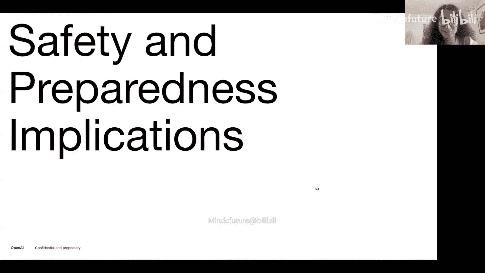

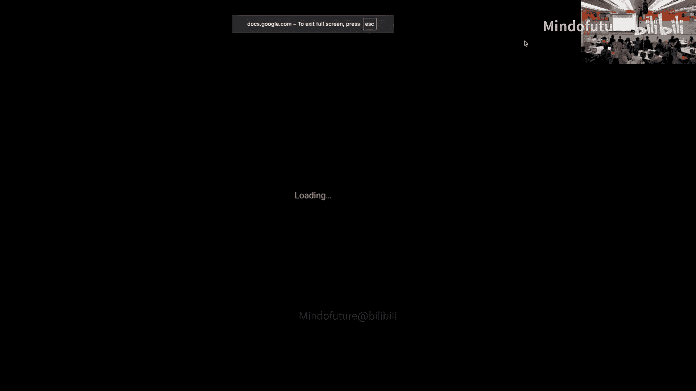

或者像……是的，我也没有什么深刻的见解，我不知道你们是否也读过尼尔·斯蒂芬森的《钻石时代》之类的书，但我觉得它描述了一个非常像反乌托邦的未来社会，非常和谐，有一堆奇怪的社会规则。有一个女孩在这个社会中长大，生活中的很多学习只是通过这本书来调解，这本书基本上就像我们现在看到的只是一本AI书，但它教她科学、哲学、如何思考生活和职业。一方面，这有点好，另一方面，这是我们能创造的最好社会吗？可能不是。我认为理想情况下，你希望人们是那些引导Shakkaia并成熟的人，而不是通过这个可能……是的，它只是像……一个正常的问题：你真的想要那样吗？我认为我们应该……是的，我认为我们应该非常深入地思考这个问题，我不知道具体是什么，但我们应该深入思考我们希望发生什么，并理解所有这些都不是完全有保证的结果，你也可以尝试让你认为会发生的事情发生。

是的，这只是提醒你们的另一点，我想我说过很多次了。我相信，那些身处其中的人会有所作为，无论你是在公司、学术界、非营利组织还是政府。如果你在AI领域或AI安全领域工作，你可以有所作为。我的意思是，有些事情可能是根本性的，也许有些事情在脆弱性方面是注定的。我认为没有什么能阻止它们，但很多关于我们如何使用这些能力的事情可能是路径依赖的，人们、公司、政府等的选择可能导致一种或另一种结果。我喜欢的例子是，据我理解，我不是历史学家，也许其他人是，印刷机虽然在中国和欧洲都发明了，中国更早，但它在帮助政府更好地治理或维持控制，还是实际上引入了像改革派这样的东西并颠覆权力方面，产生了非常不同的影响。这是同样的技术，只是使用方式不同。

我只是想知道，你们是否认为AGI（人工通用智能）和人工超级智能的想法是不可避免的，或者你们是否看到了一个世界，人们可能同意不追求它，而是追求人工专用智能，即我们创造只擅长一项任务的机器，然后尽可能多地增强人类，而不是试图追求这种人类替代的想法。

我很好奇其他人怎么想。对我来说，似乎相当合理，我们已经走了这么远，至少我们对一个可以自动化大多数经济上有价值工作的模型的理解，似乎会在中期未来发生。但我很好奇Boaz、Kevin和其他人怎么想。

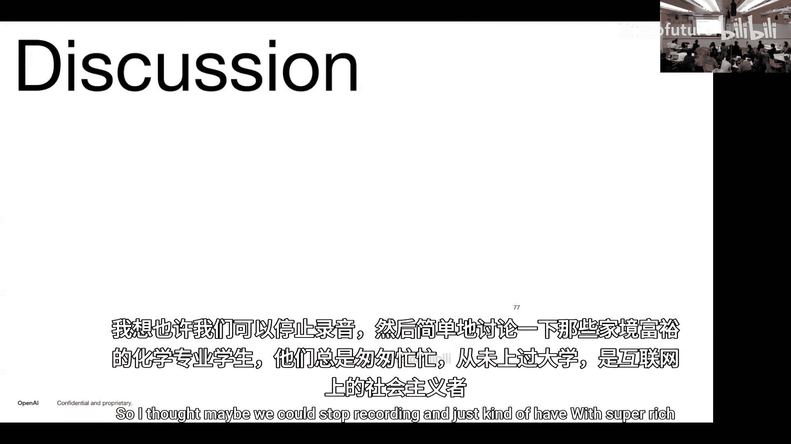

是的，我的意思是，我实际上认为这是不可避免的，除非我们遇到一些真正巨大的意外，比如一个我们不了解的根本性技术障碍。部分原因是我们从“苦涩的教训”中看到的。先验地，你不会期望我们今天拥有的最佳编码模型是在各种东西上训练的，