# 🛡️ 课程 P10：第 8 天 - MySQL 基础与 SQL 注入原理

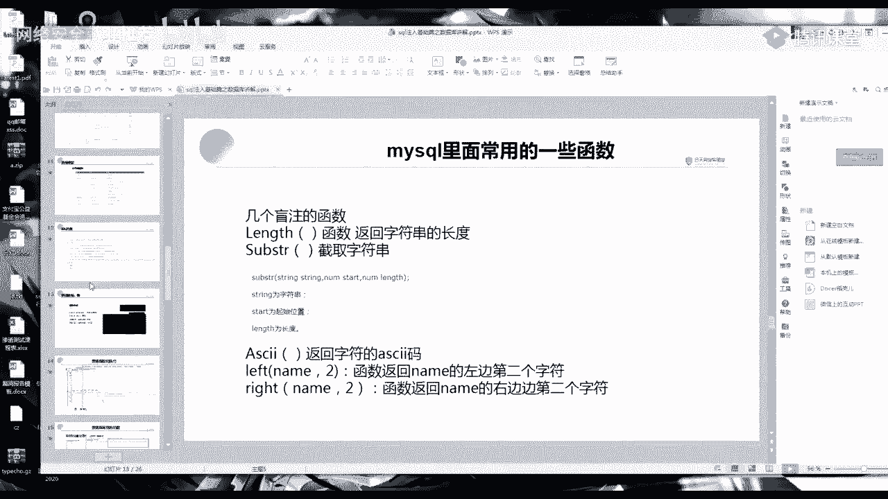


在本节课中，我们将要学习 MySQL 数据库的基础知识，并理解 SQL 注入漏洞背后的核心原理。课程的重点不在于记忆大量 SQL 语句，而在于掌握关键概念和操作思路，为后续的 SQL 注入学习打下坚实基础。

## 📚 概述：网站、数据库与 SQL

一个典型的网站结构通常包含前端、Web 服务器和数据库。当用户（或攻击者）通过浏览器提交一个请求时，Web 服务器会解析这个请求，并与数据库进行交互。数据库处理请求后，将结果返回给 Web 服务器，最终呈现给用户。

这个过程的核心在于 Web 服务器如何与数据库“对话”。它们之间使用的语言就是 **SQL**。

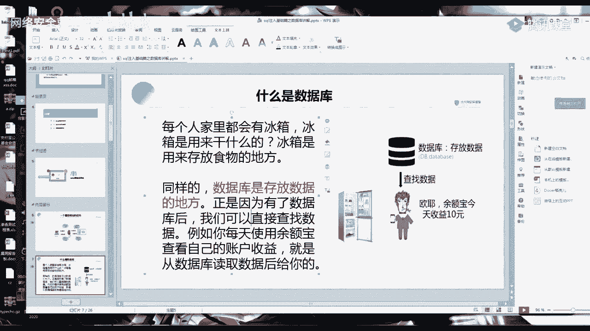


## 🗃️ 什么是数据库？

数据库，简单理解，就是一个**存放数据的地方**。网站的关键数据，如用户信息、文章内容等，都存储在数据库中。当网站需要展示或处理这些数据时，就从数据库中调用。

## 🔤 什么是 SQL？

SQL 是 **Structured Query Language** 的缩写，即结构化查询语言。它是用来**操控数据库**的语言。无论是从数据库获取数据、添加新数据、修改还是删除数据，都需要通过 SQL 语句来完成。

常见的 SQL 数据库有 MySQL、SQL Server、Oracle 等。虽然语法细节略有不同，但其核心操作原理是相通的。本节课我们以 **MySQL** 为例。

## 🏗️ 数据库的结构

理解数据库的结构至关重要，可以将其想象为一个层层嵌套的容器：

1.  **数据库**：最大的容器，对应一个项目或应用的所有数据集合。
2.  **表**：数据库内部的子容器，用于存储特定类型的数据（例如，用户表、文章表）。
3.  **字段**：表中的列，定义了数据的属性（例如，用户名、密码、邮箱）。
4.  **数据**：字段中的具体值，即实际存储的信息。

**结构关系**：`数据库 (Database) -> 表 (Table) -> 字段 (Column) -> 数据 (Data)`

例如，一个名为 `db_wa` 的数据库中，可能有一张 `users` 表。这张表包含 `user_id`、`username`、`password` 等字段。而 `admin` 这个用户名及其对应的密码，就是存储在这些字段下的具体数据。

## ⚙️ 核心 SQL 操作：增删改查

对于 SQL 注入而言，最重要的是理解以下四条核心操作语句，它们构成了与数据库交互的基础。

### 1. 查询数据

使用 `SELECT` 语句从表中检索数据。

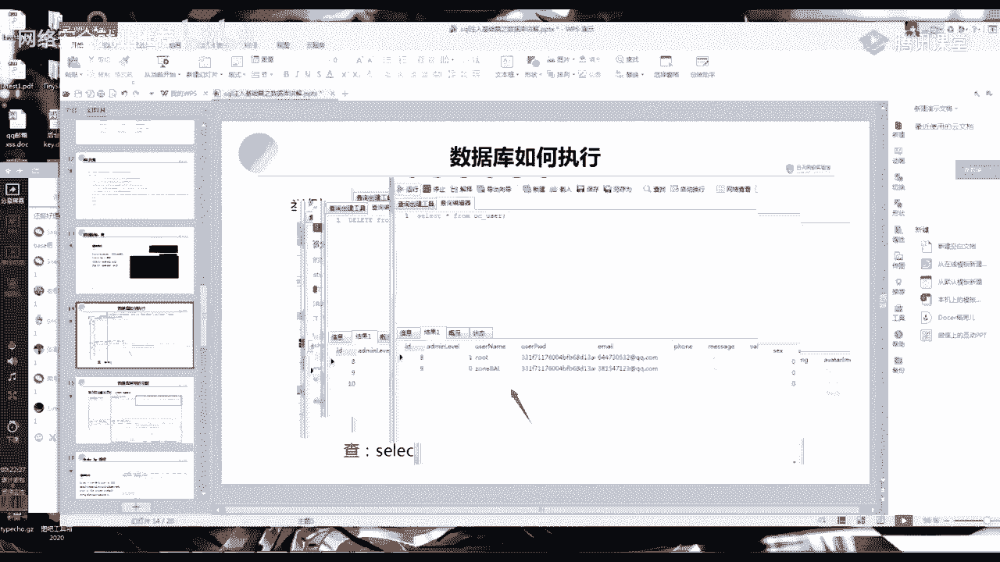

**语法示例**：
```sql
SELECT * FROM oc_user;
```
*   `SELECT`：表示查询操作。
*   `*`：通配符，代表“所有字段”。
*   `FROM oc_user`：指定从 `oc_user` 这张表中查询。
*   这条语句的意思是：**查询 oc_user 表中的所有数据**。


### 2. 增加数据

使用 `INSERT INTO` 语句向表中添加新数据。

**语法示例**：
```sql
INSERT INTO oc_user (id, username, user_pwd, email) VALUES (10, ‘test_user‘, ‘123456‘, ‘test@example.com‘);
```
*   `INSERT INTO oc_user`：指定要向 `oc_user` 表插入数据。
*   `(id, username, user_pwd, email)`：指定要插入数据的字段列表。
*   `VALUES (...)`：提供对应字段的具体值。
*   这条语句的意思是：**在 oc_user 表的指定字段中插入一条新记录**。

### 3. 更新数据

使用 `UPDATE` 语句修改表中已有的数据。

**语法示例**：
```sql
UPDATE oc_user SET username=‘new_name‘, email=‘new_email@example.com‘ WHERE id=10;
```
*   `UPDATE oc_user`：指定要更新 `oc_user` 表。
*   `SET ...`：设置字段的新值。
*   `WHERE id=10`：指定更新条件，只更新 `id` 等于 10 的那条记录。
*   这条语句的意思是：**将 oc_user 表中 id 为 10 的记录的 username 和 email 字段更新为新值**。

### 4. 删除数据

使用 `DELETE` 语句从表中删除数据。

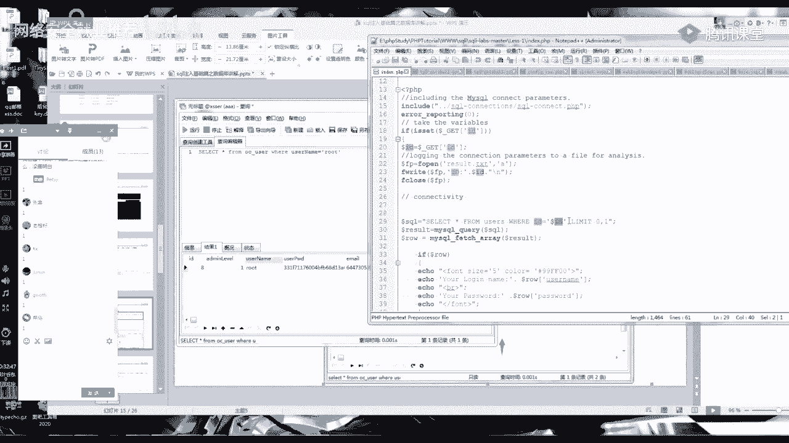

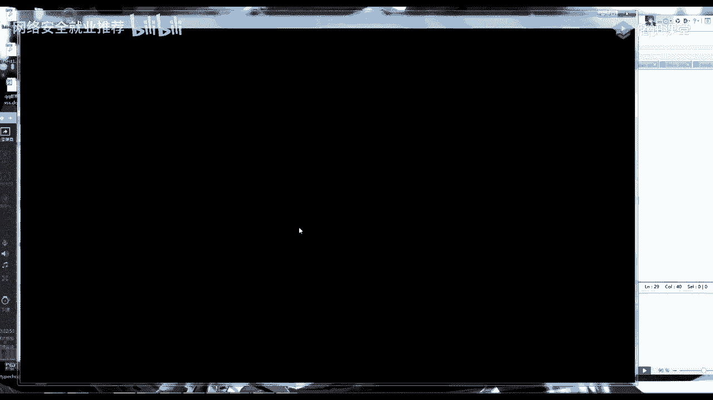

**语法示例**：
```sql
DELETE FROM oc_user WHERE id=10;
```
*   `DELETE FROM oc_user`：指定要从 `oc_user` 表删除数据。
*   `WHERE id=10`：指定删除条件，只删除 `id` 等于 10 的那条记录。
*   这条语句的意思是：**删除 oc_user 表中 id 为 10 的记录**。

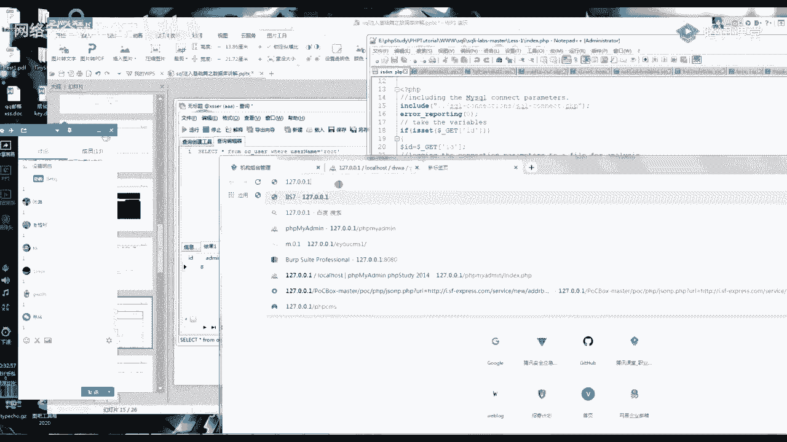

> **提示**：`WHERE` 子句在更新和删除操作中非常重要，如果没有它，可能会更新或删除整张表的数据。

## 🔗 联合查询与 SQL 注入的桥梁

上一节我们介绍了基础的增删改查，本节中我们来看看一个在 SQL 注入中至关重要的概念：**联合查询**。

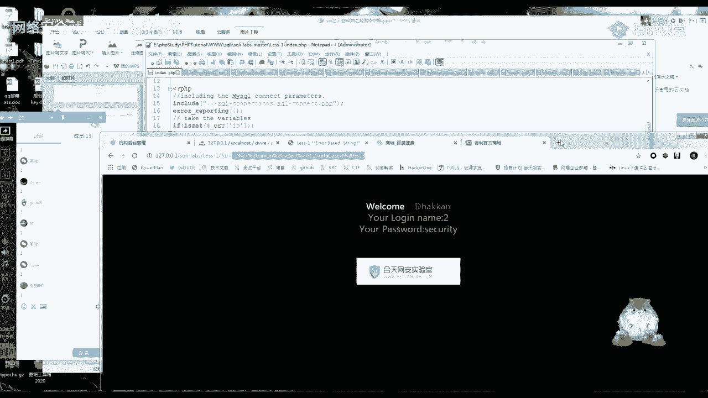

`UNION` 操作符用于合并两个或多个 `SELECT` 语句的结果集。关键点是，这些 `SELECT` 语句必须拥有相同数量的列，且列的数据类型也需要相似。

**语法示例**：
```sql
SELECT username FROM users WHERE id=1 UNION SELECT database();
```
这条语句会先执行 `SELECT username FROM users WHERE id=1`，然后将其结果与 `SELECT database()`（该函数返回当前数据库名）的结果合并输出。

**为什么这与 SQL 注入相关？**
在动态网站中，用户输入（如 URL 参数 `id=1`）常常被直接拼接到 SQL 查询语句中。例如：
```php
$sql = “SELECT * FROM products WHERE id = “ . $_GET[‘id‘];
```
如果攻击者将 `id` 参数的值控制为 `-1 UNION SELECT username, password FROM admin_users`，那么最终执行的 SQL 语句就变成了：
```sql
SELECT * FROM products WHERE id = -1 UNION SELECT username, password FROM admin_users;
```
由于 `id = -1` 很可能查不到数据，页面就会显示 `UNION` 后面那条语句的查询结果——即管理员账号和密码。这就是 **SQL 注入** 的基本原理：**通过控制输入，篡改原本的 SQL 逻辑，执行任意我们定义的 SQL 代码**。

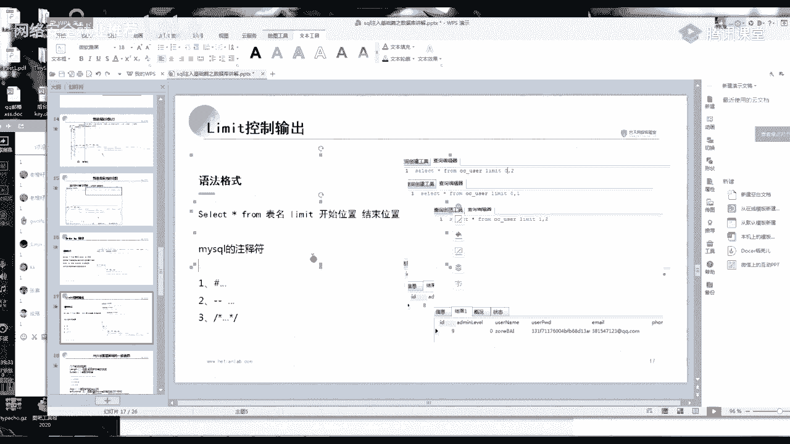


## 🧮 排序与信息探测

在 SQL 注入实战中，我们常需要知道目标查询具体返回多少列数据，这时 `ORDER BY` 子句就派上了用场。

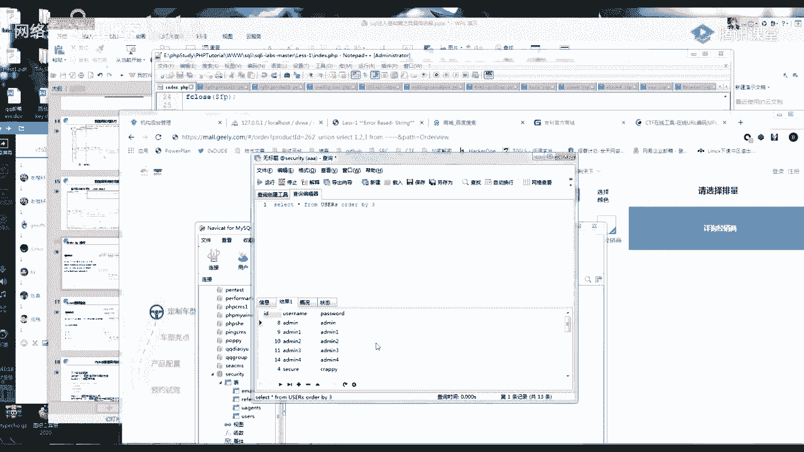

`ORDER BY` 用于对结果集进行排序。在注入中，我们利用它来**探测列数**。

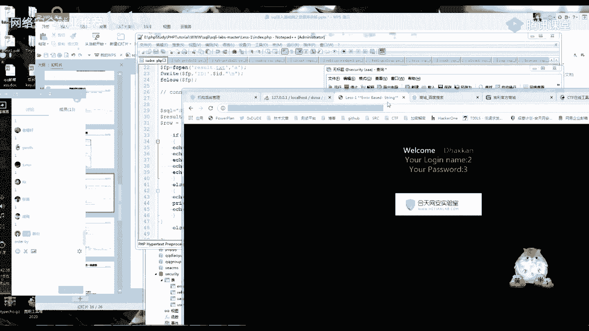

**原理**：
如果 `ORDER BY 3` 能正常执行，说明查询结果的列数至少为 3 列。如果 `ORDER BY 4` 报错，则说明列数小于 4。通过递增数字并观察页面是否报错，我们可以精确判断出列数。这是进行联合查询注入前必不可少的步骤。

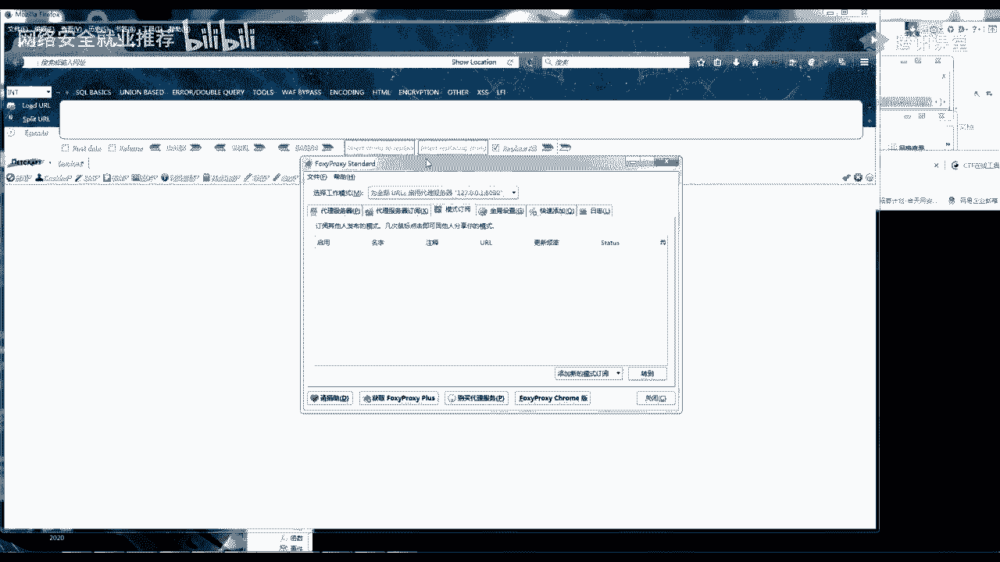

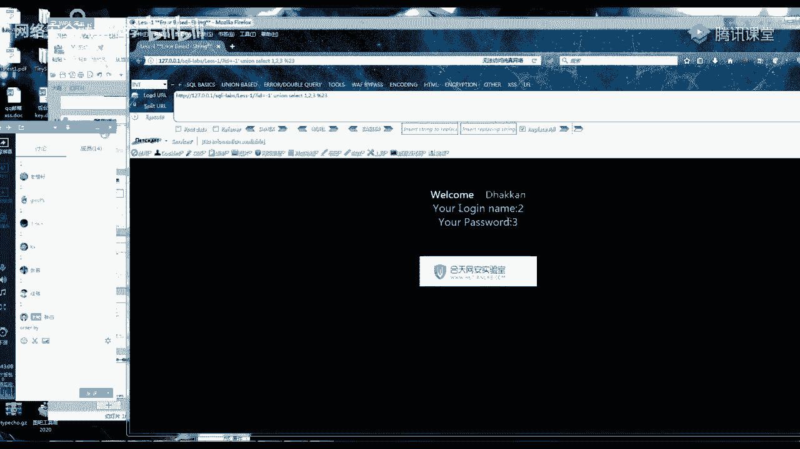

## 💬 MySQL 注释符

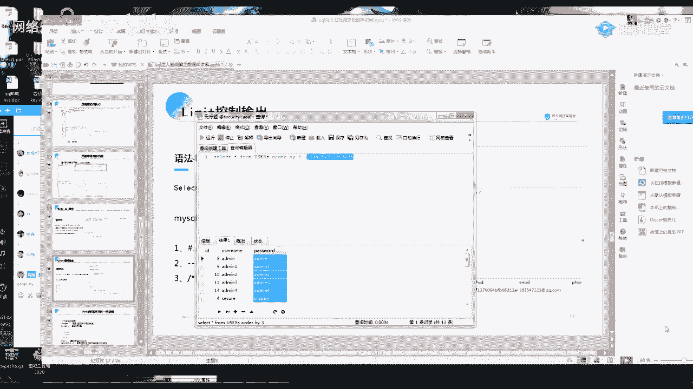

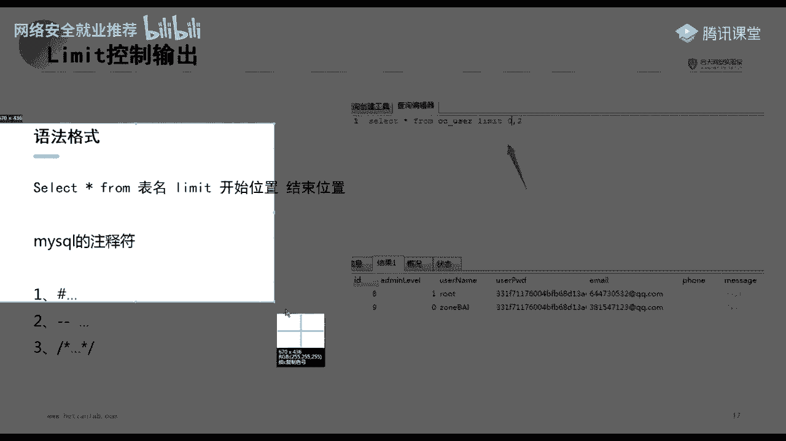

注释符用于使 SQL 语句的一部分失效。在 SQL 注入中，我们常用它来“注释掉”原始查询中我们不需要的部分，确保我们注入的代码能顺利执行。

以下是 MySQL 中三个必须记住的注释符：
1.  `#` ：井号，注释其后的内容。
2.  `-- ` ：两个减号加一个空格（空格很重要），注释其后的内容。
3.  `/*...*/` ：多行注释符，注释 `/*` 和 `*/` 之间的所有内容。

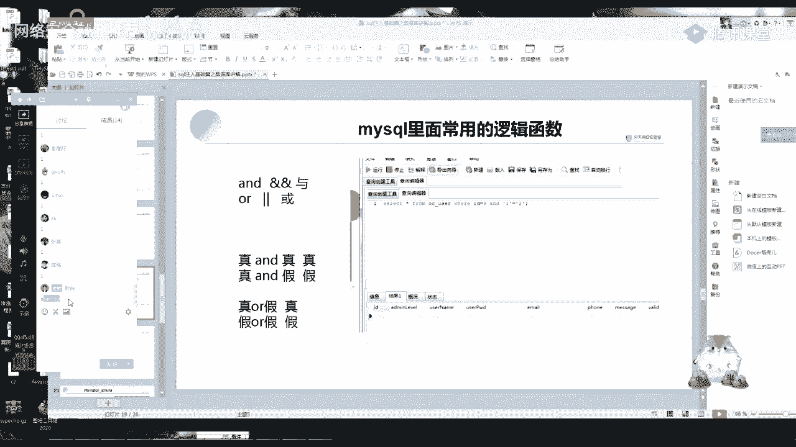

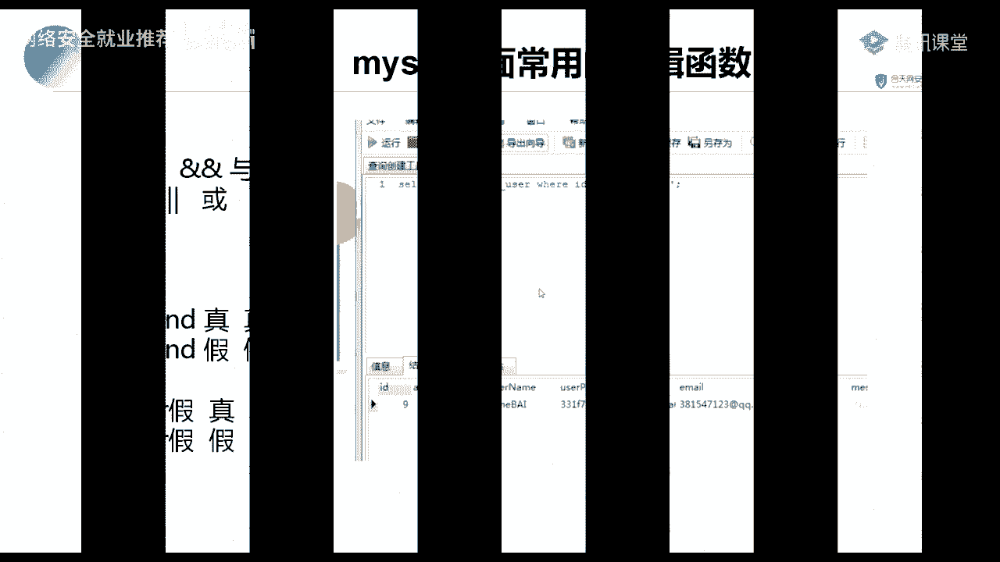

## 🗂️ 关键信息表：information_schema

`information_schema` 是 MySQL 的一个系统数据库，它包含了关于 MySQL 服务器维护的所有其他数据库的元数据（即数据的数据），比如数据库名、表名、列名等。

对于攻击者来说，这是一个宝库。在不知道目标数据库结构的情况下，可以通过查询 `information_schema` 来获取所有信息。

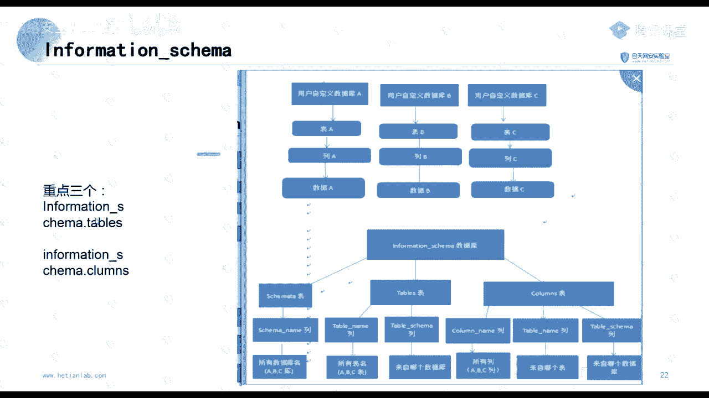

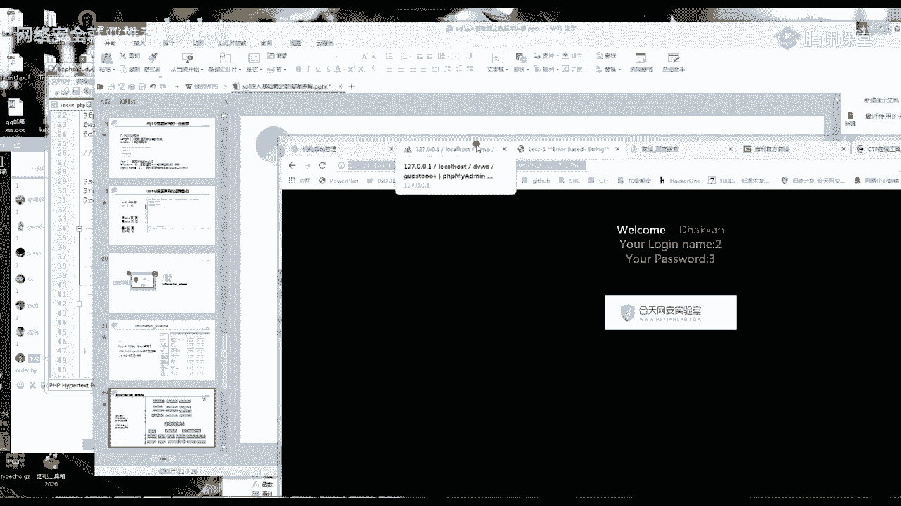

**核心用法示例**：
1.  **查当前数据库的所有表名**：
    ```sql
    SELECT table_name FROM information_schema.tables WHERE table_schema = database();
    ```
    *   `database()` 函数返回当前数据库名。
    *   这条语句查询属于当前数据库的所有表的名字。

2.  **查指定表的所有列名**：
    ```sql
    SELECT column_name FROM information_schema.columns WHERE table_name = ‘users‘;
    ```
    *   这条语句查询 `users` 表的所有列（字段）的名字。

掌握了查询 `information_schema` 的方法，就等于拥有了整个数据库的“地图”，可以据此进行精准的数据窃取。

## 📝 总结

本节课中我们一起学习了 SQL 注入所需的 MySQL 基础知识。我们首先了解了数据库和 SQL 的基本概念，然后重点剖析了数据库的层次结构。

核心在于掌握 **增、删、改、查** 四条基本 SQL 语句，并理解 **联合查询** 如何成为 SQL 注入的利用手段。我们还学习了利用 `ORDER BY` 探测信息、关键的 **注释符** 用法，以及如何通过查询 **information_schema** 系统数据库来获取目标数据库的完整结构信息。

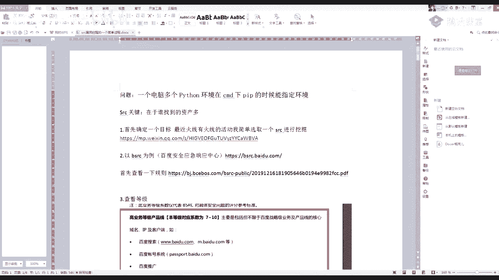

请记住，本课程的重点是**理解原理和思路**，而非死记硬背所有语法。建议将核心的几条 SQL 语句记录在笔记中，并在自己的 MySQL 环境中进行练习，这将为后续深入学习 SQL 注入技术打下牢固的基础。