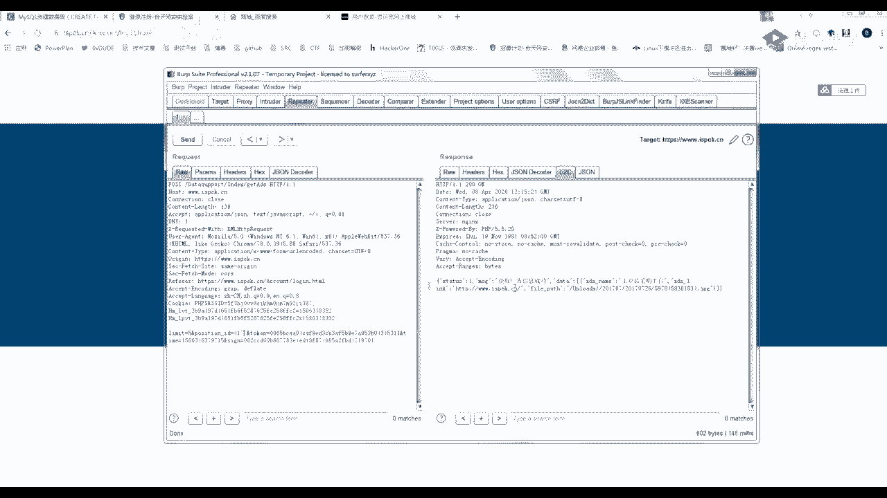

# P11：第9天：SQL注入漏洞-SQL注入简介与原理 - 网络安全就业推荐 - BV1Zu411s79i

给你们看一下这篇文章，还挺有意思的，看你吃的东西不能用啊，嗯腾讯课，咦，这里，找一个能转发的一个东西才行，嗯想一下啊，我都，过来，cat，这个，周末再去看吧，好像有点不太对，大概就是它是一个转发。

然后可以把这张图片替换成你们的一个自己，因为你们知道吗，访问xx那个指针探针就可以得到一个ip，然后我只要通过这个东西修改一下qq的xml，把这张图片替换成你的自己的一个地址。

就能获得别人的一个qq好友的一个电脑ip，然后通过ip啊，有一些什么ip定位啊啥的，一些东西就可以查到好友的一个大概位置，这篇文章嗯你们感兴趣的可以去看一下，我看了，我今天看了一下，感觉还挺有意思的。

看，啊c风，56嗯，还有四分钟，听会歌吧，不去爱才是浪费，做不对，没关系，你也不用给我机会，反正我还有一生可以浪费，我就是深深把一片编曲成多少我的优点，没关系，你也不用对我惭愧，也许我根本喜欢被你浪费。

就算我再去努力爱上谁，到头来也许白费，不如永远跟你耗来的快乐，对不对。

啊哈说抄网的话，可以给大家讲一下昨天的作业吗，现在还两分钟，简单讲一下昨天的一个作业，这里呢啊我昨天的gb t是已经89年了，可能他我忘了，简单的讲一下作业啊，因为他这一个昨天的一个课程作业是这样的。

昨天p p t的话也发给你们了，然后呢我后面还发了一个网址给你们，这里呢有一个mysql的一些基本的一些用法，挺麻烦的，然后我们就把作业做一下，他自己呢创建一个微博测试的一个测，数据库。

然后这里呢就是创建创建数据库，然后名字，微博测试看一下，可以看到这就创建了一个web测试数据库，然后呢我们进入这个微博测试，进入这个数据库，然后呢再创建一个表。

然后这个表的字段是admin password，user表，然后有一个命字段的，名字段的话给他当做一个字符，要看，然后一个password，给他一个印，他说的，嗯因为这个的原因吧，啊，有啥，这样。

诶他那个唯一属性是罗斯诺，是看一下，对不起，手贱了，cable对，然后我们看一下这个，说tabs它这里呢就一个u4 表，然后查询一下这个user，不用user，这里呢，因为我这里面是没有数据的。

所以他这里是admin和password是没有的，然后如果是添加数据的话，你毒死了死的命啊，我，好再来查一下，这样就完成了，然后这个课后作业啊有没完成的吗，或者哪里不会的。

待会呢我可以在群里面直接问一下，就是晚上我就把过程这个解发给你们，好然后开始今天的一个课程，就是昨天学完一个mask的一个基础，就开始讲一个sql注入的一个原理，其实我昨天已经给你们提过了。

这个柱的一个原理，接下来看一下，首先第一个是sql注入的一个基础，第二个是sql注入的一个利用，第三个是一个思路注入的一个实例，这个实例呢待会你们啊不要太急，知道吧。

下完课可能明天讲完之后会给你们一个实例，首先我们开始今天的一个课程，第一个什么是四个注入，在两三个柱子之前，大家可以看一下刺客猪肉，他从1998年开始嘛，就出现了，他这个收入的历史就是98年出现的。

它的一个根本原因就是因为把circle的代码插入，或者或者添加到应用用户的输入参数里面，进行攻击，然后再把这些参数传递给后台的思考服务，加以解析并执行，不知道昨天你们啊。

你们还记不记得我昨天讲的这个例子，我昨天讲的这个例子，昨天讲的一个例子是这样的，我这里呢有一个sql语句，然后我这里用户输入，这个是用户输入的一个参数，就是你输入值的一个位置。

然后他没有对这个进行一个过滤，那我把这个id变成一个嗯，昨天的一个联合查询语句代入到这个里面，这个sql语句就发生了一个变化，违背违背了它原本的意思，它的原理就是这样啊，其实很简单，你们就是用理解。

啊因为你就这样想吧，你之前的一个xss，是不是，就是我把系统把我用户的输入的值，当成了一个html的一个代码，所以呢就继续就发生了一个xxx，那我这个思路注入呢，是不是就是因为把我这个用户输入的值。

变成了一个sql语句，进行一个执行，那就会变为雷克斯的输入原理都是相通的呀，后面的漏洞也都是一样的，首先我们来看一个简单的一个拓扑图，就是我们在对一个网站进行一个查询的时候，昨天也是讲过了的。

这是我两个正常的用户，对我的网站进行一个查询，然后这里呢是我的一个黑客啊，也就是说比如说是我我对一个网站的一个查询，它中间呢就有一个过程，我客户端a对网站发起一个请求，网站上接到这个请求。

就把这个请求放到数据库里面去，然后数据库就会返回这个请求，我们来看一个具体的一个过程，首先啊从这里来听就比较简单啊，首先我要查看一个用户id为36的文章，对不对，就像我昨天的啊，我找一个文章好吧。

比如说百度文库，我百度文库呢我要查看这一篇文章，他这篇文章的一个id就是这个东西。

然后呢，我们来看是不是来看。

我要查看这个id为三顺的文章，是不是就要请求我的一个网站，发起一个这样的一个请求，查看36的文章，然后呢我这一个就得到了这个i d为36，然后就构造一个参数，查询这个文章里面id等于36的这个文章。

就是查询这个表里面的，这个id等于36的文章，然后呢，他接到这个，就对我们的一个数据库发起了一个请求，那我数据库接收到这一条思考的一个请求，是不是就会返回一个id为36的一个记录。

也就是我们刚刚在这里执行的一个user，然后vd等于a，他的命在这，啊引号add me等于它就返回一条这样的一个句子，数据库就返回了一个这样的一个结果，对不对，然后呢，数据库呢就把这个反查询到的结果。

返回给我们的一个网站，然后网站就把这一个结果进行一个编码处理，然后再返回给我们的客户端，然后呢就把这一个展示发给客户端，发发给一个用户，对不对，这里呢就是一个正常的一个逻辑。

正常的一个四风引擎的一个逻辑，这个啊明白的话，你们就扣个一好吧，这边还是好理解的，嗯有几位同学不理解吗，3456，嗯好ok，那这个呢我们的过程就它的一个返回的一个过，程，就是这样对吧。

还是回到我们的一个一定要记住自己的id，就是36，那我们来看代码，他是不是跟这个就很像，跟这个就很像了，然后我自己的id没有进行一个过滤，那我在这个id的这个地方进行啊。

输入一条我们第一节课学的一个sql语句，就是联合查询语句，然后呢这个sl语句就会发生一个变化，那就会执行我们一个自己想要的结果，自己构造的一个结果，它有一个设置注入的产生过程，就是这样的。

有没有对三个注入产生的过程不懂的，我觉得应该很简单了，不懂的你就扣个二出来呀，懂的你们就别管了，等十秒钟，呃你是懂了，扣一是懂吗，那我们的一个四个注释产生的一个过程，就是因为我这个输入的这个地方。

它没有进行一个过滤，那我们怎么进行一个利用呢，对不对，或者我这个搜狗输入有什么用呢，首先我们来看一下sql注入的一个危害，这个注入呢常见的就是获取一个敏感数据啊，我们最常用的是获取一个敏感数据。

然后当它权限购的时候，可以对文件系统，然后对注册表这些进行一个铁路，但是一定要记住啊，一定要记住一个点，大部分是获取一个敏感数据，在文件系统操作跟注册表操作，这些都是有条件的，我后面会告诉你们。

我们反正现在的目标就是获取敏感的一个数据，这个执行命令的话嗯要求也很高，到时候后面会跟你们说，嗯好，我们首先来看它一个四个注入的一个过程，就是我刚刚啊刚刚跟你们讲的一个过程，就是我这个数据的这个参数。

改成我们的一个sql语句，然后呢，这个服务端就把我这个sql语句，代入到数据库引擎里面，然后这个数据库，因为数据库它只会接受这个sl mini嘛，我不管你是谁，反正我只会接受这个四个命令，然后执行。

然后就把这个结果返回给服务端，然后服务端再回到客户端，都是很简单的一个过程，就是跟我前面讲的流程完全是一模一样的，那重点是，我们怎么来实现这一个sql注入的过程呢，对不对，首先我们来看。

sql注入的一个方式，set注入，首先通过一个注入的一个方式，分为了get注入，post，注入cookie注入，我们先来看它的分类，它这一类是什么意思呢，我们打开我们的一个bp，bp呢我们首先来看一下。

就是类似这种，这种我直接请求，我这种直接请求，看到没有，他这一个请求的参数，在这个文图这个地方，它就是一个get请求，再给你们讲一次，tm的，还有烈士都讲过的吧。

然后他post请求呢就是它的这个用和田来演示吧。

就比如说我们登录的时候，登录的时候，你可以看我们这个页面是没有发生变化的，但是他这里呢又发起了一个，账号密码的一个请求，它就叫post请求，get和post请求的一个变化。

就是唯一变化就是get的一个请求参数，在这个位置，pos在这个底下，然后cookie呢同样的很简单，就是之前给你们讲过字段吗，ht html的一个文件头，他那个注入产生在这个cookie这个位置。

就叫cookie注入，然后还有一个叫head投注，有个叫head的投注，他害者投注呢就是出现在我这一个啊，这个害者头里面的任意一个字段，其实他就分类很简单，你们不用管那么多，他就是出现在哪个点。

它就叫什么注入，出现在哪个位置，然后注入的方式呢就会有一个回血注入盲注，二次注入，报错注入堆叠注入宽字节注一大堆一个东西啊，这里呢啊你们也首先了解有这个东西，我后面会一个一个给你们进行一个解释。

就是他这个是什么意思或者怎么操作，后面的课程都会讲，我们接下来看我们学sql注入的一个目标，是不是为了找到他的注入，对不对，然后我们来看一下它的一个原理，首先我们来把sql注入的原理再来看一遍啊。

sql注入的一个原理，就是因为我们的这个id他没有进行一个过滤，然后就把这个sc语句传到数据库里面了，进行一个执行，对不对，然后我们在啊玩这个数据库的时候，是不是发现一些问题啊。

就是我这一个数据库语句稍微有一点问题，他都会给你报错，对不对，就是我稍微有一点写错的地方，比如说我这里少一个东西，稍微有一点点写作的地方，这个sl语句，那我数据库都会报错，对不对。

然后你想一下我这个数据库报错之后，那他会不会同样的呢，同样的会把这个报错的一个形式。

返回给我们的一个客户端呢，以这个为例，比如说我随便输入一个单引号诶，他报错了，那就是不是说明我这个单引号，代入到我这个sl语句里面去了，因为我只有带入到我sl语句里面，他才会报错。

然后就导致了他这个sql语句不完整，然后数据库报错，这一步有没有不懂的不懂的，现在马上敲这一步，一定要让你们理解，懂得扣个一，不懂的，扣个二好吧，还是，嗯好啊，你们之前应该也是有进行一个预习的。

也就是说我这个单引号，肯定是带到我这个sql语句里面去了，那就说明这个位置有错，有四个注入，对不对，所以我输入单引号让他报错。

是不是就是一个检测四个注入的一个办法，对不对，给你们看哪个类型这个网站呢啊不是靶场啊，是啊，某一个比较隐蔽，某一个特殊的一个站，你可以看我输入单引号报错。

然后或者我输入一个反斜杠，因为反斜杠有一个转移的意思吗，就是让我这个符号失效，他也报错，那是不是，然后我再输一个诶，他没有报错了，再加一个他又报错了，这里是不是就可以肯定。

我这里有一个sl注入了，所以呢我们在测试和柱子的时候，最简单的办法就是我这里有一个参数啊，比如说我随便找一个位置啊，随便找一个地方，随便打开一个网站吧，随便搜搜什么呢，上城对吧，随便搜个商城。

啊然后我这里呢就有一个抓包，沙发的志玲啊，抓到的这里呢就会有一个就是我们点一个嘛，随便点一个点一个几桶油，看一下请求，再点击随便点一下啊，加入购物车，获取广告成功没有upload。

就例如这里呢我如果我输入一个单引号，看他会不会报错，看到没有，它这里有防火墙啊，它这里有防火墙，卧槽，我以我以为有四个注入了，我以为直接就这样注入了，没这么巧吧对吧。

就是如果我输入这个单引号，他这里呢报了一个错误。

类似这样的，那我就可以肯定他有一个设置注入，所以我们在检测的时候呢，最简单的办法就是我遇到每一个点，我都去进行一个，我就随便加一个单引号进行一个判断，每一个请求我都去判断一下，手工注入就是这么麻烦。

好然后我们继续看啊，就还是以这个为例啊，我找到了这个四个注入之后怎么办呢，怎么办，然后还有一个判断的一个例子啊，这里是真实存在的一个网站给你们看，我首先第一个这是一个有回血的嘛，你这里报了一个四个注入。

它发生错误，这一点大家都知道，那我遇到盲注的时候怎么办呢，就是大家看我这个输入呀，我这里啊是一条正常的查询语句，对不对，我在这个地方加一个单引号，你有没有发现它这里发生了一个变化，那我再加一个单引号。

有没有发现诶跟这条一模一样，那这里是不是就可以说明一个问题，我加一个单引号，他报错了，然后我再加第二个单引号，他把sl语句进行了一个闭合，然后他就回想正确，那它是不是也是存在一个sl注入漏洞。

这一步有没有不懂的不懂的，马上扣个二，懂的话，你继续扣个一啊，你们这居然全都懂了，那就好办了，那我们作为一个啊叫什么，作为一个刚入门的黑客，找到漏洞还是要会利用的，对不对，首先这里呢啊还是给大家看一下。

就是它注入的一个位置，最多的其实就是一个参数值的一个位置，参数名位置啊，啊就比如这些我是我是很少遇到呀，我遇到的更多的都是这个值的位置，试一下啊，没有什么用，诶他们这个就有意思了，你看到没有。

他们这个输入单引号，它这里会进行一个拦截，但是我输入两个单引号，他也不能接，输入三个单引号，它也不能接，他们这个写的有问题啊，那我们哪些地方会存在输入呢，就是参数名，cookie，目录名，文件名。

一切都有可能吧，主要是看他那个程序怎么写，但是我们是一个黑盒测试啊，黑盒的话我觉得要大家要讲究一个效率，就很简单，我就看到一个包，我就去加个单引号测一下，有中路就有中路，没注意就算了，没注意就立马过。

这个包我就不看了，然后那我们正常来说怎么去获取一个注入呢，主要有两个方式，第一个就是自动化，用工具自动化范围广，效率高，但是呢它误报还有测试方法都很有限，第二个呢就是手工测试。

它的一个优点就是测试方法灵活，缺点就是效率低，范围窄，然后根据水平而已，我给你们的建议呢就是嗯手工测试比较靠谱吧，然后哦不对，测s r c手工注入比较靠谱，但是跑普通的这种战啊，比如说嗯你们某个学校呀。

或者什么东西的a w vs会给你们机体，就跟你们说，当然啊你必须要在有授权的一个基础下，才能进行一个渗透测试，不要搞事情，然后我们就来看一下，我如何去找到一个注入呢，啊我记得有给你们有一个那个叫四。

你们来打开这个地址，发群里面了，打开这个地址，这里呢就有一个注的一个网站，当然这是一个练习网站了，我们做一个简单的一个判断了，就像我刚刚教你的，如何手段进行手动进行一个判断，比如说我输一个单引号，报错。

我是个双引号哦，他这里是因为没有这个单引号的，所以不需要闭合，他这直接报错了，反正你记住书单以后或者其他的一个字符。

它如果出现了这一条四个注入就是sl错误。

什么东西，什么东西它就百分之百存在一个适合度，记住是百分之百，百分之百是那个守住，那我们如何进行一个测试呢，待会儿讲还是啊还是同样的，先看一下这一个漏洞依据，刚刚我也给你们讲了呀。

他首先依据就是看你这个结果，有没有成功被数据库引擎执行，因为我们知道吗，只有sl语句它不完整的时候才会报错，那我一个正常的一个微博程序，pad sl语句肯定是经过很多次测试的，百分之百是对的。

只有在我只有在我这一个用户输入的这一个，输入的这个参数的值，被这拼接到了这个sql语句里面，并且生效了，然后是那个sql数据库他才会报错，所以说我这个构造测试语句，就是我们刚刚的单引号提交请求。

然后分析一下他这个返回的结果，如果符合预期的，就是实在是个输入，符合我们这一个报错，那就是一个这个注入，还是同样的今天一个重点，那我怎么进行一个利用呢，就是一个整个的一个流程，大家来看啊。

首先第一个用单引号报错，有注入，这个是刚刚看到的，第二个就是运用一些逻辑语句，and一等于一或者and一等于二，and一等于一是什么意思呢，我们在这里来看还是同样的这一个我们and好。

我们首先查询一下id等于一，他这里呢是不是出了一串数值，我们and一等于一加个13%，可以看它这里and一等于一，是不是没有一个变化，然后我们and一等于二呢，诶他是不是这里就没有出现一个数值了。

这里是为什么，有人知道吗，有人知道的话，在上面啊，挑一下对了的，我给稍微给点福利，到时候，为什么对and一等于一and一等于二，就是因为1=2是错误的，对1=2是错误的，那你想一下。

还记得我第一节课给你们讲的吗，and它是真啊，真and真，他还是返返回真，一甲机甲没错，待会上完课给你们，稍微给你们一点点福利，所以呢这里呢就是不是肯定可以说明，我这里有一个and一等于二，他被执行了。

反正呢就是要在数据库里面执行，这一个逻辑语句。

它才会有这样的一个结果，对不对，要在数据库逻辑语句里面，然后类似这种and的啊，饮酒啊，什么什么东西相乘啊，这种都是为了绕waf啊，就是不常见的好，我们判断了一个输入之后。

还是用这个suki level来进行一个算算，我们首先判断了一个错误之后啊。

我们是不是要进行一个闭合，你们在学xs的时候是不是学过。

就是我要先闭合前面那个标签，我后面的xss语句，它才可以进行一个执行，对不对，那我是个注入，同样的，我要先对前面的一个语句进行一个闭合，我们来看这个语句是什么样子的。

我这个语句我这个id是不是前面有一个单引号，那我这里呢是不是要加一个单引号，跟前面的进行一个闭合，然后我在goodbye，三加一个23%，就是我们的一个井号，我们来组合一下，那他的这个语句。

是不是就变成了一个这样的一个语句，我们传到这个程序里面，它程序就变成了一个这样的一个语句对吧，那它就会执行前面这个id等于一，然后后面就old by 3，这里呢是一个还记得跟你们讲吧。

我就是跟你们说这一个省略的一个朱式服，一定要知道这个注释符的意思，就是后面这条语句都没有用了，后面这条语句直接就消失了，没有用，那他是不是就变成了一个这样的一个语句，goodby 3，嗯等一下啊。

这里因为有个处理的一个过程，得用百分号，那他是不是就成了这样oby 3，那我然后我by 4，是不是就后面变成了一个，因为他只有三列嘛，我昨天给大家讲过，old by是查他当前的这个表有几列。

它这里有三列，然后就进行了一个报错，然后呢我们再查询你一个表，就是我要查询我这个当前的这个表，当前这个数据库的这个表是什么样子的，首先我们来看之前说过，这个despss是一个表的一个名字，还是同样的呀。

这里我给大家看一下oby 3，你先记住流程，oby 3，正确by 4错误，然后呢你就在这个地方输入联合查询语句，123，输入联合查询语句123，嗯前面要用个-1啊，为什么要用-1呢。

首先我给大家解释一下，这里必须要给你们解释啊，首先你要知道我如果是执行一个id等于一，然后加上一个联合查询的u n i n123 ，那它是不是会有两个结果，啊我还是用我的那个，ncs给大家看一下。

它这里面是u s表进行一个查询，好我们，我们进行一个查询啊啊按照它的一个语句，服装id等于，然后un i n等级一，然后后面一个井号再带上这一块，最后的句子是不是就是这样子的，我们运行一下。

而是不是可以发现这里呢有两行数据啊，就是他查询了两行数据，对不对，但是为什么我这里只显示这个d，前面这一行只显示这个数据呢，那是因为我这里写的就是echo一个roll。usn，它只能显示一行，懂吗。

就是我这个web程序的显示位只有一行，那我查询了两个数据，我也只会把最前面的这一行显示给大家，那我查询一个id等于-1呢。

因为我-1不存在，所以呢我这里呢就是变成了id 123，那我这里加个-1 z呢，就变成了id 2，id 3，自己能理解吧，能理解的话，继续扣个一，马云要考试，嘿嘿溜了溜了。

他就是因为vivo的这个显示位只能显示一位，嗯好，如果还有不理解的，你们可以在qq群问我，或者在群里面进行，大家进行一个讨论，进行一个讨论，这里呢就是二跟三，那我们尝试一下，把这个二变成一个。

就是查询我们的一个数据库的一个名字，那他这里呢是不是就会显示这个数据库的名字，然后我这里的二，我在这里把二改成，这里没，那我自己是不是数据库的名字就这样出来了，对不对。

所以呢它是个输入的一个简单的一个过程，就这样，那我们再来查它的一个表，啊我们直接call吧，懒得敲了，虽然我给大家来解释一下这个句子，嗯还是在这里来进行一个执行，大家看一下这个句子啊。

为什么我这里要用这一个，你有一个错误，诶他不能跳出去吗，run user啊，这里少了一个联合查询，我们首先来看一下啊，我们首先来看一下这个句子呢，在这里面执行是什么意思啊。

然后还有一个这个group combat有什么用，我们首先来看group contest呢，他就会把我这个tb的这个表的名字，全部给他列出来，我把它去掉试一下啊，我把它去掉，我把它去掉。

它这里是不是就变为了一个四行，对不对，就是我不加这一个rob concrete，它就是变为了四行，我刚刚给大家讲了。

他这个微博的显示位只有一行，所以呢我这里呢不加，我只能查到他的一个表，我只能查到他的第一个表就是email这个表，那我加一个gram contact，你们来看一下它的一个查询语句。

他就会把所有的表都进行一个输出，所以呢他的第二步就是查我们的一个表，因为我们开始数据库已经查了。

然后数据库查完就是查表，然后呢你看你觉得哪一个表啊。

有比较有可能性啊，就是有敏感信息，肯定就是我们的一个user表，对不对，那我们接下来就是查这个user表里面的一个列。

好，我们来看一下这个语句，查询这一个列的这个名字，在昨天，昨天我让你们理解的这个mask的一个大表，然后while这个tab on等于这个user，就是查这个user这个表里面的一个列，我们看一下。

那他是不是这里就把我们的一个列，它给查出来了，因为这个类比较嗯，那个呀还是同样的给你们在这上面看，就是这个结果，这个列，我们通过这个cut看一下我们的一个优势表，预测表你可以看它有数据的，其实就这几条。

但是呢我们的一个列啊，我们查一下它等于，一个呀，id username password。

诶他这个怎么啊。

有这么多东西啊，他这个列，正常来说不就啊，这是他嗯。

他只有三个列啊，那为什么我这里查出这么多东西呢。

有点奇怪啊。

啊反正到时候先略过，待会儿我再看一下，这里呢我们肯定要看的就是这里两个东西。

第一个，看一下源码id password，这点就是usman跟password，话说他这一个列的东西有点多呀。

我都感觉我是不是哪个地方查错了吗，哦我想起来了，想起来了想起来了，等一下啊，因为我有很多叫user表的这个东西，就是我的数据库里面不只有这一个user的一个表，达，我的数据库可能跟你们不太一样。

我有很多很多的一个数据库，不是不是这个表，而是我我电脑里面有很多的这个数据库，懂吗，因为我这是一张大表，大家懂吧，这是一张大表，然后我那张大表里面呢有很多叫usas的一张表。

就是我其他数据库里面也有一张相同的名字。

然后他就查询出了这么多的一个东西啊。

我们用这个的话就简单明了嘛，我那一个我买个东西太多了。

比较尴尬，-1，然后用这个在线的，你可以看这里呢就是id username password，我才相信我，数据库里面奇奇怪怪的东西太多了呀，啊你可能可能看我这里呢。

你们也会有一个usx的一个表或者哪里去了呀，反正就因为我的库里面东西比较多呀，正常来说你们看到的应该是id username password，然后后面就更好查了呀，正好查了。

那我是不是就查一下我这个值就可以了。

就是uc name password的这个值不是uc。

然后就可以查到我这一个，查到我这个表的一个信息，然后我这个预测表里面的一个账号密码。

是不是就查出来了，那你如如果你想一下我这些个正常的一个网站，正常的一个用户登录网站，那我把他user里面的一个表给他查出来了，例如这是一个admin用户啊，然后我就admin admin直接登进去。

那是不是就成了他这个网站的管理员了，假如啊这是假如，那我如果成为了一个，加个tab设置对，我查了其他数据库的一个表，啊我看一下啊，对然后再加一个条件就可以了，就是我再加一个条件啊。

我再加一个条件，就是我这一个叫什么去了啊，再加一个那个，再加一个那个叫什么来着哦，再加一个那个数据库，数据库等于当前的这个debus。

那我就可以进行一个查询了，待会儿给你们看一下，那么这样的话一整套的一个流程他就走下来了，我们再来回顾一下，首先第一个判断一个sl注入点，然后第二个就是判断它的一个字符还是数字，其实就是进行一个闭合。

把我这个4k语句进行一个闭合，第三步开始就是正式的一个查询，order by把它的列数报出来，然后用debu把他的一个数据库名字给报出来，然后第五个就是把它的一个表的名字给报出来，用这个东西查询。

第五个呢就是进行一个爆裂啊，它这个的话，看一下啊，不要太不，主要是你那里面东西太多了。

vr vr好像是可以加两个贝尔吧。

看一下啊，and嘛。

ok你看我加了一个条件，这样的一个当前数据库的一个条件，我如果过多了，那我就再加一个条件嘛，我多加几个条件进行一个判断就可以了，这个能理解吗。

能理解的话，你扣个一待会儿啊，我们再用这个东西进行一个演示，你就假如说假设这是一个网站，这是一个网站，然后呢这是一个靶场，就是我们的一个网站，让我输入一个账号好，他报错了。

那我知道他这里有个四个四个注入，然后其实你可以看了，就是我不看这条sl语句啊，你可以看到这个思考错误里面，它会返回你这一个错误的地方，就是它会返回你这个位置，你哪个地方错了，就例如这里我多了一个单引号。

那你有没有发现他这个错误，就是我这个单引号没有进行一个闭合，因为这边多了一个单引号吗，这边没有一个闭合的，对不对，我再加一个诶，这边三个单引号，这边还是没有闭合的，那我是不是就不要打引号。

你从这个语句里面就能看出来，那我知道注入之后好，我这个不需要闭合，然后我就good bye，三，o by 3没有报错，goodby 4，他报错了，然后我这个地方是不是就输入我们的联合查询，123。

这里呢跟你们说了，就是一个显示位的一个问题，我加个-1，这里呢就变成了二跟三，然后呢我就开始进行一个查询，它的一个库名叫什么名字，正常来说我都不需要查呀，因为这个debu这个可以代替它的一个数据库明。

他这个可以代替它的一个数据库，没有可以看到我们的这个数据库里呢就叫和田，然后呢我们又开始进行一个查询，查完数据库呢，是不是就要开始查表了，对不对，查表就是，50呢直接哭吧。

发表呢你可以看就是我们的一个tnt，然后呢就去这个information这个代表里面进行一个查，这个百分之30 23%，就是你们记住这个23%或者景点空格，这个一定要有一个习惯性的一个动作。

就是我一定要带上注释符，不管它有没有一个，后面有没有语句，然后百分之20 300分之二十三，其实就是井号呀，一定要有一个习惯，就是我自己给他带上去，报完表嘛就还是爆裂，跟刚刚的一样，昨天的语句还记得吧。

如果昨天语句不记得，你们就啊反正就练把这三个语句给记好，你如果会了这三个语句，你sql注入，后面我讲的所有的sql注入都是围绕这几个语句，都是围绕这三个语句来的，也就是说sl注入，如果你理解这三个语句。

我就可以把所有的sc注一个原理啊，包括其他的我都给你们讲通，全部都能理解，待会儿课后作业，我会给你们布置，就是啊你记住是什么样的一个理解啊，就是包括我每一条每一条语句。

它比如说我这个group come cat是干嘛用的，我这个负重是干嘛用的，然后我这一个为什么要这样做，如果你能理解的话，整个四个柱子都通了，戴耳朵后面给你们看。

所以呢我们的一个社会注入过程就是这样判断，然后闭合爆裂，报库名报表明报列名报纸，跟我们数据库的那个表的结构是一样的，我是数据库，然后数据库底下有表，表底下有列，列底下有数值，所以说它的一个原理就是这样。

还有一个利用过程，再总结一下数据库的一个四个注入原理，就是因为把我们这个代入的位置，就是程序没有写得好，把我们的一个查询语句直接变成了sl语句，进行一个执行，然后过程就是这样好。

今天的课程呢啊就是到这了，待会下课我会把这个ppt发给你们，然后会给你们一点实力吧，实力给你们做，然后今天哪个课后作业，就是把我的这个，把这个网站的四个注入给我做出来，照着我pp上面的步骤做就ok了。

然后理解每一步是什么意思，大家记得交文档，也班主任好，今天课程就到这儿，待会儿下完播。

