# P12：第10天：SQL注入漏洞-联合查询注入 - 网络安全就业推荐 - BV1Zu411s79i

之前没有啊，别人没发现，之前嘛，基本上可以把所有的一个杀软全部都过了，可以给你们看一下最近的这个病毒的一个小写。

可以看，火龙有了之后，显性，最近也是比较火的呀，而且好像就是嗯就是国内的人写的，你看到没有，这里是一个伪装，他是个什么激活工具，所以你们在这些什么鬼啊，下载站上面下东西的时候也得小心一点啊。

kms激活工具，系统重装了360qq防护都不执行后续代码，还是挺有意思的，嗯还有三分钟，还有三分钟切换到今天的那个题目，讲一下吧，昨天有个客户作业，首先的一个课后作业，哎呀就是这个其实他昨天这个qj啊。

你可以看，跟我今天要讲的前面这一段基本上是一样的，是我把你们昨天做的，基本上把这一块已经讲完了，别看，但是为什么我还要讲呢，就是我要把这一个，把里面的这个跟后面的一个报错注入呀，包括盲注呀。

宽字节注入这一块全部都给你们串起来，这个哦，因为我还没有看你们那个作业的提交情况啊，班主任那里应该基本上是差不多的，这里有要解要讲的吗，这个作业还是讲一下吧，虽然讲了很多遍了。

这个课后作业就这里报错报啊报错，然后呢在这个地方进行一个闭合，他这四个语句都可以看到了呀，发现嗯这里根本就不需要进行一个闭合，然后呢就开始进行一个列的一个，进行一个列的一个，发现只有三列goodbye。

待会在讲课程的时候。

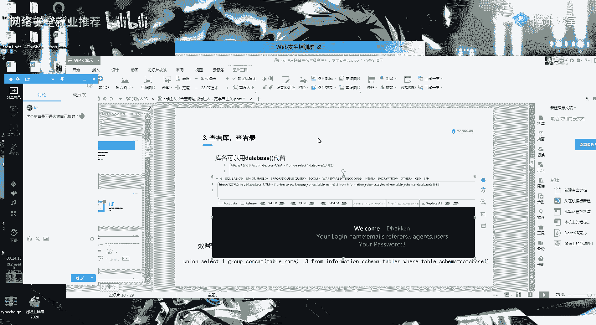

我直接跟你们讲吧，好吧，为什么我特别要强调这一个思路呢，就是你知道联合查询，联合查询的一个注入，后面的注入都很容易理解了，还有一分钟，稍微等一下，好开始今天的一个课程讲解。

今天呢要给大家讲的是一个sql的联合查询，跟一个报错注入，我们来看一下，今天的一个内容啊，今天其实我在后面呢还加了一个宽字节注入，因为我觉得嗯你们昨天弄了这个联合查询之后，联合查询语句之后嗯。

后面的报错注入呀，还有一个宽字节注入，都可以很快的给理解，所以我就今天加了一点内容，我们来看一下cl的一个联合查询是什么样子的，呃还是同样的，昨天也是提过了这个呢，circle是如何产生的。

就是从这个sql的一个代码来看，昨天都给你们详细的讲过了，就是因为我们的这个id参数，它没有一个很好的很好的进行一个，叫什么，就这个地方没有过滤吧，就是过滤不严格，然后导致这个传入的一个参数。

就直接变成了一个sql语句进行一个查询，这一点大家一定要记住，就是万变不离其宗，你所有的注入都是一样的一个原理，包括所有的漏洞懂吗，就这样就这样跟你们说，所有的漏洞，都是因为他这一个输入点过滤的不完整。

或者就是没有考虑的，那么就是没有考虑的那么周全吧，所以他就会有一个漏洞的存在，好我们继续来看一下这一关呢，其实跟你们呃昨天的那个课后作业，是一模一样的呀，所以呢联合查询语句的是什么，联合差序语句。

啊我们还是先看这个内容吧行吗，还是你永远都记住这几个步骤就可以了，第一个就是先加一个单引号，判断有没有一个报错，然后再加一个单引号，看到没有，再新加一个单引号，它会不会报错。

然后再加一个单引号，它又正确，这就说明肯定会有一个合注入，然后呢第二个就是would by，进行一个列的一个爆裂，ob 3 odby 4正确，就是证明它只要三列，这个呢也是前面两节课都讲过了的。

我就不会这么详细的，给大家进行一个一一的解释了，上两节课应该讲的很详细了吧，这个，然后呢第三步就是我们刚刚是old by成了三嘛，所以就是这一条就是联合查询懂这个ui，再加一个li，就是一个联合查询。

也就是说联合查询语句，就是你可以使用这一条语句，可以使用这一条语句，它就叫联合查询，没有啊，没有什么一个特别多的一个含义啊，啊然后呢，这里呢是给你们解释一个微博的一个显示位的，一个原因，昨天也讲了。

就是微博呢它这里一个echo，它显示呢只会解释这个第二列和第三列，看到没有，就是那password，因为它这里对应的是就是那password，就是对应的这个mysql里面的一个值。

所以它这里显示的就是二跟三，全部是看他的一个代码怎么写的啊，到这一步有没有不理解的呀，就是你们不懂的，不懂的话，你就扣个二好吧，不懂的话扣个二，等你们啊一个十秒钟的时间，好应该基本都懂了。

我觉得我昨天那节课讲的，讲的应该是比较的一个详细了呀，这里呢就是你们昨昨天的家庭作业啊，就是课后作业，大家应该自己都做过了，这里呢还是同样的，你们一定要记住呀，这条句子一个意思，这几条句子的意思啊。

如果你就是对这个社会注入的一个流程，里面的一个语句，等一个意思不明白的，你们就扣个一出来，我就再我再仔细的给你们讲一遍，一定要你们一定要把这几条语句给他搞懂，有没有不会的，就是啊你觉得觉得我不用讲了。

你就扣个一，要讲的你就扣个二，其他同学，其他同学啊要需要啊，需要重新讲一遍吗，虽然你们四个扣的啊，行有疑问你你先给我提出来，就是你哪个地方有疑问，哪个位置，对啊马上四个啊，我继续再快速的过一遍，好吧。

就是因为有一个同学有疑问，我就再快速的过一遍，你们也稍微加深一下印象，啊我首先要问啊，首先要问的是，你是对判断是否都住不理解呢，哦你是说这个despss换成一个爆出来的库明，对不对。

好这里呢是因为我这个debu，跟这一个数据库的这个名字是一样的，你懂吧，跟数据库的名字是一样的，就是mysql的这个里面，我这个device是可以代替这一个，它的这个本身的一个库的，就是你填两个都可以。

你两个都可以用，懂吧，就是我如果填这一个debus这个代替的，我就不需要加一个双引号，我给你们看一下啊，我给你们看一下嗯，还是用这个给你们讲好吧，好你看你看我这一个的查询结果。

我这条语句在这个地方加这个debus的一个语句，是一个这样的一个结果，对不对，诶，它的一个库名是多少，去了，这里我先看一下它的一个库名啊，他的顾名是和田nel，对不对，那我们把这个地方改为httl。

就是我这里一个单引号核心，是不是得到了一个查询结果是一样的，就是因为despace，就是等于跟当前的数据库是相等的，好吧就是它跟当前的数据库名是一样的，所以你这个嗯这个应该就不用说了。

这里我只是看你的个人习惯吧，我个人习惯使用，这样就你不要跟着我老师的一个思路，就是卡死在这啊，就是你自己要有自己的一个想法，还没有不理解了这位同学，好其他同学也可以说啊，就是不知道的也没事啊。

这个是很正常的，我当时我自己学这个注入，我自学我也学了挺久的，当时我们当时那个呃网上的一个教程，他们是一个思考过程，就是给他给你们有一个星期的，一个厕所的一个课程，一个星期吧，整整一个星期。

我是因为把我的一个理解给你们讲了，所以我这个课程会过的比较少，就是不像他们那样一整个星期，整个星期这实际是个猪肉的话，要学的东西有很多，因为他有一整本书，你们如果读大学的。

知道有一本就是你们那个tcp ip还是什么事，就是有一大本书，一一本砖头书特别厚的，刺客注入，专门讲这个注入的，也有一本这么大的一本书，想要深入的理解，可以去看啊，然后我们再来看一下，就是你们要记住啊。

这三个这三个函数是需要你们稍微记住了，这三个是需要你们自己记住的一个，首先我们看一下一个语法，contact，他这里呢就是一个username password，就是一个查询码，查询user里面的。

但是呢我这里加了一个逗号，你们可以看到它的一个查询结果，这里呢就边上有个逗号，然后contact at w的话也跟这个是基本上是一样的，你可以看一下，只不过呢它的一个用法呢，就是它这个前面的这个符号。

在这个前面把多个字符串连成一个字符串，但是可以一次性的指定这个分隔符，然后这一个group cocat你们应该也用的比较多了，就是把所有的数据都连成啊，就是都连成一个值班。

就是我把这个分组里面的值全部都给它连起来，这个是需要记住的呀，就是没有什么其他的一点，就是你们要记住，然后我们在这里进行一个跳过这里的查看表，里面的列，查看列里面的内容，这些都应该是都会了。

然后就来到今天的一个重点了，本来我是想今天讲smart的，但是后来把课程推了一下吧，就是先把报错注入跟快速结束，给你们讲完，明天的话就教你们一个sucup，首先我们来看一下什么叫爆头注入。

报错注入呢就是通过特殊函数的错误使用，并且使其输出错误结果来获得一个信息的，遇到有报错回写的时候，但是没有数据回显的时候，可以利用这一关是什么意思呢，就是什么时候要用到报错注入呢，啊我举个例子啊。

我举个例子。

这里好像就有一个爆头注入吧，我给你们举一个例子。

这个布尔盲注是，哦这里没有保守住，我看一下啊，而是用我本地的一个环境来给你们看一下吧，他这里面没有报错注入，但是报错注入是什么意思，就是例如我们在判断数据库啊，在判断一个叫什么东西啊。

在判断这个中路的时候，我们输入一个单引号，它是不是会输出这一串错误，对不对，就是这里有一串报错的一个信息，嗯我看看片视频study，真实场景的话啊，我待会下完课，我给你们看一个真实场景啊。

就是把那个地址发给你们，给你们看一个真实场景，好首先我们来看一个，哦我只开了bp的，应该是第五关吧，3d901 好，就是这样啊，你比如说你看这个关卡啊，就是比如说我输入id等于一，是没有一个输出的。

对不对，然后我输入一个，单引号，然后呢，他这里就发生了一个报错，但是我继续，如果我比如说我像第一关一样，我像第一关一样进行一个，比如说这里一个un就是进行一个联合查询，是不是可以看到他这里呢是没有一个。

它这里呢是没有一个回血的，对不对，所以说呢在这种没有回血，我们进行联合查询，没有回血，但是呢我这里又有报错的情况下，我又有报错信息的输出，报错信息输出的一个情况下，那就是一个那就是可以执行一个暴徒注入。

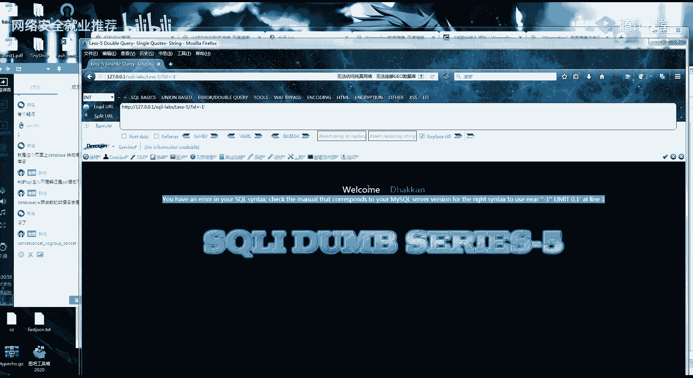

它的一个重点就在这里，为什么要分报错注入，跟你一个普通的注入呢，为什么不直接用盲注呢，因为就是一个，四个注入的一个快速吧，就待会给你们讲盲注，就知道你要记住盲注是非常非常慢的一种注入。

就是不像我们随便输几条语句，查询就可以出来了，是非常大的一个，然后报错注入呢有很多的一个函数，主要是讲这两个，就是大概有十几个函数，十几个都可以用，但是我们常用的还是这两个，通过参谋文档的一个信息。

它这个原理呢，就是当它的一个参数不正确的时候，它产生错误就会返回一个参数的一个信息，然后你要想这个参数呢是我们可以自己设置的，那我把这个参数设为一个查询语句，比如说是查询数据库的一个名字，那这个参数。

然后构造的时候，把这个参数的格式改为一个不正确的，然后产生错误，就会返回这个数据库查询的一个语句，这两个，然后你们想了解更多的，我这里呢列了一个报错注入的一个速查表，也就是很多种吧。

很多种高度数的一个速查表，我待会下课呢会把p p t发给你们，你们根据这个表去进行一个查询就可以了，今天就开始一个正式的一个课程，报错注入的一个利用，你们要记住这两个函数呢，它的一个试用版本是5。1。

5以上，然后呢，它的一个错误用法就是在这个前后添加一个，这个叫什么号去了，这个叫波浪了，唉忘记叫什么了，我们来看一下，我们来看一下它的一个语法语法治理，你可以暂时就先省略掉，它主要报错呢。

就是通过这个第二个函数进行一个报错，你看这里这个po的，对哈哈，我也不知道，反正就是过了啊，然后我给大家看一下，就是你们要知道一点点的一个编码知识，这个0x71 。

他这个0x7 就是这个波浪号的一个编码，你看它的一个hex编码，就是这个波浪号，我们把这一个就是添加试啊。

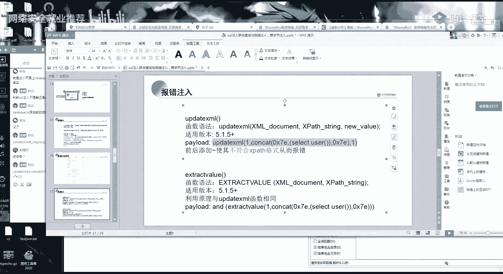

试一下好吧，就是看一下效果，它有什么用，呃可能查user的话，你们可能不太清楚，看一下效果，从这里是不是可以看出来，我这一个查询语句它生效了，因为他把这个数据库的一个名字给报出来了，那我就给你们开始讲。

为什么会把这个数据库的一个名字给报出来。

嗯首先第一个你要看它的一个参数，我前面的一个解释，就是在对xm xml文档进行一个查询的一个函数，当参数的格式不正确的时候，还产生一个错误，就会返回参数的一个信息，那它的参数是哪一个呢。

参数呢它这个参数就是这个xp，还有，那这里的我们看一下我们的格式，这个xml这里是一，然后这个new这里又是一个一，那我是一个xp，是不是就是我是一个contact at 0 x71 。

然后还有一个set user 0 x7 ，对不对，那我的参数就是这个，那在报错的时候就会把我这一个参数给它返回，那我们具体应该怎么操作呢，这个呢语法也是一模一样的呀，你们先记住这两个参数。

就是这两个用法，我接下来给大家看一个效果，这个你们不要背啊，就是不要死记硬背，你反正就觉得就是我在这个地方执行操作，它可以进行一个返回，也就是说我只要我只要这整个语句，我只要在这个地方修改就可以了。

然后我们看一下后面的语句啊，首先嗯这里的测试报错的话，先给大家看一下它的一个爆库的一个名字，这里的desps的话，这里我是写的比较简便啊，所以直接写了个debus，它也是可以爆出来的，因为我之前说过嘛。

这个debus跟我们的一个数据库名是相等的，对不对，然后他报错，就把这一个数据库的一个值给显示出来了，我们接下来重点了，是看它报表的一个po的来看一下啊，这是你们首先这里是一个and。

然后是我们刚刚的这一个xml的一个函数，对不对，然后这里一个一就是刚刚的一个参数，然后这个contact一直到这里一个大啊，一直到这个地方一个大括号完结，到这里就是我们的第二个参数。

因为两个用法是不一样的呀，你可以看到嗯。

你可以看这个参数，他这里只有两个，只有两个参数，前面这个up有三个参数，这里只有两个参数。

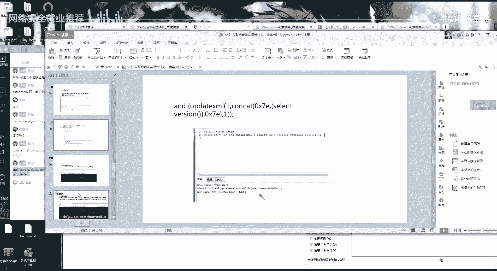

好我们一条语句一条语句子来分析，首先这里呢是一个一，然后这里呢contact这里连x7 ，就是我们的这个啊波浪波浪线吧，应该是叫波浪线，然后这里应该是t就是一个波浪线。

那中间这一条语句大家是不是觉得很熟悉啊，是不是我们的那一个联合查询语句，里面的查询表明的一条语句，this group content，table name from。

这一条是不是就是我们查询表明的一个语句，然后呢，他就利用这个报错，把这一条语句，进行了一个执行，然后返回到这一步啊，不理解的，你扣个二，理解的，扣个一，嗯就你一个理解的吗。

啊为什么xml报错代入到sql语句里面，进行了一个查询，呃首先你要首先我们理解这样的，首先这这样的一个理解啊，啊我们这一个整条句子，我们这整条语句是不是会代入到这个，是不是会代入到我们的数据库里面。

进行一个执行，对不对，那我是个数据库语句，它执行的话，就是他会先执行我们的这一条，这样的一个查询语句，就是先把他的就先把这个括号的值给查出来，大家懂吧，就像你做加减乘除的时候。

我首先算的我是算括号里面的一个值，对不对，所以呢他就先把这最里面的括号，这个语句进行一个执行，然后执行了之后就会变为我们的一个这个参，ml函数的一个参数，到这这里可以理解吗，理解的话。

你们还是继续扣个一，不理解就扣个二，啊其他同学也稍微做点反应，啊啊啊，嗯好五位，嗯好，然后，有疑问的就赶紧停啊，有疑问就赶紧提你，首你首先我们还是首先的是理解它为什么会啊，为什么会返回这个东西。

然后再为什么我们要执行这样的一条语句，这些语句就是都跟前面的联合查询，是一模一样的，也就是昨天教你们的，他的意思是一模一样的啊，那既然这样，就是我们利用的这一条语句，这样是进行一个。

我们利用的这样的一条报错语句，是进行一个查询表明，那你们剩下的一个库明能推出来吗，就是啊列名怎么把这个列给爆出来，能推出来吗，啊能推出来就是你先说思路吧，你们知道思路的，就在公屏上扣一下。

要知道一个举一反三啊，对改这个查询语句，还是还是继续回到原理，就是它这里会把参数不正确的格式啊，它就会参数格式不正确的时候，就会返回这个参数的信息，那我们刚刚的这个参数，刚刚这个查询表的参数。

是不是就是一个这样的一个参数contact，然后呢，我这个地方是上次那个联合查询语句进行查询，表明的一个语句，那我把这一个查询表明的语句，改为一个查询列名的语句，那它是底下的错误。

是不是就会返回我们的一个列，这张表里面的一个列，我们来看一下啊，我们来看一下爆裂，爆裂呢它就是把，我标红一下，应该有个画板吧，画笔爆裂呢就是把这个地方，这个地方的这里这个地方的字条语句。

这一条查询表的语句改为查询列的语句，我的手有点抖，所以画线不好看，你们不要介意，好我们来看这个爆裂，你看一下我们爆裂的这个语句是什么样子的，这里是不是就是查询这个user里面的一个列，是不是跟l。

是不是跟我们之前的那个叫什么去了，跟我们之前的那个联合查询是一模一样的，这条语句还有印象吗，那接下来的改值，那是不是也可以这样进行一个力推，他这个画板的这个功能有点有点点小看。

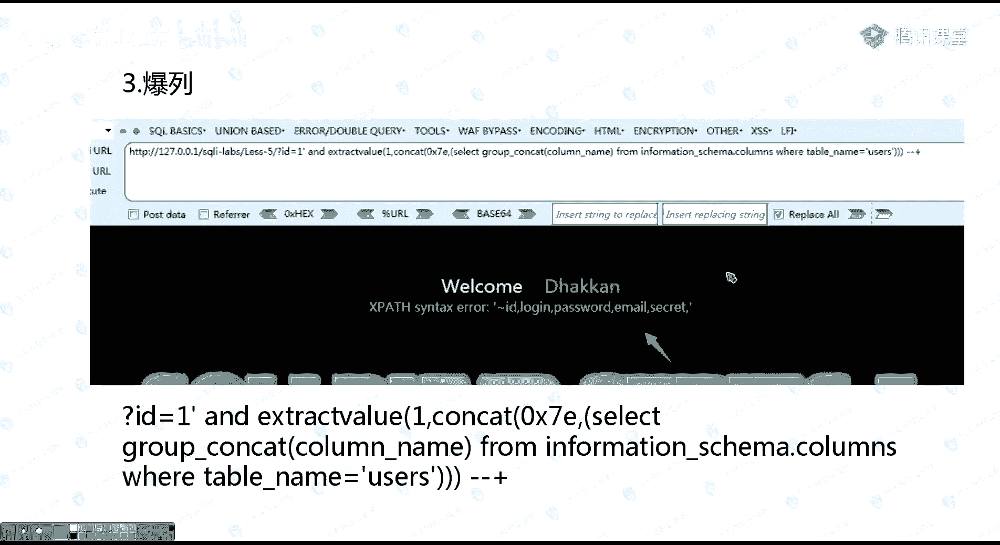

那我们就来演示一下吧，就是来演示一下，还是，嗯用哪个东西来演示呢。

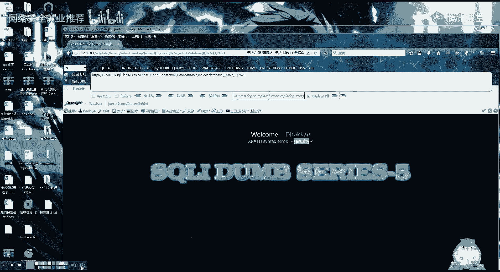

还是用之前给你们的这个网站来进行一个演示，实操实操的话是体验啊，实操的话就可以加上你们体验吧，应该说是首先我把这些语句，也是我把这些语句都给你们扣上去，报库报表然后爆裂。

当然我有可能中间有哪个东西打错了，也不一定啊。

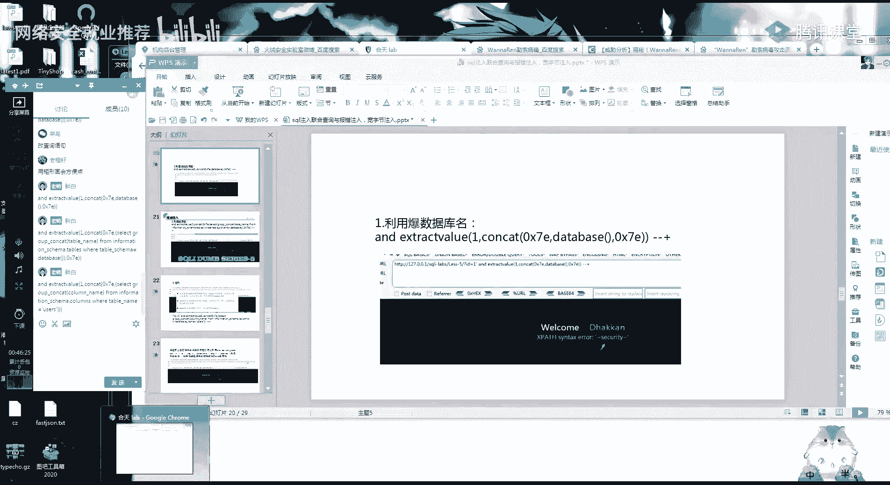

好我们首先还是来看啊，我们最开始的第一关，我们的一个查询语句是怎么样的，我们的查询语句是n，let 123，我们上一节课的一个查询库的一个语句，咦，哦没有加那个没有闭合。

我们上一节课学的一个四个注入语句，大家都知道吧，你这里呢基本上可以不看，就是slidesp，那我们来看今天的一个报错注入的一个sql语句。

是什么样子，i d等于一啊，这个谁呀，这里第一关，百度热搜啊，compa，b团。

我们看一下这个报错语句，用户用这个吧，用这个吧，我们估计因为这个ui要编码太难了，很难受，好这条语句就是我这个despss，当然你也可以这样写，就是slice，要打括号了，好首先这第一个爆库的这个语句。

就是因为我这第二个参数是查询它这个debu，到这一步懂得扣个一，嗯好，那第二步，第二步我们是不是就爆裂，那我们就把啊上一部的一个查询语句，因为我们上一步的一个，查询这个表的一个语句是这样的吗，就是。

我还是拖到自己来，group concubine from，然后后面一串一大串，然后我这里呢就把我的这个表给查出来了，对不对，那我把这个查表的这一串语句呢。

然后copy到这个里面来，copy到这个位置来，会回到这个位置来，就是爆头注入的这个位置来，然后就会发现是不是查询到的一个结果。

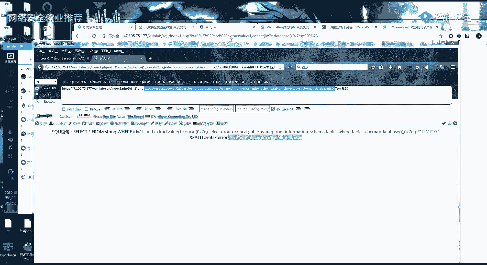

是一样的呀，得到的一个效果，那我爆裂那就更简单了呀，啊我爆裂之前也是一个slip cat，这里呢是查我这个u s表里面的一个列。

这里我之前跟你们说过了，是因为我这里面的一个优势表有点多，然后我继续了，我还是把这条语句拖到这个报错语句里面来，进行一个查询，是不是也是得到的结果是一样的，那我后那我后面的差值，还有包括嗯叉叉的一个值。

是不是也跟我这一个，就是也也跟我昨天的那一个叫什么，跟我昨天的一个联合查询语句是一样的，这样一步一步下来的，啊这样报错注应该懂了吧，懂了的话，你扣个一，不懂的话，你就把不懂的打到公屏上，好，嗯哼还有。

哦来晚了哈行，你待会待会儿回去复习，那写好啊，就是你反正记住啊，一定要举一反三，包括后面的盲注也是一样的，都是一样的原理，你记住这个原理。

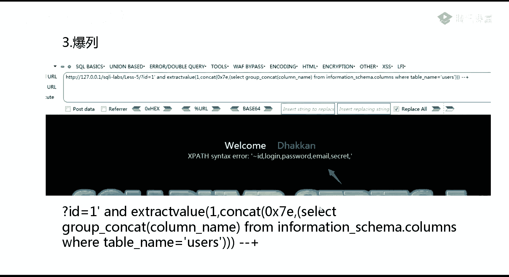

然后呢这里有一点要注意的是，就是这个报错注入它的一个返回啊。

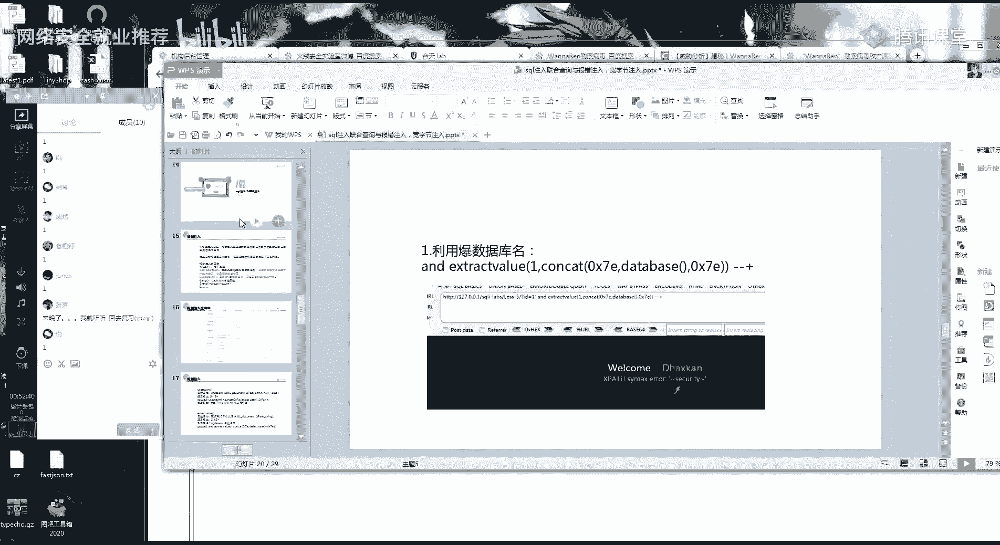

它有一个返回的一个限定，我把这张表发到群里面。

就是他报错的一个值，看到没有函数有一个写错的一个长度的限制，这是数据库里面写死的呀，就是我这两个它只有一个32的一个显错，就是我可能一个一次性的报错，可能回血不完全，当然这个你都不用管了。

就是你这个都不用管，后面的一个假sk map的话，基本上都是会有一个完成的，因为我最后的不是教你们所住，而是教你们怎么进行一个手工加工具，进行一个结合，懂吧，手工加工具结合又快又好用。

就比如说我刚刚这里啊，我的一个user表里面有很多一个列嘛，它你可以看我这个boss注入，他只出了一个12345。

他只出了五个函数，你们可以数，刚好应该就是32位，然后你看我这个结果，我这个回血是不是出来了一大串。

一大串东西，那这个时候我们怎么办呢，看一下它的一个情况，这里呢我们同样可以用and，然后加以为昨天给你们演示了吗，这个vr的条件是可以用and进行一个加的，那我就在这里加一个，and。

我这一个查询的这个名字不等于not in，已经出来了，这几个罗腾，你这几个，到这里呢他就啊，反正就是你后面加加，到最后它总会有一个极限的一个值，这里只是一个思路，你只需要记住就可以了。

就是现实中你根本基本上用不到这个东西，然后报纸报纸这里我就不说了呀，跟你们说了，就是举一反三，在这个地方，slice grown啊，group contact。

然后username password是不是一模一样的，主要是你们要记住这个思路啊，同样的他这个报纸没有权的，你用这个vr这个查询语句，这里呢后面会给你们ppt，你们稍微看一下就可以了。

然后今天呢还要给你们讲一个，另外一个类型的主播，就是跟前面其实注入过程也都是一模一样的，懂吗，注入过程还是一样的，但是我为什么要提呢，就是因为我们在中国，你懂吧，这个叫宽字节注入。

宽字节注入只适用于国内啊，只有国内才有这个宽字节注入，至于为什么你待会儿看啊，首先第一个宽字节注入的一个原理，你们这些呢嗯这些我都不看。

我把这个标红吧。

你们在做sl注入的时候，应该遇到过这样的一些情况，输入注入或者之前的xc 4，你们输入一个特殊字符，是不是有些网站就会喜欢加上反斜杠，这个东西有遇到过吧，有遇到过的话，你就扣个一，就是会有一个反斜杠。

反斜杠的一个转移，待会儿你待会儿给你看，你就知道了，同样的，我这里呢啊这里靶场里面是有一道这样的题的，是有一道题的，正好有一个宽字节注入，就是比如说我输入一个单引号，他这里呢就会多一个转移符。

转移的字符，那我再输一个单引号呢，你看它就变成了这样，然后我输反斜杠，你看，反斜杠，那他又多了一个反斜杠，这是为什么呢，这是因为啊他网站用了这样的一个函数啊，就是mysql里面有一个转移的一个函数。

应该是菲律宾里面的吧，这个函数的一个意思就是把，这个也是常见的呀，现在的cm里面还是有，现在的网站里面还是有这个功能，但是很少啊，这个过程是很常见的，就是特殊符号进行一个转移。

然后第二个就是网站开启了一个数据，重点是这个吧，就是数据库设定为了一个gpk的一个编码，gbk编码是什么呢，就是gbk编码是专门针对汉字的，你懂吧，汉字我给你们看一下是什么意思就知道了。

这样说可能不太明白，你比如说就是我们在这里出一个单引号，在浏览器上输一个单引号，它是不是会ui l编码成一个27%对吧，但是我们比如说我输了一个汉字呢，我，那我这个汉字url编码之后会是什么样子呢。

啊还是用这个小葵随便打一个汉字呀，比如说一个我字，有没有发现他的一个ui编码是这样的，两位数，任意的汉字呀，你就说任意的汉字url编码都是两位，然后任意的字符，比如说啊e啊，随便输入一个字符都是一位。

你就记住这个啊汉字唉，端l编码两位，然后字符url编码移位，那这里你是不是有一个想法了，就是因为我们刚刚随便输入一个单引号，都会被这个斜杠加过来，对不对，就是我随便输一个单引号都会加一个斜杠。

那如果我在这个汉字前面加一个3%b，就是我加一个，因为汉字是两位吗，哦不是不能用这个，如果说我随便打一个汉字啊，随便哪个汉字，我用这个汉字的前面一半，因为汉字是两个是两位。

我用这个汉字的前面一半再加一个单引号，它会产生什么样的一个结果，它会这里有一个字符，就是对应的我们这个百分之b c，然后这个斜杠，也是代表一个字符，那他有没有可能这个百分之b7 ，再加上这个斜杠。

我们浏览器就把它认为这是一个汉字，汉字是两位编码，就是把这两个编码认为是一个汉字，然后我这个单引号是不是就空出来了，单以后就有效了，那我这个单引号就可以进行一个sl语句，的一个闭合。

简单的来说就是因为你看代码，mysql这里设了一个gpk，然后这里呢用了这样的一个转义字符，原理就是汉字的编码为两个，那我们怎么利用呢，这里呢应该也很简单了，那我们怎么利用。

首先报了一个这样的一个错出来啊，你们先说吧，我让你们讲思路，你们对这个宽字节的一个编码有没有不懂的，有不懂你就扣个二，懂了你就扣个一还是同样的，然后懂的你们就想一下，懂的你就想一下他这个语句怎么输入。

就你一个搞懂了吗，那我再说一遍好吧，我再来讲一遍，再来给你们重复一遍，首先确定一个这样的一个值啊，它的原理呢就是，因为我加一个单引号，我每输入一个单引号，它这一个mysql的语句都会给你多一个反斜杠。

对不对，然后浏览器是怎么认识这个url编码的，你们可以看到一下这每一个汉字的一个编码，它都是比如说我是b开头，然后我出去这个我然后我这里又是一个c开头，但是我们随便输字符啊，你可以看到我这个ui编码。

随便输字符，它这里呢是没有一个字母的，我随便说好吧，你可以看都是没有字母的，让浏览器遇到这一个，比如说是11%，我遇到了一个百分之c1 ，然后他就会认为我这里是一个汉字。

那他把我的这个百分之c再加一个反斜杠，两个加起来认为是一个汉字，认为是一个汉字，那我后面的这个单引号，他就认为我是一个有效的单引号，因为我这两个是一个汉字了，那我这个单引号是不是就空出来了。

那我这个原来反斜杠的一个作用，是不是就消失了，这里呢就叫宽字节注入，而且我开始讲了，为什么只有国内有呢，你想一下，除了中国，还有其他地方用汉字吗，没有吧，对而且这一个遇到的很少呀，很少有遇到的。

因为他条件很苛刻，你看代码他有两个条件，第一个是用了这样的一个过滤，第二个是用了一个gpk的一个编码，这里面就当一个理解，然后你们呃不懂了，你说一下为什么不懂呢，我现在给你们解答，今天的内容其实不多。

一定限制gpk吗，对一定要是gbk，他才有两位数的一个编码，如果他没有gbk的话，啊ut f8 为编码的话就是，哦我给大家看一下ut f8 ，比如说我随便输一个，编码它是ut f8 ，然后他这个中文。

ut f的啊，就是ut f8 呢它的一个编码，反正就是他不会认为这个中文是两个百分号，就是只有gbk的编码才会把中文转成一个，只有中文才会转转为两个字符，你看一下它的一个原理啊，约在编码里面。

gbk的编码占两个字符，只有gbk，ut f8 ，它虽然能识别汉字，但是他的汉字编码完也还是占一个字符，它不会占两个字，这是gbk独有的，对基本上遇不到了，但是会有一些比较老的一些站，会有一个gpk。

所以我为什么就是我只稍微提一下，我不会给你们啊，很那个的讲，你简单的就理解为我这一个url，我这一个宽字节就是为了绕过这个过滤，就是为了绕过这个过滤，我把这个快字节这个原理给你们发群里面。

你们好好的认识一下，然后呢，既然我绕过了这一个单引号，那我后面是不是跟我原来的联合查询，是一模一样的，我自己的一个联合查询，-1，这里加一个1%，好，那我后面呢就跟这个联合查询的一个语句。

是一模一样的了，然后我在后面查询这个数据库呀什么的，也都是一样的，然后你们今天的一个课后作业呢，就是会课后作业就简单的做一下这个，简单的把一个这两个这个宽字节注入，还有这个字符型注入，就是字符型注入。

你用报错注入来做，用报错注入来做，我把先把作业打一下，待会儿可能我群里给你们拍一个，简单的一个小课呀，去那边开个简单的一个小课，很快乐，这种，我会把昨天的一我会给你们发一点小东西，比如作业就是。

哦宽字节也宽字节，你不喜欢用报错注入的潘志杰，我只是需要你绕过就可以了，当然你想用报仇之路也可以，我不拦着你，无所谓的这个，然后第二个就是，盘子也出，今天的一个课程内容就差不多这么多。

所以说啊万变不离其宗，你们如果还是不知道，前面这个联合查询是什么意思，你就去看看完联合查询语句，你再看其他的一个录入，看完联合查询与分离，再看其他的一个注入，就可以很快的进行一个理解了。

好今天课程内容呢就是这样，然后我待会会在群里面给你们发一个，发一个东西啊。

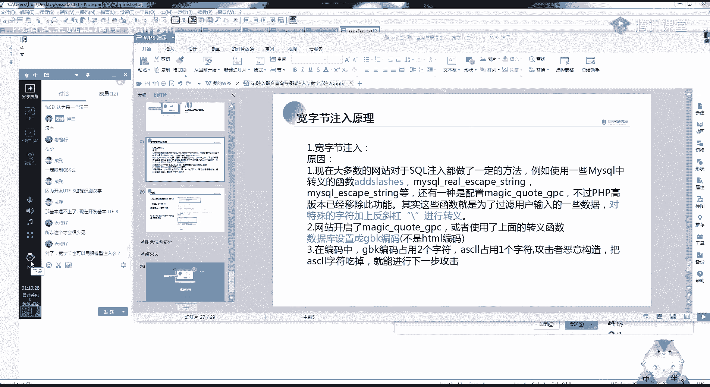