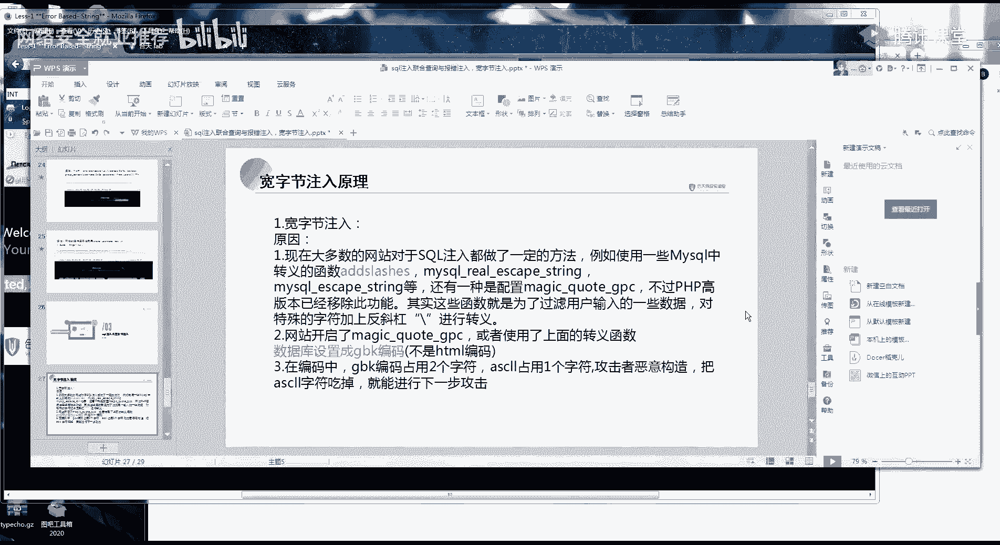

# 🛡️ 课程P12：SQL注入漏洞-联合查询与报错注入

在本节课中，我们将要学习SQL注入中的两种重要技术：联合查询注入与报错注入。我们将从原理出发，通过简单的步骤和示例，帮助你理解如何利用这些技术发现和利用SQL注入漏洞。课程最后还会简要介绍一种特殊场景下的注入方式——宽字节注入。

***

## 🔍 SQL注入的产生原理

上一节我们回顾了SQL注入的基础，本节中我们来看看SQL语句是如何被恶意构造的。

SQL注入的产生，源于代码中对用户输入参数（例如ID）的过滤不严格。攻击者传入的恶意参数被直接拼接到SQL查询语句中并执行。

**核心概念**：所有SQL注入漏洞的根源，都是因为程序对用户输入点的过滤不完整或考虑不周。

***

## 🔗 联合查询注入详解

联合查询注入的核心是使用SQL的 `UNION` 操作符，将恶意查询的结果合并到原始查询结果中并显示出来。

以下是进行联合查询注入的标准步骤：

1.  **判断注入点**：通过添加单引号 `‘` 观察页面是否报错，来判断是否存在SQL注入漏洞。
2.  **判断列数**：使用 `ORDER BY` 子句递增数字，直到页面报错，以此确定查询结果集的列数。例如 `ORDER BY 3` 成功而 `ORDER BY 4` 失败，则说明有3列。
3.  **实施联合查询**：确定列数后，使用 `UNION SELECT` 语句。例如，确定有3列后，构造 `UNION SELECT 1,2,3`。
4.  **确定回显位**：观察页面显示的内容，确定 `UNION SELECT` 中哪几列的数据会被显示出来（例如，可能只显示第2和第3列）。
5.  **获取信息**：将回显位替换为我们想查询的信息，例如数据库名、表名、列名和数据。

**关键函数**：
*   `CONCAT()`: 连接字符串。`CONCAT(username, ‘-‘, password)`。
*   `CONCAT_WS()`: 使用指定分隔符连接字符串。`CONCAT_WS(‘-‘, username, password)`。
*   `GROUP_CONCAT()`: 将分组中的所有值连接成一个字符串。`GROUP_CONCAT(table_name)`。

***

## ⚠️ 报错注入详解

上一节我们介绍了有回显的联合查询，本节中我们来看看当页面没有数据回显，但有错误信息输出时，该如何利用。

报错注入是通过故意触发数据库函数的错误，并让错误信息中包含我们想要的查询结果。

**适用场景**：页面没有正常的数据回显，但会输出SQL语句的报错信息。

**核心原理**：利用某些函数（如 `updatexml()`, `extractvalue()`）参数格式不正确的特性，当函数执行出错时，会将错误的参数信息返回。我们将查询语句作为参数传入，就能在报错信息中得到查询结果。

**常用函数**：
*   `updatexml()`: 用于更新XML文档的函数。
    *   **公式**：`updatexml(1, concat(0x7e, (SELECT database()), 0x7e), 1)`
*   `extractvalue()`: 用于从XML文档提取值的函数。
    *   **公式**：`extractvalue(1, concat(0x7e, (SELECT database())))`

其中 `0x7e` 是波浪号 `~` 的十六进制编码，用于构造格式错误。

**利用步骤**：
1.  **爆出数据库名**：将查询数据库的语句放入报错函数参数中。
    *   **代码**：`and updatexml(1, concat(0x7e, (SELECT database()), 0x7e), 1)`
2.  **爆出表名**：将查询表名的语句替换进去。
    *   **代码**：`and updatexml(1, concat(0x7e, (SELECT group_concat(table_name) FROM information_schema.tables WHERE table_schema=database()), 0x7e), 1)`
3.  **爆出列名**：将查询列名的语句替换进去。
    *   **代码**：`and updatexml(1, concat(0x7e, (SELECT group_concat(column_name) FROM information_schema.columns WHERE table_name=‘users’), 0x7e), 1)`
4.  **爆出数据**：同理，替换为查询数据的语句。

**注意**：报错注入有回显长度限制（如32位），可能无法一次显示全部信息。可以通过 `SUBSTR()` 函数分段截取，或使用 `NOT IN` 排除已获取的内容来逐步获取完整信息。

***

## 🇨🇳 宽字节注入简介

最后，我们简要了解一种主要出现在国内网站的特殊注入类型——宽字节注入。

**产生条件**：
1.  数据库或Web应用使用了 `GBK`、`GB2312` 等宽字节编码。
2.  程序使用了 `addslashes()`、`mysql_real_escape_string()` 等函数对用户输入进行转义（在特殊字符如单引号前加反斜杠 `\`）。

**核心原理**：在 `GBK` 编码中，一个汉字由两个字节组成。攻击者可以输入一个字符（如 `%df%27`），使得转义后的反斜杠 `\`（`%5c`）与前面的字符（`%df`）结合，被数据库解释为一个合法的 `GBK` 汉字（如“運”），从而“吃掉”了反斜杠，使得后面的单引号 `%27` 成功逃逸，闭合了SQL语句。

**简单示例**：
*   输入：`id=%df%27`
*   转义后：`%df%5c%27` （`%5c`是反斜杠）
*   `GBK`解码：将 `%df%5c` 解析为汉字“運”，单引号 `%27` 生效。
*   最终SQL：`... id=‘運’ ...`，单引号成功闭合。

**利用方式**：绕过转义后，后续的注入步骤（判断列数、联合查询等）与普通字符型注入完全相同。

***

## 📝 课程总结

本节课中我们一起学习了SQL注入的进阶技术：
1.  **联合查询注入**：适用于有数据回显的场景，通过 `UNION SELECT` 合并查询结果。
2.  **报错注入**：适用于无数据回显但有报错信息的场景，利用 `updatexml()`、`extractvalue()` 等函数的报错机制获取信息。
3.  **宽字节注入**：一种针对特定编码（如GBK）和转义函数的绕过技术。

请记住，**万变不离其宗**。所有SQL注入的本质都是“用户输入被拼接到SQL语句中执行”。只要深入理解了联合查询的原理和步骤，其他类型的注入都可以触类旁通。

**课后建议**：尝试使用报错注入的方式完成一道字符型注入的题目，并理解宽字节注入的绕过原理。手工练习结合工具使用，是掌握SQL注入的最佳路径。