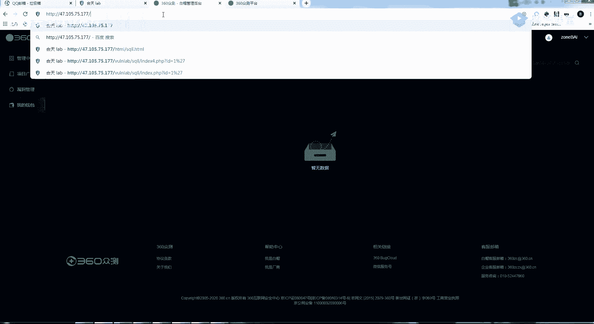
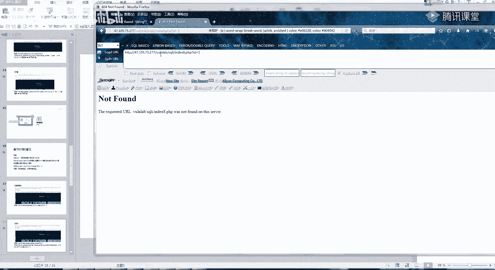
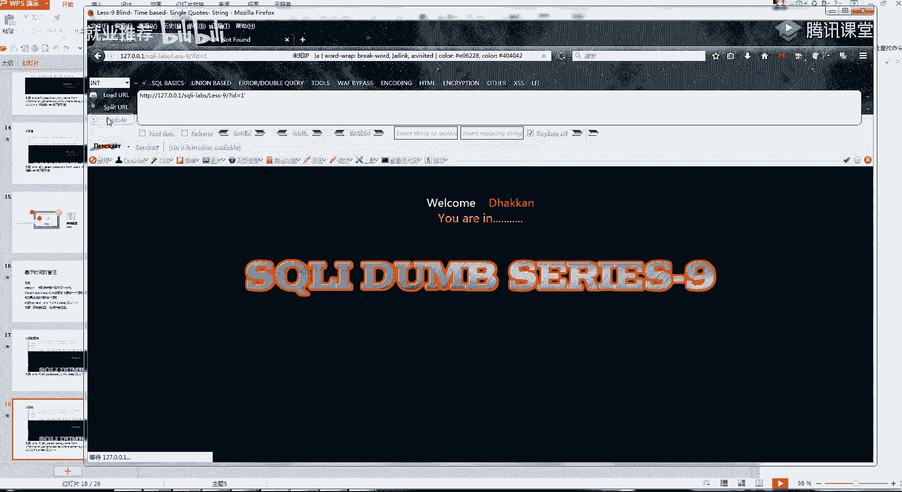
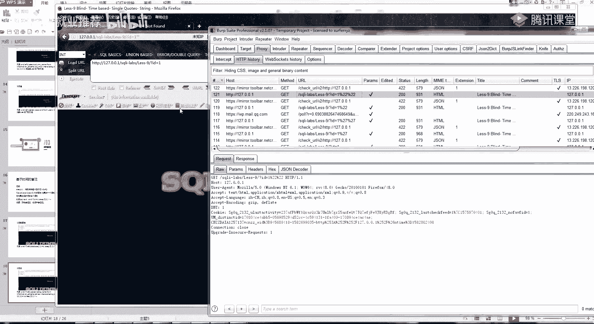
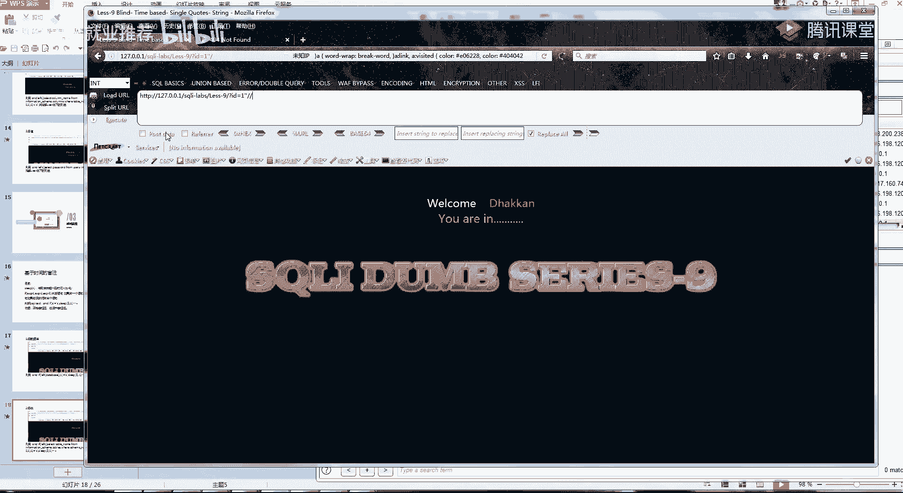
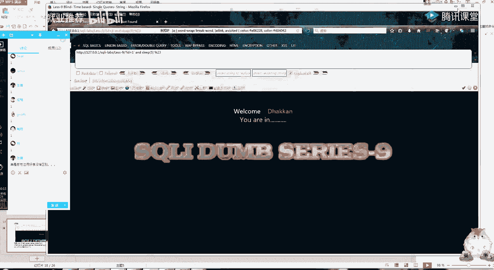
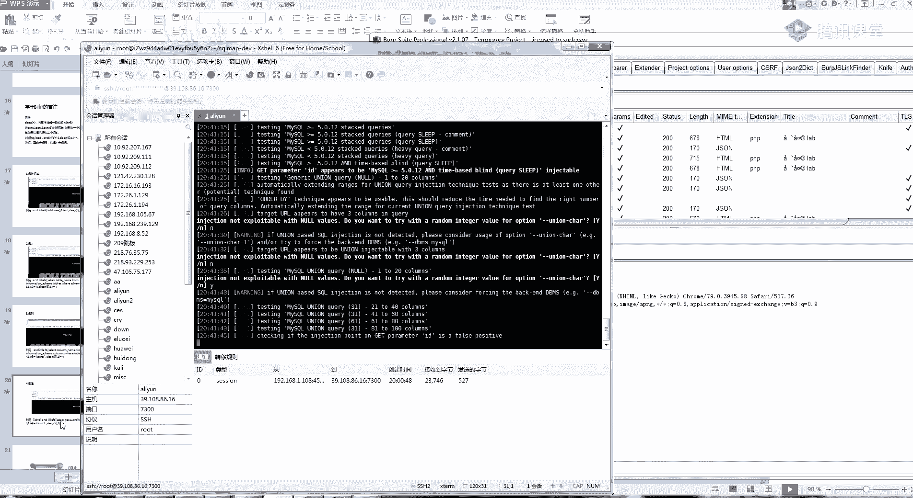

# 课程 P14：第12天 - SQL注入漏洞：布尔盲注、时间盲注及堆叠注入 🎯

在本节课中，我们将要学习三种更高级的SQL注入技术：布尔盲注、时间盲注和堆叠注入。理解这些技术对于全面掌握SQL注入漏洞的挖掘与利用至关重要。

## 概述

上一节我们介绍了基础的SQL注入和自动化工具的使用。本节中，我们来看看当注入点没有直接的回显信息时，如何利用布尔逻辑或时间延迟来判断和提取数据，以及如何利用数据库特性执行多条语句。

## 什么是盲注？🤔

首先，我们来回顾一下判断SQL注入的常规方法。通常，我们通过输入单引号等特殊字符，观察页面是否返回数据库错误信息。但存在另一种情况：输入单引号后，页面没有报错，但内容发生了变化。

例如，正常页面显示“You are in”，添加一个单引号后，该提示消失；再添加一个单引号闭合后，提示又重新出现。这种基于页面内容“有”或“无”两种状态进行判断的方法，就是**布尔盲注**。

一个良好的习惯是在测试时开启Burp Suite等代理工具捕获流量，通过对比**响应包大小**和**响应时间**的差异，可以更精确地判断盲注是否存在。

**布尔盲注的核心原理**是：如果SQL语句执行正确，则返回一种页面状态（如显示内容）；如果执行错误，则返回另一种页面状态（如不显示内容）。我们基于这两种状态的差异来推断SQL语句的执行结果。

## 布尔盲注的原理与流程 🔍


还记得用 `and 1=1` 和 `and 1=2` 判断注入点吗？其原理是：当 `and` 后的条件为“真”时，页面正常；为“假”时，页面异常。布尔盲注正是基于此逻辑的延伸。



以下是布尔盲注的一个典型流程，其思路与有回显的注入类似，但需要逐个“猜解”：

1.  **判断注入点**：确认是否存在布尔盲注。
2.  **获取数据库名长度**：例如，通过 `and length(database())=8` 来判断。
3.  **猜解数据库名**：逐字符猜解数据库名称。
4.  **猜解表名**：先猜解表的数量，再逐个猜解表名。
5.  **猜解列名**：猜解指定表中的列名。
6.  **猜解数据**：最终提取出目标数据。

为了理解如何“猜解”，我们需要掌握几个关键函数：

*   `length()`: 返回字符串长度。
*   `substr()` 或 `left()`: 截取字符串。例如 `left((select database()),1)` 返回当前数据库名的第一个字符。
*   `limit`: 用于限制查询结果。`limit 0,1` 表示从第0条记录开始，返回1条结果。

让我们通过一个例子来理解。假设我们通过 `and length(database())=8` 得知数据库名长度为8。接下来，我们猜解第一个字符：

```sql
id=1 and left((select database()),1)='s'
```

这条语句的意思是：判断当前数据库名的第一个字符是否等于 `'s'`。如果等于，则 `and` 后的条件为真，页面返回正常状态；如果不等于，则为假，页面返回异常状态。通过遍历字母、数字，我们可以确定第一个字符。后续字符的猜解方法依此类推。

猜解表名、列名的语句结构类似，只是将 `select database()` 替换为查询 `information_schema` 中相应信息的子查询。例如，猜解第一个表的第一个字符：

```sql
id=1 and left((select table_name from information_schema.tables where table_schema=database() limit 0,1),1)='e'
```

整个过程就是通过大量的请求，根据页面布尔值（真/假）的变化，像“盲人摸象”一样拼凑出完整的信息。显然，手工完成极其繁琐，这正是我们需要自动化工具（如sqlmap）的原因。

## 时间盲注 ⏳

时间盲注是布尔盲注的变种，适用于页面无论输入什么，返回内容都完全一致，无法通过内容差异判断的情况。





其核心是利用数据库的 `sleep()` 函数和 `if()` 条件语句。`sleep(n)` 会让数据库暂停 `n` 秒。`if(condition, true_part, false_part)` 会根据条件执行不同的部分。






时间盲注的典型语句如下：


```sql
id=1 and if((select database())='security', sleep(5), 1)
```



这条语句的意思是：**如果**当前数据库名是 `'security'`，**那么**执行 `sleep(5)` 使数据库延迟5秒响应，**否则**执行 `1`（无延迟）。通过测量页面的响应时间，我们就可以判断条件是否成立。

判断时间盲注的步骤通常是：在疑似注入点后尝试添加 `and sleep(5)`，观察页面响应是否明显延迟约5秒。如果是，则可能存在时间盲注。

时间盲注的猜解流程与布尔盲注完全一致，只是判断依据从“页面内容变化”变成了“响应时间长短”。由于其每个请求都需要等待睡眠时间，自动化跑数据的速度会比布尔盲注慢很多。




## 堆叠注入 🥞

堆叠注入是一种特殊的注入类型，它允许攻击者通过查询语句分隔符（通常是分号 `;`）一次性执行多条SQL语句。

**堆叠注入的原理**在于，某些数据库接口函数（如PHP中的 `mysqli_multi_query()`）支持执行由分号分隔的多条SQL语句，而不像常见的 `mysqli_query()` 只支持单条语句。

例如，一个普通的查询是：
```sql
SELECT * FROM users WHERE id=1
```
而堆叠注入可以构造：
```sql
SELECT * FROM users WHERE id=1; INSERT INTO logs (action) VALUES ('injected')
```
这将先执行查询，再执行一条插入日志的语句。


堆叠注入的**威力在于其权限极高**。因为它可以执行任意SQL语句（`INSERT`, `UPDATE`, `DELETE`, `DROP` 等），而不仅仅是数据查询。这使得它比普通的联合查询注入更具破坏性。

然而，堆叠注入在实际中相对少见，因为它依赖于特定的数据库接口编程方式。在测试时，可以尝试在参数后添加分号 `;` 再接一条测试语句（如 `select 1`），观察是否能够执行。

## 总结

本节课中我们一起学习了三种重要的SQL注入技术：


1.  **布尔盲注**：通过页面内容的布尔状态（有/无）差异来推断和提取数据。
2.  **时间盲注**：通过页面响应时间的延迟来判断SQL条件是否成立，是布尔盲注的延伸。
3.  **堆叠注入**：利用分号分隔符一次性执行多条SQL语句，权限更高但利用条件更苛刻。


理解这些技术的原理是关键，而在实际漏洞挖掘中，我们通常使用 `sqlmap` 等工具来自动化完成复杂的猜解过程。手工测试的价值在于验证漏洞的存在和原理。请结合课后提供的靶场进行练习，巩固对这些高级注入技术的理解。