# P15：第13天：SQL注入漏洞-SQL注入漏洞挖掘思路讲解 - 网络安全就业推荐 - BV1Zu411s79i

rap的话他只能跑出一个表明，而且我感觉rap有点问题啊，我也是我写，我写了个temple，它都没跑出来，嗯也没事，你听你待会听我讲就知道了，越讲的话，可能会就是当一个完整的一个网站来进行，跟你们讲。

就是我不会只针对这个点讲给你们得听好喽，这都是思路，啊就是以后如果你们在做练习的时候，不只是做练习啊，包括在漏洞挖掘啊，或者在对某些网站进行渗透的时候，可以开始有前面的一步的一个叫什么都可以。

有这样的一个流程吧，有这样的一个步骤，嗯待会儿哦我翻一翻，有没有一些，待会翻一翻，有没有以前的一些文章给你们看一下，看一点其他的一些东西，对了对了，忘记一个事了，嗯今天的话同样会有一个小课呀。

对我还没通，班主任让你变老师，一下，看一下我课程还到什么时候去了，4月27号好，那我能休息半个月，视频票，这是什么东西啊，导出前面列表，发现设置成用40p p t安装路径，你一层，算了好。

开始一个今天的一个课程讲解，今天呢是给你们讲一下，一个sl注入的一个课程讲解，然后哦先从这里面来看呢，就是我们先来讲思路，首先打开一个这样的网站，就是啊我给的就给你们一个网站。

然后呢这时候要你们想一下啊，这一个网站拿到这个网站，我们的一个考核点是一个四个注入，对不对，今天哪个考点是一个四个柱，那你说这个网站哪些点可能会存在这个注入呢，啊。

首先我们思考的是这个第一个这个搜索的功能，这里可能会有，对不对，然后可能还有这些，你看这里也有id等于多少的这一块，然后呢应用案例因为挺麻烦的呀，就是他可能其他点也可能还会有漏洞，但具体没有预测的。

既然我要给你们讲一个思路，就是先看ppt吧，首先我要判断我这一个网站是一个什么样的，一个框架，d s s，首先呢我们要判断它一个是一个什么样的框架，那怎么判断呢，这个其实很明显了。

你们可以看到e e e e s企业网站管理系统，我说一下，我这样关键其他，诶居然可以发现，百度可以搜到这个网站的一个东西嘛，就是可以搜到它的源码，这就说明了我这个网站是一个开源的，是一个开源的一个网站。

啊那我平时在做渗透的时候会怎么做呢，我这里应该是目录的关系啊，所以用明细的话可能解不出来，我们可以百度搜索一下指纹识别，这个一般是用明细啊，但是明星指的是一级目录，要记住呀啊我们的一个所有的网站。

我们在对所有网站在进行一个深入的时候，都要有这样的一个思路，输的好像不是王者啊，这是因为我输入的这个目录呀，它目录比较长，但是这里啊，这里我们就可以识别出是一个b e c m s。

然后呢可以识别出它是一个psp的p h b，其实可以从我随便点一个，从这里的一个后缀就可以识别出它是一个psp，然后是一个b e c m s，那我们识别出来之后呢，又有什么用呢，这里先不说。

我们来看一下一个简单的一个思路，资源就是以前的一个思路，首先他是进谷歌找记录，没记录就找房租，没房租就开目录，这个以前的一个思路跟现在啊，你去渗透一些比较老的网站还可以，但是呢现在来说不是特别实用吧。

不是很实用呃，然后呢我要教你们的两个点，就是第一个先识别一下子指纹，就是我刚刚跟你们说的，识别它是什么cm s，然后是一个什么样的服务器搭建的，然后呢是一个什么语言，比如说psp和jsp这一些。

然后第二个呢查找目录一定要记住啊，查找目录，我记得我跟你们说过一个工具吧，叫dr设置或者遇见对吧，这些扫目录的扫后台的一个工具，这种应该啊还是有印象吧，这里我因为我那个御剑四点有点大呀。

我用一个跑的快一点的，就用dr设置来跑，我们的一个目录是这样的，啊然后呢，我就开始对这个网站进行一下，目录的一个扫描啊，你们要记住啊，如果这是你从单从这个页面找不出什么漏洞，或者看不出什么东西。

举个页面，或者他有可能啊就是一个单纯的一个网站。

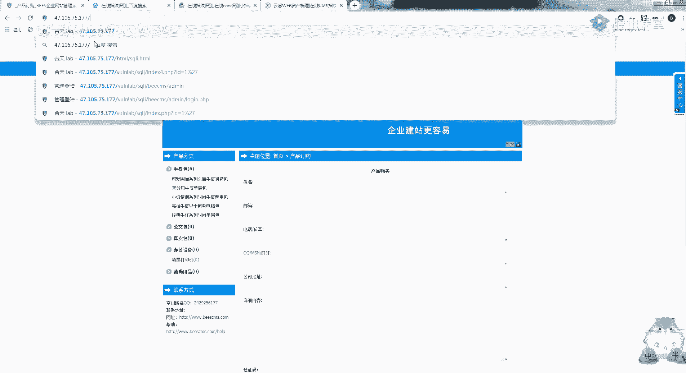

比如说是什么东西都没有。

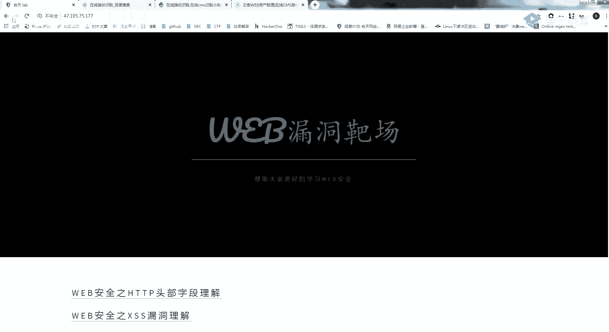

这啥也没有，那这里呢你看到所有的赞，都可以用这个来扫目录啊，然后你这里就可以看到一个诶，有一个a的命的一个后台，然后呢看一下啊，然后还有个boot，还有个upload，开个time。

这里呢我们根据这个目录来的，有一个admin的一个后台，是不是就到这一点了，就是我扫完之后，我就看一下后台有什么东西吗，这是一个思路，发现一个命的一个目录，然后呢就开始进行一个测试。

首先我们来讲第一个思路，第一个是识别它是一个b e c m s对吧，b e c m s，b s c m s，最简单的就是我百度1下b e ccm，有没有什么历史漏洞，你看直接就漏洞吧，当然我个人建议啊。

个人建议你们用谷歌呀，百度的话其实有点哎，我也不黑他好吧，就是不太好用，就是搜这种学术性的东西，或者搜搜这什么不太好用，但也是能搜到的，你可以看一下，这里有一个四个注入，然后这里还有个系统漏洞，你看。

当然他这一个有很多漏洞啊，有好有好几个漏洞，有好几个漏洞，你看任意文件上传这个输入，这里呢要给你们讲的就是一个四个注入漏洞，就在这个位置，嗯我先看一下我的bp，四个中路这个点都找出来吧。

有没有没找出来的，你没找出来就给我扣个一啊，就是如果连这个位置的一个四个注入，都没找出来的话，就扣个一，我感觉应该这里的一个是个猪肉粽，你们都没找出来吗，你们没有找出来吗，三个好吧啊，听我听我的一个啊。

就是，我教你们的最快最简单的一个办法啊，最快简单的一个办法一定要记住啊，就是不管是你这个b e c m s，还是以后所有的网站都可以这样操作，就是我是啊，我先看到一个bs后台管理登录。

或者我这里b e s cms企业网站管理系统，我们就可以去搜看它有没有一些历史漏洞，历史漏洞懂吗，然后我们看一下，随便就点开一个嘛，就会发现呃，他自己都看不了的话，找个看得到的。

就可以发现很多的一些文章啊，他这里有很多的一个漏洞的一个讲解，首先看这个是不是一样的，源码是一样的，虽然它的一个，它就有一个后台的一个四个猪肉洞，然后我们看一下它的后台啊，首先我们来试一下啊。

还是同样的，我自己就输个单引号嘛，然后123456随便输712b点击登录它，这里呢就出一个验证码不正确，啊可能是这个有问题啊，679d我们这里呢可以用bp来做，验证码还是不正确，什么鬼吗。

你们是不是有人在跟我同时啊，一起刷这个网站，在这里你是不是可以看出来，他有一个设置注入的一个漏洞，而且呢他这个验证码没有过期，就是我这一个验证码，我可以无数次的操作，只要我不刷新我这个网站。

那这里的一个四个字是不是就找出来了，对吧，这里呢就是我们的首先查看历史漏洞，然后呢，它的一个考点就是后台有一个四个注入漏洞，然后呢会有一个，啊这里呢可以用测试注入显示，待会给你们讲。

因为自己降低难度了呀，你看关键词就是b e b e s t m s漏洞，你这就随便搜一个吗，随便搜一个，然后我们就可以，根据他的一个判断就可以找到这个这个注入点，对吧，然后呢我们找到这个点呢。

可以看一下别人的一个分析文章，就是啊你可以看很多分析文章，他只讲了一个大概，因为首先你第一个这一个是开源的，那我是不是可以下载它的源码b e s源码下载，这里呢就要考验一点代码审计这个能力了。

当然你们可能代码都不好呀，这也没事，同样的，我来通过源码来给你们分析，他这个四个注入为什么会产生，这里呢也教你们一点点，就是这种代码审计的一个思路啊，因为这里呢要黑盒的话，就是你自己不看代码。

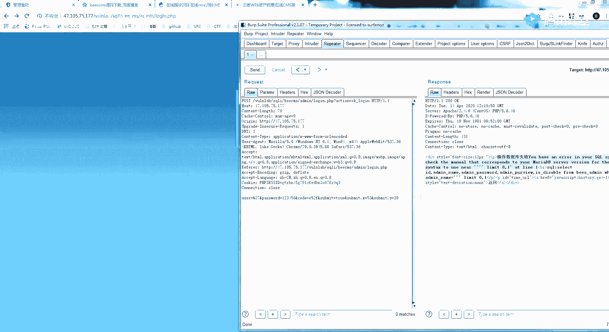

然后自己去猜这个四个字，非常非常恶心啊。

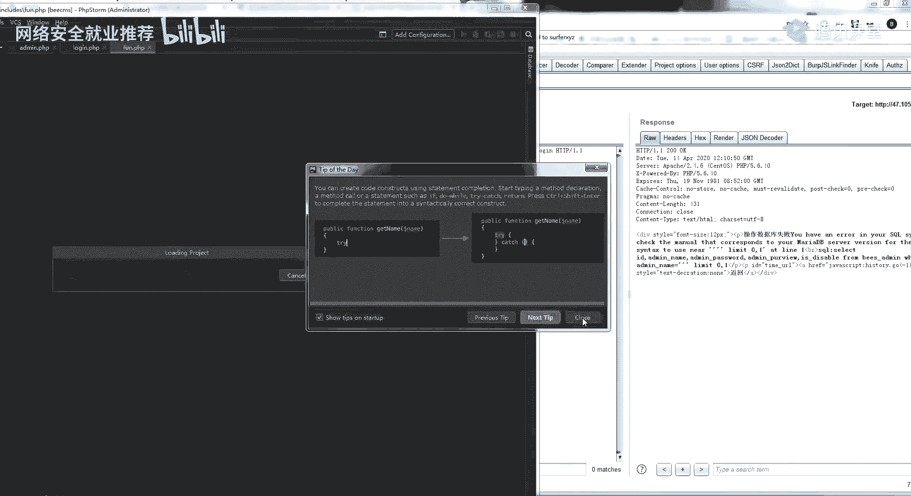

非常非常恶心，啊我们首先来看了。

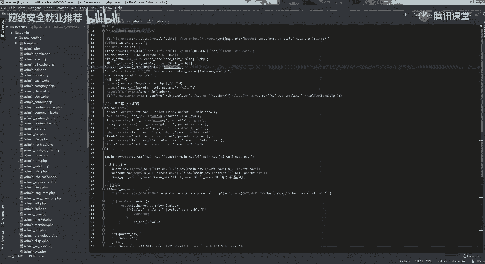

首先我们看一下这个设备注入的一个，文件是哪一个longan。

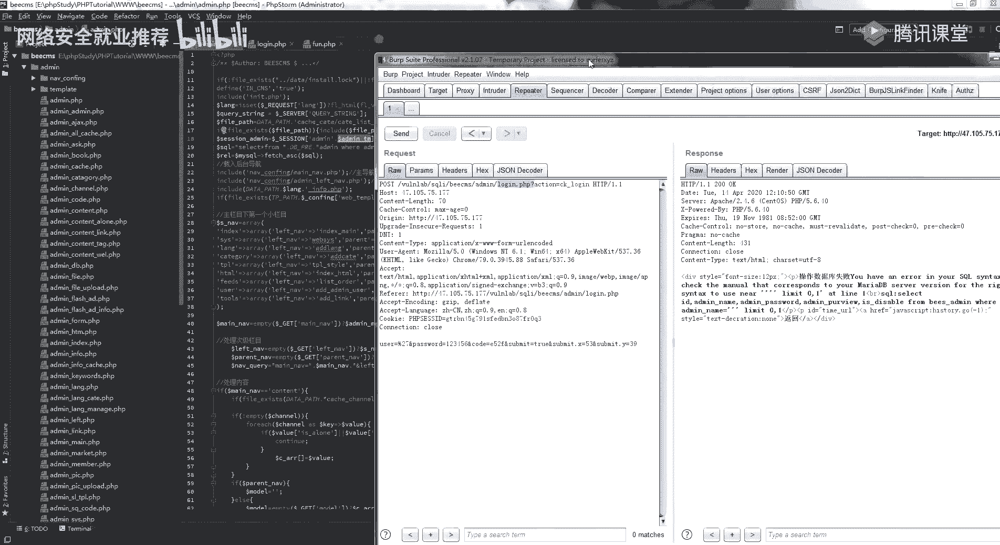

点菲律宾我们就找到这个文件啊，然后呢你当然可能会觉得很乱了，这里会很乱嗯，首先我们来看一下它，这里呢有一个。

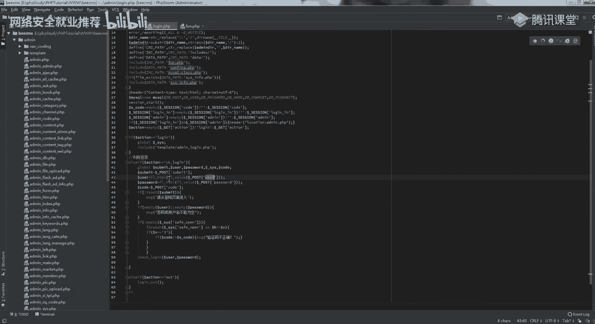

这个地方，这个地方是不是就是我们的一个user的一个参数，就是我们的这个user post user，对不对，自己能看懂吗，你看这个位置，这里呢就是通过post传入这个user的值。

然后我们再来看他这个user呢后面到哪里呢，到这一个chlogan这个函数里面去了，但是你首先经过了这两道过滤啊，这里能看懂的话，你扣个一，经验告诉你，我的命能出后台，嘿嘿，只有两位同学能搞懂吗。

嗯好这里1234567，还有几位同学不懂吗，嗯不懂，你就看一下前面的一些代码呀，就是我这个post就是这个传参嘛，这个肯定是知道的。

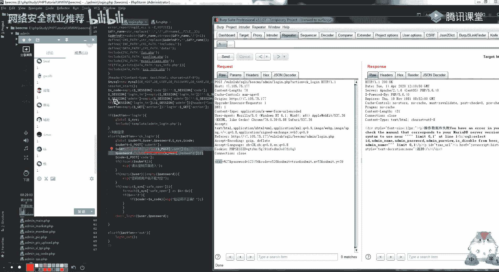

然后，这后面的呢就是首先他船舱经过了这两个参数，这里呢我们先这里也可以去看吧，我就跳到这一个里面去啊，你就可以看到那是不是这样的一个函数，这个函数它有什么作用呢，关键在这里。

他把这个里面的这些值都给它变成了一个空的，这也是为什么你们的双血可以绕过去，这样就先给你们截个图啊，看一下它的一个绕过规则，先给你们截个图啊，这个很重要，这里呢我先不看我先不看好吧。

然后我再来看这个chicken loken，这里面为什么会有一个注入啊，你可以看到这是我们刚刚传入的一个user，对不对，这是我们刚刚传入的这个user。

然后这个user呢就传到了这一个mysql语句里面，然后你想一下user是不是只经过了两个，刚刚的user只经过了，经过了两个过滤，然后呢直接进入这个sl语句里面，那我们是不是只要绕过这两个过滤嗯。

超过这个fl html，这个基本上不用看，你看它自然就是一个实体化，他这个的意思你们学啊，sk注入应该有学吧，防刺客注入用的就是把一个，把这两个框框变为实体，然后呢这一个就是我们绕过这个东西。

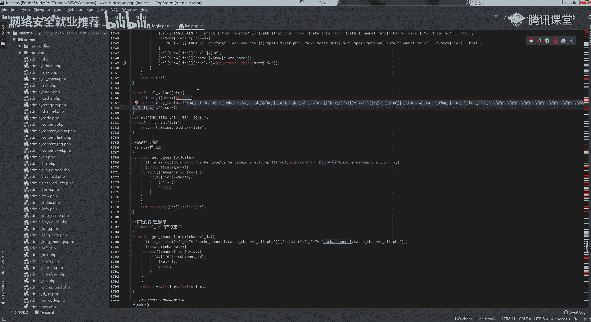

这是一个黑名单的一个匹配，好我们来看一下。

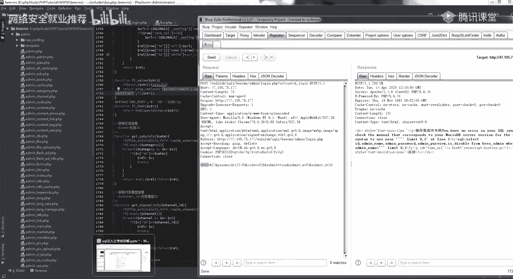

我们继续来看这个，首先我知道了这里存在一个是注入。

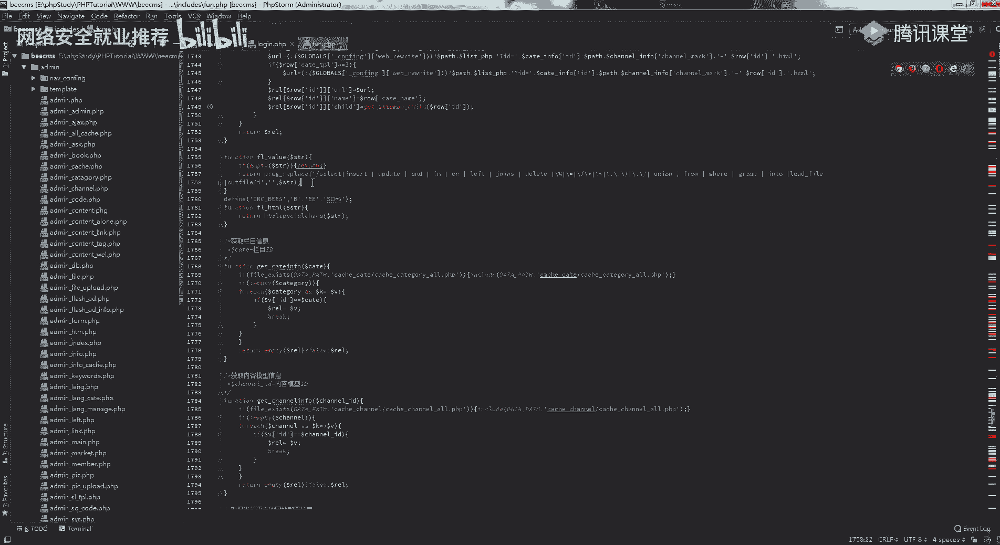

然后我知道了他的一个绕过的一个规则，我们看一下怎么绕过。

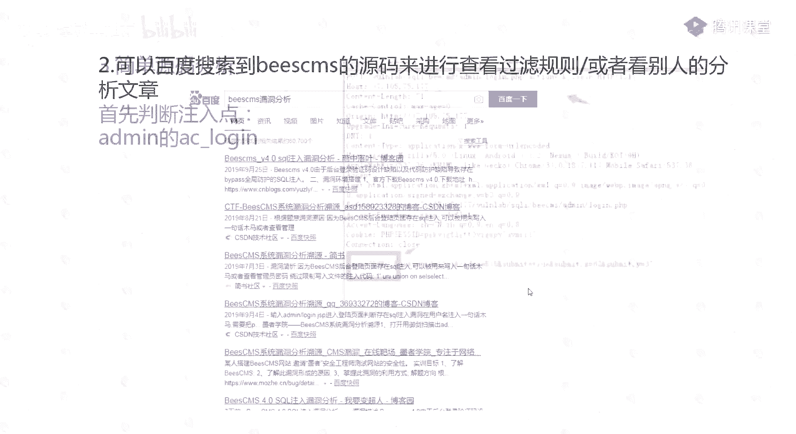

首先我判断这个注入点啊，这里可以看到很明显。

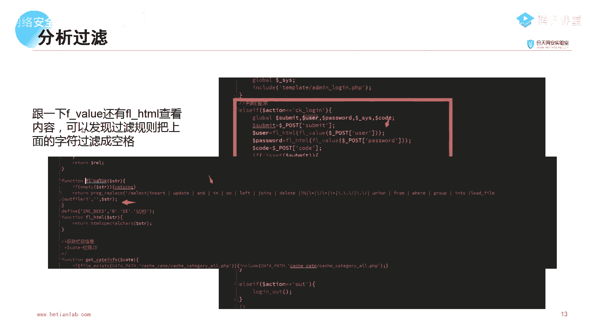

这几天刚刚也跟你们讲啊，首先我们是不是要做的是一个old by，就是我刚开始最开始教你们的就是啊，先用old by来判断嘛，对吧，hold by 5，你看它是正确的，或者by 6，它就是一个错误的。

当然它这里呢啊，他的联合注入是没办法显示的呀，这里没办法联合显示，但是你看到这个报错的详情，是不是能想到一个报错注入对吧，我看到这里我报错，那我能想到一个报错注入，那我用爆头之路怎么做呢。

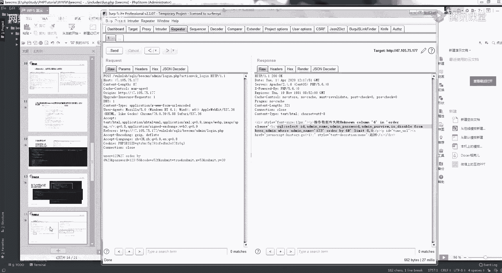

首先第一个我们来看这个过滤的一个规则。

他这里的意思呢就是把这个slat变为空的，然后这个u n i n变为空的，然后你想一下我为什么要这样做啊，首先你看我这中间的u n i o n两个空格，这个地方是不是匹配了这一条。

那我这两个东西就是变为空，把它去掉，那我后面这两个u n i n是不是组合起来了，又变成了一个，这个我这个select就是中间这一条双写，其实所有的绕过都是针对程序来写的呀，就是我程序怎么写。

我就怎么绕，那我到这个地方这个u n i o n，然后要构造成这样，这个能理解吗，能理解的话，扣个一，为什么要这样构造，还有几位同学不懂的，你就再来看一下，就是我们的这一条这条语句的意思。

就是把我这里面的这些字符看到，这个匹配到的没有，就是我这里面的字符都变为一个空的，都把把这里面的字符变为一个空的，然后呢我这里呢当我这一串变为空的时候，我这剩下来的两个字符，那我就重新组合起来了。

变成这个样子，那我后面就好做了呀，首先我们来看一下啊，我们看一下它的一个过滤，还是看一下他把这里的and and，然后啊，from where group intro，这些啊变为一个空的。

那我们来看一下，首先一个简单的一个boss注入报错注入的语句，它是不是这样的，and首先我是报他的数据库，首先我的一个数据库的一个报错注入，是不是这样的，先把这个call过来吧。

首先我的一个数据库报错注入，原来是这个样子，就是它一条完整的语句嘛，就是and，然后加这个，再加我们的一个debus，我们首先勾一下，哦他这个and呢，他这个and呢，因为是它这里呢匹配的是一个空格。

and前面要有空格，他这里呢才会去掉，所以我这里直接就把b e s直接爆出来了，但是我按前面加个空格呢，你可以看到这是我们的一个sql语句，我这里的end就不见了，那我就可以用这样的一个啊。

首先一个a然后amd and双写，这样就可以进行一个绕过，你看我们的sql语句，那我们再用这个啊circle的一个报错语句，我们查了一个库了，是不是要开始查表了，查表的话也很简单。

查表呢我们还是首先来看啊，呃，我把原来那个爆头猪的那个ppt给弄出来啊，我就不直接哭了啊，我把语句扣上去，然后我自己给你们敲，现在你就看得仔细一点，首先我们看一下报社注入的一个报表名，是什么样子的。

这条语句的话应该大家肯定是记得的，它的一个语句呢是这样子，这个and嘛，然后这里面呢就是一条查询语句，那我们就对着我刚刚发给你们的。

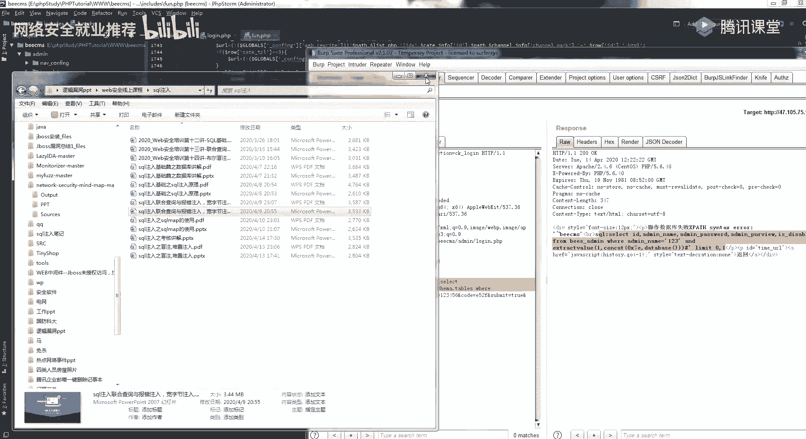

一个过滤的那个截图，这个截图一个一个看，首先这个and发现and空格它会过滤，那我就在这里加一个空格and好，这样我and呢就构造好了，然后再来看这里呢有一个，cocat它没有过滤掉。

然后slislice呢就是在这里，那我在这里面输一个这样的，然后group它又可以，它又被过滤掉了，看到没有，这里，那我还是同样的嘛，用这个双写进行一个过招绕过，然后负重也是，然后再看v。

然后tab设置等于debus，这里呢你可以看到最坑的一个，就是这个等号被过滤了。

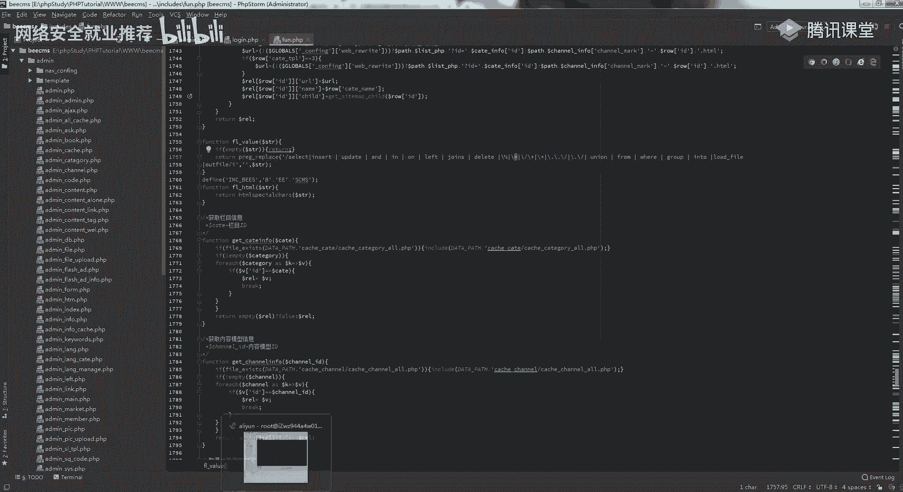

那我这个等号被过滤了怎么办呢，对吧，我这个等号过去了，你看一下啊，我这所有的一切前面都还是正常的，但是我后面这个等号没了，等号为空的，那怎么办，因为我这他等号是不管多少个等号都是水库嘛。

你看这是dress没了，反正就，啊那我是不是，可以想到另外一个就是一个in搜一下mysql in，首先来看一下mysql中的一个硬的一个用法，啊我只有我记得我只有在一个boss注入的时候。

讲了一个north in对吧，在这里讲过一个north音，当时还没怎么停，因为它是一个条件语句嘛，那你想一下我这个north英语，如果我把north去掉呢，就是这一个ceo什么东西在这个值里面。

当我只有一个值的时候，是不是就啊，这个就类似于，16进制代码不行啊，like也可以，like也可以，方法很多呀，方法方法很多，啊我这个呢就是这个in呢，其实就啊就是类似于一个等号，等于id。

这里呢是一样的，你没有自己的思路也不错啊，挺好的，然后我这里呢嗯，就弄一个硬，in的话，他是要打括号吗，然后看一下你错了，这个in呢它也被屏蔽掉了，你来看这里的一个音。

那我们在同样的同样的老办法忽略这样啊，那他的这个表明是不是就出来了，后面的后面的话还需要讲吗，一个思路就是这样，首先是我先去查看它的一个过滤规则呀，我查看它的一个过滤规则。

然后我利用这个过滤规则进行一个绕过，这里的话应该挺简单的吧，啊可能就是你们如果手工去绕的话，绕的比较恶心啊，啊，查表的数据它会报only什么什么什么，嗯查表的数据，你是看查哪一个表呀，查不出来啊。

我试一下，因为我具体他这个mysql它在哪个表里面，我也忘了，然后你再来看一下爆裂的一个语句啊，还是一样的，就是我把这个我这个报表呢，因为他这个表你看到没有，它只能显示32位，没有出来。

然后我这后面再加一个and note in什么什么东西，就跟你们之前的报酬注入一模一样，这就不讲了，然后他这里爆裂呢，诶哪里去了，它爆裂的一个plot的也是一样的。

你看let grp contact它的这个名字，然后后面接一串，刚刚有的同学说他没办法报什么东西啊，你是说表的时候对吧，就是sli，看一下啊，that我们是admin name，他这里是抱住我的命令。

然后人民pass，怕死的吧，就是我一顿查询，我就爆出来了，这个这一个bs admin里面有这样的一个列，然后负重，from我们的一个b s的命吧，对吧，是这样吧，然后我们再来进行一个过滤，绕过过滤。

这个绕过select，好吧啊，数据库操作，oppo数名列，这里，打括号啊，这不是查出来了吗，这里，这不是可以查出来吗，你看他的用户名是adm，然后我们单看一个password，他这个怕说的不就这样吗。

呃直接绕过登陆径管理啊，也可以，因为我我跟你们说过吧，就是我可以搜这个b c m s，还有一个零哦对因为看到这个这个没有，他总共呢base 64是有32位，然后我这一个，然后我这一个吧。

这个东西呢他把这个32位给去掉了，你懂吧，这是比较尴尬的一件事啊，他把这个32位给他去掉了，但是呢我不加这个0s7 ，还有，爆出来了，他图又爆出来了，我是不是加了两个0x7 啊，难怪我加一个0x7 。

它就爆出来了，然后我们去搜一下啊，记住啊，cm。五cm d5 可以在线解密，我们的一个md 5，或者稍微问题我，问题或者说问题，我这两个比较好用，我们去解密一下，输入我们的刚刚这个md 5的一个值。

看一下，解密，此密文无法识别，还是这个的原因吗，又多了一个071吗，看一下多少位，1234578 90 60 70 89 22，12232425，他这才报出25位呢，那我们就继续加一个条件嘛，没有啊。

有多可硬，不要admin gutf word，not in，好，咦他这为什么还有呀，01920什么什么500哦，他这是把最后面的爆出来了吗，他这个就有点坑了呀，因为他是个sim，因为它是一个叫什么去了。

他是一个六啊，32位，还有32位才可以，我看一下啊，那他命234是一个m，就我这他这个爆头之后只能做出一半呀，就是admin的一半，截断嗯也可以对，可以用截断，啊就是我这里的一个。

我这里的一个grab contact at，我就再加一个sub，suv s t r，然后我就再加一个条件，0x7 ，然后服用对他这个括号得打在这个地方，嗯s b s t r的一个，啥用去了，自己都忘了。

contact，还是给你们讲盲注的时候讲的，我用left吧，用left吧一样的，哦不left，他总共只有这么多呀，没办法呀，这里自然就是在这个地方，因为我们原来这里呢是一个整体对吧，普通。

这条语句是一个整体，那我呢在中间把它截断一下，就是把这条语句截断一下，反正最后得出来的是a的命123，他的一个账号密码呢就是一个a的m23 ，后面呢你们就可以用这个东西登录，你看，主要是我这一个值呀。

我这个值我可以啊，比如说我还可以用之前的一些截取字符啊，主要还是因为我这一个爆速度，只能报这么多位吧，报32位，你手工珠没上，所以一定要记住啊，我给你们讲的思路在啊，不管是在渗透其他网站。

或者是我们的练习靶场之前，你首先你就得去搜一下，说一下这个东西有什么漏洞，它是不是一个cm s，如果是cm s的话，就很有可能网上有公开的一个漏洞啊，我跟你说用历史漏洞的话，是可以拿很多东西出来的呀。

就是叫什么圈历史漏洞，啊现在外面的一个漏洞，基本上就是历史的历史遗留的漏洞，占了将近三四层吧，或者四五层，然后还有一个绕口令，这两个半壁江山，整个山坡里面的，好然后我们再来看另外一种啊。

就是之前是没有给你们讲的，这个sql注入呢是可以进行一个写cl的，因为我只教过你们用smap写一个cel，当然有同学自己去研究过啊，就是怎么用这一个选项，首先你要记住一个点，写shell呢。

一定要是可以使用联合查询语句啊，一定要可以使用这一个联合查询语句，如果你不用联合查询语句是没办法写的，因为他要先调用一个slice的一个语句，然后我们看一个看一下这条语句是什么意思，这个就是sli。

然后这1234什么东西都不用管了，月总共15条嘛，把这一串数据写入到to alfie，因为我这里aufile呢它是也是被过滤的呀，所以我自己加了两个写入到这个路径里面去，切入到这个psp里面去。

你们可以看一下效果，所以呢这一题呢也是你你比如说你要拿cr的话，也就很简单，他这个题目呢总共有，首先我第一个我这个四个注入可以拿下，就是可以拿到我们的一个网站权限。

然后呢还有一个是叫b e s t m s吧，他后台有一个任意文件上传完，看到没有，这有一个后台上传漏洞，发给你，首先你看登录到后台，你们可以去拿着啊，后面是可以复现的。

当然啊下一节课的文件上传也会讲这些东西啊，会讲这个我就不过多讲了，今天呢我要教你们的就是一个，set注入的一个选项，首先第一个满足的条件要可以联合注入，第二个条件是叫，i circus的配置。

他那个配置叫什么东西去了，忽然之间一下忘了啊，你可以搜一下s e c对，它这里呢它需要为空或者为一个新号吧，因为空或准备新号，你们可以去搜一下这个配置，他这个是什么意思呢，它这个就是他这个配置的意思。

就是，标明你这个mysql可以在哪一个目录可以写，当然我这里啊，我这里的一台服务器啊，好像是这台吧，我这台服务器是设置了你们可以任意可写，好我们来看一下效果呀，首先我先把我的这个，l l s吧。

这样你们看的好一点，还是阿波罗的，就是我这b1 cm s的，所有目录都可以写三个龙吧，我们来首先我们把这个语句call一下啊，我同样的，我把这个语句发给你们了，你首先看一下这个语句的一个作用是什么。

至于我为什么这里要用0x呢，这是因为开始给你们讲的一个配置。

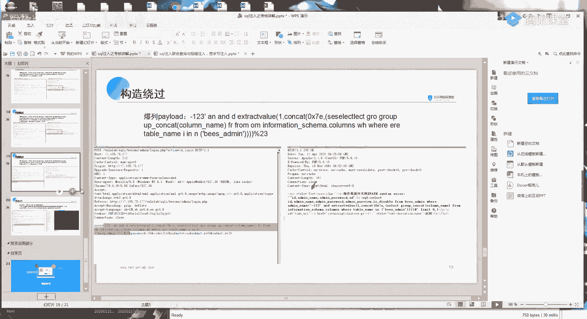

还记得吗，就是在这个地方，他把这两个给实体化了，我们的mysc就没法写这个地方。

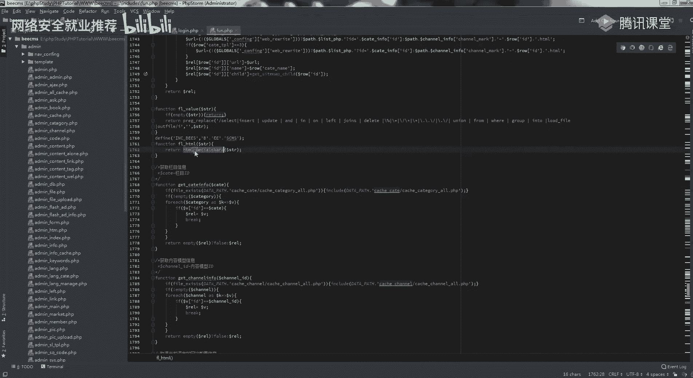

虽然我这里用0x进行了一个绕过啊，我这个目录我改一下啊，这个目录是随便你们挑的，我们看一下啊，这里是没有，我这一个，这是点psp的，然后再看一下，播了出来，然后我cut看一下，同样的。

这个1234是什么，1234，然后呢这一条好好，诶，看一下他这个语句呢，就是把这一个这个代码给他写进去，写到我的，杠四和杠b c m s哦，我记得有同学是问过的呀。

对有同学是在问这个文件路径是怎么样的啊，首先我要跟你们讲一个。

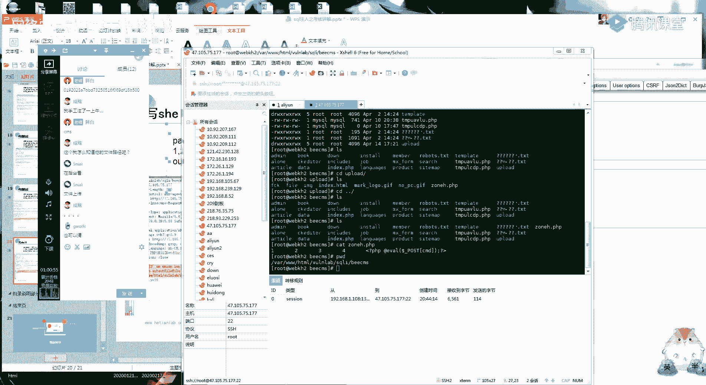

首先我要讲一个经验，首先第一个你看我们的网站了。

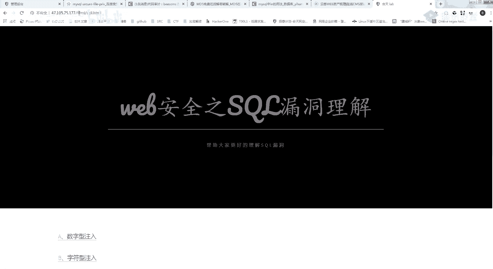

你看我们的网站是什么样子的，我们的网站路径是不是这样的，然后呢我们可以从这里面可以看到，就是呃我们在抓包的时候，你可以看这边有个返回包，可以判断它是一个阿帕奇，然后是一个生产os阿帕奇的目录，还记得吧。

杠vr杠杠w杠四星没有，这是让你们linux搭建那个网站的时候的一个目录，这是默认的，我这就没有改，当然还有其他办法呀，首先第一个我这里的一个字符的一个错误啊，啊这一个没有爆出来，我看一下啊。

他这里没爆出来的话，那就只能用一个，看一下啊，就是mask里面有一些配置，你们后面会学，我现在我现在讲给你们听一下吧，讲给你们听一下，就是mysql有一个at at sdr吧。

mysql的一个alt f death dr，它的一个意思呢就是把我们的一个mysql，这查不到呀，就是把我们的一个叫什么东西去啊，把我们的一个路径，把我们的mysql的一个路径给爆出来。

把我的mysql路径爆出来，至于把这个路径爆出来有什么用呢，啊首先我如果我是linux的话，我可以猜到对吧，但是如果是菲律宾四大顶呢，菲律宾四大顶，那我目录是不是就没法猜，等一下啊。

我把我的pcb study开一下，然后我们来看一下这个配置比study，一定要记住这些常见的目录，是你们自己需要记的，我们的一个网站根目录，是不是，比如说我这里是一个e盘。

然后这个地方3w就是他的网站跟路径，那我们的mysql在哪个位置，你看这是3w，这里就是mysql的位置，那我如果用刚刚的这一个，用我们的刚刚这一条，是不是可以把我这个mysql的路径查出来。

然后我们再结合常见的一个路径，是不是就可以把这个3w也给构造出来，所以说它的路径大部分是靠猜，所以为什么我开始说过mysql，它的一个get shell是很条件是很苛刻的，另外呢还有还有一种呢。

还有一种就是，数据库报错啊，不跟你说，啊就是比如说我随便找一个网站了，我想一下也不能找别人的，比如说你看我这我这aa是一个错的，登录后台系统设置，这里这是没有的，就是可能有一些网站的话。

是会有一个是会有一个，路径的一个配置，就是它会直接出来在网站的一个配置里面，所以呢其实这一次的一个考核说难也不难吧，只是对你们初学者来说就是比较麻烦，所以他的路径是猜出来的，干边二杠3w干kml。

当然了，当然我记得这里好像不止一个题目吧，啊如果我没记错的话，你们有一个，好吧，这里钻石只给了一个特助，就是还可以配合其他的一个漏洞，进行一个其他的漏洞，进行一个路径的一个配置。

当然我觉得这里应该就很好做了呀，-1，然后n i n，这里我改为一个cs，你看，这是我们的一个mysql的一个路径啊，linux的一个路径基本上是可以猜出来的呀，如果是那个的号，好，开始一个在线解答了。

这个考核，你们哪一个点没有听懂的，我就再简单的给你们讲一遍，你们要记住，就是要去会百度，百度搜索这一个cms，然后如果还有没做出来的，待会儿记得下完课自己再去做一遍，因为你可能觉得我自己听懂了。

但是你实际实操的时候就会发现很多问题，嗯你们都没有问题吗。

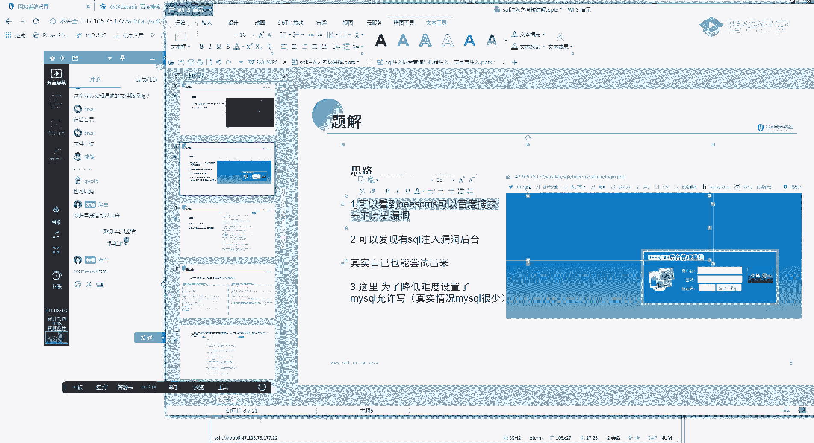

都没有问题的话，我就slice为什么不用加空格啊，不是跟你们说了吗，代码写的，你看一下这个slit是不是没有空格，然后我这个u n i o n是不是他加了空格，是根据代码来的。

所以说啊那些盲猜的应该也找到教训了吧，如果你如果你能看着这一个过滤的一个代码，来进行一个绕过，是不是就会舒服很多，你也不要怪我们。

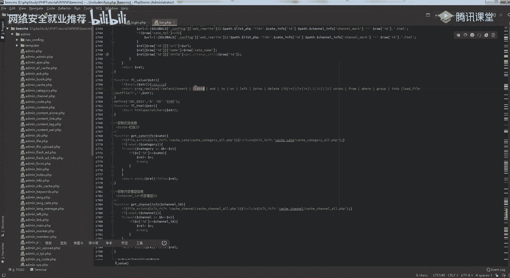

怪我坑你们了啊，这个是很正常的，你们多动手的话才会有一些思路吧，多动手对啊，我代码我直接就搜嘛，b e s t m s，然后我就可以搜到这些啊，这些源码，然后他们很多渗透。

就是我可能我这个网站可能没有历史漏洞，但是我比较厉害了，我就直接去下载他的这个源码，然后进行一个分析，今天重要的思路还不只是那个aw少了一堆注，就是没有的命，悠着点啊，awa死也是他妈不跑的话。

得自己写temple，不写temple跑不出来的，这个因为有过滤，然后他这一个我跟你说，他这个漏洞不知道是怎么回事，我写tao，他自己也没出来，所以我就没跟你们讲那个天赋了，所以为什么我教你们这个猪肉。

还是要教你们手工，如果这个smap真的是个万能的，我就根本就不需要教你们手工了，喝个map不是万能的，你看我这之前都写好了一个探讨，但是他跑不出来是真的尴尬，内容管理上传的码为啥会给注释。

我要看才知道呀，那一个啊，我讲了刘师傅会打我的，他这不是后面还有一句文件上传嘛，对吧，你看，我讲完课之后就是文件上传了，文件上传的话，到时候会给你们讲，上面都会有的，好吧啊。

这个注入的一个课程基本上就在这了，另外给你们啊提个小建议，就是觉得我们前面课程讲的还不错的话，给我们刷个好评好吧，给我们去放个评论，后面的话会慢慢学，待会儿的话我就给你们啊，再开个小课吧好吧。

再开个小课，好，那我今天整个社会中的一个学习过程，基本上就完了呀，你们有时间的话就自己再复习一下，回顾一下。

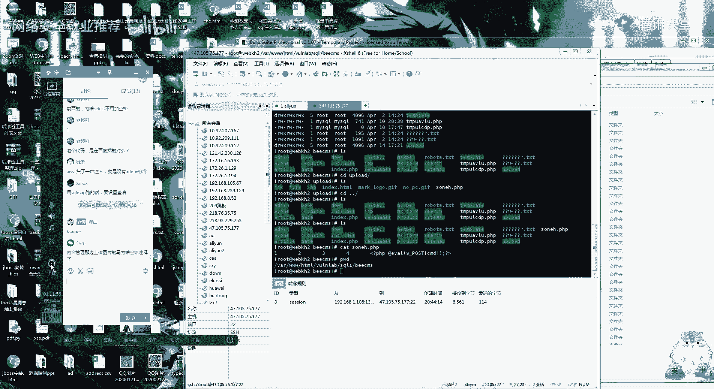

好啊。