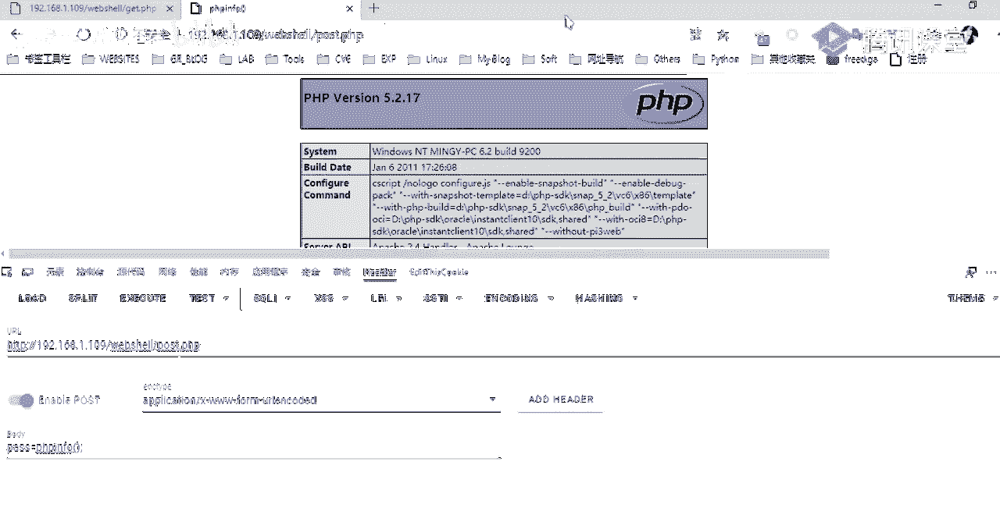
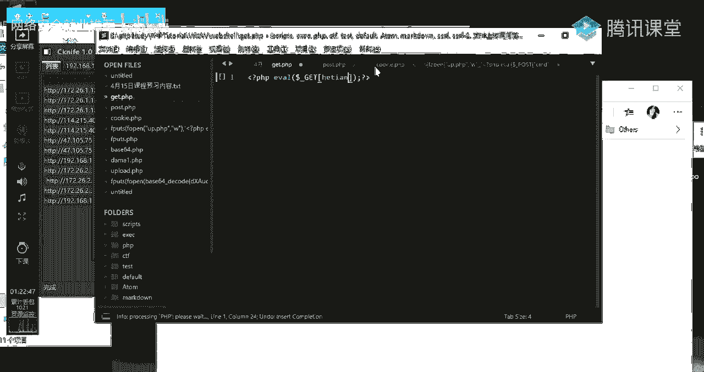
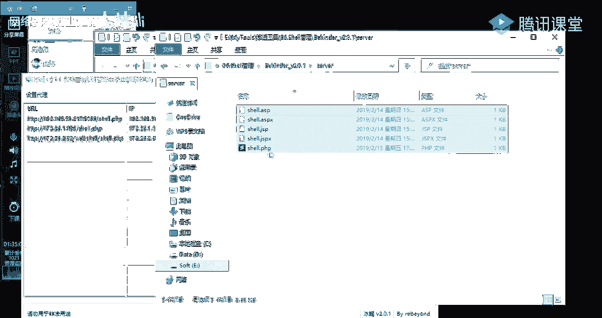
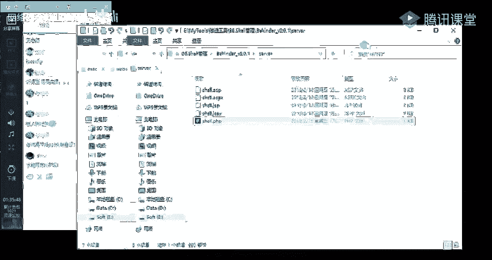

# P16：第14天：文件上传基础及过滤方式 - 网络安全就业推荐 - BV1Zu411s79i

好大家晚上好，呃时隔一周，我们又再次见面，嗯首先的话嗯我大概介绍一下我吧，就是呃就大家如果说有问问题啊什么的，就前面的话也忘记说，给大家做一个基本的一个介绍，就我的话姓刘，大家叫我牛老师就可以了。

逆刀牛，大家就叫我刘老师就可以了，好的话，我们本节课的一个课程内容的话，就是一个web share的一个介绍，呃，啊为什么要讲这个web shell呢，就是呃我们在明天的一个课程，也是这一周的一个课程。

内容的话就是一个文件上传漏洞的一个介绍，以及它的一个应用，然后在讲文件上传之前的话，呃，就是我特意就是对着一个web share做，给大家做一个介绍，就是啊介绍什么是一个web share。

以及它的一个基本的一个工作原理，还有的话就是一些常见的一些web shell，的一些管理工具，就是说在我们之后的一个文件上传课程的时候，会去用到，好的，我们先来了解一下什么是web share。

呃就web shell的话就是啊以sp p h p j，s p等等这一些网页文件的一个形式，存在的一种命令执行的一个环境，好的话，这些这些啊，网页文件的话都是一些动态的一些脚本文件。

我们的话可以将其称作为一种，网页木马的一个后门，然后的话攻击者就是呃，通常会通过这样的一个网页后门的话，来得到网站的一个服务器的一些权限，包括的话控制网站服务器，来进行一个文件的一个上传下载。

还有查看啊，数据库以及能够执行命令，前面我们有提到就是说网页木马后门，那什么是一个木马呢，木马的话它的一个全称就是这个特洛伊木马，英文的话是这样子的，就是它是指技术在计算机里面的一种非授权的。

一个远程控制的一个程序，然后它的一个作用的话，就是呃开放系统的一个权限，然后泄露用户的一个信息给攻击者，然后的话是哦黑客常用的一种工具，而且它的它是能够在计算机管理员。

不被发掘的一个情况下来得到系统的一个权限，那后门后门是什么呢，哦首先我们需要了解到，就是说我们的一个计算机，我们的一个服务器上，一台计算机上面的话，总共的话是有65535个端口，6535。

然后每一个端口的话，它就是呃计算机与外界连接所开启的一个门，就说呃计算机与外界与进行，与外界进行一个通信的话，就是通过端口来进行一个通讯的啊，每一个门也就是每一个端口的话，它会有提供这样的一些服务。

然后攻击者的话就通过利用这样的一些服务，来获得问服务器的一个权限，然后并且给自己进入计算机留下一个后门，就常见的一些服务，比如说我们之前说到的一个8年端口对吧，八零端口的话。

一般的话默认都是啊提供了一个web服务，也就是我们访问的一个网页的话，都是呃一个web服务，然后的话还有就是说呃，我们的一个远程桌面对吧，3389端口，就提供我们能够通过远程去连接啊，计算机的一个桌面。

还有的话就是呃常见的一些linux系统里面的s h，就我们可以通过s h的22端口，来去连接我们的一个linux系统，oh what will show，然后的话web share。

它会它根据文件大小的一个文件大小，以及根据脚本的一个类型的话进行了一个分类，首先第一个就是根据文件大小分类的话，有以下这三种，第一个的话就是一句话，木马也是我们经常会使用到的。

它的一个优点的话就是代码仅仅仅短，我们从名字的话也能够知道，它就是只有一一行代码，也就是一句话嘛，然后它是使用的话是十分的一个方便，然后还有就是小码，小码的话就是呃包含文件上传功能。

它的体积的话啊比较小，当然的话它是相比于大码来说，它的一个体积是啊比较小的好，大码的话它的一个体积的话就比较大，它包含的话是有很多的一个功能，然后它里面的一个代码，通常也会进行一个加密的一个隐藏。

因为它里面的话呃，代码的话代码量的话是比较多的，里面的话会有一些啊敏感的一些函数，然后通常为了就是说绕过一些呃对代码呃，里面的一些函数的一些敏感，函数的一个检测的话，它通常会进行一个加密。

而第二个的话就是根据脚本类型去进行一个分，类，我们常见的就是像这种js p s p，s p x以及ph p，这些的话都是一些呃动态的一些网页脚本文件，这样的话像我们现在其实呃经常去讲的，也是像菲律宾啊。

因为呃我们经常碰到的一些网站啊，一些cm都，它都是基于一个菲律宾的一个语言，去进行一个开发的，那web需要的话它有一以下的四个特点，这样的话我只列举了四个，前面我们说到就是说web shell的话。

他一般都是由这样的一些动态的一个脚本语言，呃，呃并写出来的，就是说它是一个一个动态脚本的一个形式，出现好的话，它就是一个这样的值得一个木马后门，就说web share，它就是一个木马后门。

然后木马后门的一个特点呢，就是说我们能够通过这样的一个啊，菲律宾的一个web share，比如说一个菲律宾的web shell，能够得到啊服务器的一个权限，以及能够在服务器上面去执行。

我们想要的一个命令，以及查看服务器里面的一些敏感信息等等，第三个的话就是web share，它是可以穿越服务器的一个防火墙，就是说呃我们这里说的一个web share。

其实从名字上面就能够知道就web嘛，web然后跟shell的一个组成，有web的话，它是我们常说的一个web服务，也就是我们啊经常会去使用到的一个八零端口，shell的话就是一个呃一个后门。

就是能够得到权限的一个啊这样子的一个web share，一个web后门，然后web shell的话，它通常都是通过八零端口去进行一个，数据的一个传递的，也就是说攻击者与我们的一个服务器，去进行一个交换。

数据的话，它都是通过一个8年端口去进行一个啊，传递数据的，嗯所以的话就是web share，他一般不会在系统日志里面去留下，这样子的一个记录，它只会在我们的一个web日志，留下我们的一个数据传递记录。

然后的话我们了解到了一个web share的一些，基本的一些特性，我们一起来了解一下，就说web share，我们如何去利用一个web share来去进行一个攻击，就它的一个攻击流程。

先第一个就是利用web漏洞去获取web的一个权限，就比如说我们啊一个通过一个网站对吧，通过一个cm的一个网站，我们得到了他的一个web权限，就是说能够去执行命令，或者说我们能够去上传文件。

也就是我们之后会去讲到的一个一种方式，还有的话就是说呃通过啊，就是上周有讲到的一个circle sql注入对吧，通过sql注入也是可以得到一个web share，得到这样子的一个web shell。

之后的话，我们通常会去上传一个小码，为什么要去上传一个小码呢，就前面我们有了解到是小码的话，它就是一个文件上传的一个功能对吧，我们利用它的一个呃文件上传的一个功能，来去上传我们的一个代码。

这里的话大家一定要就是呃就明白要区分开来，就是说小马它的一个作用，就是为了用来算上传大码的，就是说呃你们可能会有疑问，说为什么我不直接去上传一个大码呢对吧，就这里的话就我们前面有说到，就大码的话。

它的一个体积是比较大的，就说它呃它的一个代码量是十分多的，等会的话会给大家去看一下，它的一个代码很多的话，就是说我们直接去上传的话，它的一个呃就是数据的一个传递的话，量的话会比较大，就是说动静会比较大。

然后的话我们通过这样子的一个小马，去进行一个传递的话，就嗯要更加的一个隐蔽，也更加的也就是说能够去绕过它的一些呃检测，第四个的话就是呃远程调用web share来执行命令，也就是我们最终的一个目的。

就是我们通过我们上传的这样子的一个大码，还有的话就是我们的一个呃，来去执行我们的一些命令，获取服务器的一些信息等等，这就是一个基本的一个啊，利用web share去进行一个攻击的一个流程。

然后下面的话我们一起就是大概来看一下，就是说我们常见的一些web share，首先第一个的话就是菲律宾的，我这里的话有列举了两个，然后这里的话都是以一一个，一句话木马的一个形式，就说呃是一个一句话木马。

我们首先看来看一下第一个，一个的话它是一个菲律宾的一个web shell，也就是菲律宾的一个一句话木马，然后我这里的话，我就大概介绍一下它的一个结构吧，就是说菲律宾代码的话。

它它都是以这样子的一个开头以及结尾，如果开头的话，它是有一个这样子的一个监括号，然后接一个问号，后面的话是接p h p，就是说表示我们的这样的一个文件，它是一个菲律宾菲律宾的一个代码文件，然后结尾的话。

同样的是接一个问号以及一个镜框，就是啊这前面的话呃就小于号以及大于号，当然的话不是说这就是这个意思吧，然后中间的话就是我们的一个呃代码，这个代码的话就是，我们首先看一下这一个i5 函数。

这个函数的话就是用来执行我们的一个，菲律宾的一个命令，我们可以看一下，i5 函数它的一个解释是这个i o函数的话，它是把字符串作为一个菲律宾的一个代码，去进行一个执行，就大家心有这样子的一个概念。

然后的话我们再来看一下中间这一个括号里面，括号内容里面的话，就是啊我们用来传递数据的一个方式，传递传递字符串的一个方式，因为前面我们说到就是说这个era函数的话，它是用来执行我们的一个呃。

就是把我们的一个字符串作为一个菲律宾代码，去进行一个执行，然后这里的话我们需要传递一个，我们的一个字符串，然后这里传递字符串的一个方式的话，就是以get方式去进行一个传递的。

就是说啊这一个多的符号下划线加一个get，注注意的话是要大写的啊，接一个中括号呃，这个叫方块吧啊，里面的话就是接一个参数pass，就是我们通过这样子的一个pass参数来像啊。

我们的这一个文件去传递我们的一个数据，也就是传递我们的一些命令，同理的话，第二个就是以一个pose的方式。

然后呃关于这个get post的话。

就是前面讲那个hp方法的时候，大家应该都有都了解了吧，就其实前面的话已经有讲过，如果还是没有不是很明白的话，呃不知道大家有没有去看这样的一个文章，就是说菲律宾里面它的这样子的，几个函数的一个区别。

就是说get的话它就是用get方式来提交数据，我们前面有提到，就是我们提交get数据的话，就是比如说这里是一个p h p文件是吧，我们在后面接一个问号，问号后面的话就是接我们传递的一个参数。

然后传递的一个参数的话，就是一个比如说我这里的一个木板，就是一个pass参数，对吧啊，这个pass参数的话就是后面的话接我们的一个，啊传递的一个字符串，这个字符串的话就会传递到这样啊，就会传递到这里。

就这一个意思的话，就是获取我们通过这样子的一个get方式，传递的一个数据，然后的话给这样的一个i p函数去执行好，这样的话，我这里比如说我这里输入一个ph info是吧，好它传递到一个ap函数的话。

它就会显示一个psp info的一些信息给我们，然后的话pose的话也是同样的。

这里的话哦好啊，等会我会以实际的一个例子，去给大家做一个演示，然后就是a s p j s p x哦，还有js p这一些的话哦，就大家呃看一下了解一下吧，这样的话，其实它的一个大体的一个框架也是类似的。

只是啊就是你写这些脚本的一个语法的话，语法要求的话它是不一样的，没看到的话，这里是通过一个request，它同样的也是一个就是呃，通过request来获取我们传递的这样的一个呃字符串。

然后的话给af函数去进行一个执行啊，以及下面的这里也是同样的一个意思，指示的话它传递了一个啊就是它的一个函数啊，它是不一样的，好啊，我们前面大概了解了，就是web需要它的一些基本的一个呃特点。

以及它的一些基一个基本的一个样子好，下面我们一起来了解一下web shell，它的一个基本的一个原理，就web share，它的一个原理的话，就是，首先第一个就是它是一个可执行的一个脚本。

然后的话这里的话是，hp的一些数据包，也就是我们通过这样子的一些方法来去进行，一个呃获取我们传递的一个数据呃，就是接收我们传递的一些一些字符串，然后的话给我们的一个呃，执行函数去进行一个执行。

而第二个的话就是一个数据的一个传递，就说我们通过我们的一个啊pass参数，比如说以这个为例子，通过我们的一个pass参数来向啊，我们的这样的一个菲律宾的一个脚本，来传递我们的一个数据。

第三个的话就是执行传递的一个数据，执行传递的数据的话，就是有以下这样子的几种形式，呃当然的话，我这里的话是以菲律宾脚本文件做一个啊举例，好首先第一个直接执行的一些p h p函数，有这样的一些我们常见的。

也就是呃经常去使用的一个ever及system，就执行系统命令i5 的话，它是把我们的一个字符串，对我们传递的字符串，作为一个菲律宾的一个文件去进行一个执行，然后到第二个的话就是文件包含。

文件包含的话就是呃在下节课就在文件，我们讲完文件上传之后的，下一节课就会给大家去介绍一个文件包含，就我们通过文件包含这样子的一个漏洞，来去包含我们的一个文件，来执行文件里面的一些菲律宾的一个代码。

那第三个的话就是动态函数的一个执行，而这里的话，这样的话大家了解一下吧，就可能呃不是如果没有了解过菲律宾的话，可能不是会不会很好懂，我们以这个为例子，就说我们这里就传递一个这样子的一个b区。

并four给这一个变量对吧，然后的话我们可以把这个变量当做一个函数来，就是去进行一个执行，就比如说这个的话，传递了一个这样的一个字符串ph in for，然后的话我们可以把这个ph for字符串。

当成一个函数来去进行一个执行，然后他执行之后的话，就是啊会返回一个变形four的一个信息，哦最后一个的话就是回调函数哦，这样的话我先了解一下，就在呃之后的一个课程，就是在讲命令执行的时候。

我会呃给我会给大家做一个详细的一个介绍，好的话就是我们一起来了解一下，就是常见的一个ph web shell，就其实前面的话已经给大家做一个，基本的一个介绍，我这样的话就列举了三种方式。

就是以get方式来去进行一个传递数据的，以及post的方式，还有我们可以通过cookie来去进行一个传递，我们的一个呃字符串，也就是传递我们的一个命令啊，这里的话我以呃我做一个演示。

想到这里先新建一个呃，比如说get，新建一个get的一个bp文件。

然后的话直接把它复制过来，复制过来，然后这里的话就是一个一句话，木马的一个pp文件了。

嗯就这样吧，啊这就是一个呃pp的一个呃一句话木马文件啊。

我们怎么去进行一个访问，然后的话去进行一个执行命令的，我这里的话是在一个菲律宾啊study的一个环境，选择等ph b，然后我这里的话直接去访问这样子的一个，一句话木马文件的话，它是会没有回血的。

就没有任何的一个显示，如果大家看到有就说没有这样的一个形式的话，就说明你这一个文件是能够被解析执行的，如果说有报错或者说无法访问的话，那就说你那就是说明，你这你的这样子的一个一句话木板文件。

他是无法去进行一个解析的，如果无法去解析里面的一个ph p代码的话，那么我们就不能够通过这样子的一个，木马文件来去哦，得到服务器的一个权限以及执行命令，那我们怎么去啊，利用这样子的一个get方式。

来去进行一个传递参数，首先我们，以get方式，然后我们传递了一个字符串的话，是要给这个pass参数，我这边的话传递一个kb for好，大家要注意的话，我这里的话是传递了这样子的一个。

ph b four的一个字符串，其实也就是一个函数，一个菲律宾four的一个函数，然后这里忘记提了一点，就是ph info好吧，菲律宾呃，文件的话，a b代码的话，它都是以一个分号去进行一个结尾的。

就说你必须你在啊pp和代码后面，你需要加一个分号来表示，你的这样的一个代码是已经就是结束了，就说这样子才是一个完整的一个代码，然后我们回车回车之后的话，可以看到它显示了这样子的一个。

菲律宾four的一个信息，就这一个的话就是ph for的一个信息，它里面的话就是包含p h p的一个版本啊，还有p h p里面的一些详细的一些信息啊，以及它的一些配置的一些扩展啊什么的，呃。

还有就是阿帕奇的一些环境等等对吧，这样的一些信息都能够啊被列出来，而这里的话就说明我们的这样子的一个呃，一句话，木马文件是执行了我们这样子的一个，菲律宾info的一个代码，他的话可能大家可能就是觉得。

就只返回这样子的一个信息啊，没有什么用对吧，我们可以通过一个system这样子的一个函数，来执行我们的一个系统命令，然后因为我这里的话是在windows系统。

所以的话windows系统比如说我先查看一下ip对吧，比如ip config，然后我们回车回车之后的话，可以看到我这里的话。

就显示了我当前这一个机器的一个ip地址，的一个信息，可以在这里看到，就是等于就是呃在这里，等于就是我通过这样子的一个web share，然后通过这一个system函数来执行了啊。

windows系统上面的一个ip config，来查看ip信息的一个命令，然后这里的一个返回信息的话跟这里是一样的。

你看到我这里的ip是1。1。9对吧，这就是执行他的一个系统命令啊，以及比如说呃d i r来查看，就说我当前目录下面的一些文件，然后当前目录的话就是这个目录，然后我这里之前的话可以看到。

它会显示我当前目录的这样的一些文件啊，这样的话是，他这里显示是是这样子去显示的，可以看到就是啊这里有一个啊时间对吧，还有的话就是这里的话是一个文件名，然后前面的话它是一个文件的一个大小。

有一个b374 k对吧，这样子的一个ph p文件点击还有个大码一，还有大码二对吧，总共的话是有五个文件，这就是一个嗯菲律宾的一个一句话，木马的一个web share。

然后的话还可以去去执行其他的一些命令，就是说在windows里面的一些其他命令，大家可以尝试一下，比如说啊net elder，就是查看啊用户，然后退游走。

咳，可能会报错了，想，啊比如说我可以执行这样子的一个l s命令，来查看当前的一个目录，然后在linux里面的话，就呃我们使用的话就是一个linux的一个命令，这样的话，因为我这里的话是有有这样子的。

一个linux的一个环境，所以的话可以去执行这样的一个命令，然后这里的话就是一个get方式，一个get方式去传递我们的一个呃，就是执行命令的一个字符串，背个一句话木马，然后我们一起来看一下。

就是以post的方式去进行一个传递。

我们。

保存保存之后的话，同样我们呃进行一个访问，王者的话，呃不好意思啊，喉咙有点哑。

然后稍微有一点咳嗽，所以的话可能讲的不是很，所以啊稍微有点咳嗽声，就希望大家见谅，然后的话我们可以看到，就是我这里直接访问之后的话，它是没有任何其他的一个报酬，就说明我们的这样的一个一个一句话。

没文件的话，它是能够被正常解析的，然后的话我们怎么去进去，进行一个数据的一个传递，也就是执行我们的一个命令，我这里的话用啊一个high bar的一个插件，当然的话你也可以使用一个bp。

我们通过bp抓取这样子的一个数据包对吧，好的话，我这里的话因为是使用了一个，要去使用一个post的方式去进行一个传递，我们的一个数据，对吧好，我这里的话是一个get方式。

所以的话我这里需要把它做一个就是转换，转换的话这里有一个小技巧，就是呃在bp里面的话，你右键右键或者是说呃，呃你右键就右键，然后的话这里有一个change request master。

就是改变我们的一个请求的一个方法，然后我们可以啊，就是选择一下，选择之后的话，可以看到我们当前的一个数据包的话，它是改成了一个post的方式对吧，又不需要我们自己去手动去改一些啊，一些请求头。

而我们透透视的话，大家应该都知道，就是我们post的一个数据化，是在我们的一个请求包里面的，一个请求体里面对吧，就是说在这里我们去进行一个数据的一个传递，我们这里以一个pp for去进行一个传递。

传递我们的一个ph pinfo的一个函数，然后我们执行执行之后的话，可以看到有这样子的一些返回信息，就大家可能看到这些信息的话，不知道它是显示的一个什么内容对吧，我们可以通过bp里面的这样的一个功能。

这个render，然后这里的话它会显示，就是说当前的就是你的这一个代码，在web上面它显示了一个样子，就呃就是能够让我们更加直观的去看到，当前的一个请呃，一个返回包的一个内容。

可以看到这是一个菲律宾four对吧，然后我们同样的，通过system函数来去执行我们的一个命令，好我们执行执行之后的话，可以看到，这里返回了我们的一个ip地址的一个信息。

这就是以一个post的方式去进行一个，去进行一个呃执行，我像web需要传递我们想要执行的一个命令，他的话呃，我们也可以通过这个hack bug的一个插件，就是呃五五个浏览器里面有这样子的一个插件。

我们可以通过这个插件来去传递，我们的一个命令，然后我们执行，可以看到的话是可以执行。

我们传递的一个命令的，这就是一个post的方式。

去呃下我们的一个一句话木马，传递我们想要执行的一个命令，好，然后第三个的话就是呃一个cookie的一个方式，去进行一个传递，它这个代码的话就是这样子，好像你的话，把代码发群里吧。

然后第三个的话就是一个cookie的一个方式，去进行一个传递，他的一个代码的话，就是这样子的，然后这里我们就大概来看一下它的一个构成，而这里的话它是以一个cookie的一个方式来去获取。

我们传递的一个数据，然后他传递的数据的话就是通过这个一参数，就我们需要通过像这个一参数，传递我们的一个呃字符串，然后的话给我们的一个菲律宾代码，然后的话主要的话是不是看这里，就说这一个asset。

asset这个函数的话，它同样的也是一个执行命令的一个，ph一的一个函数，就把这个asset它的一个意思是检查一个，就检查我们的这里的一个函数，它是否是呃为false。

然后的话它如果是传递的是一个字符串的话，它就会这样的一个函数，当做一个p h p代码来去进行一个执行，然后的话就是达到执行我们想要的一个代码，的一个目的，那这样的话我们看一下，就是这个cookie。

我们的一个代码怎么去进行一个呃连接，啊前面的话呃，它不像前面的一个get方式，还有push的方式去进行一个连接，而去进一个数据的一个传递，它是通过cookie啊，前面的话我忘记哦，有说了，呃后面再说吧。

后面再讲web shell管理工具的时候再给大家说吧，就是我们的这样的一个一句话，木马的话是可以用一个web shell的一个管理工具，也就是菜刀啊，这样的话是11刀去进行一个连接好。

这里的一个cookie的一个方式的话，我们啊去使用这样子的一个工具，去进行一个连接，然后这里要注意的话，就是我们需要在我们的一个请求头里面，去传递我们的一个呃代码，也就是去传递我们这样子的一个代码。

因为因为这里的话它的一个cookie函数，它的一个意思的话，就是从我们的一个啊请求头当中获取cookie，获取，从cookie这一个请求头当中所传递来的一个数据，也就是我们这里的一个数据。

然后获取之后的话，就能够给我们的一个asset函数去执行，执行的话就是像这样子，我可以通过啊，当然也可以通过这个hack bar，或者是说呃bp去进行一个呃传递，然后它的一个效果的话就是这样子。

主要的一个哦，点的话就是在这里我们需要添加一个，我们的一个cookie的一个请求字段，cookie的一个请求头，然后它的一个值的话是这样子的一个形式，就是就是我们之前的一个ever的一个呃。

一句话木马的一个代码，然后这里的话。

我同样的给大家做一个基本的一个演示吧，先创建一个。

文件。

我们保存啊，其实啊我这里的话是我直接在我这里的话，要说一下，就是我这里的话是我直接在我的这个web服务器，里面的这个web share目录下面，直接创建了这样子的一个文件，就模拟的，就是说我们呃啊。

把我们的一个web share，已经放到了一个服务器上面去了，当然的话我们啊，不可能说直接这样子去进行一个写入的，就是说我们需要通过一些得到一个，web share的一个方式。

然后的话上传我们这样子的一个web，share的一个文件，然后的话来去进行一个呃执行我们的一个命令，然后的话在明天讲的一个文件上传内容的话，就是会就是介绍，如何去通过文件上传的一个漏洞来去。

直接上传我们这样子的一个web shell文件，然后的话通过这样的一个web share文，web share文件来得到服务器的一个权限，我这里同样呃去访问这样子的一个文件。

c h e完之后没有任何报错，就说明的话是没有问题的，然后的话我们需要，我这样的话用这一个hb我们需要传递呃，怎么去向这个web share传递我们的一个命令呢，我们首先需要添加一个cookie头。

cookie的一个请求头可以好好它的一个值的话，就是它的一个值的话是一等于，诶这个项目机，然后的话我们需要像我们的这个，就是这里的一个一句话木马，也就是我们的一个cmd参数，传递我们想要执行的一个命令。

比如说我们这里传递一个ph并four好，我们来执行，执行之后，可以看到他成功地执行了，我们想要执行的一个ph inform命令，好的话，以及，on fire，好像你写错了，我这里执行不了。

我这里的话是需要执行，就是我们的一个菲律宾的一个代码，所以的话我用那个工具。

这样的话就是一个web share的一个管理工具。

也就是一个啊c当好，这样的话我添加一个就是它的一个使用的话，其实比较很简单的，我这里的话直接右键添加，添加的话，这里就是输入我们的这样的一个呃，一句话木马的一个链接，然后添加到这里地址。

而这里的话我们需要传递的一个参数的话，就是一个cmd是吧，就是我们这里的一个cmd参数，然后添加添加之后的话，因为它是需要添加一个cookie头的，所以我们这里需要设置一下，就请求头，这里请求头。

这里的话我需要设置为这样的一个cookie字段，然后后面的话接我们的一个呃，传递的一个这样的一个菲律宾的一个呃代码啊，呃这里的话要记住要开启这个请求头，然后保存可以看到已经设置成功了。

然后的话我们直接双击，双击之后的话就能够呃，打开我们的这样子的一个就文件管理的一个，功能。

当然的话它还有其他的一些功能，比如说一个模拟终端。

模拟终端的话，就是一个像我们的这样子的一个呃，这样的一个终端，就是一个命令行的一个终端，我们可以在这里执行我们的一个命令，一浮空。

哦我这里我说，我说怎么执行不了，我这边的话我搞错了，我这里写错了，不是不是衣服，config是ip configure，因为呃就好。

大家也不要搞混了，就是在windows里面的话，他查看ip的话是一个ip config，然后在linux里面的，因为linux用的多了，就总是搞混，在linux里面的话是一个依附config。

来去查看他的ip信息，所以的话这里的话是呃。

因为在windows里面，他没有这个衣服comp格的一个命令，所以的话他执行不了，然后比如说jr，然后的话我们可以在这里执行，就是说在windows有这样的一个dos命令下面。

能够执行的一些命令，都能够在这里去进行一个执行啊，比如说呃外卖i，麦可以看到我当前的一个权限的话，就是我这里当前的这一个用户的个权限。

这就是一个通过cookie的一个方式。

来去传递我们的一个命令，就其实前面讲到呃的这三种。

其实就是说我们通过这样的三种方式，来跟我们的一个web share，去进行一个数据的一个传递，首先就是get post，就是我们常见的两种方式对吧，就我们通过get方式来去向服务器传递。

我们的这样的一个命令，然后的话给这个web share去进行一个执行，执行之后的话，它会想返回给我们一个响应，也就是我们执行的一个结果，它会返回给我们，然后这里第三个这个cookie的话。

就是通过一个cookie的一个请求头，我们通过我们的一个cookie，请求头里面去携带我们的一个呃数据，然后的话传递给我们这样子的一个web share，来让他执行。

这其实就是啊web share的它的一个能够去执行命令，的一个基本的一个原理，这是cookie的一些执行命令，然后第四个的话就是呃我们通过一句话去写，我们那个小马，就前面我们就是有给大家介绍。

就是说web share它的一个攻击的一个基本流程，就是我们通过获得一个web share对吧，然后我们我们的话需要去传，上传我们的一个小码对吧，我们已经有了一个基本的一个啊web share。

然后的话我们可以通过一句话木马来去，好像服务器写入我们的一个小码，然后的话通过这一个小马来去上传，我们的一个大码，然后这里的话如何通过一句话，木马去写一个小马，它的一个基本的一个命令的话。

就是就是这样子的一个代码。

就这样子的一个代码，这个代码的一个意思的话，其实就是这个f puts这个函数，就是说我们通过这样子的一个代码的话，我们只需要直接访，就直接去访问这样子的一个ph的一个文件，我们访问之后的话。

它就会去执行执行它的一个效果是什么呢，就是说他通过这个f open函数，它会向它会在当前目录下面写入这样子的一个，以up。pp为文件名，然后它的一个内容是我们的一个一句话，木马背一个内容，当然的话。

这里的话我只是一是以这样子的一个例子，我们这里的一个一句话木马内容的话。

是可以替换为我们的一个小码内容，哦哦这里要做一个演示。

就我同样的就是说在我先创建这样子的一个，我不需，比如说谈吐，puts。

puts。hp。

然后我们保存，保存之后的话，我们可以看到，当前的话它是没有这样子的一个呃up，没有这样子的一个up点菲律宾文件的对吧，刷新一下啊，我这里的话，我通过去访问这样子的一个这个f puts影片区。

在这一个cp文件，大家大家别眨眼，注意看就注意看这里，然后我这里回车。

哦这里的话写错了，我这里的话是呃忘记了，加那个菲律宾的一个就是它的一个格式，大家一定要注意，就是它的一个格式的话是这样子，然后就是以这样子的一个开头，就只有这样子的，你要满足他的一个ph文件的一个格式。

这样子的一个菲律宾代码，它才会就是说给我们的一个菲律宾的一个。

解释器去解析执行我们的一个代码内容，我们保存一下，然后我们访问，访问之后。

然后可以看到，可以看到在这里一闪一闪而过的话，会生成这样子的一个up点菲律宾文件对吧，我们打开看一下，打开看一下的话。

里面的一个内容的话，就是我们的一个呃菲律宾的一个一句话木马，当然的话我这里的话把这一个我们要做的话。

就是通过一句话木马去上传我们的一个小码，我们这里需要把我们的一个，就是里面的一个内容。

把它做一个更改，就是替换成我们这里的这样的一个小马，我们看一下这个小马它的一个内容，就它是怎样子的，lol。cop就是这样子的一个菲律宾文件，它它它的一个功能其实就是选择一个文件对吧。

就说我这里随便选择一个文件。

然后上传上传之后的话，可以看到它会在当前目录。

它会生成这样它会上传上传这样子的一个文件，它的一个功能就是这样子，我们要通过这个小满来去上传一个大马。

然后现在我需要做的就是，我们需要需要把这个内容就是把它好，通过这样的一个f puts，这样的一个就是写入hp文件的一个函数。

来把我们的这里的一个内容，把它写到一个kp文件里面，我们看一下ppt，这样的话它的一个内容的话是比较多的，就是这一部分。

然后我这里的话大家可以看看一下，我在群里发的这个文件内容，就我这里的话把我们的这这里的，就是这一个文件里面的一个内容，做了一个base 64的一个兵马，就是说我们在这里的话，因为菲律宾里面的话。

他去上传这样子的一个呃文件的话，它里面是不允许包含一些特殊的一些字符的，就说这些字符的话，他去上传的话，它是会嗯就呃写入不成功的，所以的话我们这里需要需要对它做一个兵马。

编码的话就是做了一个base 64的一个兵马，哎我这里呃不用工具了吧，我直接在，直接用呃，有网页的一些bus 64编码的一个工具。

没有啊，当时，我这里的话就对他做了一个贝斯，64的一个兵马，然后编码之后的话，有没看到的话，它里面有一个等号哦，因为等号的话它算是一个特殊字符，就说用啊，在post请求里面。

它它是不允许包含有这样子的一个特殊字符的，所以的话我们还需要对它做一个兵吗，就是做一个二次兵嘛，就需要把这个等号把它给去掉，有点卡了，然后编码之后诶，可是有问题啊，我用这一个编码工具吧。

把它做一个base 64的一个编码。

这里然后编码之后的话，他这里的话是有一个加号，我们需要把这个这种特殊的一个字符，把它给去除，然的话我们再做再对他做一个兵马，编码之后的话，可以看到就是呃已经没有，他都是这样的一些字母对吧。

大小写字母还有数字组成，然后这里的话就是我们，嗯啊嗯嗯。

我的咳嗽，然后这里的话编码之后的话，就是我们的这里的一个内容对吧，然后我们怎么去进行一个利用，就是说怎么去把我们的这里的一个数据啊，写入到这样子的一个文件呢，就我们因为我们前面的话是经过了两次的。

一个base 64的一个兵嘛，所以的话我们需要把它做一个解码，因为你编码之后的话，我们想要让它还原成原来的一个样子对吧，就还原成原来的一个ph p代码。

所以的话我们需要用这个bassist 4 decode，这样的一个函数，就是p h p里面的一个函数，把我们的这样你的一串字符做一个解码，然后做了一次解码之后的话，我们还需要做第二次。

因为我们经过了两次的一个编码，所以需要两次解码，然后的话再做一次解码，解码之后的话，然后再写入我们这样子的一个文件，然后这里要注意的话，这里是同样的做了一个vc 64的一个兵马，我们可以把它做一个解码。

解码之后的话，它的一个内容的话就是这样子的一个up点，p h p，就是他那个他就是把我们的一个这样子的一个，小码的一个内容，把它写入到这样的一个up点菲律宾的一个文件，然后它的一个内容就是这样子。

这里可能呃我这里的话给大家做一个演示。

同样的新创建这样子的一个呃hp文件，就叫贝斯64点p h p吧。

然后我们写入我们的一个内容，要注意的话，就是呃，一定要符合他的一个p h p的一个和代码规范，然后的话把我们的一个p h p代码写写到这里，我这样的话直接贴进去，写进去的话就是这样子的一个文件。

啊我们保存保存之后的话，呃它会呃它会生成一个app。p h p，我这里的话先把这个这个up。ph 1，先给它删除掉，删除之后的话，我这里再去进行一个访问，访问这一个。

从这一个base 64点p h p文件，然后大家注意看，这边会生成一个up点片区域的一个文件，可以看到对吧，那我们直接来访问这样子的一个up。pp文件，可以看到就是一个小马。

就是一个包含上传文件功能的一个小码，这里的话就是这一部分内容，就我们通过这样子的一个一句话木马，来写入我们的一个小码，当然的话这里的话要注意的话，就是需要做一个base 64的一个冰嘛。

就大家可以自己在课后去进行一个尝试，就说你可以尝试，就是说啊做一个一一次兵马，就是只做一次被364编码，然后去进行一个呃，铁路的话，啊我们上传我们通过一个一句话木马写入，写入了我们的一个小码之后。

我们要干嘛对吧，我们就利用这样子的一个小码的一个功能，来上传我们的一个大码，上传成功之后的话，我们访问这一个大嘛，他那个样子就是这样子，然后它里面的话有十分丰富的一个功能，我这里的话哦以这个为例子哦。

因为这里的话哦，我这里已经，已经有，我先把这个把它给拷贝过来，就是这里的话已经没有大码，点一点菲律宾了对吧，那我这里选择呃，把这个文件上传上去，然后点击上传，可以看到这里的话就已经上传成功了对吧。

上传成功之后的话，我直接去进行一个访问。

打完之后的话就是这样这样子的一个界面，哎呀啊。

这里的话是一个登录的界面，就是说你需要输入一个密码，能够去进行一个登录，然后这里的话它那个密码的话就是一个hiking，这里大家可以自己做一个更改。

就是改成自己想要的一个密码，然后像这种密码的话，其实呃有这种很简很简单的一个木马啊。

一个密码的话是可以被爆破的。

就说呃大家就是说如果你碰到有别人上传了，这样子的一个代码文件对吧。

就你可能你某天你啊你去扫，你去扫那个网站对吧。

你扫出来这样子的一个文件，然后这个文件的话就是像这样子的，像这个样子的一个文件，然后一个输入框要让你输入密码对吧，这个时候你可你可你可以去进行一个爆破，就是说你的这个，因为它只有这样子的一个登录嘛对吧。

你可以通过bp去进行一个爆破，把他的一个密码爆破出来，然后的话你就能够得到服务器的一个权限，就说哦黑吃黑嘛对吧，就这个网站已经被别人黑了，然后已经有了这样的一个木马，一个后门木马。

你直接通过他的一个木马，就能够得到它的一个权限，就不用去什么，还要辛辛苦苦去找找漏洞对吧，然后这里的话就是这样子的，一个代码的一个文件，然后可以看到有很多的一个功能，这里的话是在当前的一个目录对吧。

我这样的话可以切可以切换到上一级目录，是上一节目的话，就是啊我的这里这里的一个目录，然后还有像呃，像什么呃文件，因为我这里的话是一个windows的一个系统对吧，所以的话它这里是本地磁盘。

是c d e盘对吧，可以看到有c盘和c盘的一个文件，还有d盘啊，e盘的一些文件都能够查看。

就是说已经我们可以通过在这样子的一个代码，来去操作我这里的一个计算机，计算机，也就是我这里的一个。

就是目标的一个服务器里面的一个文件了，然后这里的话其实还可以去进行一个上传文件。

可以我们可以通过这样的一个大码。

还上传我们想要的一些，比如说上传我们的一个工具，把我们的一个和一些文件一些工具，比如说我这里上上传一个这样子的一个，exe文件对吧，然后上传到哪个目录，您可以选择。

然后选择这样的一个文件，然后上传对吧。

就可以看到就是我这里的话就已经上传成功了，大码的话它呃它的一个功能的话是很多的对吧。

能够去上传文件，也就是呃pg并four的一些信息。

系统的一些信息啊，都能够查看到。

还有可执行ph的一个脚本，就这样的话我们就能够通过这个代码，通过这一个web share来执行我们的一个脚本，这个可以看到还有可以执行其他的一些，比如说，执行可以看到对吧。

就相当于就是我们前面的一个一句话，木马的一个功能，到这里的话已经有了。

这样的话，执行sql语句的话，你首先需要知道你的，你首先需要知道目标服务器。

它的一个数据库的一个密码，我这样的话就以我当前的这个p h，p 10大理的一个环境啊，密码的话就是默认的root，然后执行执行之后的话可以看到就执行成功了，还有一个版本对吧，还有可以修的一个p。

缺德base，可以看到这句话显示了这样子的一个呃，系统的一个数据库对吧，哦还有其他的一些像比如说端口扫描啊，就是扫扫描你当前服务器的一个ip有哪些端口，当然的话还有就是就是说你的这个服务器。

就一般的一个服务器对吧，如果说你是你拿到的这个服务器，它是在一个哦可以访问内网，也就是说比如说你是拿到了一个企业，拿到了一个企业的一个这样子的一个，就是说在外网的一个服务器，然后这个服务器的话。

它是可以去访问公司的一个内网的，这个时候的话，我们可以就是说通过这样子的一个服务器，把它作为一个跳板机去去，就是获取一个你在公司内网的一些信息，对吧就是可以扫扫内网的一些端口啊，还有他的一些存货主机。

然后的话以这样子的一个机器，进行一个内网的一个渗透，当然这样的话就呃提一下。

这里的话就是一个p h p大嘛。

我们呃刚刚可以看到，就他这个功能的话是相当丰富的，就说呃可以有很多的一些功能，然后的话下面的话我们继续我们那个课程内容，下面我们就给大家介绍一些，就web需要的一些管理工具，哦又，哦忘啊，刚刚又忘记啊。

讲着讲着就忘了，跟大家就是做一个互动了，就大家应该都听懂，听得懂吧，就我的这一些操作就说课后的话会有呃，课后的话会有一些就是一个课后作业啊，就大家就是把我在课上的一些操作做一下，就操作一下。

对实操实操的话就是大家在课后的话，我操作一下，然后有问题的话直接问我好吧，就务必就务必要大家要能够，就是自己去动手去操作一下，好的话，务必要去弄懂这样子的一些操作，好吧就力求大家要能够听得懂。

然后要能够操作，然后这里的话web shell的一个一些管理工具的话，我这里列了有五个，就是一些常见的，首先第一个的话就是就提到web，需要管理工具的话。

就不得不提的一个一个呃web share的管理工具，就是菜刀，中国菜刀他那个全名的话就叫中国菜刀，就是他的官网是这个，当然的话这个工具的话是已经呃，就就是说在现在的话是已经比较过时了。

就比较老的一个工具了，就可能功能功能方面的话就是不是很好用了，而且可能就是说你的你就说这，而且它的一个呃网上下载那些菜，中国菜刀的话，可能有一些木马后门什么的什么的，就大家就是呃给大家介绍一下啊。

用的话呃随你自己吧。

然后第二个的话就是一个c一刀，就是我刚刚用到的这样子的一个工具，就说这个啊c nife，这个的话它的一个界面的话就是像这样子的，他那个，网站就大家在github上面去直接搜这个cnife就行。

就是刚刚的话也也给大家有演示哦，还有的话就是，我用这个就是刚刚那个get点菲律宾对吧。

还有pose的p点，菲律宾这样的一些一句话木马，都是可以通过这样的一些web，需要的一个管理工具去进行一个连接的。

就比如说这个呃，比如说这个get我直接直接在这里添加，然后的话输入我们的一个链接，就我们的这个呃菲律宾脚本的一个路径，一个链接一个url，然后的话这里这里的话是输入我们的一个密码。

这个密码的话其实就是其实就是呃这里。

其实就是这里我的这里的一个代码里面，就是说密码的话，就是这个这里的这一串。

当然我这里的话是写的是一个pass。

我这话是写的是一个pass，你也可以改成其他的，像比如说呃，比如说什么我听对吧。

嗯你可以改的更复杂一点，就说因为如果说你这里的话比较简单的话，别人也是可以去能够去爆破，爆破出来你这样的一个密码，然后的话能够得到你的这样的一个shell，然后这里密码的话，我这里嗯。

我这里的话就写写的是一个pass对吧，然后我添加添加之后的话去进行一个访问。

现在不要改了，you get。

刚刚我改了一下，所以的话他这里的话连接失败，我这句话在，哦这个我用这个pose了吧，然后可以看到这里的话就是能够执行，能够去进行一个正常的一个连接，然后的话还有他还有其他的一些功能，比如模拟中呢。

还有数据库管理啊，就是说能够去连接我这里的一个数据库对吧，连接我这里的一个数据库，然后的话去进行一些数据库的一个查询，当然的话像这样子的，主要的话就是一个文件管理嘛对吧，就是我们可以新建我们的一个文件。

还有上传我们的文件，还有下载对啊，我们可以下载，还可以修改啊，诶还可以双击打开，就打开查看里面的一个内容等等，然后的话还有就是这样的一个虚拟终端对吧，这样的一个虚拟终端的话。

我们可以能够在这里执行我们的一些命令。

这就是一个c一刀，就是说这个c刀的话，我个人觉得是比较好用，而且它是一个java开发的，就界面什么的都比较紧密，而第三个的话就是这个v vv，这个这个的话它是一个，就是说在那个卡里面自带有的。

大家可以直接输入这个前面的这一串river，能够直接就是能够打开，然后输入杠h的话，能够查看它的一个使用帮助，这样的话我就不多讲，就可以通过这个vivo来去进行嗯。

就是生成木马，然后的话去进行一个连接，但它是一个以一个命令行的一个形式去进行一，个操作的，就是说像我等，就等一下我们在linux里面去操作操作一样。

电话是它的一个它是一个开源的一个项目啊，大家可以看一下，然后它这里的话功能的话是有很多的，就呃我这里的话不细讲了，就大家如果我想用的话，就是有有要用到的时候再去了解就行了，就一般的话。

大家也是在windows上面去进行一个操作嘛对吧，就像windows里面的一个c刀就可以了，还有的话就是下面这两款，就是中国已经还有冰西，就这这两款的话也是用的比较多的一些web shell，管理工具。

其实它它的一个呃，就是它它的一些功能什么的都是比较多的，就大家去尝试一下，然后这里要说的话还要说的话就是一个冰蝎，这个冰系的话就是这个工具的话是一个神器，就是他他的一个他的一个木马的话。

不它是它它生成的那个这是b web share的一个代码，他是就是说呃，我们通过这样子的一个冰箱的一个客户端去啊，与我与我们上传到web服务器上面的一个啊vip，去进行一个连接。

去进行一个数据的一个传递的时候，就是说传递我们的一些命令对吧，我们的一些操作命令的时候，它的一些数据流它是经过加密的，就说啊因为我们现在常见的一些，就几乎大部分的一些网站都有那种waf。

就说呃有还有就是呃它会检测你的，你在网站里面，你上传的这些文件，它是否是啊，有那些啊就是是不是一个pp的一个木马后门，如果是的话，他就会做做一个隔离删除，还有一些通过一些就一些呃防火墙。

它会通过你的这样的一些数据的一些流量，因为你虽然你是通过一个web，它可以通过在web日志里面的一些请求，也能够去查看到你的这样的一些操作，你执行了一些命令也是能够去查看到的，嗯当然的话这个冰箱的话。

它是对这样的一些数据的一些传递，他是做了一个加密的，就是它不是一个，就说不是不能够直接的去查看到，你的这样的一些日志里面，一些数据传递的一些命令什么的，就是说它是能够呃。

有很很好的一个绕过防火墙的一个效果，哦这样的话我这里的话就不细讲了，他的一个使用的话，网上有很多的一个文章，还有它是一个开源的，就他的大家去github上面去查看这样的一些文件，就去查看这些项目的话。

它都有这样子的一个red m嘛对吧，它的一个使用方法什么的都已经很详细了，还有安装方法，如果看不懂的话，翻译一下吧对吧，就都都都成都中文的话都能够看得懂吗，啊我这样的话就有。

我用我自己的本地的一个给大家看一下，它的一些见面吧，首先的话第一个是一键，其实呃其实就用一个菜刀也是足够了的，它的一些功能的话大体都是差不多的，它的一个界面的话是像这样子的，就我们可以在这里。

还有这样子的，有很多的一些功能，还有就是它有一些插件，一些脚本什么的，用的话还是挺好用的吧，我们这里加的话，就通过这里添加一些数据嘛，添加数据的话嗯，比如说这一个。

然添加进去密码连接密码的话就是呃pass，然后下面的一些就有一些编码器啊什么的，他就会对这样的一些数据做一些编码什么的，这些话默认就行了，如果你有特殊的一些要求什么的。

然后的话请求信息你可以在这里添加一些，添加一个header对吧，添加header，就比如说我前面要用一个cookie对吧，我可以在这里加一个cookie请求头，然后自动的话就是写我们的，想要传递。

想要通过这样的一个cookie请求头，传递给服务器的一个字符串，这样的话我就这的话我这里不需要那里添加，添加之后的话就是这个，然后双击双击之后的话，可以看到就是这样子的一个界面，其实差不多。

然后他他的一些就是实现功能，可能有一些不一样，还有像这里的一些功能，大家去玩一下就知道了，因为这些工具的话其实也没有什么多讲的，主要的话还是就是说前面，讲的一些就是呃它的一个一句话木马。

还有我们的一个小马以及大码，它的一些工作的一个基本的一个原理，其实我们主要用的还是一个一句话木马嘛对吧，因为我们的这样的一些工具，都都能够通过这样的一个一句话，木马的一个好吧。

都能够去连接我们的一个一句话木马，然后的话我们本节课的内容的话，大概就是这样子的这样子，然后还有的话就是一个课后作业，做作业的话就是这一期。

这样的一些内容，就大家嗯呃就包括了，就是我这一节这节课所讲的一些内容，然后大家通过这样子的一些操作的话，来去熟悉，我们怎么去利用这样子的一个啊，一句话，木马来获得我们的一个服务器的一个权限。

然后大家应该没有什么问题吧，ppt发群里哦，可以的，然后这节课的话内容的话还是比较简单的，就主要的话就是呃就是一些p h p的一个代码，大家如果不是很清楚的话，其实就是一些函数。

一些p h p的一个函数，就大家哦呃在有一些菲律宾手册里面去看一下，大概知道他的一个意思就行了，然后大家对本节课的内容有没有什么疑问呢，呃中间的话讲着讲着就投入了，然后又忘就忘记。

跟大家就是做一个基本的一个互动，大家都没有什么疑问，没有什么疑问吧，丙烯丙烯的话呃，github上面，我这里直接把下载链接，我到时候把ppt发群里吧，咳，冰心的话就是这个哦，对冰协的话。

其实它的一个功能也是比较高，比较简单，主要的话是它的一个就是能够去绕过一，绕过防火墙的一个功能，就是他也他也是一个java开发的，然后就是像这样子的一个，我们需要就是上传它，这里的话有呃。

已经有提供了这样的一些呃脚本文件，那话如果你呃能够去进行自己去做一个冰写，就可以自己通过他的这样的一个呃代码。

来自己做一个编写。

其实它里面的话就是做一些加密的一些措施，他的一些啊构思，来去进行绕过防火墙的，界面的话就是像这样子，就如果你连接的话，它就会有显示ph for，还有执行命令啊等等的一些，功能。

然后大家应该没有什么问题了，没有什么问题的话，那我们本节课的内容的话就到这里结束了，待会的话我会把就是呃，我这节课有用到的一些工具的话，我会发群里，还有p p t的话，也发群里，啊呃啊啊。

因为我有喉咙有点不舒服，然后有稍微有点咳嗽，有可能中间的话呃，有点有些有些有些话没有讲的很连贯，就没讲清楚，也希望大家尽量吧，好吧好大家，大家也辛苦了，哦哦今天课程的话就到这里结束了啊，谢谢大家。

