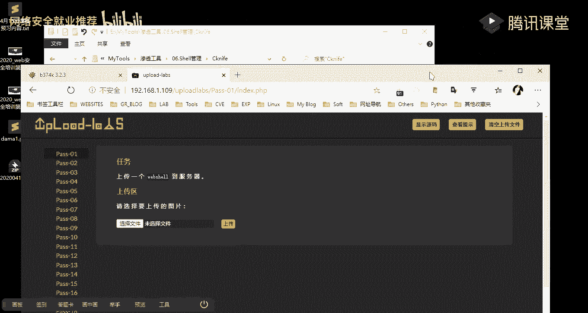
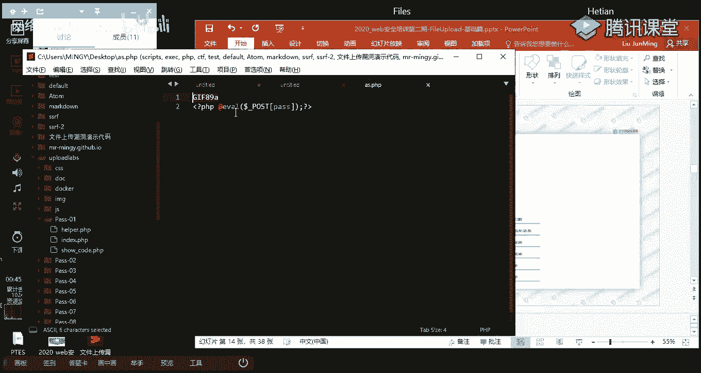
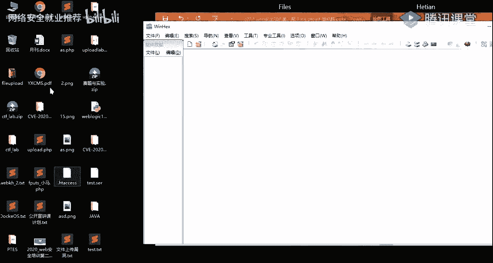

# P17：第15天：文件上传黑名单，白名单及数组绕过技巧 - 网络安全就业推荐 - BV1Zu411s79i

呃大家晚上好，我们先来测试一下呃，我麦的一个声音，大家能听到我声音的话，还还有声音，足够清楚的话，在讨论区这边扣个一，好的都应该都能听得到，然后的话还有大概四分钟的时间，和我们稍微等待一下其他的同学。

八点钟的时候的话，我们准时开始我们今天的一个课程内容好吧，然后的话这一段时间的话，我们先听一会音乐，他骗了你很久啊，睡后的默契，你转身不回头，我没对你挽留，直到看着你远走，乘风与你相心，却不再对谁提起。

把你放在我心，你卷自己盖过了你，轻轻吹动，我，如今却剩几首熟悉的陌生人回忆只能是回忆，错过了我买魔法，即使成绩最爱我，现在已一句问候都可以撒着光去，你的心神代代上了，以为就是一辈子，穿越信阳人而已。

想让心把你代替，你的声音在我脑海里，我该怎么忘记你，这海边好天气，却发现不是你要的压制我的身体，是你的记忆，不属于我自己，曾经最痛，我如今却是最熟悉的陌生回忆，只能是回忆，错过了我们无法击是想起最爱我。

现在英俊问候都可谓色扯过去，你的星辰再带上吧，以为就是一辈子，哦曾经最懂我，如今全世界熟悉的陌生人回忆真的是回忆，错过了，我们无法歧视真情，最爱我，现在一句问候都格外奢侈，过去你的信誓旦旦什么了。

以为就是一啊，大家晚上好，我们今天讲的课程内容的话是，unset file upload基础篇，就按cf fire upload的话，它的一个意思的话就是不安全的一个文件上传。

我们这节课主要讲的就是这一块的一个内容，那我们本节课的话主要有四个，是四块的一个内容，首先第一块的话是对文件上传的一些，基础的一个介绍，就对它的一个简介，就给大家介绍什么是文件上传。

以及呃在文件上传的时候，程序员会做一些什么样的一个检测，它的一个检测流程是怎么样怎么样的，然后的话对这一个文件上传的一个漏洞，它所产生的危害做一个概述，这块的话是绕过客户端的一个检测。

第三个的话是绕过服务端的一个检测，第四个的话是对web的web服务器的一些解析，漏洞做一个简介，首先我们先来看一下啊，文件上传的一个基础部分，首先我们一起来了解一下什么是文件上传，文件上传的话。

它就是呃，我们客户端将数据，以文件的一个形式进行一个封装，然后的话再通过我们的一个网络协议，把它给发送到服务端，而这里说的一个网络协议的话，就是我们前面讲到的一个htp协议。

然后的话呃我们上传的这个文件的话，在服务器端他会做啊一个数据的一个解析，解析之后的话，它会存储在我们的一个服务端的一个硬盘上面，然后存储为一个文件，就如图所示，就我们一个呃个人的一个主机。

我们通过啊hdp的一个方式，通过post的一个请求，把我们的一个文件的一个内容，把它给啊发送到我们的一个web服务器，然后的话在web服务器上面做一个啊保存，然后通常的话和文件是以啊这样的一个。

htp协议去进行一个上传的，然后的话是以post的请求去进行一个发送啊，就前面也有讲到哦，就前面在讲那个htp协议的时候，有给大家做一个例子，就是啊post请求的一些啊三种的一个方式对吧，然后的话。

web服务器在接收到我们的一个主机的一个，请求之后啊，建立一个连接连接网啊，连接之后的话就会进行一个数据的一个传输，这就是一个文件上传，让我们一起来了解一下，文件上传产生漏洞的一些原因。

首先第一个的话就是服务器的一个配置不当，有服务器它在配置的时候，没有对我们上传的一个文件做一些啊检测，第二个的话就是文件上传限制被绕过，就是说啊，服务端对我们的一个文件的一些文件上传，有做一些限制。

但是它的一个性质的话它是不完整的，或者说它它的一个性质是不是啊，有效的一个性质，然后的话我们可以通过一些方法去进行，一个绕过，第三个的话就是呃，一些开源编辑器的一些上传漏洞，第四的话就是文件解析漏洞。

就是啊我们后面会有说到的一些web web服务器，比如说阿帕奇as啊，nginx等等的这些服务器，它都有存在过一些解析漏洞，能够导致我们啊进进行一些文件的一个上传，具体一点呢。

说的话就是说上传我们的一个web share目嘛，然后的话进行一个文件执行，帝国的话就是他的一个过滤不赢或被绕过，就是呃跟前面是啊类似的，哦文件上传这个漏洞，它有什么危害呢，就。

就在我们进行一个文件上传的时候，如果服务器端它的一个脚本语言，它没有对我们上传的文件进行一个，严格的验证和过滤，就容易造成容易造成这样的一个，上传任意文件的一个情况。

然后攻击者就能够去利用这样子的一个文件，上传的一个漏洞，像我们的一个服务器啊，上传我们的一个恶意文件，ae文件的话就是web share，然后通过啊通过一个这样的一个web shell之后的话。

我们就可以在服务器上面执行，我们的一个恶意代码，然后的话呃就是呃在上节课有讲到的web share，它的一些特点对吧，我们能够通过web share啊做到哪一些操作，就能够控制整个网站。

或者是说整个服务器，哦嗯文件上传漏洞，它可能存在的一些位置，我们从他的一个致命意识就能够知道，就是说我们在进行文件的上传的时候，这样的一些功能点就是会存在这样的一个漏洞，比如说第一个的话图片上传对吧。

我们经常会有比如说一些网站呃，他你去发一些帖子对吧，发帖子的话，你去上传一些图片，或者说呃你注册一个账号之后，你要修改修改一些你的头像，修改头像的话就需要啊上传你自己的一个图片。

就是这种图片上传的一个功能点的话，是很有可能存在这样的一个漏洞，还有头像的一个上传功能，还有就是呃文档的一个上传，就是比如说我们要上传一个word，或者说呃图片文啊。

呃像excel等等的一些文件的一个上传功能，这一这一类的一些功能的话，往往都会存在这样的一个上传文件，它印证是不够严格的，然后的话会导致这样的一个安全缺陷，缺陷，哦哦这里的话就是文件上传的一个检测方式。

是我们本节课啊主要去讲的一些内容，就说我们通过呃了解文件上传过程当中，它所涉及到的一些检测方式，然后的话我们针对这样的一些检测方式，去进行一个绕过，然而从中学习到我们如何去啊，绕过这样的一个文件上传。

首先我们先来看一下呃一般的文件上传过程，它的一些检测方式有哪些，首先第一个客户端的一个js检测，一般的话它会检测文件的一个扩展名，就是js检测的话，它的它是一般是在我们的一个前端。

就是说我们的一个前端的一个呃脚本，就说它没有在我们的一个服务端上面，去做一个检测，而是通过在前端的一个js脚本，来对我们上传的文件做一个检测过滤，第二种的话就是服务端的一个mm类型。

这个mmo类型的话前面也有讲到，就是我们前面说到的一个content type，这个啊字段通过检测这样的一个字段内容，来判断我们上传的文件，它是什么样的一个文件类型，这里的一个mmm的话。

我们呃就之前也有说到，我们可以看一下这个是卖马的，他哪一些类型，这里的话呃可以看到我们主要呃举一些常见的，比如说这个pdf pdf它的一个文件的一个mmo类型。

也就是我们的一个content type的一个字段的话，就是这样子的一个application加一个斜杠，后面的话接一个pdf这样的一个类型来的话，像我们上传的一些，比如说ex 1。

它是一个这样子的一个octor stream，还有呃我们常见的一些图像，一些图我们上上传的一些图片，它的一个类型我们其实可以看得到，就是关于图片类型的这样的一个content type字段的话。

它都是以一个image开头啊，后面接斜杠，然后的话就是呃我们上传的一个文件类型，它是什么样的，然后的话它就会在后面接一个文件类型对吧，然后要注意的话，这里的一个就是jp呃jpg，还有j p e g。

我们常见的这种图片文件类型的话，它都是同样的一个呃j p e g，然后第三个的话就是服务端的一个目录，路径的一个检测，它通常的话它是会检测，跟我们的一个pass参数相关，就是说我们在上传文件的时候。

它的一个上传文件内容的话，它会有包含就是你上传的一个文件，它的一个目录是上传到哪里，然后的话还有你上传的一个文件名是什么样的，在后面的话呃，在演示的时候会给大家做一个介绍。

第四个的话就是服务端的一个文件，扩展名的一个检测，通常的话就是检测它的一个文件啊，扩展，第五个的话就是服务端的一个文件内容检测，前面的话都是检测它的一些呃类型对吧，比如说扩展，还有啊一些字段。

我们的在我们的一个请求头的一些字段里面，都能够去查找到它相应的一些信息，然后第五个的话，它是对我们上传文件里面的一个内容，做一个检测，它是检测我们的一个文件内容，它是否合法，如果包含有二页的一个代码。

如果不是合法的一个呃文件类型的话，它就不允许你去进行一个上传，然后针对我们上面前面的这样的一些检测的，一个方式的话，我们能够去进行相应的一些啊绕过，绕过他的一个检测，然后我们一起来看一下。

就是文件上传绕过的一个基本的一个流程，首先第一个的话就是我们前面有说到的一个，客户端的一个检测，主要的话它就是对在本地做一个限制，它的一个检测，代码的话是在我们的一个客户端啊，客户端。

去向服务端发送请求的话，我们可以通过我们的一个bp去进行一个抓包，就抓取文件上传的一个包，然后的话做一个修改，然后修改的话，这里的话就涉及到，就是说像服务端传递这种数据的时候。

我们可以通过这样子的一个抓包修改这里的，比如说修改它的一个mm类型，如果他是对我们的一个meal类型，做一个检测的话，我们修改我们包中的一个content type的一个字段，好修改为它允许的一个类型。

就能够去进行一个绕过，相应的就是啊目录啊，还有文件扩展名，文件内容等等，我们都可以去进行一个修改，然后的话呃修改之后的话，我们再发送给我们的一个目标服务器，而目标服务器的话在呃响应。

响应给我们的一个客户端，这就是啊一个基本的一个流程，在这里的话，我们主要会去使用到一个bp，去进行一个抓包改包，咳咳，然后的话我们呃首先来了解一下，如何去绕过客户端的一个检测，客户端检测的话。

它的一个基本原理就是呃，在我们的一个上传页面，它有专门去检测我们文件上传的，一个js的一个代码，就最常见的话就是检测文件的一个类型，还有你的一个扩展名，好我们绕过的方法的话。

就是因为它是一个在客户端的一个js代码，我们只需要禁用我们的一个js，就是说不让他的一个js代码去进行一个执行，就他不会去对我们的一个上传文件，做这样子的一个检测，达到一个绕过的一个目的，可以使用的话。

就是呃火狐浏览器有这样子的一个js的插件，就是禁禁用js代码的一个插件，然后的话呃我们在这里的话，我们会去使用到一个bp，就是因为，呃在后面演示的时候再具体说吧，然后测试的话就是呃有一个靶场。

就这个靶场的话，我有发在群里有这个upload的一个靶场，这个靶场的话我们啊为什么要去用这个靶场呢，就是它里面的话啊包含了哦是很多的一些，就是呃在文件上传的时候，他的一些呃检测的一些方法。

然后的话我们针对这样的一个检测，能够去使用什么样的一个绕过的一个姿势，然后我们通过这个靶场来学习，就是文件上传它的一个一些绕过的一个姿势。

然后那个靶场的话大家应该有去下载吧，就我有发在群里的啊，这个这里的话呃，大家如果自己去，因为它是一个开源的一个靶场，大家如果自己去进行一个下载的话。

呃可能会里面的一些关卡它是会有问题的，那我这里的话就呃我用我自己的一个菲律宾study，呃我自己把里面的一些环境什么的，都给它配置完，配置完和配置好了，就说你可以直接去进行一个使用。

而不会说有一些就是说你代码访问，还有就是你的一些呃上传文件，它会有一些问题什么的，这样的话大家去使用我这里的这一个啊ph study，然后的话呃里面有一些就是啊。

就是这里的话就是上节课讲课所使用到的一个，web share的一些web share，还有的话有几个大码的话，我们也给大家去讲话呃。

比如说这个v374 k的一个代码，然后这这个阵容的话，就是他的一个大码的一个内容，然后可以看到它的一个就是它的一个代码量，是很多的，可以看到对吧，有总共的话有4583行，有一些呃。

然后的话很很大的一个代码量了。

然后呢，它里面的话有这样的一些加密的一些字符，然后这个代码的话呃，大家可以自己去啊玩一下。

这里面的一个功能的话是很很丰富的，然后这里的话我就是要说一下，就是我们为什么要去使用这样子的一个代码呢，就是我们呃大家应该有操作过，就是我们之前啊，我之前给大家介绍的这样的一些呃。

web share的一些连接工具对吧，我们只需要在web服务器上面上上传，这样子的一个web需要的一个一句话，然后的话就能够去进行一个连接对吧，当然的话啊我们前面有介绍，就是说你一句话。

木马它的一个基本的一个运行原理，就是我这里通过呃，像我这里的一个web项目码，发送我的一些命令的一些请求对吧，就是啊比如说发送一个执行命令，执行一个ip config的一个命令对吧。

我们需要像我们的这样的一个web share，去发送我们的一个数据，但是你在这种发送数据的时候，有时候它不会让你去进行一个连接，就说你对这样的一个而需要连接工具，它无法去连接这样子的一个一句话木马。

不管你无法去连接这样的一个一句话木马的话。

我们怎么去进行一个跟服务器去进行一个，稳定的一个啊通信呢，就是说这里的话就会使用到这样子的一个大码，因为一个你一个代码的话，它是在啊服务器，就说在我们的一个目标机器上面，去进行一个执行的对吧。

就我们的一些啊，我这里举个例子，咳咳，咳，啊我就以这样子这样子的一个大码为例，就我们这里的话，我们只需要在它的一个web服务器，通过这样子的一个web端去进行一个访问，访问它的一个文件就可以了。

然后的话他的我们的一些操作是在，因为这个脚本它是运行在服务器上面对吧，然后的话我们可以通过这样在啊，在这里去进行一些操作，这个操作的话它是呃好，直接在它的一个服务器上面去进行一个执行的，卡了。

比如说我们执行一个命令对吧，我们这里执行的话，它的一个执行结果它是直接显示在这里的，但是但是他不跟不同于我们的一个通过web share去，web需要工具去进行一个连接，它的一个代码，它是直接在呃。

它的一个服务器上面的，这个脚本文件里面去进行一个解析，然后解析之后的话，再把服务器里面的一个结果返回给我们，就是他没有说有中间的一个通过啊，网络去进行这样子的一个数据的一个传递。

去传递我们想要它执行的一个命令，对就是我们去使用一个代码的一个原因，就主要是为了我们的对服务器的一个，比较稳定的一个啊操作，呃然后的话我们回归我们的一个课程内容。

然后就是这样的一个靶场，这个靶场的话呃，我不知道大家就是在今天下午的时候，有没有去进行一个尝试，去进行一个操作，就其实啊他这个靶场的话，网上有很多的一些教程，我建议的话大家先不要去看那些教程。

然后呃教程的话，其实我这里要写一个，就是对这个靶场的一个通关的，一个就是一个方式，就是它里面涉及到的，比如说他做了哪一些过滤对吧，它限制了哪一些内容，然后的话我们通过这样的一些性质。

它限制了一些内容来呃，来构造出我们的一个绕过的一些方法，我这里的话有写这样的一个啊，在课后的话我会发给大家。

然后呃现在的话呃，大家先不要去看那个他们的一个一些，解题的一些步骤啊，我希望就是大家在我今天的一个课程内容，讲完之的话，自己在去进行一个操作，然后自己通过在啊去进行一个测试。

来进行一个绕过的一个方法。

首先这里的话呃，第一个就是一个js的一个检测。

我们怎么去进行一个判断呢，他是做了一个js的一个检测呢，首先我们，而是首先我们先找一个就是找一个一句话码，他码的一个内容的话，就是像这样子的，然后这里的话这句话我这里加了一个这样子的。

一个就是一个文件幻术，就是再去进行绕过啊，服务端，它对我们的一个文件内容，去进行一个检测的时候会去用到，当然这里的话你可以先不加，然后的话再准备一个这样子的一个s。p png。

其实里面的一个内容的话，也是这样子的一个一个内容。

然后把他的一个后缀，它的一个文件扩展名改成了一个pg。

这样子的一个形式，好我们去进行一个好，先随便上传一个文件对吧，我们先上传一个，比如说我们的一个菲律宾文件，一个p h p后缀的一个文件，然后进行一个上传，然后他这样的话提示它。

提示我们这里就是说上传的一个文件类型，只能是包，只能是这几种jpg pg i g f的这种图片文件，然后我当前的一个文件类型的话，是它是一一点ph p对啊，然后这个一点p h p它是怎么来的呢。

就是它是怎么去进行一个，我判断我这一个10p h p的一个文件，内容是什么样的，就说他会对我上传的一个文件的一个文件，扩展名，就是我们的这一个后缀他会做一个啊提取，提取出我们的这个后缀。

然后的话再跟他的一个js代码里面的一个哦，文件类型，它允许上传了一个文件类型做一个啊匹配，然后匹配如果是是这样子的一个类型的话，它就会允许我们上传，然后这里的话我就呃换一个对吧，换一个一个点。

pg这样子的一个呃，以顶png的一个图片后缀结尾的一个文件，然后我进行一个上传。

然后可以看到这里的话已经上传成功了，对ok啊，右键打开看一下啊，大家看到是这样子的一个内容，就是它是没有内容的，没有内容的，因为我们这一个文件的话，它不是一个图片文件。

所以的话它不会显示一个图像的一个信息，然后只是这样子的，因为里面是一个其实是一个一句话码，但是的话这里的话就有一个问题，就是你一个偏激的话，它是无法去进行一个解析的，就说它不是一个p h p文件的话啊。

服务器的一个ph p的一个解释器，它是无法去解析里面的一个文件内容的，所以这里的话我们需要去想要上传。

我们的一个一句话码的话，我们需要对它做一个绕过，好绕过的话。

哦对了，就是我们怎么去进行一个判断，它是一个js检测，我们先呃通过一个bp来去进行一个判断，我现在你刷新，我这里先选择一个点菲律宾，菲律宾的一个文件。

然后我们进行一个上传，然后注意看这边的一个请求包，我们上传上传之后的话，可以看到在这里我的一个就是bp，这里他是没有获取到他的一个请求包的，然后这里的话他是直接就弹出了，这样子的一个呃宽。

所以我们从这里其实可以基本上做一个啊，基本的一个判断就是它的一个，就它的一个内容的话啊，就是它的一个检测的话，它是没有去在服务端做一个检测的，而是在前端对我们的上传文件内容，做了一个检测。

为什么这么说呢，就是说如果说他的一个检测它是在服务端的话，我们上传这样子的一个文件，我们的一个文件的话，它会上传到一个服务端，上传到服务端的话，它中间就会有数据的一个传递，也就是我们的一个请求包对吧。

我们需要向服务端post这样子的一个，文件内容对吧，然后的话他这里是没有这样子的，相应的一个请求包的，就说明他没有到。

他没有把我们的一个数据发送到服务端，去做一个检测，所以我们只可以判断它是在前端，就是有一个js代码，对我们上传的一个文件做了一个啊，做了一个这样子的一个检测，而针对这样子的一个检测，我们怎么去绕过呢。

我们首先啊就前面也有说到。

就通过禁用它的一个js对吧，我们其实可以，先审查一下元素，然后审查元素我们可以看到，就是说在这里它啊注意一下这里的一个，这里有一个字，有一个这样子的一个好字段，就这里的一个代码的话，有。

这个on summit这里的一个代码的话，它就是把我们的一个，就是我们的一个请求的一个数据，它会把它就是呃放到我们的这里的一个，check fire的这个函数里面，然后这里的话它是一个j定义的一个。

js的一个函数，我们从文件名其实也可以知道，它是一个检查我们的一个文件的一个呃内容，检查我们上传的文件啊，我们可以通过在这里在，因为它是在前端嘛对吧，他前端的代码我们是可以能够去看到的。

我们直接把他的这里的一个前端代码，做一个删除，删除之后的话，就是说我们现在这里去进行一个上传的话，他不会把我们的一个上传的一个文件，放到我们的在下面的一个js的一个内容，去做一个检测。

其实就是在这里这里的一个js的一个代码，就是检测我们上传的一个文件，它的一个呃文件类型，它是不是它这里允许的，这样的三三种文件类型对吧，然后这里的话我把它给删除删除了，删除了的话。

他就不会把它放到我们的这样的一个啊，js代码里面去检测，然后我们可以来尝试一下，我选择一个菲律宾文件，好直接进行一个上传，这里不行吗，哇这也不行的吗。

啊这里不行啊，那还是要去禁用它的一个js的一个代码。

这里的话我就不用这一个，我不用这种，我用另外的一个，就是去进行一个改包的一个方式，我这里先找找一张这种偏激的一个图片对吧。

它是允许去进行一个上传的，然后这里的话因为它是在前端检测的话，他这里的话是允许我们上传这种图片文件的，然后这里我先抓一个包。

那我点击上传上传之后的话，抓取这这样的一个结论，这样子的一个请求包，然后的话我因为这里的话这个请求包，它其实是发到服务端的，然后这里我们的一个前端的一个检测，已经被绕过了。

然后我们只需要把这里的一个就是它呃，保存了一个文件名，就在这里的话就是一个file name的话，就是表示我们的一个上传文件的一个文件名，好我们再去进行一个forword。

就发送我们的这样的一个包发送过去。

然后的话就可以看到，在这里的话已经有了这样子的一个图像，有了这样子的一个文件，就是我们上传的一个文件。

可以看到它是一个as点菲律宾的一个文件，然后在这里的话我们可以，来访问看一下，访问一下这样子的一个ph的一个一句话，好可以看到它这里的话是正常解析了，就是他输出了我这里的多余的一个字符对吧。

然后我这里执行执行之后的话，可以看到我们的一个一句话码，是成功的进行了一个上传，这就是呃通过一个bp去呃更改它的一个请求包，来绕过他的一个前端的一个检测，呃然后这里的话大家有没有什么疑问呢。

就应该都能听得懂吧，能听得懂是吧啊啊，刚刚那个其实删除他的一个js代码，其实是可以的，这里他不行，我我我不知道，就说这种姿势大家可以去进行一个尝试的，就删除它的一个前端的一个js代码。

就只有一只有一位同学听懂了吗，而其他同学呢可以都听懂了是吧，好那我们继续我们的一个课程内容，前面我们讲到了，就是绕过他的一个客户端的一个检测，下面我们一起来看一下，就是如何去绕过服务端的一个检测。

然服务端的一个检测的话，通常是检测三个点，哪三个点的，第一个就是它那个迈尔迈尔类型，也就是我们的一个请求包当中的一个content的，content type的一个字段，第二个的话就是文件的一个后缀。

比如说我们那个文件扩展名，再比如说点p。p h p。p n g等等的，这种就是一个啊文件扩展名嘛，然后第三个的话就是对他的一个文件内容，就是我们上传的一个文件里面的一个内容，提取它里面的一个信息。

来去进行一个呃检测判断，啊其实就是我们这里如图所示，主要的话就是这样的一些点，有客户端的一个校验，然后服务端的一个教育，教育的一些信息的话，主要哦呃在后面的话都会有去讲到，这文件后缀相关的一个检测的话。

主要通过黑名单策略，还有白名单策略等等，还有文件内容的话就是呃一个文件幻数，文件幻术的话就是刚刚的那个p h p的一个码。

你前面有一个就是我加了一个gf对，就是这个gf 89 a这一个的话就是呃他好，服务端它对我们上传一个文件内容，它会提取我们的一个文件头头部，这里的几个字节好，这这里的几个字节的话。

就g i f89 a这一个字节的话，就是啊g i f图片文件的一个呃，这样子的一个啊文件幻数，然后它可以通过这样的一个呃。

这样的一个字符串来判断它的一个文件，它是一个gf的一个图片。

然后还有就是图片训了，你只要是训了这个的话呃，在那个靶场里面会有给大家去讲到，好我们一起来了解一下，就是常见的一些map类型，其实呃前面的话也要给大家介绍，这样的话我大概看一下。

就我们常常常见的像比如说text的文件对吧，就这种text link，还有htm啊，还有就是呃一些图片文件，还有word等等，好前面我们有说到，就是说服务端的一个检测的话，有一个ml类型的一个检测。

那我们怎么去进行一个绕过它的一个检测呢，我们绕过它的一个检测，一个基本的一个原理就是它的一个map类型检测，它就是检测图片类型的一个文件，它上传过程中我们的一个htp包当中的话。

它会有一个这样的一个content type的一个字段，好我们可以从这个请求包当中呃，找一个之前上传的一个文件，比如说这个对吧，这个的话就是我们上传我们的一个s的，影片机的一个呃请求包。

然后这里的话就是我们请求的一啊，我们的上传文件的一些内容的一个信息，然后这里我们有一个这样子的一个content，type的一个字段，这个字段的话就是啊用来告诉服务端，我这里的上传的这一个文件。

它的一个类型的话是一个png的一个图片文件，然后的话服务端他再去做一个检测的时候，他就是获取他这里的一个content type的一个，字段的一个值，也就是这个获取到这个值的话，与它的一个就是呃。

以它的一个允许上传的一个文件类型的一个值，去进行一个对比，然后对比出如果说是允许上传的话，就允许我们的一个文件的上传，如果不允许的话，就拒绝，就是它的一个检测的一个基本的原理。

那我们绕过的一个方法的话就比较简单对吧，我们知道了服务端它是去检测我们请求包当中，它的一个这样的一个content type的一个字段值对吧，那么我们可以直接修改我们的一个请求啊。

就是这样这样的一个请求，htp包的当中的一个content type的一个值，修改为就是呃服务端检测的时候，它允许上传的一个类型对吧，就能够顺理成章的绕过他的一个检测。

因为他只是对这一个字段做了一个啊判断，然后第四个的话就是嗯绕过文件后缀的一个检，测，文件后缀的一个检测的话，主要就是有两种策略，就是黑名单策略以及白名单的一个策略，然后这里的话我们先来了解一下啊。

黑名单策略，就黑名单策略的话，它的一个意思就是我们的一个文件扩展名，如果说在这样子的一个黑名单的话，它就是不合法的，不合法是什么意思呢，就是说呃服务端它是不接受这样子的一个，文件上传的。

就不允许这样子的一个呃文件类型，去进行一个上传，然后一般的话会有这样子，就如图所示，这样子的一个黑名单的一个列表，就在你的一个列表的话就列出了，就是不允许你去上传的一些文件的一些后缀，对啊。

比如说p h p p h p5 ，还有其他的一些呃，可执行的一些文件的一些类型，然后里面的话就是包含常见的一些类型的一些，可可执行的一些脚本文件后缀，然后针对这样子的一个黑名单的话。

我们有相应的一些绕过的方法，我这样的话有列举了六个，首先第一个的话就是呃后缀的一些，后缀的一个大小写绕过，好后缀大小写logo的话就是像这这样，这里的一个例子，我们可以通过这样子的一个大写。

然后小写小写这样子的一个大小写，一个混合的一个方式，来去绕过它的一个呃黑名单，就说他这里，比如说它这里它没有对我们的一个，我们可以看一下对吧，他只对这样的一些菲律宾啊，文件类型做了一个过滤。

但是的话我们可以看到，它其实里面没有包含有这样子的，比如说包含我这个点大写的p开头的一个，ph的一个后缀对吧，那么我们就自然就可以去上传这样子的，一个后缀，上传到服务端，服务端它在检测的时候。

他发现没有这样子的一个黑，就是包含在黑名单中的一个文件类型，那么它就是允许去进行一个上传的，然后第二个的话就是一个空格的一个绕过，还有的话以及这一个顶绕过哦，以及后面的这一个啊这样的一个字符串。

特殊的一个字符串的一个logo的话，它是呃在windows里面的，用windows系统里面的一些特性去进行一个绕过，首先我们先来了解一下这个空格，绕过空格logo的话，就是哦黑名单。

他没有对我们的一个呃后缀名，做一个去空格的一个处理好的话，我们可以通过在后面加一个空格来绕过，为什么能够绕过呢，就是就是啊因为黑名单里面他没有加嘛对吧，然后的话我们上传的这样子的一个点p h p。

后面接一个空格的话。

在windows里面我们其实可以看到。

大家应该有碰到过这样子的一个问题对吧，我们上传在我们新建一个这样的一个文件，然后的话我对它做一个命名，比如说test对吧，然后的话我在这里输入，在它后面输入一个空格。

然后的话我这里输入了一个空格之后的话，可以看到，就是说我这里输入码输入之后对吧，有有一个空格哦，这里看不到了，我这里输入了一个空格对吧，输入了一个空格之后的话，我们保存保存之后的话，我们可以看到它。

其实它会默认的把后面的一个空格给去除掉，然后的话我们就是利用它的这样子的一个原理，就是我们在这里去进行一个发包的时候对吧，我们在这里，把它的一个文件名呃，这里是一个文件名做一个加一个空格。

在后面加一个空格，就是这里加一个空格之后的话，我们去而针对服务端，它啊，没有对我们的一个文件名做一个这样的一个，去除空格的一个处理的话，我们就可以用这样子的一个方法来绕过，因为他呃目黑名单里面。

他没有这样子的一个呃呃，文件后缀的一个过滤的一个规则对吧，所以的话我们就能够去进行一个上传，就等于绕过了服务端的一个检测，然后的话这样子的一个后缀我们上传到服务端，上传到windows里面。

windows的一个服务端的话，它就有了这样子的一个特性，就是它会把默认的把后面的一个空格给去除掉，然后它其实保存到他，最后保存到服务器上面的话，它其实就是一个啊这里这样子的一个s点，hp的一个文件。

就是保存的话就是这样子的一个呃s点，菲律宾的一个文件，然后还有一个顶顶顶绕过的话，就是我们在windows里面也是同样的，我们在后面再输入一个点，然后我们进行一个保存对吧。

然后可以看到我这里输入一个点之后的话，它我们保存保存之后的话，它默认的它同样的会把后面的一个点给去除掉。

就是利用了它的这样子的一个特性。

咳咳咳咳，以及第四个，第四个同样的也是啊，windows上面的一个特性，就他没有对这样子的一个做一个处理，它是利用的一个windows这个文件系统，就我们在文件名后面加这样子的一个啊。

像这样子的一个后缀的话，它会比如说我们在这里对吧，在这里后面加这样子的一个两个冒号，然后加一个呃dollar符，然后大写的date这样子这样子的一个文件名，然后服务端它去进行一个检测的话。

它检测我们的一个后缀是这样子的对吧，他是不包含在我们的一个黑名单中的，有的话它是允许去进行一个上传的，然后上传到服务端的话，它会有这样子用windows的一个特性，它同样的。

他会把后面的这一个字符串的一个内容，它会保存为这样子的好不，他会把我们的这个文件里面的一个内容，就这样子的一个文件名，它会保存为一个s。p h p的一个文件，然后第五个的话就是一个解析漏洞。

就配合阿帕奇的一个解析漏洞，这里的话呃先了解一下，后面的话有会去说到，就它利用它的一个解析漏洞的一个特点，就是我们啊阿帕奇他在解析文件的时候，它是从右往左去进行一个判断哦。

如果他不能够识别它的一个后缀的话，它就会继续往左判断，比如说这样子的一个文件后缀好吧，文件名，比如说a a。p h，b。o w f。r r这样子的一个文件对吧，我们去上传的时候，上传到服务端的话。

他他啊服务端它在对对他做一个，解析的时候，解析的时候的话，它会从右往左，就是从这边从r r这边，然后往左去进行一个判断，而判断它是一个什么样的一个文件，然后他碰到这种i啊，还有这种呃ow mf。

任意的这种就不可识别的这种后缀的话，它就会啊一直往左去进行一个解析，一直往左啊去进行一个判断啊，然后他直到判断，能够去进行一个解析的一个后缀，它就会保存为这样子的一个文件，嗯就这一个的话。

他这后面两个他无法去判断嘛对吧，然后的话他到这里的话，它能够啊判断它是一个菲律宾的一个文件，然后的话它就会把它保存为一个aa。p h p，然后第二段话就是一个点h ta c c e s s。

这样的一个文件，这个文件的话就是嗯一个分布式的一个配置，文件，全称的话就是像这样，就这个呃超文本的一个入口，它的一个主要作用的话，就是针对当前目录的一个配置的一个解析。

就是啊他提供针对目录去改变配置的一个方法，然后的话它的一个特点的话，就是呃它只作用于当前的一个目录，以及所有的一个子目录，然后这个文件里面的话，我们可以去进行一个编写。

就编写的话里面可以去编写它的一个文件，解析的一个规则，然后这个规则的话，我们可以去啊利用它的一个呃就是服务端，它没有对我们的这样的一个文件去进行，一个过滤的话，我们上传这样的一个文件上传到服务端。

然后服务端它去解析的时候，他去啊解析这个目录下面的一些文件的时候，它会找到这样子的一个文件，这个文件的话里面定义了，就是解析当前目录下面的文件的一个规则，然后这个规则的话是我们可以去自己去进行。

一个冰写的，然后就像这里的这一个例子，我们可以看了他这里的一个意思的话，就是啊fes match就是呃文件匹配匹配，匹配当前目录下面的文件啊，有包含有这样子的一个字符串，我这样的话就是写了一个s点。

偏激的一个文件是吧，你也可以写成其他的一个任意的一个字符，然后的话他这里的一个意思的话，就是呃一个阿帕奇的一个，就是web服务器的一个配置，就这个配置的一个意思的话，就是呃把文件作为一个呃ht。

作为一个菲律宾的一个文件去进行一个解析，这里的一个代码的一个意思的话，就是呃，如果匹配到了一个s等片机点偏激的一个文件，然后这匹配到这样的一个文件的话，它就会把这个文件当作为一个呃。

p h p的一个文件去进行一个解析，所以说我们这里好，只需要去上传这样子的一个文件，然后的话在上任意上传一个s等于p n g，包含有这样子的一个字符串的一个文件，就就算它是一个图片文件服务端。

它同样的会把它作为一个，菲律宾的一个文件解析，然后的话这个图片文件里面的话，就写的是我们的一句话嘛对吧，就能够去解析它的一个啊文件里面的一个代码，好下面的话就是对它的一个基本的一个解释。

就是啊跟我刚才讲的是一样的，一样的意思好，我们其实可以通过这样子的，如果他允许这样的一个上传，这样子上传这样的一个文件的话，可以绕过很多的一个上传验证机制对吧，因为你就算他就只需要。

我们随意能够去上传这样的一个文件，如果说他只是对他的一个文件名啊，还有他那个扩展名什么的去做一个检测的话，我们随意随意上传一个文件，我们都能够去把它当成一个ph文件解析，自然的话服务端它是啊检测不了。

我们的这样子的一些一个区，进行一个啊获取web share，然后第五个的话就是绕过文件后缀的一个，白名单的一个检测，前面我们有说到就是白名啊，黑名单，黑名单的话就是说在黑名单里面的一个文件，后缀的话。

它是不允许我们去进行一个上传的，好白名单的话与黑名单是相反的，就说在白名单里面的一个文件，后缀的话是允许上传的，然后的话如果不在白名单里面的一个后缀的话，它是不允许上传的，就其实白名单相比于黑名单的话。

它是呃啊它的一个安全性是要更高的，因为你一个黑名单的话，你能够去呃存放，就是说能够去列举的这样的一个后缀，其实是有限的对吧，你不可能把所有的这样的一个后缀，你都能够列举完。

然后放到这样子的一个黑名单嘛对吧，然后白名单的话就更加呃干脆，就它只只允许你在我这个名单里面的，一个文件类型进行一个上传，就比如说你只允只允许你去进行一个上传，一个jb j p g对吧。

还有一个png的这种图片文件，然后其他的任何的一个后缀，它是都不允许上传的，然后针对这样子的一个白名单，那个啊检测的一个logo的话，我们主要的话是会利用到这样的一个，年龄阶段的一个方式，200阶段。

我们这里的话，主要的话就是呃介绍一下这个呃零零阶段，就年龄阶段的话，它是嗯我们的一个特殊的一个字符，就是，比如说我们这里一个url它发送到服务器，对服务器进行一个解码，解码之后的话。

他没有去对我们还没有传到一个验证函数，然后的话我们的一个验证的一个函数里面的话，它没有他接到的，他不是这样子的一个字符，而是我们的一个在这里00%，解码之后的一个字符。

这个00%其实是一个url的一个编码，这个u r l的一个编码，我们可以对它做一个解码，解码之后的话，可以看到它其实是一个这样子的一个字符，然后在这里这样子的一个字符的话，他是就是说呃文那个服务端。

他对他再去解析这样子的一个啊字符的时候，它会把这个字符后面的一个啊，就是把后面的一个字符给忽略掉，就比如说我在这里，我在这里，我，我在这里啊有输入了这样子的一个字符，然后的话他检测的话是一个白名单。

它只允许我们的一个点偏激的一个后缀对吧，然后的话它的话它解析的话，它是一个点偏激的一个后缀，但是我们上传到服务端之后的话，他去进行一个解解析，然后保存文件的时候，它我们中间这里是有一个。

就是刚刚那个00%，这样子的一个呃特殊的一个字符，然后的话他再去进行一个解析的时候，他会把后面这个0%，后面的一个字符给忽略掉哦，它实际保存到服务器的一个文件的话，是一个s0 p hp的一个后缀哦。

这要这里的话，因为我们知道他是一个u2 的一个兵嘛，其实我们正确的一个写法，如果是一个get请求，我是一个get请求，说在这里我们啊上传了一个文件对吧，name用get方式去上传我们的一个传递。

我们的一个文件名，s等于菲律宾对吧，我们这里的话就可以在这里进行，一个出了一个00%，这样子的一个就特殊的那个字符串的一个，编码形式，然后我们后面接，我们能够允许上传的一个文件名对吧，然后他解析的话。

它会把它当成一个png的一个文件，然后实际去保存的时候，它会把它做一个解码，就是这里的一个呃url的一个解码，解码之后的话，它会生成这样子的一个字符，然后在post的请求里面的话，它就是。

我们想要去因为这个字符它是不能够就是，比如说在这里的话，它是复制不出来的，他是复制不出来的，我们在这里的话，我们想要把它做一个年龄阶段的话，我这里我先在这里输入一个空格。

然后空格的话它的一个hex的一个冰嘛，是20%，好我们需要在这里，就是这里有一个hex的一个编码的文件，然后这里的话我们也需要找到这里，我的这里的一个文件名，就是这个fname这个字段嗯。

找一下就是这里对吧，那我们前面我们知道这里的一个空格的话，它的一个hs编码的话，它是一个2%啊，就是一个二零，让我们找到这里的这一串这一个字符，找到一个二零，就这一个，因为一般的话这种呃。

中间的话那是没有有空格的，就这一行的话没有有空格的，只有这一个对吧，我们自然的可以找到这里的，就是那个空格的，我们把它改成为一个零零，然后的话呃保存保存之后的话，我们来这边看一下的话。

它显示的就是这样子的一个符号，其实就是我们这里的一个这个，它解码之后的一个符号，那这里的话我提一下，就是特意提一下，就是在get get方get方式的话呃，在我们的一个url里面，然后的话我们是呃。

我们传递的这样子的一个url的一个编码的，这一个特殊字符的一个url编码，好，在传递到服务器的时候，它会有就是浏览器，它会对我们的这一个要编码做一个解码，解码之后的话，它会解码成这样子的一个字符。

然后在post的话，它是原样的一个传传递，它没有啊，服务端它不会对这样的一个要编码做一个解码，所以的话我们需要把它直接就是写成这样子的，一个特殊字符，这里的话大家要注意一点。

然后就其实就是其实都是差不多的一个意思，就00%，还有这样的一个呃，16进制的一个零零阶段，然后第六个的话就是文件内容的一个检测，就文件内容的话，前面其实也有说了。

就是它主要是检测文件内容来进行一个判断，文件它是否是合法的一个文件，主要的话是有两种检测方式，地址的话就是检测我们上传文件，开始出的一个文件幻数，这个文件幻术的话就是啊。

就这一个magic number，它主要的话就是标记我们的一个文件，都一个格式，就说要符合他的，这就是啊我们可以通过这个文件幻数来标，来标示这样子的一个文件，它的一个格式它是什么样子的一个啊，文件类型。

前面举的一个例子是一个gf的一个文件，它是以一个g i f98 a的一个开头，就通常的话他去进行一个文件检测的话，就是判断他前十个字字节就这一个文件话术，因为它就是在一个文件开头的一个位置。

通过判断它的一个这个字节，来判断它文件的一个真实类型，然后我们绕过的话，自然的我们就可以在我们的一个上传文件里面，添加它的这样的一个文件换数对吧，然后的话来绕过服务端对它的一个检测。

第二个的话就是文件加载的一个检测，就文件加载的话，一般就是通过服务端调用的一些api或者函数，来对我们的一个文件做一个渲染，常见的话就是图图像的一个渲染测试，就是我们上传图像，上传一个图像文件的话。

他要把我们图像里面的一个呃，里面的一个内容做一个渲染，然后的话他不会把我们在图片文件里面的一个，内容做一个就是呃简单的来说就是做一个打乱，打乱之后的话，它其实只是里面的一个呃内容变了。

但是它的它的一个图像还是原来的一个图像，就看到的图像是原来一个图像，就其实我们不是哦，我们上传一个文件对吧，有一个就是一个真实的一个文件，还有还有的话它会对它做一个缩略图对吧，他那个缩略图的话。

它其实就是基于那个文件，然后做了一个啊，做了一个其他的一个渲染，渲染之后的话，生成了这样子的一个文件，就可能你一个那一个缩略图的话，它是就是它一个清晰度对吧，我们可以明显的看到就是嗯不一样的。

然后这里的话大概介绍一下这个文件幻术吧，就像这样子的，这样的话呃看一下吧，主要的话就是我这样的话列举了，就是常见的一些图片类型，就像jpg jpg的话，就是前面的这样的这样的一些字符。

它其实就是以这样子的一个，我们的一个就可写的一个字符的话，一个20孔板是这样子的，然后gf的话就是像这样子的一个gf 89 a，就所以说我们为什么就常用的也是一个gf的。

加一个gf的一个这样的一个文件头啊，把文件换数，就是因为他这里的话好写，就gf 89 a像前面的这种这种特殊字符的话，我们写不出来的对吧，然后如果说你要写这样子的一个，一个16进制的一个呃兵马啊。

16进制的一些数的话，我们记不住对吧，他的话像呃png的也是一样的，像这种特殊字符的话，我们是啊再去写到文件里面的话，是不好书写的啊，我们我们的这里的这种呃，这个文件方式是怎么看出。

怎么去进行一个查看的，这样的话呃可以使用到一个工具，这个的话就是查看文件的一个啊，16进制的一个一些数据，好大家可以随意的找一张图片，比如说这样子的一个png的图片，其实我们直接用一个文本命器打开。

也是能够看得到，当然的话它是有一些字符的话，我们是看的是这样子的，这个vhs的话打开有点慢。

好打开。

就这样子的一个软件，我们可以把它拖进来，拖进来之后的话，其实可以看到它的一个ask的一个字符的话，就像这样子的一个偏激对吧，然后的话他这里的一个16进制的一个数的话，其实它是对应的，就这里的一个创的话。

就是这样子的一个16进制数，然后我们其实也可以，就是直接在文件里面去进行一个，把我们的一个图片文件对吧，这里把它进行一个更改，改成我们想要的一个文件头，就添加一个这样的一个文件幻数就可以了。

当然我们常用的还是用这个gf的，因为好写，然后就了解一下吧，就大家可以去呃找这样子的一些图片去打开，来查看一下它的一个这样子的一个格式，那的话我们只需要在文件化说上面。

加上我们的一个一句话木马就可以去啊，绕过他的这样子的一个检测，好第二个的话就是嗯，文件加载的一个检测，文件加载的话主要就是对图，对渲染加载测试的一个攻击，我们主要的话就是用一个代码注入，这代码注入的话。

就是我们用这样的一个图像处理软件，比如说刚刚那个问hex对吧，然后在一张图片里面。

在一张正常的一个图片，就而不是像我这里的话呃。

这里呃这种假的图片，就是虽然是一个偏激的一个后缀，但是是打不开的，是看不到里面的一个内容的，要不是看不到图像内容的，我们这里的话找一张真实的图片，比如说像这样子这样子的一张真实的一个图片，对吧，好的话。

在我们的一个好图片里面的一个空白区，进行我们的一个一句话木马的一个填充，然后注入我们的这样的一句话木马，然后的话一般就是有一些图片，就图片里面的话它有一些注释区，在这个区域的话。

我们是可以填填充我们自己的一个代码，而不会改变呃图像的图像的一个内容，就保证图像文件的一个结构它是有完整的，如果图像文件它结构不完整的话，它是呃打不开的，就是无法去查看到图图像的一个信息。

而对于这种的话，对于一般的一个渲染测试的话，是能够去进行一个绕过的，然后还有就是更严格的一个二次序嘛，九二次渲染的话就更加直接一点，就是它它会把我们的一个图片，原本的一个图片里面的一个真实的一个。

图像数据给抓取出来，然后其他的一些多余的一些部分的话，它会把它给直接隔离掉，就比如说我们要注入的，我们注入的这样的一个一句话木马对吧，注入在这种图片的一个空白区，然后二次渲染的话，他就会把呃。

不是属于图像数据的这种空白的一些地方，里面的一些数据，它都会把它给隔离掉，所以的话我们这里注入的这种代码的话，它是不能够啊，它是无法去使用的，然后呃对于这个攻击的话。

就需要对我们的一个就是加载文件的一个，加载器进行攻击，当然这样的话只是介绍一下，因为呃，实际的能够去利用这样子的一个漏洞的话，是比较难的，就对他一个文件加载器，如果说它存在这样子的一个漏洞。

你要去进行一个攻击，去进行一个呃，溢出攻击，然后的话执行我们的想要的一个代码，这这种方式的话是嗯比较难去实现的，而且啊不一定也能不一定能碰得到，然后前面的话就是啊我们详细的介绍了，就是文件。

就是我们在上传文件的时候啊，如何去绕过服务端，还有客户端对我们上传文件的一些检测，里面是呃比较详细的介绍了，就是一些绕过的一些方法，还有的话就是它检测的一个基本的原理，我们如何利用它的。

就是它的一个检测的一个原理，来构造我们自己的一个绕过的一个方法，然后下面的话就是一个web解析漏洞，呃这里的话，主要的话就是常见的一些web服务器，就我们常见的比如说阿帕奇，还有i s啊啊两个版本的。

以及ngx的一个解析漏洞，对他的一个介绍，当然的话呃其实在现阶段的话，这种解析漏洞的话是比较少见的，当然的话如果说你有碰到的话，那你就能够直接去进行一个利用，而且它的一个利用的话。

其实就其实是比较简单的，首先第一个的话就是一个阿帕奇，阿帕奇解析的话，我们前面也有说了，就是说他在解析的时候，他会碰到就是这种不认识的一个后缀的话，他就不会去呃解析，然后的话它会一直往左去进行判断。

他判断的话，判断到它能够去解析的这种文件的话，它就会把这个文件，把它给识别成一个菲律宾的一个文件，而不是在这里的话，例子的话就是识别成一个菲律宾，然后第二个的话就是is六点的一个解析漏洞，这个的话嗯。

它有两种解析方式，就是第一种的话就是一个目录的一个解析，它的一个就是原理的话，就是呃服务器它默认它会把，就是把以以一个顶asp啊，后缀结尾的一个目录下面的一个文件，它都会解析成asp的一个文件。

这什么意思呢，就是我我们可以就是创建，如果说我们的一个我这里创建一个，文件夹对吧，它的一个文件名是sd f。sp对吧，这样子的一个文文件夹哦，当然这里的话它，不能在命名啊，在windows里面。

然后的话就是说在这样子的一个，asp的一个文件目录，这个目录下面的所有的一个文件，它都会把它当成为一个sp的一个文件，去进行一个解析，就是说我们随便创建一个随便上传，创建这样子的一个文件。

比如说a这样子的一个文件，它里面的话是写的一个sp的一个一句话，木马对吧，我们这样子的一个文件，它同样的会把它当成一个菲律宾文件，去进行一个解析，这是一个目录解析好，第二个的话就是一个文件解析。

文件解析的话就是呃这个is六点的服务器，它默认不会解析分号后面的一个内容，这样的话就了解一下吧，其实现在的话比较少见了，这样的话我很有必要去了解一下，还有的话就是is七点的。

这个的话就是我们呃就对任意的一个文件名，后面的话接上一个字符串，就比如说我们在这里啊，不管前面的一个文件名，还有嗯文件名它是什么样子的，我们在后面接一个顶菲律宾的一个后缀。

它就会把它把我们的这样的一个文件内容，把我们的这样的一个文件，按照一个菲律宾的方式去解析，还有的话就是nginx ngx 2，跟前面的这里的话类似的，当然的话它其实不是呃，就是利用方法的话是类似的。

同样的就是任意的一个文件名，后面接我们的一个呃可解析的一个后缀，就能够去进行一个攻击，比如说这样子的一个这样子，还有的话就是呃任意文件名后面接，就接一个00%，然后点p h p。

它同样的能够去把它解析成一个，菲律宾的一个文件，这是一个解析漏洞，就这样的话就大概介绍一下，大家了解一下就ok了，然后最后的话我们对我们进行一个课程内容，做一个基本的一个总结，就文件上传漏洞的一个总结。

我们其实啊今天课程内容的话，都在这里的这个图里面，我们大概的一起啊，我们一起来过一遍吧，就把我们今天的一个课程内容给捋一遍，首先我们就是介绍了文件上传对吧，文件上传的话就是我们客户端啊。

通过我们的一个网络协议，通过htp把我们的一个文件内容封装，然后发送给我们的一个服务端对吧，发送给服务端，然后的话中间的话呃，啊就是服务端，还有客户端，它会对我们的一个上传文件做一个检测。

就检测我们上传的文件是否是允许上传的，判断啊，然后检测的一个方法的话，就有就是前端的一个js的一个检测，然后的话前端那个js检测的话，我们绕过的话，就是可以通过禁用它的一个js代码对吧。

还有的话就是我们先上传一个，就是它允许上传的一个文件类型，然后的话通过抓包就抓取，在客户端发送到服务端的一个请求包，因为它是只是前端做一个检测对吧，它从前端对我们的一个文件内容检测完，检测通过之后。

他就会把我们的一个数据发往服务端，放服务端的过程当中呢，我们通过bp来抓取这样的一个请求包，好的话，修改成我们想要的一个恶意的一个文件名，比如说一个顶配h p的一个文件后缀，然后的话上传到服务端就好。

成功上传了这样子的一个啊，菲律宾的一个web share啊，我们绕过之后的话，还有的话有文件内容的一个检测，还有对路径扩展名的一些检测，然后对于文件内容的一个检测的话。

我们可以通过代码注入来进行一个logo，就通过呃做一个啊，就是做一个图片嘛啊如何做图片码的话。

就在windows里面我们可以通过一个命令，就是一个copy的一个命令，我们可以打开一个命令行啊，windows里面的话它自带有这样的一个copy命令，然后这个copy命令的话。

就是能够把我们的一个文件，把它给就是合成成一个文件，我们这里要用的话，就是把我们的一个这样子的一个，ph p的一个码木马文件，把里面的一个内容，然后把它给啊copy，把它给复制到。

或者说插入到我们的这样的一个图片文件里面，然后他的一个我这样的话就不演示了吧，啊它的一个方法的话就是我在这里的话，我这里写的一个，而教程里面的话有有有有介绍，就是通过这样子的一个命令来生成。

这样子的一个，包，含有这样子的一个一点菲律宾木马的一个文件，然后的话这一个呃图片文件的话，它是能够正常的去打开的，啊对啊，文件内容检测的话，还有就是入境扩展面的一个检测，如果说检测绕过之后的话。

警车绕过之后的话，我们就能够直接去进行一个解析对吧，然后如果检测没有绕过的话，我们就可以通过说，如果说存在这种解析漏洞的话，我们就能够通过解析漏洞去进行一个上传，然后或者是说通过解析漏洞来解析。

我们的一个啊web shell的一个文件，来达到一个呃上传啊，web share的一个目的，然后中间的话就有包括啊说这种啊，对于黑名单的一个检测，一个绕过的一个方法，还有白名单的一个检测绕过。

以及就是通过这种特殊的文件，这种呃呃目录的一个文件，配置的一个文件来去进行一个解析，还有的话就是文件包含，就下节课会去讲讲到的，还有就是解析漏洞，这个图的话就是我们本节课的一个文件。

上传的一个所有的一个内容了，好的话，我们本节课的一个内容的话就到这里就结束了，然后最后的话有一个课后作业，课后作业的话就是完成我们呃，就是我发给大家的这个app load。

这个靶场里面的就是啊一到17关啊，就我建议的话，大家啊，因为我这里的话还没有讲怎么去进行一个logo，他的一些方法对吧，但是的话我在这里课程内容里面的话，其实呃大部分都涉及到了。

就是啊在我课程内容里面讲到的，这样的一些绕过的一些知识的话，能够直接去使用到这样子的一个靶场里面，就我建议的话，大家先自己呃去进行一个尝试，就呃通过我在课上讲到的这样的一些知识，去进一个尝试。

然后尝试之后的话，把你做的这样子的一个比较详细的一个过程，对吧，你是通过什么样的一个方法去进行一个绕过的，然后的话你绕过他的一个就是截图啊，什么的对吧，把它给列出来，就像我这里的，比如说对吧。

你前端检测你怎么去进行一个绕过对吧，绕过的一个方法就是上传一个一句话木马对吧，然后抓抓包修改我们的一个文件名，为这种顶菲律宾的一个后缀，然后发包就能够继续进行一个绕过，然后这里的话就是呃一个课后作业。

就大家在课后的话去进行一个完成吧，然后的话在下一节课的话，我会给大家去做一个。

详细的一个讲解就是，对这个靶场里面，它所涉及到的一些知识做一个讲解啊，当然的话其中可能会涉及到一些ph的一个代码，就是关于菲律宾代码，这一方面就是大家觉得就是嗯能够去接受吗，哦也是可以的呀。

你可以去试一下。

呃就是大家对菲律宾代码的话，如果我讲菲律宾代码的话，大家能不能去接受呢，就是大家呃我讲你们就听啊。

就我讲了，但是我我们的一个目的，就是要让大家能够能听懂啊，就是要能懂，如果说如果说我讲了的话，我就是讲的话，因为中间的话可能会涉及到一些代码，就是啊通过代码，通过他的一个代码的一个。

就是它的一个书写对吧，它的一些呃代码的一个书写来理解服务端，它是怎么去对我们的一个上传的一个文件，做一个检测的，然后针对这样子的一些检测方法，我们怎么去进行一个绕过，学过。

那我明天再给大家详细的讲解一下吧，就可能会涉及到一些代码，但是的话呃就考虑到大家如果说接受不了的话，我就哦点到为止，因为讲太多了，可能大家也不会听得太懂了，对啊，就相关的，我觉得大家能够去听懂的话。

我肯定会也会去讲的，如果说有些，不是一时半会能接受的话，我可能就会跳过，哦那好的，然后那我们本节课的内容的话就到这里了，然后大家没有什么问题的话，那我们呃下课大家记得就是把这个靶场做一下。

然后呃尽量不要去看，尽量自己做吧，然后还有里面的话有一些就是啊，我这里有搭建的一些3m s，大家也可以去尝试去做一下，就包括了前面就特意给大家搭的吧，包括前面有有去用到的，像这种cms。

因为之前不是也有挺多人搭环境，一直搭不了，然后我顺便的话就呃就是搞这个环境的话，顺便就是把这一些4m s把那个放进去了，就方便大家在本地区进行一个测试嘛，因为这个up pro的话，这个环境的话啊。

我之前是本来想搭在那个靶机上面的，但是有一些在linux里面的话，它是实现不了的，它是需要windows的一些特性，所以的话我就把它放到windows里面发给大家了啊。

其他的也不多说了，呃大家早点休息啊。