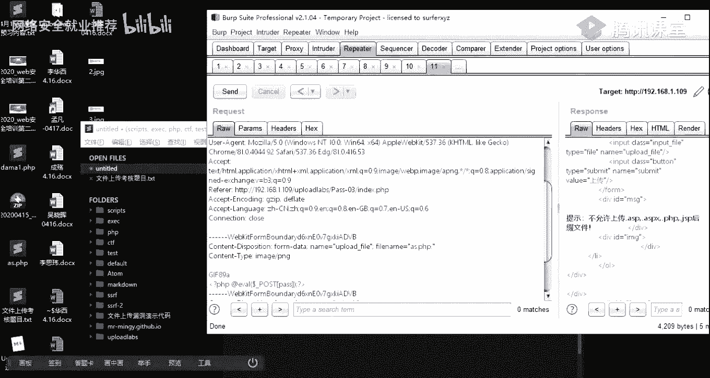
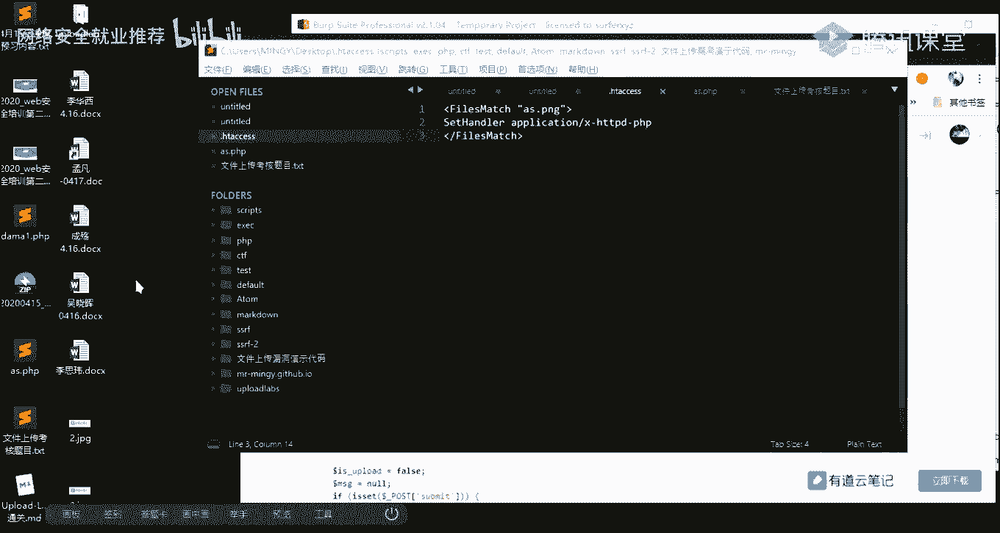

# 🛡️ 网络安全就业推荐 - P18：第16天：文件上传漏洞靶场实操教程


在本节课中，我们将深入学习文件上传漏洞的实战绕过技巧。我们将通过一个精心设计的靶场环境，逐一分析并绕过常见的文件上传检测机制，例如前端JS检测、MIME类型检测、黑名单过滤、文件内容检测等。课程将结合代码分析、工具使用（如Burp Suite）和实际操作，帮助初学者理解漏洞原理并掌握利用方法。


---


## 📋 环境配置与问题解答

上一节我们介绍了文件上传漏洞的基本绕过思路，本节中我们来看看靶场环境的配置以及同学们遇到的一些常见问题。


为了顺利进行后续的靶场实操，需要确保PHPStudy环境配置正确。以下是关键配置步骤：


1.  **开启PHP扩展**：在PHPStudy的“PHP扩展”中，确保勾选并启用 `php_gd2.dll` 和 `php_exif.dll` 这两个组件。
2.  **启用Apache重写模块**：修改Apache配置文件（`httpd.conf`），找到 `LoadModule rewrite_module modules/mod_rewrite.so` 这一行，去掉行首的注释符号（`#`）。
3.  **修改目录权限**：在配置文件中，找到所有包含 `AllowOverride` 的项，将其值从 `None` 改为 `All`。
4.  **添加PHP解析配置**：为了后续利用特殊后缀（如 `.php3`, `.phtml`）绕过，需要在配置文件中添加类型映射。例如，在 `httpd.conf` 或相关配置中添加：
    ```apache
    AddType application/x-httpd-php .php .php3 .phtml
    ```


> **注意**：课程提供的靶场压缩包已预先完成上述配置，建议直接使用，以避免环境问题。


---


## 🔍 靶场关卡实操与原理分析


接下来，我们将逐一分析靶场中的各个关卡，理解其检测逻辑并实践绕过方法。


### 第1关：前端JS检测绕过


本关主要考察对前端JavaScript检测的绕过。网站通过JS代码在客户端检查文件后缀，若不符合白名单则阻止上传。


**绕过方法**：
以下是两种常用方法：
*   **禁用浏览器JS**：直接在浏览器设置中禁用JavaScript，然后上传 `.php` 文件。
*   **抓包修改**：
    1.  上传一个图片文件（如 `.jpg`），以通过前端检测。
    2.  使用Burp Suite拦截上传请求。
    3.  将请求包中的文件名（如 `shell.jpg`）修改为 `shell.php`，然后放行。


**核心代码分析**：
查看网页源码，关键检测函数如下：
```javascript
function checkFile() {
    var file = document.getElementsByName('upload_file')[0].value;
    if (file == null || file == "") {
        alert("请选择要上传的文件!");
        return false;
    }
    // 定义允许的后缀
    var allow_ext = ".jpg|.png|.gif";
    // 提取文件后缀
    var ext_name = file.substring(file.lastIndexOf("."));
    if (allow_ext.indexOf(ext_name) == -1) {
        alert("该文件不允许上传，请上传" + allow_ext + "类型的文件!");
        return false;
    }
}
```


---

### 第2关：MIME类型检测绕过


本关服务端通过检查HTTP请求头中的 `Content-Type` 字段来验证文件类型。




**绕过方法**：
1.  准备一个图片马（将PHP代码插入到图片中）。在Windows命令行下使用 `copy` 命令制作：
    ```cmd
    copy normal.jpg /b + shell.php /a webshell.jpg
    ```
    参数 `/b` 表示二进制文件，`/a` 表示ASCII文本文件。这样生成的 `webshell.jpg` 既能正常显示图片，又包含PHP代码。
2.  上传该图片马，并用Burp Suite抓包。
3.  将数据包中的 `Content-Type: image/jpeg` 保留，同时将文件名 `webshell.jpg` 修改为 `webshell.php` 即可。

**核心代码分析**：
服务端验证逻辑通常类似以下PHP代码：
```php
if (($_FILES['upload_file']['type'] == 'image/jpeg') || ($_FILES['upload_file']['type'] == 'image/png') || ($_FILES['upload_file']['type'] == 'image/gif')) {
    // 允许上传
    $temp_file = $_FILES['upload_file']['tmp_name'];
    $img_path = UPLOAD_PATH . '/' . $_FILES['upload_file']['name'];
    move_uploaded_file($temp_file, $img_path);
} else {
    $msg = '文件类型不正确，请重新上传！';
}
```

---

### 第3关：黑名单过滤（基础绕过）

本关服务端采用了黑名单机制，禁止上传 `.php`, `.asp` 等脚本文件，但过滤并不严格。


**测试与绕过思路**：
首先进行模糊测试，上传各种变形后的文件名，观察响应。
*   上传 `shell.php` -> 被拦截。
*   上传 `shell.jpg` -> 成功。说明存在黑名单。
*   尝试 `shell.Php` (大小写) -> 可能被拦截（说明做了小写转换）。
*   尝试 `shell.php.` (末尾加点) -> 可能被拦截（说明删除末尾点）。
*   尝试 `shell.php ` (末尾加空格) -> 可能被拦截（说明去除首尾空格）。





**有效绕过方法**：
利用黑名单未包含的其他可解析后缀。例如，在特定服务器配置下，`.php3`, `.phtml`, `.phps` 等后缀同样会被当作PHP文件执行。上传 `shell.phtml` 即可绕过。


**核心代码分析**：
关键过滤函数如下：
```php
$deny_ext = array('.php','.asp','.aspx','.jsp');
$file_name = trim($_FILES['upload_file']['name']); // 去除首尾空格
$file_name = deldot($file_name); // 删除末尾的点
$file_ext = strtolower(strrchr($file_name, '.')); // 获取后缀并转为小写
$file_ext = str_ireplace('::$DATA', '', $file_ext); // 去除特殊字符串
if (!in_array($file_ext, $deny_ext)) {
    // 允许上传
}
```
由于黑名单数组 `$deny_ext` 中没有 `.phtml`，因此可以绕过。


---


### 第4关：黑名单过滤（.htaccess文件利用）


本关黑名单更加全面，包含了 `.php3`, `.phtml` 等常见变种。此时，可以尝试利用Apache的分布式配置文件 `.htaccess` 来重新定义解析规则。


**绕过方法**：
1.  创建一个名为 `.htaccess` 的文件，内容如下：
    ```apache
    <FilesMatch "shell">
    SetHandler application/x-httpd-php
    </FilesMatch>
    ```
    这段配置的意思是，在当前目录下，所有文件名中包含 “shell” 的文件，都会被当作PHP文件来解析。
2.  先上传 `.htaccess` 文件。
3.  再上传一个内容为PHP代码、文件名包含 “shell” 的文件，例如 `shell.jpg`。
4.  访问 `http://靶场地址/upload/shell.jpg`，其中的PHP代码将会被执行。

**原理**：`.htaccess` 文件可以覆盖Apache服务器在特定目录下的配置。通过它，我们强制服务器将特定文件当作PHP解析，从而绕过后缀检查。


---

### 第5关：黑名单过滤（点空格点绕过）

本关过滤了 `.htaccess` 文件的上传，但我们可以利用Windows系统的文件命名特性。


**绕过方法**：
构造一个特殊的文件名，例如 `shell.php. .`（点+空格+点）。
1.  服务端代码可能会删除末尾的点，得到 `shell.php. `。
2.  再经过去除空格操作，得到 `shell.php.`。
3.  黑名单比较的是 `.php.`，而名单里只有 `.php`，因此绕过。
4.  当文件在Windows系统上保存时，系统会自动去除最后的 `.`，最终磁盘上保存的文件名就是 `shell.php`。

**核心逻辑**：利用代码过滤顺序与Windows系统处理文件名方式的差异。


---

### 第6-11关：黑名单过滤的多种变形


这些关卡是黑名单过滤的各种变体，原理相似，主要考察对过滤逻辑的理解和测试技巧。

以下是各关卡的绕过要点：
*   **第6关：后缀名大小写**：直接使用 `.PHP`（大写）绕过，因为黑名单里是 `.php`（小写）。
*   **第7关：后缀名空格**：使用 `shell.php `（php后加一个空格）。代码可能只去除了首尾空格，但未处理中间空格，导致后缀识别为 `.php ` 而绕过。
*   **第9关：特殊字符串 `::$DATA`**：在Windows NTFS文件系统中，`::$DATA` 是数据流标识，文件保存时会自动忽略。上传 `shell.php::$DATA`，服务端可能识别后缀为 `.php::$DATA` 从而绕过黑名单，但系统存为 `shell.php`。
*   **第10关：点空格点多重绕过**：类似第5关，尝试 `shell.php. . .` 等组合。
*   **第11关：双写后缀绕过**：如果发现代码使用 `str_replace(“php”, “”, $file_ext)` 来删除 “php” 字符串，可以使用双写法：`shell.pphphp`。替换一次后，中间的 `php` 被删，剩下的 `p` 和 `hp` 组合，又形成了 `php`。


---

### 第12-13关：%00截断绕过

本关漏洞点不在文件名本身，而在文件保存的路径上。服务端将用户可控的路径与文件名拼接，如果路径中存在空字符（`%00`），则后续内容会被截断。


**第12关（GET型截断）**：
1.  正常上传一个图片，用Burp抓包。
2.  观察发现，保存路径 `save_path` 参数在URL中（GET传递）。
3.  修改 `save_path` 为 `../upload/shell.php%00`。
4.  上传一个正常图片，拼接后的路径为 `../upload/shell.php%00normal.jpg`。经过URL解码后，`%00` 是空字符，许多C语言函数（如`fopen`）会认为字符串在此结束，因此实际保存的文件是 `../upload/shell.php`。

**第13关（POST型截断）**：
1.  POST型数据不会自动URL解码，所以不能直接写 `%00`。
2.  需要在Burp Suite的Hex视图下，找到路径参数值对应的地方，直接修改一个字节为 `00`（空字符的16进制）。
3.  例如，将 `../upload/shell.php.jpg` 中的 `.` 的16进制值 `2e` 替换为 `00`。
4.  效果与GET型相同，保存的文件被截断为 `shell.php`。

---

### 第14-16关：文件内容检测绕过

服务端开始检查文件内容，而不仅仅是元数据。

**第14关：文件头检测**：
服务端通过读取文件的前几个字节（文件幻数）来判断类型。
*   **JPEG**: `FF D8 FF E0`
*   **PNG**: `89 50 4E 47`
*   **GIF**: `47 49 46 38`


**绕过方法**：在PHP木马文件的开头，添加对应的图片文件头。例如，制作一个内容为 `GIF89a<?php phpinfo();?>` 的文件，并命名为 `shell.gif`。上传时，文件头检测通过，但后缀仍需通过其他方式（如配合文件包含漏洞）才能解析。


**第15-16关：getimagesize()函数检测**：
PHP的 `getimagesize()` 函数会读取图片的尺寸等信息，如果不是有效的图片文件则返回false。
**绕过方法**：使用真实的图片马。用 `copy` 命令或者图片编辑工具，将PHP代码写入图片的注释等元数据区域，确保不破坏图片结构，使 `getimagesize()` 能正常返回信息。


---


### 第17关：图片渲染二次检测


这是最严格的检测。服务端不仅检查文件头，还会用GD库等图像处理函数对图片进行**渲染再保存**。普通的图片马在渲染过程中，插入的代码很可能被破坏或丢弃。

**绕过方法**：
1.  需要找到图片中一块“空白”或注释区域，该区域在图像渲染时不会被修改。
2.  使用专业的工具（如`weevely`的`gifshuffle`或手动使用十六进制编辑器）将PHP代码精确插入到这些区域。
3.  上传此精心构造的图片马。
4.  通常，还需要配合**文件包含漏洞**（第18关）来执行图片中的代码。因为即使上传成功，服务器也不会直接解析图片文件中的PHP代码。


**文件包含漏洞配合利用**：
假设存在一个文件包含漏洞页面 `include.php`，代码如下：
```php
<?php include($_GET['file']); ?>
```
那么，上传图片马 `shell.jpg` 后，访问 `include.php?file=./upload/shell.jpg`，包含漏洞会读取图片文件内容并将其中的 `<?php ... ?>` 代码当作PHP执行，从而获得Webshell。


---


## 📝 总结与考核预告


本节课中我们一起学习了文件上传漏洞的多种实战绕过技巧。我们从最简单的客户端检测开始，逐步深入到服务端的黑名单、内容检测乃至严格的图片渲染检测。关键在于理解每一关的**防御逻辑**，并通过**模糊测试**和**代码审计**来寻找其缺陷，最后使用相应的技巧进行绕过。


**核心要点回顾**：
1.  **前端绕过**：禁用JS或抓包修改。
2.  **黑名单绕过**：寻找未过滤的后缀、利用系统特性（点、空格、`::$DATA`）、双写、`.htaccess`文件。
3.  **截断绕过**：利用`%00`空字符截断文件路径。
4.  **内容检测绕过**：添加文件头、制作不破坏结构的图片马。
5.  **综合利用**：文件上传漏洞常需与文件包含、解析漏洞等结合才能最终获取权限。


**下节课预告**：下周将进行文件上传漏洞的实战考核。我们将在综合靶机环境中，对多个存在上传漏洞的CMS系统进行实战攻击。请大家提前尝试，将遇到的问题带到课堂，我们共同讨论解决。


> 建议同学们课后使用配置好的靶场，对每一关重新操作一遍，并尝试不查看源码，仅通过黑盒测试（上传测试、观察响应、抓包分析）来判断和绕过，以巩固学习效果。