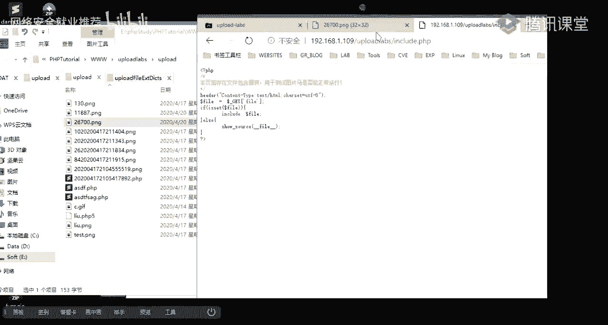
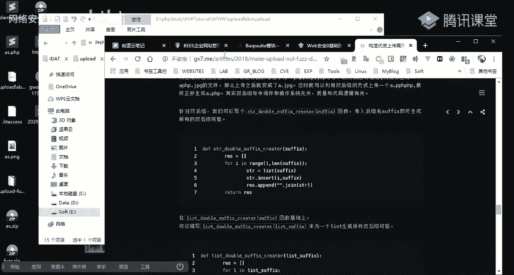
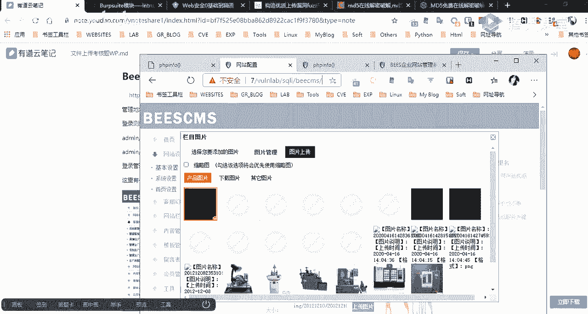

# 🛡️ 网络安全就业推荐 - 课程P19：第17天：文件上传漏洞挖掘思路


在本节课中，我们将学习文件上传漏洞的实战挖掘思路。课程将围绕上周布置的考核题目展开，通过分析几个具体的CMS（内容管理系统）案例，讲解如何发现并利用文件上传漏洞获取服务器权限。我们将从信息收集、漏洞探测、绕过技巧到最终利用，完整地走一遍实战流程。


---


## 📚 课前资料与回顾


上一节我们介绍了文件上传漏洞的基本原理和常见绕过方法。本节中，我们来看看如何将这些知识应用到实战中。在课程开始前，老师在群里分享了一些资料，这些资料对本次考核和后续学习非常有帮助。




以下是课前分享的核心资料介绍：


*   **fuzz字典集**：包含SQL注入和文件上传相关的Fuzz字典。在做爆破测试时，这些字典非常有用。例如，在测试SQL注入点时，如果不知道如何构造Payload，可以直接使用Burp Suite的Intruder模块加载这些字典进行自动化测试。
*   **文件上传漏洞字典生成脚本**：这是一篇技术文章附带的Python脚本。文章几乎涵盖了课堂上讲过的所有文件上传漏洞点，作者根据这些点编写了脚本，可以自动生成用于Fuzz测试的字典。如果看不懂代码，可以重点阅读文章中列出的各种绕过方法（如大小写混合绕过）。
*   **GitHub项目**：上述脚本在GitHub上有开源项目，里面已经生成了现成的字典。字典中组合了常见的绕过后缀，如`%00`截断、大小写、`.php5`、`.phtml`等。在手工测试麻烦时，可以使用这些字典进行批量测试。
*   **图片WebShell文件**：这是上节课用于绕过图片渲染检测的Payload图片文件（如GIF、PNG格式），里面已经写入了一句话木马代码，可以直接用于测试。
*   **解题报告与目标链接**：老师提供了上周考核题目的详细解题报告，以及两个待测试的CMS系统链接（BBCMS和FCMS），供大家对照练习。


关于图片WebShell的利用，需要特别强调：一个内嵌PHP代码的图片文件（图片马）本身不会被服务器解析。要利用它，通常需要结合**文件包含漏洞**，让服务器通过包含这个图片文件来执行其中的PHP代码。明天我们会详细介绍文件包含漏洞。


---




## 🎯 实战考核讲解：BBCMS


上一节我们回顾了课前资料，本节中我们来看看第一个考核目标：BBCMS。我们的目标是获取该系统的后台权限并最终拿到WebShell。


### 第一步：信息收集与后台发现


面对一个未知系统，首先需要寻找其后台管理入口。


以下是常见的后台路径猜测和发现方法：


*   **手工猜测**：尝试常见路径，如 `/admin`、`/admin/login.php`、`/manager` 等。
*   **工具扫描**：使用目录扫描工具（如 `dirsearch`、`御剑`）能更高效地发现隐藏目录和文件。这些工具通过字典枚举，根据HTTP状态码（如200、302、403）判断资源是否存在。


### 第二步：漏洞利用获取后台权限

扫描发现后台登录地址后，尝试登录。在登录框测试常见的SQL注入Payload（如单引号`‘`），发现存在报错注入漏洞。通过SQL注入，可以爆出管理员账号的密码哈希值（MD5）。使用在线MD5解密网站（如cmd5.com）对哈希值进行解密，即可获得明文密码，从而成功登录后台。

### 第三步：寻找文件上传点并GetShell

进入后台后，我们的目标是找到文件上传功能并上传WebShell。

以下是寻找和测试文件上传点的思路：

1.  **定位功能点**：在后台寻找诸如“上传图片”、“发布文章附件”等功能。
2.  **初步测试**：直接上传一个`.php`文件，通常会被拦截。
3.  **抓包分析**：上传一个正常图片，通过Burp Suite拦截请求包，分析其结构。
4.  **绕过检测**：对比正常图片和PHP文件的请求包，发现该系统仅在前端和请求头的`Content-Type`字段做了简单校验。在Burp Suite中，将上传文件的`Content-Type`修改为`image/png`，同时将文件名改为`.php`，即可绕过检测，成功上传WebShell。
5.  **访问Shell**：从响应包或页面元素中找到上传文件的访问路径，使用浏览器或连接工具访问该路径，验证命令执行是否成功。




**核心绕过公式**：
在Burp Suite中修改上传请求包：
```
POST /upload.php HTTP/1.1
...
Content-Disposition: form-data; name="file"; filename="shell.php"
Content-Type: image/png  // 将此处的 application/x-php 修改为 image/png


<?php @eval($_POST[‘cmd‘]);?>
```


---


## 🎯 实战考核讲解：FCMS


解决了BBCMS后，我们来看第二个系统：FCMS。这个系统的登录框没有SQL注入漏洞，但我们可以尝试其他方法。


### 第一步：突破登录验证


对于没有验证码和登录次数限制的登录框，可以采用爆破方式。

以下是使用Burp Suite Intruder模块进行爆破的步骤：


1.  **抓取登录请求包**：输入任意账号密码，拦截登录请求。
2.  **发送到Intruder**：将请求包发送到Intruder模块。
3.  **设置攻击点**：在用户名和密码参数值位置设置Payload标记。
4.  **选择攻击类型**：对于同时爆破账号密码，常用“Cluster bomb”模式；若已知用户名只爆密码，可用“Sniper”模式。
5.  **加载Payload字典**：使用弱口令字典（如课前分享的`weak_password.txt`）作为密码Payload。
6.  **分析结果**：爆破完成后，根据响应包长度或内容筛选成功结果。例如，响应中出现“login success”且长度与其他请求不同的那条，对应的就是正确的账号密码。

### 第二步：利用已知CMS漏洞GetShell


通过爆破进入后台后，发现界面复杂，没有明显的上传点。此时可以查看系统信息（如版本号）。通过百度搜索“FCMS 2.6 漏洞”，可以发现该版本存在任意文件写入漏洞。


漏洞位于主题编辑功能中：
1.  访问路径如 `/themes/default/fs.php`。
2.  观察请求包，发现`src`参数可控，用于指定文件路径。这存在**任意文件读取漏洞**，可读取`config.php`等敏感文件。
3.  同一功能的`save`操作，其请求包中的`src`参数（文件路径）和`content`参数（文件内容）均可控。将`src`参数值修改为`shell.php`，`content`参数值写入PHP代码，即可在服务器上生成WebShell文件。
4.  访问生成的文件路径，成功GetShell。

**核心思路**：在后台功能中，仔细查看每个请求包，寻找可控的参数（尤其是文件路径和内容参数），这些地方可能隐藏着文件写入或读取漏洞。

---

## 🎯 实战考核讲解：PHPK

第三个目标是PHPK系统。这个系统后台有验证码和登录限制，但老师提供了账号密码。我们的重点是在后台寻找文件上传的突破口。


### 第一步：登录后台并寻找上传点


使用给定账号密码登录后，在“内容管理”等模块寻找文件上传功能。发现上传附件时，系统有严格的格式限制。

### 第二步：修改上传允许类型

直接上传`.php`文件被拦截。尝试在后台寻找可以控制“上传允许类型”的功能点。

以下是关键的绕过步骤：

1.  **发现“附件分类管理”功能**：此功能定义了不同附件类型允许上传的后缀（如图片类允许`.jpg, .png`）。
2.  **添加PHP后缀**：在“图片”分类的允许后缀中，添加`,php`（注意逗号分隔）。
3.  **利用修改后的分类上传**：回到发布内容页，选择附件时，选择刚修改过的“图片”分类，此时即可成功上传`.php`文件。
4.  **获取Shell路径**：上传成功后，通过预览或下载链接找到文件的访问URL，访问即可执行WebShell。

**核心思路**：当直接上传被拦截时，考虑后台是否存在可以“定义规则”的功能。通过修改规则（如允许上传的后缀列表），为上传WebShell打开通道。

---

## 🎯 实战考核讲解：学生会简历系统


最后一个系统是一个简单的简历系统，我们将综合运用多种方法。


### 第一步：突破登录的三种方法


该系统登录框存在漏洞，提供了三种突破方式：

1.  **万能密码登录**：使用Payload `admin‘ or ‘1‘=‘1` 和任意密码，利用SQL注入直接登录。
2.  **Burp Suite爆破**：使用Intruder模块，对密码进行爆破，最终爆出密码为`admin445`。
3.  **SQLMap自动化注入**：将登录请求包保存为文件，使用SQLMap的 `-r` 参数指定该文件进行自动化注入，最终也能拖出数据库中的账号密码哈希并解密。

### 第二步：利用简单上传漏洞GetShell

登录后台后，发现一个头像上传功能。

以下是测试和绕过过程：

1.  **直接测试**：上传`.php`文件，被拦截。
2.  **抓包分析**：上传正常图片，分析请求。
3.  **尝试绕过**：尝试修改文件名后缀为大小写混合形式，如`.Php`或`.pHp`。
4.  **绕过成功**：该系统仅做了简单的后缀字符串匹配，未统一转为小写校验。使用`.pHp`后缀成功绕过，上传WebShell。
5.  **获取Shell**：从页面元素中找到上传后的文件路径，访问并验证。


**核心绕过代码**：
```
filename="shell.pHp"  // 利用大小写绕过
```


---

## 📝 课程总结


本节课中，我们一起学习了文件上传漏洞的实战挖掘思路。我们通过四个不同的CMS案例，实践了从信息收集、突破登录验证、寻找后台上传点、分析过滤规则到最终实施绕过的完整流程。

核心要点总结如下：
*   **信息收集是关键**：利用工具扫描目录，搜索已知漏洞。
*   **突破登录多样化**：SQL注入、爆破、万能密码、SQLMap都是可选手段。
*   **关注后台“规则”功能**：修改上传允许类型是常见的突破口。
*   **仔细分析请求包**：任何可控的参数（路径、内容、文件名、Content-Type）都可能成为漏洞点。
*   **经典绕过方法依然有效**：修改`Content-Type`、大小写绕过、结合文件包含等。
*   **工具与手工结合**：使用Burp Suite、Dirsearch、Fuzz字典等工具提升效率，但思考和分析需要手动完成。


希望本节课的实战分析能帮助你建立起文件上传漏洞挖掘的基本思路。明天我们将学习文件包含漏洞，它与今天的图片马利用紧密相关。