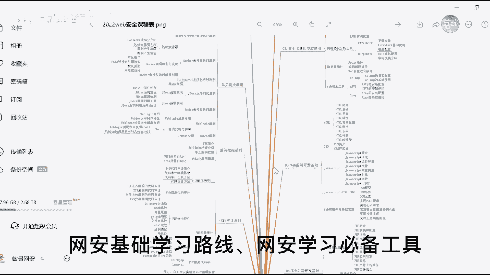

# P2：web安全学习路线图 - 网络安全就业推荐 - BV1Zu411s79i

教程开始之前，up已经把相关的网安基础学习路线。

网安学习必备工具，电子学习书籍，高清教学视频，晚安面试题都已经准备好，放在pl区了，给个三连全部打包带走哦。

赶快冲呀，web安全的学习应该是一个体系化的内容，考虑到整体技术的难度，我们整个学习过程中，应该是需要循序渐进的去进行这个学习，在整个过程中不停地去感受到自己的提升，在这个情况下。

我们才可以能够更好地坚持，持续地保持学习下来，在大家现在看到的脑图之中呢，我们依照技能的学习顺序，让大家逐步的去上手，从简单的再慢慢进阶到复杂的，把各种类型的技能呢进行了一个细化的分类。

以便于大家可以更加完整，并且轻松的去掌握到整个关于web安全的学习，内容和技术体系，在这个体系当中呢，首先我们可以看到它的内容非常非常多，我们把所有的主题全部展开之后，就会看到它有很多很多的内容。

可能对于任何一个人来讲，我们的学习啊，可能都会花费很长的时间，才能够把这个脑子上所列举下来的，所有东西全部学完，所以我们在这里给大家去简单说一下，大家看到这个脑图呢也不用紧张，也不用觉得东西太多对吧。

按照一个web安全的整体学习，为了让它更有效率的学习呢，首先第一个我们要学习的应该是web安全，基础这一块，有没有发现当我们收起来之后，其实啊要学的东西也就不是那么多了，对吧啊。

那首先在接触到web安全的时候，第一阶段我们先要掌握到web安全的一些基础，这些基础包括什么呢，比如说网络协议，在整个的互联网的所有软件当中啊，我们都是基于网络协议来进行数据传输的。

所以了解清楚网络协议的相关内容，搞清楚ip，搞清楚http相关的一些具体的内容，这个对于我们的后续学习一定会事半功倍，所以像是ip啊，像是这个http啊这样的一些东西呢。

我们把它熟悉好之后是非常非常有帮助的，除了这个ip和http这样的一些网络协议之外，接着在web安全领域上面，我们会频繁的使用到某一些特定的工具，那这一块呢首先作为网络安全领域上。

应用最为常见的一个抓包工具，叫做bb weet，这个东西也是我们在web安全的这个领域下，既能学习的重中之重，这个bb street它也同样包含有非常非常多的功能啊，像是burp suite代理。

像是他的一些常用的模块，像是他的一些弱口令爆破，或者说是密码破解的这样的一些实操啊，这个是我们需要去懂得的一些基本的使用，接着呢对于web安全整个技术的学习，其实我们能够达到最直观的收益。

并不是通过就业，或者说是其他的一些比赛之类的内容，而是什么呢，src的挖掘能力，所以web安全首先我们要搞清楚，s r c的这个独立挖掘的能力是怎么去做的啊，常态化的一些操作行为我们都要搞清楚。

在了解完web安全的技术体系之后，我们接着就要开始进入到web安全的一个，相对比较核心的技术体系内容，学习了这个体系内容呢就是有关于漏洞的学习，那我们把所有的漏洞啊，按照目前市场上遇到的一些常见的。

一些容易频繁出现的这样的一些漏洞的情况，我们把它做了一个简单的排序，这个排序第一呢就是业务逻辑漏洞，这也是我们在进行漏洞挖掘的时候，非常非常常见的一个漏洞的类型，业务逻辑漏洞，对于这个漏洞的整体。

我们会跟大家来讲解，有关于业务逻辑漏洞本身是什么东西，它包括有像是url的跳转漏洞，像是信息轰炸的漏洞，像是密码找回的漏洞，还有包括说像是支付逻辑的漏洞，这些漏洞他们是怎么样去发现的。

大概会是在什么样的一些位置，以及说这个漏洞如何去利用，如何去绕过它本身的一些验证机制以及常态化，下面我们这些漏洞的一些修复的手段，会是什么样子的，通过这一章节内容的学习，我们就可以非常完整的去掌握到。

关于业务逻辑漏洞，这样一个非常非常主流的漏洞技术体系，它应该是怎么样的一个操作情况，包括说各种类型业务下的这个业务逻辑漏洞，它的成因，以及我们的挖掘和利用的方法是什么样子的。

就会在这个业务逻辑漏洞这一个阶段下面，会具体的去了解到，那了解完业务逻辑漏洞之后，接着我们需要去了解一个在web安全领域下，非常非常主流，也非常非常常见的另外一个漏洞，叫做cycle注入漏洞。

sql注入漏洞，它全程是基于软件的数据库来搞的，一个漏洞的相关内容，所以我们在掌握这个sql注入漏洞的时候呢，我们必须得优先去了解到整个数据库，它在软件系统当中它的用途是什么样子的。

以及说它的这个数据管理的原理，以及包括说市场现在最主流的关系型数据库，mysql数据库的一个使用到底是什么样子，所以在这里呢，我们列举出了，包括数据库本身的一些基本的概念的东西，需要我们去了解的。

包括mysql本身的一些环境的安装，远程连接的一些手法，包括说通过一些常用的sql语句的操作，来操作我们的数据库增删改查，这些包括一些常态化的函数，查看我们当前的状态，查看我们当前的版本等等等等。

然后以及在sql注入领域下面，我们会非常常用的一个叫做information schemer，这样的一个库，它有什么样的作用，我们可以做一些什么样的事情，通过在sql注入这个领域的前面这一部分呢。

我们把数据库的相关基础，做一个相对比较系统的学习，接着呢，我们就会开始来了解到sql注入本身的内容了，像是sql注入本身呢，它的一些基础，它的基本的概念，它的注入的原理，它注入的手法分类。

包括说这个漏洞它会产生一些什么样的危害，以及说搭建一些跟我们seo植物相关的靶场，比如常见的像是d v w a，像是sl i lips这样的一些东西啊，像这些内容的搭建呢，可以便于我们很好的去学习到。

sql注入的这样一个技术，再把前期的环境的部署，以及说数据库的基础全部都掌握之后呢，我们开始需要真正的进入到sql注入的一个，技术的掌握和学习过程中，那在这个过程中呢会结合到联合查询，结合到布尔盲注。

结合到时间盲注，结合到这个报错注入，以及说宽字节注入smap的工具应用，这样的一些技术维度，带大家全方位的去了解到，有关于sql注入这样的一个漏洞的技术学习，应该要掌握的所有内容啊，像是联合查询当中。

我们对于漏洞进行判断，它是否存在，以及对于漏洞当前判断，我们需要注入的数据类型是什么样子的，然后通过一些方式来明确到我们需要展示的，查询列数，确定我们的显示位，然后再从而获取到我们想要获取的数据。

包括通过注耳盲注，对于无回显的啊，对于无悔险的这种显示状态，我们来如何进行sql注入，包括说时间盲注，它也是一样的对吧，有很多很多的注入方式，这些不同的注入方式，都可以应对在不同的场景下面。

所以我们在学习sql注入的时候，不能够只是单纯从一个注入的维度去思考，我们在应对到不同的系统，所应对的环境场景真的太多太多了，所以对于sql注入的掌握呢，它有非常多的方式方法是需要我们去掌握的。

在这样的一个掌握情况下，我们才可以很好的去了解到整个sql注入，它各种主流的注入方法，以及包括说我们还需要去了解到，在sql注入这个领域下面，有一个非常非常常用的工具叫什么呢，叫做cycle map。

这个sc map他在sql注入的领域下面，它是起到一个什么样的作用，它的环境应该怎么去部署，我们怎么使用这个sql map的工具，更快速去找到系统当中存有的cycle，注入的这样一些漏洞。

这些注入点以及说通过sql map，可以很好的帮我们实现到注入，来获取到我们想要的内容，这也就是我们所讲到的，自动化注入的一个实现啊，所以整个sl注入这一章节的内容讲解呢。

我们会让大家去了解到mysql数据库的相关的应用，以及sql注入的一些相关实操的技术技巧，同时呢也包括有sc map，它本身工具的一些自动化注入的应用，通过这样的一些技术的全面掌握。

大家可以对于sql注入有一个，非常非常非常好的掌握啊，然后第三个漏洞的讲解就是跨站脚本攻击漏洞，也就是俗称的x s s漏洞的一个讲解，在这个xss漏洞的讲解过程中，因为它是关联到了系统的前端。

所以说在这个漏洞的学习之前呢，我们需要对前端有一个基础的认识，包括html包括javascript，包括说前端对于事件处理的这样一些逻辑，是怎么去实现的啊，这些这些内容全部都很好的去熟悉，了解之后。

我们才能够更好的去实现，有关于xs的这样一个漏洞的利用，那这个在掌握到前端的一些，相关的基础内容之后呢，我们会去了解到xs s这个漏洞，它是什么样的一个原理，它存在于什么样的场景。

这个漏洞可以给我们带来一些什么样的危害，包括说这个漏洞的类型，像是反射型存储型，还有像是doom best这样的一些情况啊，这样的一些不同的类型，我们都需要很好的去了解，就像我说的不同的软件。

它会有不同的表现形态，我们在不同的环境下面，应对到这个漏洞，可能生成的这个情况是不一样的，所以我们需要更加全面的去了解到，这个漏洞的方方面面，在了解完xs s这个漏洞，的基本的一些原理之后呢。

接着我还需要去了解到这个漏洞，我们可以用它来做一些什么样的事情，包括说xss当中获取cookie漏洞去钓鱼，或者说做流量挟持这样的一些情况，都是我们在整个xss的过程中。

非常非常常用的一些漏洞利用的手段，然后同样的在这个领域下，像是我们的beef攻击啊，beef平台的一个攻击实现，这个也是xs s下面非常非常主流，且常用的一种操作行为，所以对于beef的一个使用。

我们也是需要非常清晰的去了解到的，同时呢对于这个漏洞啊，本身它是有很多的修复方式的，所以我们也需要去了解到，一般情况下我们的这个网站，它对于xss漏洞的一些修复手段，是怎么去实现的。

我们在了解到他的修复手段之后，我们可以更好的去做一些漏洞限制的绕过，让我们可以更加好地实现，xss漏洞攻击的这样一个手法，所以在跨站脚本攻击这个漏洞的章节内容下面，我们列举了包括xss漏洞的原理。

以及它的常态化的攻击手段，包括说这个漏洞的利用方法，然后结合到beef平台的一些使用啊，然后同时呢也会要求大家去了解到，关于xss漏洞的一些修修复的手段，以便于我们可以更好的去对这个xs的漏洞。

来进行多维度的攻击，这个是我们在了解一个漏洞，学习一个漏洞的时候，必然要懂得方方面面的知识啊，那除了这个呃业务逻辑sl注入，包括说xs这样的一些形态之外呢，我们还需要去了解到跨站请求伪造漏洞。

也就是cs rf跨站请求伪造漏洞c s r f，这个也是非常常见的一个漏洞啊，包括说同样的这个漏洞，它具体的原理是什么样子的，这个csrf为什么会出现，它出现之后会产生一些什么样的危害啊。

我们的攻击流程会是什么样子的，包括说这个漏洞，我们空过什么样的一些方式去利用啊，包括他的get请求，他的post请求这样的一些内容上面，我们该怎么去做啊，怎么去利用这个漏洞来达到我们的目的。

同时呢也会有一些常态化的漏洞，修复的一些手段，这些东西我们都需要去一一的系统掌握，这个是关于csrf这个漏洞，在了解完cs rf的漏洞之后呢，还有像什么呢，像是服务器端请求伪造漏洞。

也就是我们所讲的s s r f啊，s s r f也是非常常见的一个啊，那同样的，我们在做这个s s rf漏洞的列举的时候啊，也是基于漏洞本身的一个原理，它是在什么情况下出现的。

我们该怎么样去发现这个漏洞，以及包括这个漏洞它的分类啊，包括有回显的漏洞，无回显的漏洞这样的一些情况，同时呢这个漏洞我们该怎么去利用，利用这个漏洞可以达到一些什么样的效果。

比如说像是攻击redux这样的一些事情对吧，包括说呃像是反弹需要的这样的一些内容，我们该怎么去实现啊，这个是基于有关于s s r f漏洞的一个，实际的使用啊，同时呢包括说像是主流的一些对于漏洞的。

防御手段，像是添加白名单，像是协议的限制等等等等这样的一些手段呢，他们是怎么去实现的，那基于他们实现的这个过程，我们该怎样的去绕过这样的一些防御，来更好的去对服务端的这个s s i f的实现啊。

这个漏洞的攻击来做到一个更好的效果，这个是关于srf漏洞的一个相关内容，那学完这些常态化的比较，市场主流的这些漏洞之后呢，呃其实还有很多其他的漏洞，但是在学习完主流的漏洞之后，我们优先应该考虑的是。

漏洞挖掘的技巧该怎么样啊，漏洞挖掘的技巧该怎么样，因为我们不可能只是单纯的去了解到，而不同的漏洞它是什么样的成因，该怎么样去利用，那我更想要知道的是，在整个网站上面，我该怎么去挖掘这些可能存在的漏洞呢。

所以说我们需要对于漏洞挖掘这个东西，有一个相对比较清晰的认知，要去了解到在整个网站当中，我们做漏洞的挖掘，应该需要用到一些什么样的手段和方法，所以在这里呢，我们也列举了，关于漏洞挖掘技术的一些相关内容。

这些内容包括说信息收集，包括说我们常见的这些扫描器，该怎么去应用的这样一些技术，通过信息收集，我们可以在src的挖掘前的这个系统，前期的信息收集工作，以便于说我们后续正儿八经。

开始做src的挖掘的时候呢，我们可以更加有效率的去进行这些信息的收集，包括说我们的域名信息，包括说我们的ip信息，包括端口信息，网站信息等等等等，这样的一些信息。

他的收集可以让我们更好的去了解到这个软件，了解到这个网站，让我们可以做到更好的一个src的漏洞挖掘，除此之外呢，在整个漏洞挖掘的过程中，我们还会频繁的使用到，一个叫做扫描器的东西啊，扫描器的这个内容呢。

它分为主动扫描器和被动扫描器两种，并且呢目前市场最为主流应用的像是aw v s，像是x ring这样的一些扫描器，都是我们平时在做src的时候，非常非常常会去用到的这样一些工具啊。

所以说在漏洞挖掘的这个阶段下，我们会给大家去列举到，你如果想要挖掘系统平台的src的漏洞啊，想要去做src的漏洞挖掘的话，对于整个系统的前期信息收集，以及在挖掘过程中的这个扫描器的使用，该如何去应用。

来提升我们有关于漏洞挖掘的效率，这个是可以结合到前面我们所列举下来的，每一个漏洞来进行讲解，来进行使用，来进行应用的这样的一个过程啊，然后同样的除了像是漏洞挖掘之外，还有一些常见的漏洞。

包括说文件包含漏洞，它是一个什么样的情况，我们怎么去利用这个漏洞，来实现我们自己的一些攻击，包括说上传一些啊含有恶意图片，或者说包含有恶意代码的这些文件哎，来对我们的这个目标网站。

进行一个对应的攻击呢对吧，像是文件包含的漏洞与此关联的呢，还会有一个叫做文件上传的漏洞啊，我们在文件包含的漏洞过程中，唉，我们如何去将这些有恶意的文件，去把它传递给到服务器呢，所以我们需要用到文件上传。

而文件上传的这个功能当中呢，很多系统的文件上传它都是存在有漏洞的啊，它都是存在有漏洞的，所以文件上传和文件包含这两个漏洞，都是我们一般会联合到一起去使用的东西，而在我们的这个脑图当中。

也详细明确的跟大家讲解了，关于文件包含漏洞和文件上传漏洞，他们是如何实现的，他们的这个基本的概念会是什么样子的，以及说如何去制造一句话的木马，像是大马，像是小马这样的一些东西啊。

对于web shell这个实现该怎么去做，以及说对于文件上传之后，在系统当中把文件包含的漏洞，可以让他哎运行起这些木马程序，来对我们的系统产生更多的危害，来获取更多的权限，来获取更多的数据等等等等。

这样的一些攻击手段，以及说针对于系统已有的它的文件检测机制，或者说他的一些防御手段，我们该如何去绕过它，这个在我们所列举到的，关于文件包含和文件上传漏洞当中，我们都有详细的去说明。

除了文件包含和文件上传之外，还会有像是xml，就是xml的外部实体注入的这个叉叉e的漏洞啊，像是这个叉叉e的漏洞，因为它关联到了xml这样的一个内容，所以我们得需要先了解到xml，它的一个基础概念啊。

包括说它的语法规则是什么样子的，xml它的一些数据类型包括什么啊，包括这个文件它的这个格式编写是什么样子的，一个形态参照到底是个什么东西，以及说dt d，这个也是我们在xml的这个应用过程中。

非常非常常见的一系列的内容啊，然后除此之外呢，对于叉叉e的这个漏洞啊，它是一个什么样的情况，我们该如何去利用这个漏洞，如何将xml的外部实体注入，这个实现了在整个的xml的外部实体注入，叉叉e的漏洞。

内容讲解过程中，我们会非常详细的，把整个叉叉e漏洞的一个实现，包括它本身的介绍，包括他的利用，包括这个漏洞的常态的一些修复手段，都会列举在这样的一个阶段内，让大家去。

可以更加清楚地了解到有关于xml的外部实体，注入漏洞啊，那除了这些常态化的一些技术漏洞之外呢，还有我们软件系统架构体系上面，可能会关联到的一些中间件，这些中间件本身它也是存在有漏洞的啊。

除去我们前面所讲到的sql注入，这样的一些内容之外，还有额外的，比如说啊像是j boss，像是web logic这样的一些历史版本过程中，它可能存有的漏洞，如果说对方的软件系统。

他们使用的是这样的一些中间件，并且恰好他们使用的是这样的一些，历史版本的话，那也就意味着这些漏洞，是可以直接被我们所使用的，但是在讲这j boss讲这个web logic之前呢。

肯定大家还是得要先了解到，这个所谓的中间件的概念是什么，所以大家肯定要学习中间件的漏洞的话，优先你得要先考虑清楚，关于中间件它到底是一个什么样的概念，同时呢，像是这个历史版本下面存在有明显漏洞的。

这样的一些中间件，像是j boss，像是web logic这些东西，他们这些漏洞到底是什么样子的，以及这些东西他们自己是什么样的概念，这些漏洞我们该怎么去利用啊，这个漏洞该怎么去发现。

这样的一些内容都是我们需要去了解到的，当我们了解到这样各种维度的漏洞之后，我们所应对的这个软件系统，它存在有任何一个维度的漏洞，都可以被我们非常非常清晰地去了解到，所以这个是我们所列举到的。

关于外部网络安全这一块，关于web安全这一块，我们应该需要去了解到的一些学习到的一些，非常非常核心且市场非常主要的技术体系，内容都在这个脑子上面已经完整的列举了，而这个内容呢如果大家有需要的话呢。

可以去私信我们啊，找我们来要这个脑图，这个是没有关系的啊，然后除了这个脑子上所列举的这些，常态化的漏洞，包括说web安全的一些基础内容之外，还包括有一些什么呢，对于web安全这个领域。

如果说你想要好好的去学会它，想要让自己变的能力更加强，让能够让自己可以学得更加完整，那有两个东西一定绕不开，一个是操作系统linux，因为我们应对的所有的软件系统，基本上99。

99%都是gb linux，操作系统搭载的服务器，所以我们在做这些web安全的学习，对于漏洞的一些挖掘和利用的时候呢，我们一定需要去操作到对方的这个操作系统，这个服务器啊。

这个服务器呢基于linux来部署的话，所以我们一定要了解到linux相关的内容，包括它常态化的一些指令，包括它本身的目录结构内容，包括它的用户，用户组的权限等等等等一系列的内容。

这些都是我们需要去了解到的，除了linux之外，另外一个绕不过的就是p h p啊，可能你作为一个初学者，或者说有兴趣去想要了解的同学呢，你只需要按照这个脑洞上面，前面所列举的这些漏洞的内容。

你把它全部学会，你就可以开始做s r c的挖掘，或者说你就可以开始进入到这个领域了，但是如果你想要让自己卷起来，你想要让自己偷偷的惊艳到所有人，那么肯定在除去这些web安全的。

常态化的技术体系内容的学习之外，你肯定还是得要去优先掌握一门叫做，p h p的语言啊，这个菲律宾的语言在未来的时间里面，一定会给到你比较好的帮助，所以在这里呢，我也列举了一些关于菲律宾的这门语言。

我们应该学习的内容，包括说他的网站开发，该怎么去实现它的编程的一些基本的编程内容，该怎么去做它的环境，部署它的函数，它的对象等等等等啊，这样的一些内容，然后同时呢也包括说像是p h p的代码审计。

我们如何去做代码审计，这个代码审计该怎么开展，中间会应用到一些什么样的技术，用到一些什么样的技巧等等，这些内容呢我们都会啊给大家去列下来，希望大家在除去web安全的技术领域的学习之外，还可以去学到更多。

其他在这个行业内有用的技术，这个就是给大家列举出来的，这样一个web安全的脑图的内容内容，如果大家已经听到这里了，觉得能够坚持下来，听到这个时候的同学，我觉得要一个三连，应该不是特别过分的一件事情吧。

还望各位听到现在的同学，可以给我一个一键三连鼓励鼓励我，那么这一套啊就是有关于web网络安全的内容，如果说大家想要进入这个行业的话，你不知道该学什么，不知道该怎么办，没有关系，你按照我列的这个脑图。

你就无脑去学就完事儿了啊，你无脑学会这个脑图上所列举的东西，按照我所讲的，从web安全到业务逻辑漏洞，到sql注入漏洞，再到跨站脚本攻击漏洞，再到尾站啊，跨站请求伪造漏洞，再到服务器端请求伪造漏洞。

在包括漏洞挖掘的技巧，以及说我们的文件上传漏洞，文件包含漏洞，包括远程代码执行漏洞，xml的外部实体注入攻击漏洞，以及常见的中间件漏洞，你如果按照这样的顺序，一个一个的去列下来去学习。

按照我的脑图上给到的这些技术内容，你无脑去学，你一定可以进入到web网络安全的这个领域，一定可以成为一个合格的网络安全人员，这个就是我要跟大家所讲到的。

