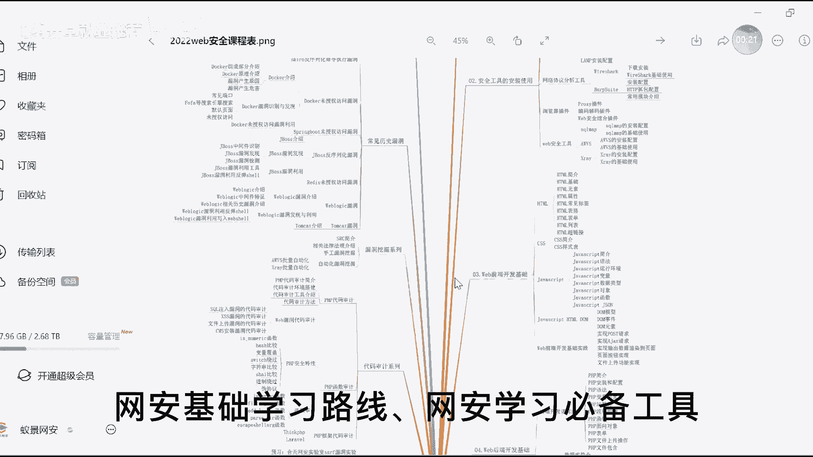
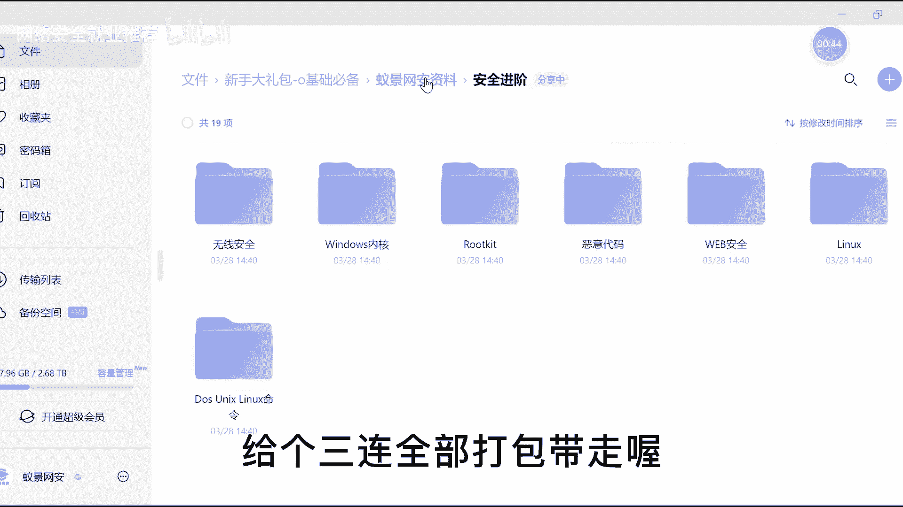
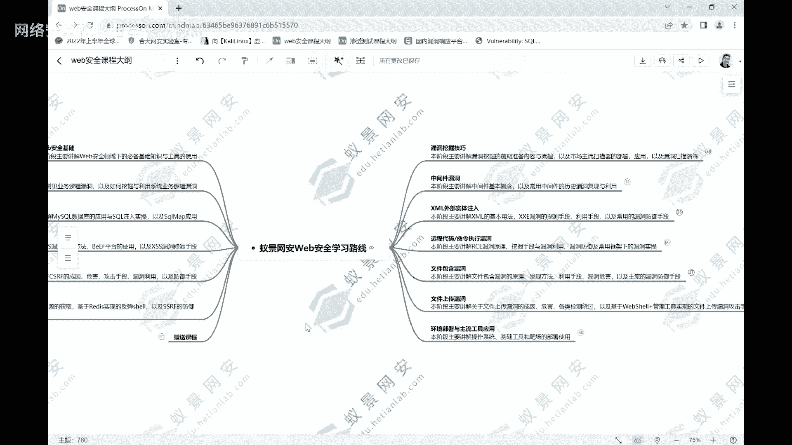

# 课程P2：Web安全学习路线图 🗺️

在本课程中，我们将系统性地学习Web安全的核心知识体系。课程内容从基础概念开始，逐步深入到各类主流漏洞的原理、利用与防御，旨在为初学者构建一条清晰、高效的学习路径。

## 概述 📋

Web安全的学习是一个体系化的过程，需要循序渐进。为了让大家能持续感受到提升并坚持下去，我们依照技能的学习顺序，将内容从简单到复杂进行了细化分类。以下内容将帮助大家完整且轻松地掌握Web安全的知识体系。

## Web安全基础 🏗️

在接触Web安全时，第一阶段需要掌握其基础。这些基础是后续学习的基石。

以下是Web安全基础需要掌握的核心内容：

1.  **网络协议**：互联网中的所有软件都基于网络协议进行数据传输。理解网络协议，特别是IP和HTTP协议的具体内容，对后续学习至关重要。
2.  **抓包工具**：在Web安全领域，Burp Suite是最常用的抓包与分析工具。掌握其代理功能、常用模块以及弱口令爆破等实操技能是重中之重。
3.  **SRC挖掘能力**：学习Web安全最直观的收益之一是具备独立挖掘安全漏洞（SRC）的能力。我们需要了解常态化的漏洞挖掘操作流程。

## 核心漏洞技术学习 🔍

在了解Web安全的基础技术体系后，我们将进入相对核心的漏洞技术学习阶段。我们按照市场上常见且易出现的漏洞类型进行了排序。

### 1. 业务逻辑漏洞 🧩

业务逻辑漏洞是漏洞挖掘中非常常见的类型。本节我们将讲解该漏洞的本质、发现方法、利用手段及修复方案。

以下是业务逻辑漏洞的常见类型：

*   **URL跳转漏洞**
*   **信息轰炸漏洞**
*   **密码找回漏洞**
*   **支付逻辑漏洞**

通过学习，你将完整掌握主流业务逻辑漏洞的技术体系，包括其成因、挖掘与利用方法。

### 2. SQL注入漏洞 💉

SQL注入漏洞是基于数据库的常见漏洞。要掌握它，必须先了解数据库在软件系统中的作用、数据管理原理以及主流关系型数据库MySQL的使用。

以下是学习SQL注入前需要掌握的数据库基础：

*   数据库基本概念
*   MySQL环境安装与远程连接
*   常用SQL语句（增删改查）
*   常用函数（查看状态、版本等）
*   `information_schema`库的作用

在掌握前期环境部署和数据库基础后，我们将正式进入SQL注入技术的核心学习。

以下是SQL注入的主要技术维度：

*   **联合查询注入**：判断漏洞是否存在、确定注入数据类型、明确查询列数、确定显示位以获取数据。
*   **布尔盲注**：针对无回显的页面状态进行注入。
*   **时间盲注**：另一种针对特定场景的注入方式。
*   **报错注入**
*   **宽字节注入**
*   **SQLMap工具应用**：自动化注入的实现，用于快速发现和利用SQL注入点。

通过全面掌握这些技术，你可以对SQL注入有一个深入的理解。

### 3. 跨站脚本攻击（XSS）漏洞 ⚡

XSS漏洞与系统前端紧密关联。在学习此漏洞前，需要对前端基础有所认识。

以下是学习XSS前需要了解的前端基础：

*   HTML
*   JavaScript
*   前端事件处理逻辑

在掌握前端基础后，我们将了解XSS漏洞的原理、存在场景、危害及类型。

以下是XSS漏洞的主要类型：

*   **反射型XSS**
*   **存储型XSS**
*   **DOM型XSS**

了解XSS的基本原理后，我们还需要学习其利用方式。

以下是XSS漏洞的常见利用手段：

*   获取Cookie
*   漏洞钓鱼
*   流量挟持
*   结合BeEF平台进行攻击

同时，了解网站对XSS漏洞的常见修复手段（如输入过滤、输出编码），有助于我们进行漏洞限制的绕过。

### 4. 跨站请求伪造（CSRF）漏洞 🎭

CSRF也是非常常见的漏洞。本节将系统掌握其原理、危害、攻击流程及利用方式。

以下是CSRF漏洞学习的要点：

*   漏洞原理与成因
*   攻击流程
*   利用方式（针对GET与POST请求）
*   常态化的漏洞修复手段

### 5. 服务器端请求伪造（SSRF）漏洞 🔄

SSRF同样是常见漏洞。本节将基于漏洞原理，学习其发现、分类、利用及防御绕过方法。

以下是SSRF漏洞的相关内容：

*   漏洞原理与出现场景
*   漏洞分类（有回显与无回显）
*   漏洞利用（如攻击内网Redis、反弹Shell）
*   主流防御手段（如白名单、协议限制）及其绕过方法

## 漏洞挖掘技巧与进阶漏洞 🛠️

学完主流漏洞后，我们需要思考如何在实际网站中挖掘这些漏洞。因此，掌握漏洞挖掘的技巧至关重要。

以下是漏洞挖掘的核心技术：

1.  **信息收集**：在SRC挖掘前期，收集目标系统的域名、IP、端口、网站架构等信息，为后续挖掘打下基础。
2.  **扫描器应用**：使用扫描器能有效提升漏洞挖掘效率。主流的扫描器分为主动扫描器（如AWVS）和被动扫描器（如Xray）。

### 6. 文件包含与文件上传漏洞 📁

文件包含漏洞允许包含恶意文件，常与文件上传漏洞结合使用。

以下是这两个漏洞的学习要点：

*   **文件包含漏洞**：基本概念、实现原理与利用方法。
*   **文件上传漏洞**：如何制造一句话木马（小马）、大马等Webshell，并利用文件包含漏洞使其运行。同时，学习如何绕过系统的文件检测与防御机制。

### 7. XML外部实体注入（XXE）漏洞 📄

XXE漏洞关联XML。学习前需了解XML的基础概念。

以下是学习XXE前需要掌握的XML基础：

*   XML语法规则
*   XML数据类型
*   文档格式定义（DTD）

在掌握XML基础后，我们将详细学习XXE漏洞的介绍、利用方式及修复手段。

### 8. 中间件漏洞 🖥️

软件系统架构中使用的中间件（如JBoss, WebLogic）的历史版本可能存在漏洞。

以下是学习中间件漏洞的步骤：

*   理解中间件的概念。
*   学习特定中间件（如JBoss, WebLogic）的历史版本漏洞。
*   掌握这些漏洞的发现与利用方法。

## 能力拓展：Linux与PHP 💪

想要在Web安全领域变得更加强大，有两项技能绕不开：Linux操作系统和PHP编程语言。

以下是能力拓展的学习方向：

1.  **Linux操作系统**：绝大多数服务器基于Linux部署。需要掌握其常用指令、目录结构、用户与权限管理等。
2.  **PHP编程语言**：掌握PHP有助于深入理解Web应用。学习内容包括环境部署、基本编程、函数、对象等。更进一步，可以学习PHP代码审计的技术与技巧。

## 总结 🎯

本节课我们一起学习了Web安全的完整学习路线图。从Web安全基础开始，我们逐步深入探讨了业务逻辑漏洞、SQL注入、XSS、CSRF、SSRF等核心漏洞的原理与利用，并介绍了漏洞挖掘技巧以及文件包含、文件上传、XXE、中间件等进阶漏洞。最后，我们指出了Linux和PHP这两项重要的拓展技能。

如果你希望进入Web安全行业，只需按照本路线图，从Web安全基础开始，依照顺序无脑学习脑图所列出的每一项内容，你必将能够成为一名合格的网络安全人员。