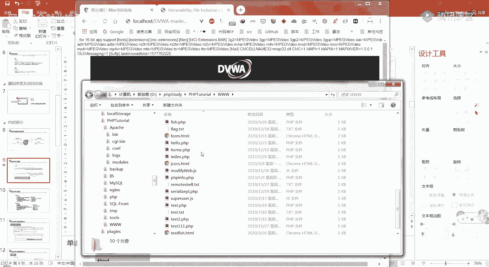
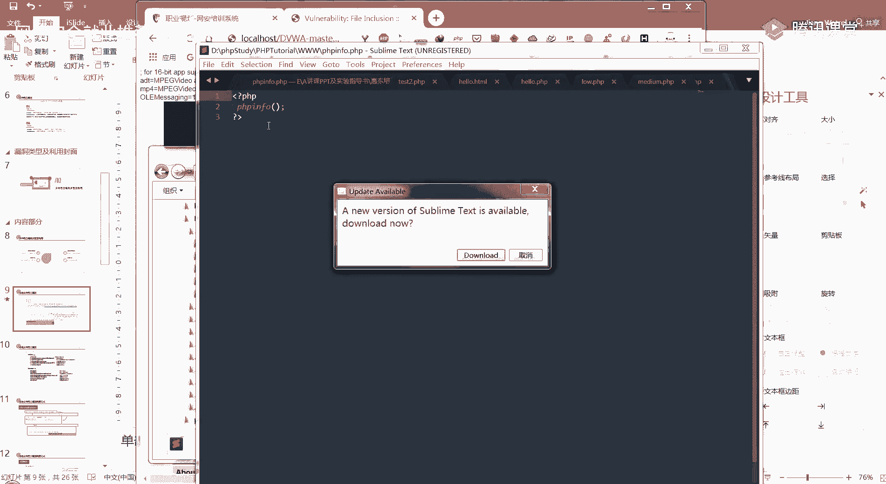
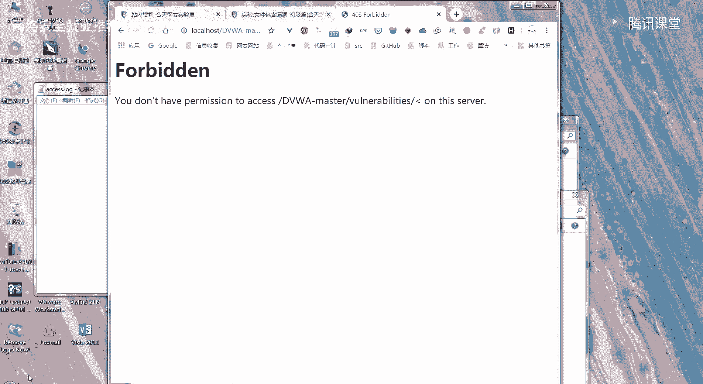
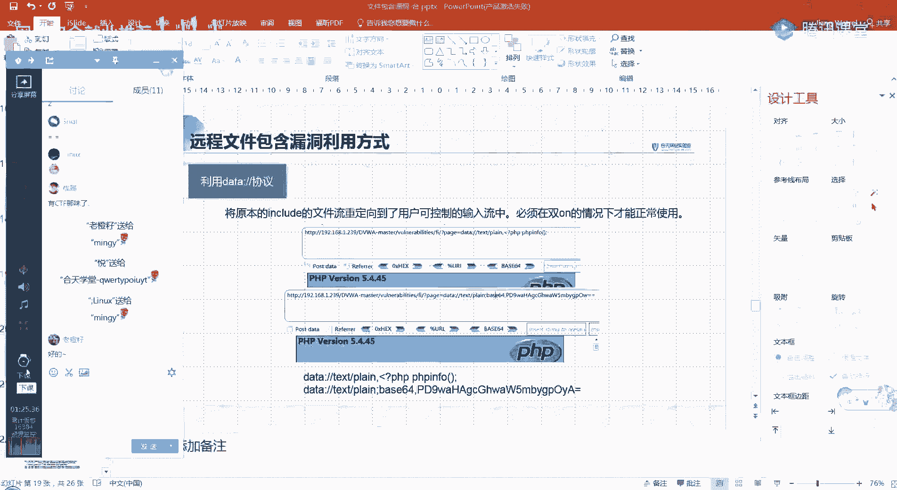

# P20：第18天：本地文件包含及远程文件包含漏洞详解 - 网络安全就业推荐 - BV1Zu411s79i

是是只有我没有画面吗，没有应该大家都没有画面，因为我还没有开那个全屏分享。

我想嗯你们现在能看得到我的屏幕吗，好的，为什么今天都没有人来听课呀，那你们为什么就是有同学做了，我发给你们的预习内容吗，就是发群里面的那个，这两个实验有人做吗，对于w那个做了一下下面的这个呢。

下面这个做了吗，好吧，现在八点钟了，然后可能大家也没有做，我之前发给你们的一个预习内容，那我们这节课讲的是一个文件，包含漏洞，如果大家有做那个实验的话，可能就会嗯先了解一下啊。

那我们开始今天的一个课程的讲解吧，今天讲的是这个文件包含漏洞，然后按照惯例有一个目录，最开始的话一个漏洞的概述，第二部分的话就给大家介绍一下文件包含漏洞，它的类型分为几类。

以及然后每个类型它是如何进行一个利用的，第三个部分的话，就介绍文件包含漏洞的一个危害以及防御，这个危害和防御，应该大家啊听完这个类型及利用，应该自己也能总结出一两点。

然后第四个的话就是给大家布置一个课后作业，那首先来看第一个部分，就是文件包含漏洞的一个概述，首先是一个什么是文件包含，他其实是开发人员将重复，将需要重复调用的一个函数写入一个文件。

对该文件进行包含时产生的一个操作，就叫文件包含，这样编写代码能够减少代码的冗余，降低代码后期维护的难度，保证网站整体风格的统一，比如说我们的这个我们的和天，你可以看到它其实这个头就是这个上面。

我们点别的地方，就是它这个这个上面他虽然就是颜色变了一下，但是它基本内容还是没有变的，以及它的这个下面都是没有变的，这些东西其实就是每个页面里面都需要用到的，一些东西，就比较重复嘛。

它就可以写在一个文件里面，然后进行一个引包含，把它引入进来，你看它这个尾部也是一样的，所以这样的话，就可能就这就是一个文件包含的一个例子，那它为什么会称之为漏洞，就是漏洞产生的原因是什么。

其实就是因为文件包含的函数，加载的参数没有经过过滤或者是严格定义，可以被我们攻击者来控制，包含其他的一些文件，导致就执行了一些非预期的一个代码，我们来看一下它的一个，比如说它常见的一个漏洞代码。

看零一这一个部分就是在这边的话，你可以看到在这个p h p代码中，他包含通过这个include函数，它是一个文件包含的一个函数，包含我们这个file lab。

然后这个file lab是通过get来进行传入的，那这样的话是不是这个get我们之前也有说过，是不是我们就可以直接在它的ui l中，加入这个file la，然后他通过这个get就能取到。

那这里的话它并没有对我们这个传入之后，就是这个file lab进行一个嗯过滤，这样的话，那就能够包含我们自己上传的一个文件，或者是其他他们系统里面自带的一些，敏感的一些文件。

所以这就会产生一个文件包含漏洞，你可以看到零二的话，就比如说他访问的url就是问号，后面file name等于show。p h，那这样的话他就会把受点p h p，包含进我们这个嗯当前这个页面里面来。

那我们改变file lab的值的话，就可以改变这个菲律宾代码中包含了一个文件，是不是说大家能理解吗，如果能理解的话，就打个一，好大家应该都能理解，这这个漏洞还蛮简单的，那我们接着来看。

这怎么成这个样子了，嗯就是菲律宾中文件包含的一些函数，第一个的话就是require，第二个的话就是这个include嗯，介绍这些函数的话，大家如果以后想做代码审计，可能就会你去审计一个cms的时候。

就可以全局搜索这些关键词，就是比如说全局搜索这个require，require ones，include include ones的话，你然后再看一下他在那个他的代码中，有没有进行一个有效的过滤。

或者是怎么样来判断它是否存在，这个文件包含的一个漏洞，那我们接下来看一下它具体的一个解释，第一个的话就是这个require组嗯，有一个require函数，他这个四个这边给出的，就是他们四个的一个区别。

这个他们四个都是用来进行文件包含的，一个函数，然后区别的话就是这个require的话，它是函数区出现错误时会直接报错，并退出程序的执行，那这个require once的话，它也是出错的时候就直接退出。

但是它和这个require的一个区别，就是它仅仅只会包含一次，然后在脚本执行期间，同一个文件可能会被多次引用，那么为了确保只包含一次，来避免函数重定义以及变量重新赋值，然后出现一些啊一些问题的话。

他就会使用这个require once，来进行这个文件，包含第二个的话就是include，那这个include函数的话，它是函数出现错误的时候，并不是像require这样直接退出。

而是它会抛出一个异常呃，抛出一个警告，然后程序是会继续运行的，然后include ones的话，它也是出现错误的时候，仅仅会抛出一个眼警告，而且它只会包含一次，就和这个require ones差不多。

这四个函数大家了解一下就好，主要可能大家如果在代码审计的话，可能就会就会用到，那第二个部分的话，就是这个文件包含漏洞的一个类型，及其它的一个利用，我们首先来看一下第一个，它就分为两种类型。

一种是本地文件包含漏洞，其实我这少打了一个漏洞，就本地文件包含以及远程文件包含，那本地文件包含的话，顾名思义就是它被包含的文件，就是我们使用那个刚才说过的那四个函数，去进行一个包含嘛。

它包含的那个文件是在服务器本地的，所以就叫本地文件包含，远程文件包含的话就是我们使用类似的函数，包含的文件在我们远程的一个服务端，可能是我们攻击者控制的一个服务端，这个本地文件包含它的一个利用方式的话。

就是它可以包含本地敏感文件，或者是我们自己嗯通过客户端上传文件，上传上去的一个文件，然后它进行一个包含，那远程文件包含的话，他可能就是包含攻击者指定的一个url，里面的一些恶意文件。

这个l f i就是local file include的一个缩写吗，这个i fi就是a remote file include，就是远程文件包含以及本地文件包含，我们接着来看啊。

我们接着看一下这个本地文件包含漏洞，第一个的话在这里的话是给大家举了一个例，子，是包含我们的一个系统文件内，在这的话我们的c盘都有这个文件，这个windows杠win。i n i。

然后它里面的话里面的内容就是这个，那个画笔嗯，就是这个灰色这一串的一个内容，就会显示给我们在这里，然后第二个的话就是包含我上传的一个文件，那在这儿这个点点杠大家知道是什么意思吗，就是这个点点斜杠。

有pose什么，什么意思，点点写啊对，对，然后在这的话它就这里这个配置的话，在这等于我可以，这个其实是如果大家有预习的话，其实是这个，在这这个file include就是文件包含嗯。

如果大家想做这个的话，之前我给大家有一个预习内容，这个文件包含漏洞，这个实验里面它的一个实验环境就是这个，然后大家先可以就是那个课后再做，或者是之后再做，现在先看，先看我吧，然后在这里的话。

这个这个地方它有一个传入了一个参数，就是这个配置等于，然后后面加上了一个include，点p h p，在这儿的话，它我们可以点击其他的一些来看一下，你可以看到在这的话。

它这个配置就会等于file一点p h p，然后在这里的它的一个内容就做了一个更改，我们返回，你看到这它又变成了include。p h p，然后翻到二的话，就是这个file 2的一个菲律宾的一个内容。

那我们就可以猜测它这个配置，这里他传入的这个参数，可能就是在当前这个fi这个index点，菲律宾里面去引入的一个，文件，所以说他在这等于file一点p h p的时候，他就引入了file一的一个文件。

然后file 3的时候，它就引入了一个file 3的一个内容，所以说我们可以在这试着去进行，包含其他的一些一个目录，比如说在这的话，我们是包含了一个c盘下的，windows，嗯可以看到它在这里的话。

因为这个搭在我本地，所以我们可以去看一下c盘的，你可以看到它这儿显示的东西，其实和我们这个里面就是一样的，只是它没有那些换行符，对吧，所以在这的话就可以确定它可能就存在，这个文件包含漏洞。

然后我在这儿给大家演示的第二个例子，是说包含了一个上传的文件，那在这的话我在这个，这个根目录下面它是有一个。

菲律宾info点菲律p了，然后在这里的话是执行了一个菲律宾for函数。

然后我在这儿尝试去进行一个包含这个文件，就是这个菲律宾info点菲律宾这个文件，那我们当前这个目录是在哪呢，是在这个dv w a杠master，然后这个这个什么，这个东西吗，这个里面的fi路径下面。

其实就是在这个这个地方嘛对吧，然后我们要包含那个的话，就要使用一个相对路径去进行一个包含，那为什么这是三个点呢，三个回推呢，嗯你可以看到它这个上面的话，就是会执行那个ph info的一个函数。

然后这个下面就是他自己的一个本来的一个，index的一个文件，那在这儿是因为他就是他这有三个回退嘛，是因为它的相对路径决定的，当前我们是在这个fi目录下的这个index。ph。

然后回退一格就到这个目录下，回退两格就到这个目录下，回退三格就到了这个3w目录下，那3w目录下就有一个这个ph for。ph，所以他这就引入了进来，嗯大家可以看到我刚才这儿又刷新了一张图。

可能看得不太明显，在这里的话，我们前面不是包含了一个相对路径的一个，菲律宾文件吗，在这里的话我就直接去包含了一个当前路径下，当前目录下，就是这个fi的一个目录下的一个，ph bf。txt文件。

那你可以看到它下面也是进行了一个这个，ph p four这个函数的执行，那这是为什么呢，右边这个就是它的一个内容，这个ph info。txt的一个内容，啊我下面其实已经写出来了，只包含一次。

不理解什么意思，啊你说只包含一次啊，你是说那个函数是吧，这是吧，只包含一次，你到时候去做一下那个我们实验室有一个，文件包含漏洞初级篇，它在这个步骤一里面，它就详细的介绍了这四个函数的一个区别。

在这里就有说到他是说嗯，就像文件名中只会包含一次，如果需要包含的文件已经被包含过了，再次调用这个包含该文件时，就不会包含这个文件，然后这个函数可以防止文件被重复包含，或者是变量被覆盖嗯。

然后他接下来就是给你演示了，切身体会一下，怎样去进行这四个函数的一个区别，如果不懂的话，可以去看一下那个，那我们回到这个地方，就是回到这个包含上传文件，那在这的话，我其实是假设我这个菲律宾info。

txt，是我们自己上传上去的，那在这儿他为什么会进行一个执行呢，其实就是因为我们在这里，它有一个就是说包含的文件内容，只要符合ph语法，就会被当做b hb代码进行解析，无关它的后缀名是什么。

所以说我们进行一个文件上传的时候，不是他可能会有一些绕过，只允许我们上传一个什么啊，图片格式的怎么样，那我们这个时候就可以把它的后缀更改为jpg，然后如果它存在这个本地文件包含漏洞的话。

我们就可以在本地包含漏洞的地方去包含，我们刚才上传的那个文件，因为它被包含的内容只要是符合p h p语法，它就会当程序p h p代码来进行解析，所以的话你在这把它改成p h p info。

点jpg png jpg df等等，它都会进行一个解析，那怎样是一个符合p h p语法的呢，那你首先肯定是要有这个头的，就是这个小于符号问号，然后p h p这个它才会把它识别为。

这是一个菲律宾的一个文件，是菲律宾的一个代码，嗯我这么说，大家能理解吗，好的，这个大家需要需要演示一下吗，如果需要演示的话，你就在这里敲一个需要演示，然后我就，给大家演示一下，我们接着往下讲。

这个需要演示吗，就是我刚才说的这个，他去包含当前目录下的一个ph for。txt，然后这个txt xt里面的内容，是一个菲律宾的代码，代码里面它是执行了这个菲律宾info，在这儿的话它进行一个包含。

就会对这个文件里面的一个内容进行一个解析，因为它是一个符合菲律宾语法的，所以它就在这里，在下面这个地方，就这个头就表示它是执行了这个patch info，这个函数嘛，这个需要演示吗，前面文件上传有讲过。

嗯好，那就不演示了，这是列举了一些敏感文件的一个默认路径，那如果他更改了的话，就不是这个路径，如果没有更改的话，它默认路径就是这些，大家了解一下就好，这给了一个他的一个利用方式。

这个的话是配合一个日志文件的，这个给大家看一下，这个大家需要过一下吗，就是需要给大家演示一下吗，如果需要的话，就扣个1号，这个其实是什么意思呢，它包含一个日志文件，其实是，我们现在在这里输入的这些内容。

就是我们刚才访问的这些内容，其实他在他的日志服务器那边，他的日志里面是由记录的，那比如说我们这个p h p study的话，他在这个阿帕奇里面这个logs，这个access log。log里面。

就记录了我们的一个一些可以拉到最后面，你可以看到这个最后面是不是，我们刚才输入的一些内容对吧，那在这儿的话，如果我们知道服务器那边，它的一个日志文件的路径，然后我们可以随意访问一些内容。

在他比如说我们去一个别的地方，在这里的话它这有一个参数，所以我们在这儿可以输入，我们自己的一个内容吗，我们如果在这个地方输入一个p h p h p info，这样的话我们把这个东西回车之后。

他是不是会把这个url，记录到他的一个日志文件里面去，那比如在这个ph study的话，它就会记录到这个access。log这个文件里面去对吧，那我们接下来如果这个网站它存在一个文件，包含漏洞的话。

我们去包含它的一个日志文件的路径，是不是就可以执行我们在这里写的这个代码，我们回车，这它它有什么显示，没有关系，只要他把我们的这个记录到它的一个文件里面，取就好了，那在这的话我们尝试进行一个包含。

因为我们是在本地，所以就会知道它的一个相对路径，它相对路径其实是在我们的3w根目录，还要上一级的这个阿帕奇路径下的logs，所以刚才是三回退三个，三个目录的话，这就要回退四个，这这里有个记录我就不说了。

就直接打这个就是阿帕奇log杠access。log对吧，嗯这里的话就会有很多，我的一个记录，甚至前面的一些，它都有一些显示，我们拉到最后吧，因为这个文件太大了，他把我之前的一些。

你可以看到其实它的这个地方看得清吗，就是这个地方他并没有，因为我们是最后访问的那个什么，就是这个网址的这个地址的嘛，对吧，就是我们刚才随便访问了一个，然后但是他这并没有进行一个执行，我把它删掉吧。

先把它里面的内容，这是，我在这里重新新建一个吧，然后现在这个是没有内容的，我们重新，重新来过一遍，刚才是我们随便找了一个地方，就是这个地方吗，然后这有一个参数，我们在这个参数后面，直接去。

或者是你不找一个参数，你只要是在这个站点下面，然后你直接把它的路径更改为，他只要能记录的话就都行，嗯虽然他这报的403，因为我们根本就不存在这个，这个是不能删除的吗。

好吧，他现在，我把这个还是还原吧，我们可以其实可以直接在这个后面来看一下，就是直接打开这个文件来看一下，拉到最下面，这个太大了，嗯他还是记录在了这里，那我刚才新建那个就是没有用，然后在这的话。

这个其实我们刚才8。31的时候，然后访问的一个网址，你可以看到它在这儿并没有把我们的，就是中间这个百分号二零的话就是进行了，还有这个3%c 31%的话，就是进行了一个url编码吗，并不是我们一个尖括号。

问号p h p h p h info，又见括号的这种形式，所以它在这里并没有进行一个解析，那有什么方法可以让它不进行一个url编码呢，因为它这不执行的原因，就是因为在这里的话，它存入这个文件。

就是它记录这个日志文件进行一个记录的话，它是记录的是你进行url编码之后的一个内容，你在这儿，大家有什么方法让它不进行一个编码吗，刚才弄那个入职文件，可能耽误了一些时间，然后大家现在有什么想法吗。

如果有想没有，前面我们看到就是在这里这个文件包含在这，我们不是包含了刚才那个日志文件嘛，就是这个嘛，然后他不是好长一串，然后中间可能会执行了这个ph info吗，那是我之前的一个记录，不是我们刚才的。

是我前面这一大堆前面的一个记录，但是他最后并没有执行这个菲律宾info这个函数，是，因为他就是以这个url编码的方式，存入了这个文件嘛，所以他并没有进行一个执行，因为他根本就不能判别。

这个是不是一个菲律宾的一个代码，它没有那个小于问号ph一那个开头，所以在这的话我们其实就可以通过利用，我们就是你使用一个拦截代理，在这边的话，哦对这里进行一个，对呀是，你可以看到它在这的话。

在这个get这这个url，他这里就已经是进行url编码之后的一个内容了，所以我们在这儿把他的这些东西改掉，改为我们一个正常的一个字符，然后再进行一个forward，因为刚才开了一个代理。

所以他这需要我重新登录一下，这个时候我们再来进行一个包含，就是那个阿帕奇，小店log，logo是，嗯我们直接看最后面，在这个地方它是我们来看一下这个文件里面，嗯我们前面的一个记录是在，为什么。

这个地方对吧，我们前面一个存入的还是这种使用了url编码的，然后后面这个的话，就是我们就是使用那个代理bb，然后拦截之后把它更改为正常的一个字符，之后存入的对吧，所以在这的话它就进行了一个解析。

这个后面就是我们那个后面的一些日志，就是我们，我刚才不是进行了一系列的登录操作嘛，然后他也记录了进来，这个大家有看懂吗，没有看懂的话，我们来看一下ppt吧，可能我刚才弄那个，弄那个日志文件。

然后大家可能看的有点晕，其实整体的意思就是我去，如果这个网站存在一个文件包含漏洞，然后我就去这个网站访问一个，比如说在这里的话就是有一个问号，菲律宾info这样的一个代码，然后他就会把这个。

记录到他的一个日志文件里面，那它直接存入的话，它是会进行一个url编码的，所以我们使用bob，把他的这些字符给改为我们正常的一个字符，然后使它能够进行一个解析，所以在这我们再去。

引入的时候他就能有一个正常的解析给我们，我这么说，大家听明白吗，对是的浏览器会对特殊字符进行编码，对它会对url里面的一些特殊字符进行编码，为什么会产生一个url呢，比如说我们访问百度的时候。

你去输入一个中文，啊我们要那样看，我们就是要，嗯大家自己去实现吧，因为已经43了，你去就是开一个代理，你去看的时候，你会发现百度这两个字，它其实是使用百分号加一串，一串加一个字符。

百分号加一个字加一个数字，然后这样的形式去进行一个传输的，它就是嗯对这些特殊字符，以及它不识别的一个字符进行一个编码，进行一个url编码，它会进行一个解码，对，我们接下来来看下一个。

下一个这个的话就是利用这个file协议，那这个file协议的话，其实就和前面我们直接进行一个包含，其实是差不多的，也是显示一个本地的一个文件，那在这的话我们使用这个file c盘下的windows。

然后windy i i，这也会有一个这个文件的内容，显示给我们右边这个p h p。i里面，我框的这两个参数，其实是我们等会远程文件包含需要用到的，这先不提，接着是讲一个这个菲律宾filter协议。

这个协议的话就是本地文件包含，他利用这个协议主要是进行查看源码这种操作，我们刚才不是说直接包含我们的一个ph p文件，或者是嗯符合他p h语法的一个文件的话，会被解析嘛，然后我们不能看到它的一个源码。

只能看到它解析之后得到的一个结果，就比如说我们刚才那个菲律宾语后，它就会嗯写写，就是给我们显示出ph info，这个函数执行之后的一个结果，我们不能看到那个文件的一个源码。

那有时候我们需要看这个嗯p h p文件，它是怎样进行一个逻辑处理的，我们就是想知道那个文件它里面的内容是什么，它过滤了那些字符怎么怎么的，我们想看那个pp h的一个源代码的话。

就可以使用这个协议来进行一个读取，它的语法其实是，它的语法可以看到这个后面这个地方，它是写一个菲律宾冒号，然后filter，这个后面就表示它是使用怎样的一个转换器，在这这个convert点后面。

就是使用一个base 64编码，然后这个在一个斜杠，resource，就等于这个include这个它整个这一串的意思，就是我们要包含的这个源文件，resource就是这个include。p h p。

然后它是怎样进行一个读取的呢，我们就使用base 64加密进行一个读取这个文件，所以说它它在这儿显示给我们的文件是一个，就是这个include。p h p，进行base 64加密之后的一个结果。

就是我蓝色框住的这一个部分，这个大家能理解吗，你既然能得到他一个源文件，它是进行一个base加密的，所以我们就可以随便去找一个，base 64解密的一个网站，拿着一串数字就是字符进行一个解密。

你就能得到这个include。p h p，它的一个源代码，这是它的一个主要作用，这么说大家能理解吗，就是这个p h p filter，它主要是有两个参数，第一个的话就是这一个。

你是使用是怎样的一个转换器，对它进行一个编码的，第二个的话就是你有一个必要的一个参数，就是你要嗯现在你要顾虑的一个刘是哪个文件，这里的话就是这个include文件。

然后你resource等于后面就可以写，你想要读入的文件名称，ok那我们就接着往下讲，嗯这个的话是使用一个压缩文件流的一个协议，它利用的条件是我们菲律宾的版本，需要大于5。三点。

这三个协议它都属于一个压缩流，它们可以进行一个访问，访问我们压缩文件里面的一个子文件，它的格式是zip，然后冒号斜杠，他这里需要使用的是一个压缩文件的绝对路径，所以说他这个协议可能会比较鸡肋。

因为我们很少会知道一个网站，它的绝对路径是怎样的，然后加一个井号，井号，后面跟上我们一个压缩文件类的一个子文件名，为什么这个其实是写到这是为什么呢，就是写的这个本地文件包含漏洞利用方式。

这它其实就是在这个ph info。z i p，我们这不是压缩文件吗，我们可以把它的后缀改为，比如说我在这演示的这个jpg，然后或者是其他的一些，你符合上传的一些文件名，但是你在这个压缩文件里面。

这个ph info。txt里面又是我们的一个ph代码，所以说它最终进行一个包含的话，就会直接去包含我们这个ph info。txt，因为我们使用这个zip协议，然后就可以访问到我们压缩文件里面的。

一个子文件吗，然后我们把这个这一串传入我们这个配置，等于这个的话，它就配置等于这个gp最长串的话，它就会对这个ph info。txt里面的内容，进行一个解析，现在这是有一个需要注意的地方。

大家都知道我们之前学那个xs s的时候，也有说过，这个型号的话，就会表示我们仅仅只在客户端进行一个，后面的内容，它就不会传输到服务端了嘛，所以在这的话我们需要对它进行一个url编码。

编码成这个井号进行一个url编码的话，就是23%，就是进进行一个编码之后才能进行一个访问，这可能是需要注意的一个小地方，接下来看下一个协议，下一个协议其实是和g i p协议。

就是刚才那个压缩协议是类似的，它也是可以去访问，我们压缩文件里面的一个内容，但是的一个子文件，但是它是可以使用相对路径的，所以说它这个协议，可能会比前面的那些协议要好一点，利用更广一点。

那在这的话它使用的一个格式，就是这个ph r冒号，然后斜杠它的一个相对路径，然后再加一个斜杠，这个斜杠后面就是一个压缩文件，里面的一个子文件名，那在这儿我给大家演示的话，就是，这个给大家演示一下吧。

嗯我这已经存一个了，所以我就直接拿这个来进行一个演示吧，我把它放到桌面，然后在这的话我把它的后缀给改了，这个时候我们首先要将它一个进行一个上传嘛，所以在这里的话，我们先到这个嗯某个上传的一个页面来进行。

这个地方把它打开，然后上传，在这的话它就已经上传成功了，我们需要加这个ph啊，这个协议，后面加上我们的这个p h p info。txt，你可以看到在这里的话，它就直接执行了我们这个菲律宾info。

点击ip，因为我后面把它的后缀名改成了j g i p嘛，然后里面的这个ph in for。txt的一个内容，然后我们是需要使用这个协议，这个压缩流协议来进行一个访问，才能访问到它里面的一个内容的。

我刚才也是，大家有看懂吗，关于这个利用的话，这个这个协议的一个利用的话，课后作业那个司机，嗯你今天的课后作业，就是这个web安全之文件包含的理解。

这个毕业证就有一个这个协议的一个利用，大家可以去做一下，我刚才操作，大家有看懂吗，如果看懂了的话，就打个一，如果没有看懂的话，就打个二，行，那我们接着往下讲，嗯我这这个ppt里面其实也给了一个过程。

就是首先上传，然后再进行一个包含，然后我接着在这去访问了这个shell。p h p，然后我们f 12看这个网络的时候，这他的状态是200的，说说明已经有这个shell点菲律宾了。

那为什么会生成这个shell。p h p呢，其实就是因为在我们这个压缩文件的test，点p h p里面，他这不是去进行了一个包含，包含我们这个test。jpg里面的test。p h p吗。

它里面的内容其实是把我们这个一句话，木马写入到我们这个shell。ptp里面了，所以他在这里的话就会生成一个shell点，菲律宾，接下来的话就可能大家就可以使用一些嗯。

菜刀等其他的一些连接工具进行一个连接，第二个的话就给大家讲一下，这个远程文件包含包含一个远程文件，嗯可以看到我这个红框框，这，其实他就和本地文件包含，就有一个很在格式上就有一个很大的区别。

我们前面的时候是并没有使用一些htp这种协，议，这个这种协议的，而是只是使用ph p的，这这种p h a r等等这些文件流的一些协议，来进行，访问或者是这种点点杠回退。

对这种方式来去包含他本地的一个文件内，远程文件包含的话，他就可以去它如果存在远程文件包含漏洞，它就可以去包含我们这个远程服务器上的，一些文件内，在这的话我就直接去包含了这个嗯，192。168。1。

23求下的一个ph info，然后他这执行成功了，那其实远程文件包含它漏洞，它存在是有两个条件的，第一个条，第一个的话就是这个参数，这个alone ui l f open等于on，这个是要开启的。

其次就是这个这个参数，along url include，这个参数也是要开启的，这两个参数是在这个p h，p。i n i这个文件里面去进行一个设置的，那后面这个参数它在ph 15。2之后，默认为关闭。

所以说可能有时候远程文件包含的话嗯，就比较难利用，这也给出了一个包含远程的一个shell，那在这的话我就直接去进行包含我们本地的，因为我这就是在本机进行实验吗，所以在这里的话，我就去包含本地文件夹下。

3w根目录下的一个remote shell，点txt，在这个txt里面的话就是还是跟刚才一样啊，其实我们先把这个一句话木马存入到这个payload，然后我们进行以写的方式打开demo，点p h p。

然后将我们这个payload写入我们这个文件里面，然后再关闭我们这个文件流，可以看到在下面的话，就是我们去进行一个包含之后，它就会在我们这个192。16，3。1。239的这个fi路径。

下面就会生成这个demo。p h p，然后它的一个内容的话就是这一个，这个一句话，木马就是我们这个po的写入的一个内容嘛，接下来我们可以使用菜刀等级，或者是其他的一些工具进行一个连接嘛。

远程连接原件这种东西来进行一个链接，然后这里的key的话就是这个cmd，接下来就还有其他的一些方式，就是p h，然后input这个协议，这个协议它利用的话，也是需要开启这个后面这一个参数的。

这个along url l include这个f open的话，你可以开启，也可以不开启后面这个参数，开启它才能够进行一个利用，那他这个协议，它主要是用来接收我们的一个post数据。

他会将我们post请求中的数据，然后作为p h e代码来执行，在这的话同样是刚才那个fa路径下，这个存在文件包含漏洞的一个点啊，然后这个配置参数，我们就在这个后面直接输入一个p h p冒号。

然后这个input后面就不要接东西了，然后在post数据里面输入我们的这个内容，这个内容的话，其实也是将我们后面这一串payload，写入到我们这个shell。p h p里面去嘛，然后这样执行之后。

我们执行之后，你会发现你的就是目标服务器上的这个fi，目录像，它会有这个shell。p h p的一个文件的生成，然后它的内容就是我们这儿输入的这个一句话，木马，这个大家这些其实大家都可以自己。

课后去进行一个演示，自己去进行一个尝试，大家这需要我进行一个演示吗，如果需要的话，就大家就打个一，如果不需要的话，就扣个二，需要是吧，其实他演示也很简单，然后接下来在这个post。

就直接使用这个hank bar，先加载，就是他的这个url是存在文件包含漏洞的吗，然后我们直接去，输入这个ph input这个协议，然后我们把要写入的，要执行的一个ph代码写到他的。

这个我们大一点写到这个body里面，这是我们的请求主体里面吗，直接把这个复制过来，再进行一个执行，嗯它这是一片空白的，那我们去访问一下这个shell点，ph看看是不是200。

嗯这个其实就是已经我们看一下little work，这里就是一个200的一个状态码，说明我们就已经生成了这个shell，点p hp这个文件了，接下来大家可以使用一些嗯远程连接的软件。

进行一个软件进行一个连接，因为我这写入的是一个一句话木马嘛，然后他的一个key就是这个叉叉叉，s e r就进行一个链接，我们就已经把这个一句话木马，写入到这个shell。ph里面去了。

这么说大家能理解吗，如果能理解的话，就把扣个一，不能理解的话就扣个二，它其实这就是将我们这个文件流，转换到了我们这个post数据里面，他使用这个菲律宾input的话，就是这个意思，我们接着往下讲。

这个的话是这个date协议，它是将也是将我们这个原本的一个文件流，重定向到了用户可控制的一个输入流，也是要在那两个参数，就是刚才给大家说的这两个参数，along ul f open。

以及这个include include，都是要开启的状态下才能够正常使用的，内在这的话这个date协议，这个后面的话就是有一个ph info，我这个后面没有加问号，尖括号闭合，这个也是没有关系的。

你只要前面能进行一个识别就行，所以的话他在这里执行的就是我们这个date，这个逗号后面的一个内容，同样我们可以进行一个贝斯鲁斯加密，这个的内容就是我们这个上面的一个内容。

然后他在这里的话也进行了一个执行，这些大家都可以去尝试一下嗯，环境的话就是那个文件包含漏洞，实验室里面的一个环境，我们接下来来看一下这个绕过方式，这个大家如果这个det协议我就没有演示了。

大家因为我演示的话也是直接复制一下，然后到这边给大家看一下，效果，就和我ppt里面其实是一样的，大家自己去演示一下，可就是去实践一下，可能那个感受会更强烈一点，我就不给大家演示了。

接下来我们来看一下绕过方式，第一个的话就是本地文件包含，它的一个绕过方式，可以看到在这个上面这一串代码中，这个include里面它是会将我们这个get，然后file的话它是会插在这个inc这个目录。

以及点htm这个后缀中间的，意思就是说我们传入的这个file，比如说我们传入菲律宾info。p h p，它就会保存到我们这个i n c就会去不是保存，是去包含i n c目录下的ph pf。p h p。

然后再点htm这样来进行一个包含，这样的话可能就不能有一个，因为他这个后缀已经指定了嘛，所以你可能就不存在那个文件，然后他就会报一个404的一个错误，出现给我们，那我们如何进行一个绕过呢。

其实这个前面这个其实就很好绕过，我们用点点杠回退到上一级，如果他没有过滤点点杠的话，就可以回退到我们这个c前面上面那一集去嘛，那这个后缀点htm这个后缀应该怎么办呢，这里的话其实有几种方式。

第一种的话就是零零百分之零零阶段，它使用也是有条件的，就是第一个的话就是这个魔法，这个参数是要设为关闭的，这个也是在我们这个那个ph那个地方，去进行一个设置的，把它设置为关闭。

而且他的菲律宾版本是要小于5。3。4的，比如说在这的话，就可能我们刚才我们前面不是说不是，只要三个回退符号就可以了吗，就是那个p h p for。p h p去引入，去包含他根目录下的时候，我们不是三个。

三个回退符号就可以了吗，那在这的话，因为它前面有这个inc，所以我们多一个回退符号就好，那后面这个的话，我们就使用一个00%进行一个阶段，那这个00%阶段的话，我在下面给出了它的一个简要的一个原理。

就是菲律宾内核，它是由c语言实现的，因此使用c语言中的一些字符串处理函数，在连接字符串的时候，零字节也是作为字符串的结束符号的，所以说你这它会解码为0x00 就是零字节嘛，它就到这个点。

菲律宾就不往后面读了，就因为他就他就他就它解解析的时候，就以为这个字符串已经结束了，它就不会解析到这个后面点htm了，就是这个意思，然后从而就达到一个绕过，然后进行一个包含这个p h p fdp。

h p这个文件就不会读到后面这个了，然后这个条件的话，这个这个参数如果开启的话，它会将00%转译为反斜杠，零的两个单体字符，它就不具备了一个截断功能，所以说我们这儿的条件的话是要把这个为关闭。

而且他的菲律宾版本是要小于这个的，这个00%阶段，目录遍历也是差不多一样的一个原理，接下来的话是有一个路径长度的阶段，嗯大家这些看一下就好，其实因为他的条件，p h b版本要小于5。2。8。

然后windows目录下最大长度为256个字符，超出的部分会被丢弃，所以说你一直点杠点杠我他后面的话，后面的这个就会被丢弃，它是这个意思，下面这个也类似，这个大家了解一下就好。

第二个的话就是远程文件包含漏洞，的一个绕过方式，他在后面的话同样是拼接上了这一串，所以在这的话其实它就有几种绕过方式，第一种的话就是我们在htm就是h配置后面。

这个hd p local host gun shell，点p h p里面，在这个后面加一个问号，那在这个后面加一个问号，传入到我们后台的话，后台服务器，然后进行拼接的时候，他其实拼出来就是我们这个。

就是这一串，再加上这个，那他在这的话，它就把后面这一串就作为我们这个shell，点p h p的一个参数传入进来了，就不能起到一个，就是拼接到一个目录的一个作用了，所以说这样就能达到一个绕过的一个原理嗯。

我这也有说，他就将这个作为了我们这个的查询字符串，就是问号后面的一个，查询字符串，同样它这个我们使用23%，20%也是同样的一个原理，一个效果，接下来我们给大家讲一下，文件包含漏洞的一个危害以及防御。

其实危害和防御应该大家有一些体会，首先我们来看一下危害，危害可能就是说获取我们系统的一些敏感信息，敏感目录去进行一个包含的话，就可能泄露嘛，第二个的话可能会执行一个任意命令，甚至获取服务器的一个权限内。

防御的话，首先我们肯定是不能使用一个动态包含的，其实我们刚才漏洞出现的根本原因，就是，因为在那个我们前面，不是给大家演示的那个靶场，它其实就是这个配置是我们能任意输入的，如果我们能够进行一个过滤。

或者是你只限定为包含哪几个文件，或者是你只能包含哪个目录下的一个文件的话，我可能就会就没有这么这么大的影响，然后在没有需要的情况下，是设置这两个参数为关闭状态，第二个啊。

就在这儿也有说说包含的文件进行限制，使用白名单的方式，或者是设置我们允许包含了一个目录，这个使用这个参数来进行一个设置，这个open base de，第三个的话就是严格检查用户输入参数中。

不允许出现这种点点杠之类的这种目录跳转符，第四个的话就是严格检查变量是否初始化化，第五个的话，不仅仅是要在客户端进行一个数据的验证，以及过滤，关键步骤，还是要在我们服务端，客户端的话很容易就能绕过吗。

我们服务端后台去进行一个过滤嗯，最后的话是大家的一个课后作业，嗯有两个题，到时候大家把文档发给我们的，班主任，这个打开是啊，我想我刚才讲的内容，大家有没有听懂的地方吗，大家如果有没有听懂的地方的话。

就打个一，如果没有的话，就打个二，没有人理我，那行，行那啊，这个是我们的一个课后作业，就是其实和你们之前的一个是在一个网址的，就是这个四七开头的这个，这里有两个实验。

大家最好如果能把两个都做出来的话。

蛮厉害，可以去尝试一下，首先给大家一个提示吧，就是如果嗯最终其实是可以就是get shell的，所以大家尽量能get out的话就去get out，然后在这里的话你打开这个。

打开这个a就是这个的话它这里是一片空白的。

在这我们去查看网页源代码，你会发现有一些东西，那在这里的话它就有一个提示符，就是这个include。f。p v，所以在这里的话我们直接去进行一个访问，嗯然后他这又有一个tips tips的内容。

就是说它的参数是file，那就按照他的提示走了，所以在这我们家，嗯他把我的排放的都现实，就啊，我们就可以在这个file后面加上我们的一个内容，比如说我在这include。p h p。

你会发现它就包含了很多次，我们这个include。p h，我提示就到这儿，然后接下来的内容的话，大家就自己去实践，然后明天把嗯对，然后明天把这个扣作业，如果大家能写个文档，就最好写个文档。

然后交给班主任，今天的课程内容，大家还有什么没有弄懂吗，如果没有的话，就暂时先下课，明天再接着和大家说，因为大家应该是没有什么问题了，那嗯今天就先这样吧。

