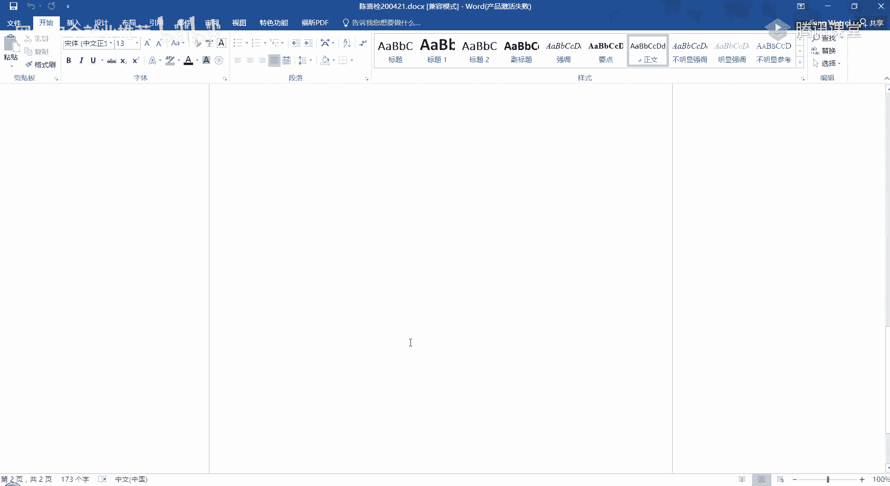
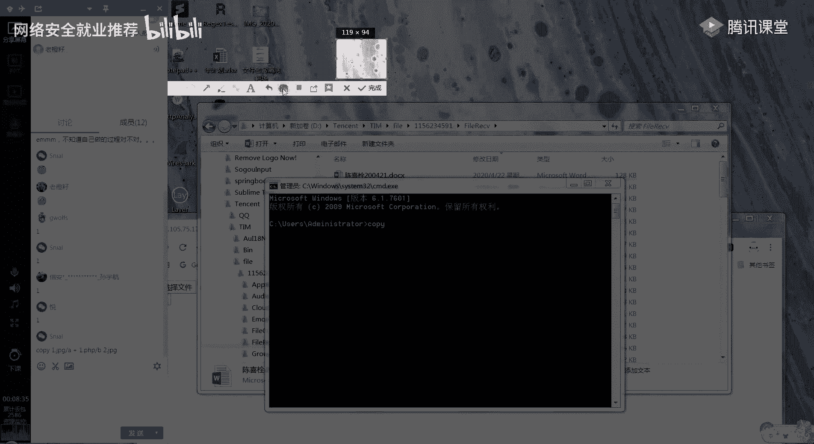
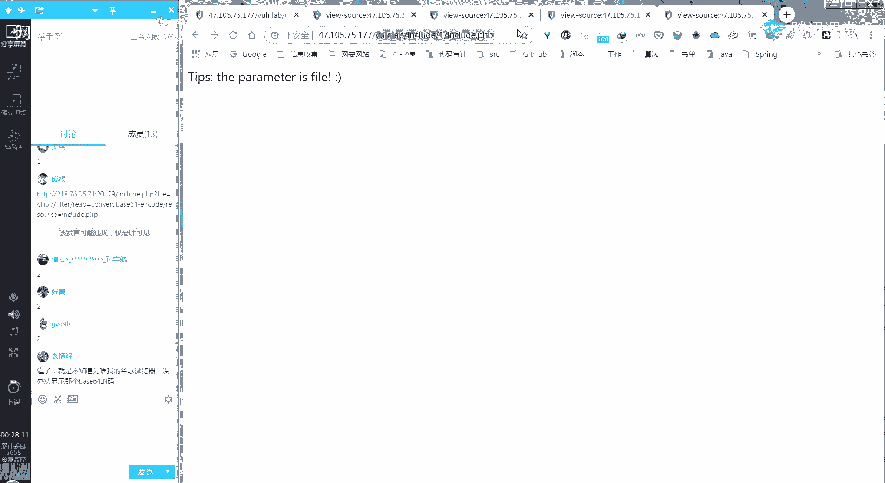
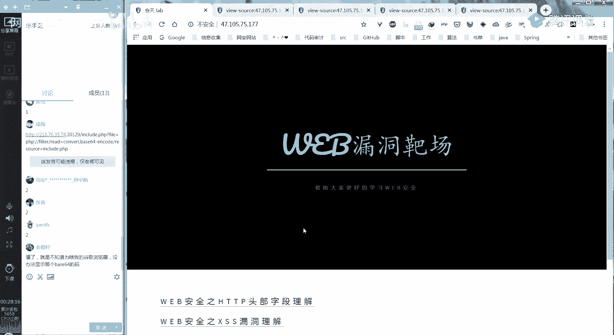
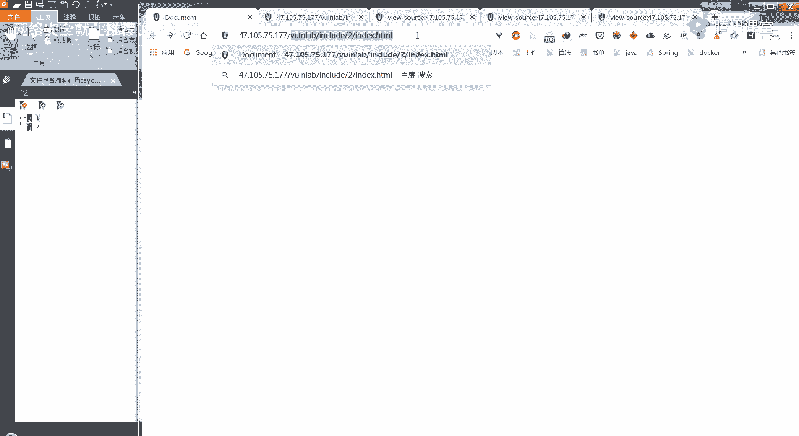

# P21：第19天：文件包含漏洞防御及实操讲解 - 网络安全就业推荐 - BV1Zu411s79i

啊。

你们能看得到我的屏幕吗，很善良，我的手越肮脏，眼神越释放，好的，然后现在八点钟了嗯，你们前面做了这个的话，然后有同学想要进来讲解一下吗，如果，我看你们就有同学做的还蛮好的，所以有没有想要。

想要出来就是给大家讲的，就点那个举手就好了，没有吗，你们听得到我声音吗，用腾讯要举手，然后给大家讲讲吗，讲讲我们昨天留下的那两个课后习题，嗯不知道自己做的过程对不对，没关系啊。

可以就是可以给大家分享一下嘛，然后如果就大家一起学习嘛，没有没有要举手的吗，那我从交了作业里面来挑一个好吗，就是这些这么多人交了作业的话，来挑一个，或者是说就是从今天来的人里面挑一个，然后你举手。

然后我来，我在这边按照你的意思来进行一个操作，为什么没有任意，那我那我就点一个好吧，那我就随便点一个，然后大家来，来看一下他的操作，你看见谁吗，要不就点你吧，老橙子是吧，你说你说话说得最多。

来给大家演示一下你是怎么做的，然后你是怎么想的，嗯哼，听得到，大家听得见吗，大家如果听得到的话，就打个一，嗯行，那你说那你讲吧，那你开始吧，大家听得到，点击a那个就第一天，听得见吗，嗯嗯听得到听得到。

点击这个，然后呢，嗯之后呢将将index dhtml改为include菲律宾，没事，那你为什么会就是查看邮件，查看元旦吗，那就看到了这个提示嗯，哪个提示，因为一般的话就是。

就是下面会有一个up roll的点p嗯，然后啊我就用这个去嗯，尝试一下，看能不能登录，就用还是用那个文件夹对，在include点菲律宾后面好，可以把这个改了，改成那个阿波罗这点p h p也可以，这样吗。

对，然后就发现我们可以上传文件嗯，然后我就尝试上传了一个菲律宾文件，然后发现上传不了，然后呢就再上传了一个图片码啊，带木马的一个图片嗯，带木马的一个图片你是怎么写的呢，就用cmd的方式。

将嗯一个菲律宾代码加一个图片合并起来，有copy，就那个代码，copy，然后那个图片，然后追加一串那啥进去是吧，对对对，就制作好那个啊图片码文件嘛，有没有现成的，嗯你是这个人吧，你是这个对对。

这个这一份交的作业是吧，是的，也没有写，对我直接直接因为是那个是之前做好的吗。

嗯嗯嗯好吧，为大家有记得之前声称应该是文件上传的时候，老师有讲吧对吧，然后有记得那个那条玲玲怎么，妻子的话就在这边打出来，我们也，好有同学在那里打出来了，嗯所以这个要先有一个图片。

点保存。

嗯这个一点p h p里面你写什么。

呃就菲律宾的一个啊，前头跟尾，然后evil e v e l，然后是那个钱的符号，这样吗，是的，然后要将这个嗯，你可能要要到当前就是桌面的这个文件夹里面，去进行这个cmd，对大概这个命令窗口，copy。

那就上传这个文件，看有没有，嗯然后就到这个地方，然后选择文件，嗯接下来呢，那接下来就还是切回到刚刚那个include点，菲律宾，嗯嗯在include点菲律宾后面啊，问号等于，然后他这个值应该是fail。

然后等于那个upload斜杠，好一好2222点jpg，因为我刚才对，然后可以用这一串去新lab，或者是在当前页面做一个那个啊psp代码测试，也可以就可以知道成功与否，所以说我们前面的话就比较简单。

在这边，然后在这个里面加一些比较测试的一些语句，是吧，还是怎么做，我就直接拿这个url去西奈服那边打开，去菜刀工具那边打开，嗯添加是吗，对url就这一个的url复制，aa，然后脚本类型修改psp。

双击好成功，ok那大家对这个题目有什么不了解的吗，然后嗯怎么就退了，老橙子应该还要负责解答呀，完成了呀，大家就是对这个第一题有什么不懂的地方吗，就不了解了吗，老陈老陈子，你要负责完成大家的疑问啊。

如果大家有疑问的话，就扣个一，如果大家没有疑问的话，就扣个二，我都没有找到那里，想跑，好吧，那这个第一题大家或者有其他的一些思路嘛，就跟老橙子是不一样的，现在最后一小时，不用图片嘛都行吧。

嗯那你要不然来给大家分享一下，你点那个举手就是g wolf，其实我不会读你这个名字，嗯你说嗯大家能听到吗啊这我觉得就把那个，嗯行，你说我觉得这是就是上传一个p h p，那个他的一个代码。

然后改bp的时候改一下它后缀就可以了，我们直接上传一个，就拿刚才那个一点菲律宾啊，对或者把菲律宾改为jpg，就直接改后缀就可以，然后在，在这边拿个包是吧，对，这或者你直接改后缀改为jpg就可以。

直接把它改成，jpg png后的切，老师你那个名字写好一点吧，就是那个二的话，我可哦不一定能它不一定能显示对，就改为一个其他名字吧，对，38425都可以对，然后上传这个文件，对对对吗，嗯然后呢。

呃然后一样的效果就直接直接就是引用，直接包含这个文件，可以因为它就是它包含的时候，他只是去查这个文件里面的，有没有这个菲律宾标志，所以不管是什么后缀都可以，这个样子是吧，对，然后用你用它大量下。

那大家对这个有什么问题吗，怎么上传，嗯那陈莎你要不要举手来，就是给大家分享一下，嗯你说个话试试，喂嗯大家能听得到他的声音吗，ok你说我是直接用菲律宾为协议去读他源码的，嗯来到这里，然后呢。

我把payload发出来，啊你把我删了，嗯应该读应该读那个upload那个页面的源码，我发的是include的页面里，对upload是吧，对，没关系，我们就先先读一下这个当前这个页面了吧。

然后给大家看一下是使用这个菲律宾filter，这个是吧，对，他a46 64去解码，就能看到它的源码，我就直接在这解码了，这个就是include文件的一个源代码，嗯你接着说主要是upload的。

这个没什么，行，把这个改为upload是吧，就其实大家从刚才那个地方，其实我们查看源代码的时候，这边也有一个就include upload。p h，所以你在这儿的话，就会发现有这个有这个文件的存在。

所以在这里的话他直接是使用这个filter p啊，不呸p h p filter，然后这个伪协议，然后在这里就能查看它的一个源代码，然后执行是吗，对填码后看它过滤的规则，然后我再去搞的那个图片嘛。

嗯它其实是从这儿开始的，这个前面是乱码，是因为我们这里有这么一串，所以它解码就变成了乱码了，你接着说，就发现它是过滤，他只能上传gif jpg，jpg和png。

然后对content type属性也做了过滤之后，操作就差不跟前面差不多去弄了，嗯嗯就是你通过查看源代码，知道了他过滤了哪些，它的过滤规则是怎样的，然后通过这个过滤规则来进行的一个绕过是吧。

然后就和前面的步骤是一样的，对嗯行，大家有没有听懂的地方吗，这个，如果有没有听懂的地方的话，就打个一，如果没有的话，就敲个二，嗯那看来大家都做的蛮好的，有没有听懂的吗，你就先敲个一给我们看一下。

然后再发出你的问题，好像没有人打一，那我就在这给大家顺一遍吧，从头到尾，就前面几个同学其实都已经讲的，没办法显示那个白色s码，怎么怎么会呢，你是不是答错了还是怎么着，就是这一串敲错了，懂了就行。

然后我给大家串一下吧，嗯首先我们是根据提示找到了那个include，在点p h p，就是刚开始在那个，index。ph ph，就找到了这个include点评app，所以尝试进行一个访问。

这样的话又有一个提示是说它的参数是一个file，所以我们可以在这个根据它的提示来，它的参数值这个file，然后包含我们现在当前的这个文件，是试试看看看能不能进行一个包含，发现是可以的。

而且就是当前这个文件的一个重复，我们通过右键查看源代码的时候，有一个upload的点p h p提示给我们，所以在这的话，我们就直接去访问一个upload的点p h p，接下来的操作，其实就和刚才一样。

然后是查看它的一个一个源代码，发现他的一些过滤规则，发现它只允许上传图片格式的一个文件，前后端后台的判断仅仅判断了他的一个后缀名，然后文件类型以及它有一个这张图，就是刚才解码之后的这个以及它的一个长度。

所以在这的话我就直接上传一个内容为p h p，p h for的一个图片码上去进行包含，就直接可以执行同样上传一个这样的一句话，木马进去进行包含，然后对就是这样好，那第一题就先到这儿结束。

第二题的话，大家有人要过来给我们分享一下你的思路吗。

如果有的话，就直接点举手。

没有吗，第二题，因为我点吗，大家有做的好的呀，我看了，第二题有同学要分享吗，没有啊，那陈上同学，你做了第二题吗，没错，那孙宇航同学，你做了第二题吗，今天是杰克，没，那张喜同学，你做了第二题吗。

你们都没有做第二题的吗，张喜同学，你有做吗，天天都要搞定，那你要加油哟，那，g wolves同学，你要做第二题吗，嗯大家能听得到他说话吗，可以大家都可以，你说，啊好的，我就先点开那个第二题哦。

已经点开对吧，然后他对老师已经写了，但是就是啊fire in hole，然后因为它提示这是一个pcp文件，所以就就可以猜测它是后缀是pcp，就是他会自己加一个后缀对吧，然后嗯你的意思是你的意思是说。

啊你的意思是说他在后台会加一个点，菲律宾的一个后缀是吗，对对对，因为它提示，所以我就拆了，然后他确实是这样的，然后用pcb 5协议读到了源码嗯，同样是使用一个菲律宾对，读哪个文件，读当前这个文件吗。

还是读对啊，pc对，就这个把pp删掉，这就是菲律宾删掉对，为什么要把菲律宾删掉呢，啊因为它会自动拼接一个p7 屏，嗯嗯那就这样回车对，然后，进行解码，这这不对吧，你复制的，反正零负责好像不太对对。

就下面的下面那个被64的编码，为啥不弄的嗯，我也感觉不太对，把那个tips删掉吧，啊然后发现他嗯p c a r协议没有过滤，然后也暂不支持，那个就是回到父母都对，这就体现出两点。

一个是可以用ph a r协议，因为这他没有就是在这边使用这个函数，进行一个正则匹配的时候，没有匹配到那个ph a r那个协议，接下来还有一个是这不能使用复古董，这两点被过滤了啊。

就不能使用这个目录跳转符是吧，对对，对，然后呃就我这里出现一个问题，就是我没发现，就是第二关也有那个up node，所以我用了第一关的嗯，你用了第一关的一个已经上传上去的，一个对文件。

第一关的第一关的up nodepp上传文件，所以就是说嗯，用的第一关的这边的upload。p h p对，然后然后同样我们要先打包一个问题，我先在外面打包一下就完了，怎么打包嗯。

啊把那个就是psp刚刚那个test改jpg改为呃，我现在改不改哦，改改一下对啊，改成天taste p p h p对，因为最后拼接的子弹是菲律宾对，然后再打包一下，就就把一个文件打包或者加一个文件给哎。

就就打包对，添加到，然后再改为jpg文件就喝醉，对然后然后上传上去，我这把改成另外一个吧，然后免得大家混淆，嗯对然，然后现在是嗯，然后就用那个pg a r c的连接，这个就是咱啊，咱连接这个pc软件。

我直接发那个哦，直接发太好了，对对我，这个我发音对呃，因为因为我现在用了第一关的时候，我想的是那个反正就是用点点把跳转过去，然后发现不可以，就是因为他把这个功率了，然后直接用的绝对路径。

嗯那这个绝对路径是你猜的还是怎么着，就是这个这个以前就算以前有讲过猜的对，他不是阿帕奇吗，这就加上那个，啊啊不是你要先加上那个哦不对，我是那个test。jpg，对不对，case。jpg对。

然后哦我们里面那个啊对，test，我们是对这个test。ph p进行了一个压缩嘛，然后生成了一个test。jpg，然后我后面加了一个001，那在这的话就是test就这样是吗，哦用菜单点一下试一下，ok。

大家有什么不懂的想要问这位同学吗，大家如果有问题的话，就扣个一，大家有问题吗，没有好的，谢谢你，嗯那大家知道第二题的话，有什么别的不一样的思路，或者是说其他的嘛，然后如果有的话，就点这个举手。

没有同学要分享了吗，嗯没有的话，那我就来给大家讲一下，就是来试一下吧，首先我做这道题的时候，同样是使用使用，就是在一里面的一个方法，去查看他的那个源代码，就使用那个hp filter吗，这样。

然后发现并没有内容显示给我们，然后利用文件包含中，就是我们已经知道前面这个，前面这个本地文件包含在这，它是存在一个文件包含漏洞的嘛，所以我就想说把这个点点点杠，然后二，include。psp。

然后前面加上那个filter协议，converter点的就是杠，encoder，resource等，没有十分吗，应该没有吧，但是他在这的话就有一个error的错误给我们。

其实我们前面去就是在第一关去查看它的一个，使用那个ph v filter查看它的源代码的时候，不知道大家有没有印象，就是他把刚才g wolves同学也有说，就是他把这个目录跳转符给过滤掉了。

所以说他在这的话就会有这个eo错误，这个显示给我们，所以说这条路也就截断了，然后。

我们就回到之前的这个地方。

然后观察他这里其实是我后来加了一个提示，就给大家提示一下，这是一个p h p的文件，然后我们看到他后面这个file等于hello，这里的话它是没有加上我们这个点p h p的。

所以就像刚才gros那位同学说的一样，就可能猜错后台那边他自己拼了一个点pk上去，所以在这边就直接尝试一下，就和刚才那位同学是一样的，这样发现确实就是在后面拼了一个点ph，因为这样的话。

他他就把我们当前这个文件的一个base，六四加密的内容危险给我们了吗，这个样子的话我们就查看到了，include，就是二里面的一个include文件的一个源代码，在源码里面也有发现一个upload点。

菲律宾就和一是一样的，同样你在这就是在这个else，就是在这个下面就会发现，他会把我们这个file从get请求url中的file拼上，我们这个点p h p，然后再进行一个包含。

然后第二种就是或者就由一get to shell之后，去查看二里面的一个文件，我们之前不是，不是通过一get down了吗，我们不是可以查看二里面的一个文件吗，嗯你就有点耍流氓啊。

对就这样的话就直接看到他那个文件，嗯所以说之前我们如果拼直接拼上了一个，点p h p，那后台又会加一个点p h p，所以这样的话就找不到汇报一个404的错误。

接下来的话就和刚才的two box同学给大家演示的，是一样的，这也发现了一个upload的点p h p，而且我们同样可以使用这个查看源码，这个伪协议来进行一个查看，查看它的源码是什么。

发现和一里面的一个内容是一样的，就也是只允许图片文件的一个上传，那在这的话，我们通过前面的那种方式去进行一个包含，一个普通的一个就我们前面不是使用的upload的，就上传的那个图片嘛。

这样进行一个包含了，这样就不能使用了，因为我们他在后台会拼一个点p h p给我们，所以这样的话他就根本因为那边他不会，他没有这个文件的存在嘛，所以他就并不会进行一个引入，也就不会我们菜刀也就连不上。

也就不会执行里面的那个一句话木马了，那这样的话我们就可以想到，我们可以使用一个压缩压缩文件，在压缩包里面可以是一个p h p文件，然后在上传的时候，我们更改它的后缀为一个jpg。

就能绕过那个上传文件上传的一个嗯限制吗，上传之后我们使用一个压缩流协议进行包含，就是这个p h a r嗯，我那个p h a r，那个压缩包里面是一个一点菲律宾，所以在这的话。

然后那个一点ph里面是ph info这个函数，嗯接下来同样的就是使用菜刀进行一个连接，嗯整体过程就是这样，对相对路径也能做，第二题可以直接上网吗，嗯这个问题其实刚才已经说了，对。

大家还有什么其他的疑问吗，大家有疑问吗，如果有疑问的话，就扣个一，如果没有疑问的话，就扣个二，就是前面这个第二题我有给大家说明白吗，嗯可以，我可以给大家就是给大家看几个同学的作业嘛。

比如说这个jobs同学，你愿意把你的作业给大家分享一下嘛，就是看一下嘛，如果愿意的话，你就扣个一，那应该是愿意啊，嗯大家可以就是怎么说，就是可以参照一下啊，这个同学的一个文档的编写就还蛮，蛮好的。

大家可以学习一下，就整体看下来就会觉得好标准嗯，就会觉得还蛮还蛮好看的，然后我可能仔细看的就是，这个和这个吧，因为因为后面的作业可能是之后交的，然后我就没有时间看了，大家可以学习一下。

我觉得这是写的比较好的，可以发群里吗，可以发群里吗，你能在群里面上传文件吗，还是我来上传，你能上传吗，然后今天大家如果没有问题的话，其实今天的课程就差不多到这了，大家有有问题吗，还，就关于今天的这两个。

这两个题目或者是说你学到了其他的一些嗯，文件包含了一些新的思路，或者是别的可以给大家给我们分享的有吗，有问题或者是有嗯别的想法的，可以扣个一，然后如果没有的话，就扣个二，作业提示可以再明显一点点。

怎么个冥想，明明显法，好吧，其实我我是觉得自己发现的整个过程，我，我是觉得整个自己发现的过程，如果自己就看到了，或者是想到了，我就会很开心，但是如果是通过别人直接告诉我，或者是怎么样。

可能就那个乐趣又少了一点，我是这么想的，所以我也不太想，就是破坏掉你们的一些兴趣或者是乐趣，嗯所以可能有些时候就没有提示的太过明显，我就想让你们自己多去思考，多尝试一下，嗯如果下次觉得。

确实是有难度的话，我就再多提示一点，或者是说你们可以来直接来问我，好的那还有还有别的问题吗，现在没有了，应该大部分同学都没有了吧，其实这里面有一些同学的作业，我还没有没有看啊。

嗯如果后面你们就是自己再做了一遍，然后把文档补充完整了之后，也可以发给就是重新发给班主任，其实今天的今天的内容已经讲完了，但是就不能提前下课，所以就还得等到九点钟，要不然太阳就来听歌吧，啊没有了。

或者是说你们有什么想聊的吗，或者是别的给大家两分钟时间，对了没有想聊的是吧，嗯尤其是参加什么c t f，或者是听说过什么这种类型的赛事吗，有呀嗯嗯你是想问什么，想问怎么去报名参加还是怎么着。

就比如说有些官网他自己会公布啊，或者是其他的嗯，但是我就参加的不多，啊大家九点了，我可以下课了，如果有什么问题的话，可以私下找我聊，或者是有什么疑问，或者是其他方面的一些事情，也可以就是私聊我。

那大家就先下课吧，好吧嗯，我还在公司呢，嗯好，那大家再见。

